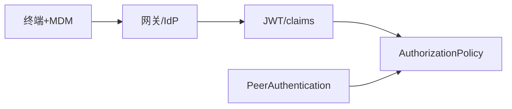

# 第35章 零信任企业落地：身份、设备与网格策略的衔接

## 35.1 项目背景

**业务场景（拟真）：远程办公 + 管理端访问**

**零信任**不是「只开 mTLS」，而是 **持续验证**：设备合规（MDM）、用户身份（IdP/JWT）、工作负载身份（SPIFFE）与 **AuthorizationPolicy** 对齐。网格擅长 **服务间**；**终端设备** 通常由网关/身份代理写入 **可验证声明**，再进策略——避免「链路上加密、终端被攻破」。

**痛点放大**

- **只信 VPN**：粗边界，无法按请求鉴权。
- **伪造 Header**：未与 JWT/ mTLS 绑定则无效。

## 35.2 项目设计：小胖、小白与大师的「多层控制面」

**第一轮**

> **小胖**：零信任是不是大家别信任何人？那还怎么干活？
>
> **小白**：设备信息谁写进 JWT？Istio 能直接读 EDR 吗？
>
> **大师**：**设备合规**多在 **IdP/网关** 侧变成 **claim**；网格用 **RequestAuthentication + AuthorizationPolicy** 消费。Istio **不替代 EDR**，只消费**可验证断言**。
>
> **大师 · 技术映射**：**终端上下文 ↔ JWT claims；服务身份 ↔ mTLS SPIFFE。**

**第二轮**

> **大师**：VPN 是「进门一次」；零信任是「每层都要票」。

## 35.3 项目实战：策略组合

**步骤 1：分层对照**

| 层级 | 示例 |
|:---|:---|
| 传输 | PeerAuthentication STRICT |
| 用户 | RequestAuthentication JWT |
| 授权 | AuthorizationPolicy claims + paths |
| 审计 | Telemetry 访问日志 |

## 35.4 项目总结

**优点与缺点**

| 维度 | 多层身份衔接 | 仅 VPN |
|:---|:---|:---|
| 粒度 | 每请求 | 粗 |

**适用场景**：远程办公；多分支；高敏感管理面。

**不适用场景**：无 IdP/无设备管理的小团队（可简化）。

**典型故障**：伪造 header；令牌过长；只加密不鉴权。

**思考题（参考答案见第36章或附录）**

1. 为何设备合规信息通常由 IdP/网关注入 JWT，而不是 Sidecar 直接读取 EDR？
2. PeerAuthentication 与 RequestAuthentication 在零信任架构中各解决哪一类主体？

**推广与协作**：安全/身份团队定 claim；平台落网格策略；终端团队管 MDM。

---

## 编者扩展

> **本章导读**：终端+用户+工作负载；**实战演练**：三跳校验表；**深度延伸**：IdP 与 SPIFFE。

---

上一章：[第34章 电商大促：峰值流量下的入口与韧性](第34章 电商大促：峰值流量下的入口与韧性.md) | 下一章：[第36章 边缘与混合云：延迟敏感业务的拓扑选择](第36章 边缘与混合云：延迟敏感业务的拓扑选择.md)

*返回 [专栏目录](README.md)*
