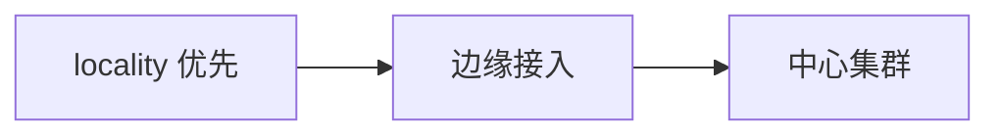

# 第36章 边缘与混合云：延迟敏感业务的拓扑选择

## 36.1 项目背景

**业务场景（拟真）：游戏/RTC 要低延迟，数据又要驻留**

**离用户近**（边缘）与 **离数据合规近**（区域中心）常冲突。网格通过 **locality 路由、多集群、East-West** 做权衡；极小节点上 **Sidecar 占比** 可能过高，需 **分层**：边缘接入、中心业务与数据。

**痛点放大**

- **盲目下沉**：数据一致性与运维碎片化。
- **延迟只看 P50**：尾延迟与抖动才是 RTC 关键。

## 36.2 项目设计：小胖、小白与大师的「延迟不是单一数字」

**第一轮**

> **小胖**：边缘盒子那么小，还塞 Sidecar？
>
> **小白**：啥指标算「不能上 mesh」？
>
> **大师**：算 **Sidecar 开销占尾延迟预算比例**；极小实例可 **边缘只做 L4/L7 接入**，核心回中心。回源慢 → **连接复用、TLS 会话、locality 优先**。
>
> **大师 · 技术映射**：**localityLbSetting ↔ 就近；资源建模 ↔ Sidecar 占比。**

## 36.3 项目实战：评估矩阵

**步骤 1：打分**

| 指标 | 边缘 | 中心 |
|:---|:---|:---|
| 尾延迟 | 优 | 视跨区而定 |
| 一致性 | 弱 | 强 |
| 运维 | 分散 | 集中 |

## 36.4 项目总结

**优点与缺点**

| 维度 | 边缘+网格权衡 | 纯中心 |
|:---|:---|:---|
| 延迟 | 可能更优 | 跨区差 |

**适用场景**：CDN 联动；门店/工业边缘；混合云。

**不适用场景**：强一致中心数据且无法分层。

**典型故障**：下沉过度致不一致；证书/时钟问题。

**思考题（参考答案见第37章或附录）**

1. 为何小规格边缘节点要特别评估 Sidecar 资源占比？
2. locality 优先与数据合规「数据不出域」如何可能冲突？

**推广与协作**：架构定分层；网络算跨区成本；SRE 统一观测。

---

## 编者扩展

> **本章导读**：就近与合规；**实战演练**：本地 vs 回源请求分类；**深度延伸**：多集群控制面放置。

---

上一章：[第35章 零信任企业落地：身份、设备与网格策略的衔接](第35章 零信任企业落地：身份、设备与网格策略的衔接.md) | 下一章：[第37章 多租户 SaaS：隔离、配额与爆炸半径控制](第37章 多租户 SaaS：隔离、配额与爆炸半径控制.md)

*返回 [专栏目录](README.md)*
