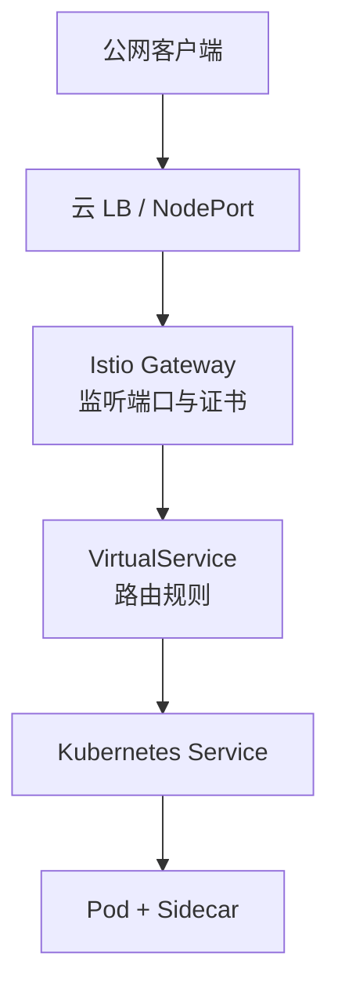

# 第3章 Gateway与VirtualService：流量入口的守门人

## 3.1 项目背景

**业务场景（拟真）：官网 + API 要 HTTPS、金丝雀、还要 VIP 分流**

某 SaaS 公司把「官网静态页 + 后端 API」迁到 Kubernetes：对外统一域名 `api.example.com`，需要 **TLS 终止**、**按路径/API 版本路由**、**5% 流量到新版**、以及 **VIP 用户走实验集群**。团队试过 Nginx Ingress + 一堆注解，换云厂商就要改一坨；运维希望入口配置与网格内 **VirtualService / 策略** 同一套语言，减少「入口一套、东西向又一套」。

**痛点放大**

- **可移植性**：Ingress 控制器方言各异，跨集群/GitOps 难以复用。
- **治理能力**：金丝雀、Header 路由、重试、熔断与可观测需要与数据面一致，而不是只在入口打补丁。
- **职责混乱**：把「监听端口/TLS」与「路由到哪个服务」绑在单一资源里，团队协作与变更评审困难。

**心智简图**



**本章主题**：**Gateway** 定义「门与证」，**VirtualService** 定义「往哪走」；与后续 **DestinationRule** 子集配合，实现完整南北向治理。

## 3.2 项目设计：小胖、小白与大师的入口交锋

**场景设定**：小白要把 HTTPS 流量接进集群并做金丝雀；小胖怕「又多一层网关费钱」；大师讲清 **Gateway 与 VirtualService 的分工**及与 **Ingress** 的差异。

**第一轮**

> **小胖**：不就是个域名转到 Nginx 吗？我们以前 Ingress 配两行不就完了？
>
> **小白**：Ingress 能统一做 HTTPS、VIP Header、5% 金丝雀，还能和网格里 mTLS、追踪对齐吗？Gateway 和 VirtualService 到底谁写监听谁写路由？
>
> **大师**：可以这么记：**Gateway = 门牌 + 监听器 + TLS（或透传）**；**VirtualService = 路由与行为**（权重、Header、超时、镜像）。Ingress 往往把监听与路由绑在一起，各厂商注解不一；Istio 把两层拆开，平台管门，业务管线，GitOps 更清晰。
>
> **大师 · 技术映射**：**LDS/监听器侧 ← Gateway；RDS/路由侧 ← VirtualService；`gateways` 字段把 VS 挂到入口。**

**第二轮**

> **小胖**：那多一个 Ingress Gateway Pod，是不是又多花一份钱？
>
> **小白**：南北向流量一定要进这个 Deployment 吗？后端 Pod 能不能直接对外？
>
> **大师**：生产通常**经入口网关**做 TLS、限流、WAF 集成与观测对齐；直连 Pod 会绕过统一策略，也难审计。成本是独立 Deployment + 云 LB，换的是**一致治理与多租户分工**。东西向仍走 Sidecar，不必重复经 Gateway。
>
> **大师 · 技术映射**：**南北向 ↔ Ingress Gateway + Gateway/VS；东西向 ↔ Sidecar + mesh 内 VirtualService。**

**第三轮**

> **小胖**：产品经理说「路由改一下」，会不会动到证书？
>
> **小白**：VirtualService 规则顺序怎么匹配？`hosts` 和 Gateway 上 `hosts` 不一致会怎样？
>
> **大师**：证书与监听一般在 Gateway 层变更；路由微调多在 VirtualService，团队可独立评审。`HTTP` 规则**自上而下**匹配，首个命中即生效；VirtualService 的 `hosts` 须与绑定的 Gateway 声明一致（或子集），否则常见 **404**。
>
> **大师 · 技术映射**：**匹配顺序 = VirtualService `http`/`tcp` 列表顺序；绑定 = `spec.gateways` + `hosts` 对齐。**

**类比**：Gateway 像小区门禁与 TLS；VirtualService 像楼栋导航；DestinationRule（后续章）像电梯调度——三者闭环。

## 3.3 项目实战：构建完整的入口流量管理

**环境准备**：已安装 Istio 且含 `istio-ingressgateway`（如 `demo` profile）；`kubectl`、可选 `cert-manager` 用于证书自动化。

**步骤 1：创建 Gateway（目标：Ingress Gateway 上开放端口与 TLS/重定向）**

以下示例展示多协议、多主机场景（按环境删减）：

```yaml
apiVersion: networking.istio.io/v1beta1
kind: Gateway
metadata:
  name: production-gateway
  namespace: istio-system
spec:
  selector:
    istio: ingressgateway  # 选择具有此标签的Ingress Gateway Pod
  servers:
  # HTTP端口——重定向到HTTPS
  - port:
      number: 80
      name: http
      protocol: HTTP
    hosts:
    - "api.example.com"
    - "www.example.com"
    - "*.example.com"
    tls:
      httpsRedirect: true  # 强制HTTP重定向到HTTPS
  
  # HTTPS端口——主业务入口
  - port:
      number: 443
      name: https-api
      protocol: HTTPS
    tls:
      mode: SIMPLE
      credentialName: api-tls-secret  # 引用Kubernetes TLS Secret
      minProtocolVersion: TLSV1_2
      cipherSuites:
        - ECDHE-RSA-AES256-GCM-SHA384
        - ECDHE-RSA-AES128-GCM-SHA256
    hosts:
    - "api.example.com"
    - "www.example.com"
  
  # gRPC端口——高性能服务间通信
  - port:
      number: 50051
      name: grpc
      protocol: GRPC
    hosts:
    - "grpc.example.com"
  
  # TCP端口——数据库等长连接服务
  - port:
      number: 3306
      name: mysql
      protocol: TCP
    hosts:
    - "mysql.example.com"
```

关键配置解析：

| 字段 | 说明 | 生产建议 |
|:---|:---|:---|
| `selector` | 选择Gateway配置应用的Pod标签 | 确保与Ingress Gateway Deployment的标签匹配 |
| `port.number` | 监听的端口号 | 80/443为标准HTTP/HTTPS，避免使用高端口 |
| `port.protocol` | 协议类型 | 支持HTTP/HTTPS/GRPC/TCP/MongoDB/MySQL等 |
| `tls.mode` | TLS工作模式 | SIMPLE为单向TLS，MUTUAL为双向mTLS |
| `credentialName` | TLS证书引用的Secret名称 | 使用cert-manager自动管理证书轮换 |
| `hosts` | 允许的主机名列表 | 支持通配符，但生产环境建议明确列出 |

**预期**：`kubectl get gateway -n istio-system` 已创建；`istioctl proxy-config listener deploy/istio-ingressgateway -n istio-system` 可见对应端口监听器。

**步骤 2：配置 VirtualService（目标：域名 → 服务/子集/权重）**

VirtualService 定义路由与行为，示例覆盖多场景：

```yaml
apiVersion: networking.istio.io/v1beta1
kind: VirtualService
metadata:
  name: api-routing
  namespace: production
spec:
  hosts:
  - "api.example.com"  # 匹配的入口域名
  gateways:
  - istio-system/production-gateway  # 绑定的Gateway
  - mesh  # 同时应用于网格内部流量
  http:
  # 规则1：API版本路由——/v1路径到稳定版，/v2路径到新版
  - match:
    - uri:
        prefix: /v2/
    route:
    - destination:
        host: api-service-v2
        port:
          number: 8080
      weight: 100
    rewrite:
      uri: /  # 去掉/v2/前缀后转发
  
  # 规则2：金丝雀发布——5%流量到新版本
  - match:
    - uri:
        prefix: /api/v1/users
    route:
    - destination:
        host: user-service
        subset: v2  # 引用DestinationRule定义的子集
      weight: 5
    - destination:
        host: user-service
        subset: v1
      weight: 95
  
  # 规则3：A/B测试——基于用户类型的路由
  - match:
    - headers:
        x-user-tier:
          exact: vip
      uri:
        prefix: /catalog/
    route:
    - destination:
        host: frontend
        subset: experimental
  
  # 规则4：默认路由——超时与重试配置
  - route:
    - destination:
        host: api-service
        port:
          number: 8080
    timeout: 10s
    retries:
      attempts: 3
      perTryTimeout: 3s
      retryOn: gateway-error,connect-failure,refused-stream
```

路由匹配优先级：VirtualService 中 `http` 规则按**顺序**匹配，首个命中即生效——**更具体的规则放前，兜底放后**。

**步骤 3：HTTPS 与证书（目标：Secret 或 cert-manager 与 Gateway 对接）**

生产 TLS 常配合 cert-manager。示例（YAML，非 shell）：

```yaml
# 步骤3a：创建 ClusterIssuer（示例：Let's Encrypt，需集群已安装 cert-manager）
apiVersion: cert-manager.io/v1
kind: ClusterIssuer
metadata:
  name: letsencrypt-prod
spec:
  acme:
    server: https://acme-v02.api.letsencrypt.org/directory
    email: admin@example.com
    privateKeySecretRef:
      name: letsencrypt-prod
    solvers:
      - http01:
          ingress:
            class: istio

---
# 步骤3b：创建 Certificate
apiVersion: cert-manager.io/v1
kind: Certificate
metadata:
  name: example-com-certs
  namespace: istio-system
spec:
  secretName: example-com-certs
  issuerRef:
    name: letsencrypt-prod
    kind: ClusterIssuer
  dnsNames:
    - api.example.com
    - www.example.com
    - "*.example.com"
  duration: 2160h  # 90天
  renewBefore: 360h  # 15天前自动续期

---
# 步骤3c：Gateway 引用 Secret（cert-manager 会写入 example-com-certs）
apiVersion: networking.istio.io/v1beta1
kind: Gateway
metadata:
  name: tls-gateway
  namespace: istio-system
spec:
  selector:
    istio: ingressgateway
  servers:
    - port:
        number: 443
        name: https
        protocol: HTTPS
      tls:
        mode: SIMPLE
        credentialName: example-com-certs  # 自动更新
        minProtocolVersion: TLSV1_2
      hosts:
        - "api.example.com"
```

**可能踩坑**：HTTP-01 挑战需从公网可达；`credentialName` 与 Secret 命名空间须与 Gateway 一致；通配符证书与 `*.example.com` DNS 授权要匹配。

**步骤 4：调试（目标：LDS/RDS 与配置一致）**

```bash
# 查看Ingress Gateway的监听器配置
istioctl proxy-config listener istio-ingressgateway-xxx -n istio-system

# 查看特定端口的路由配置
istioctl proxy-config route istio-ingressgateway-xxx -n istio-system --name http.8080 -o json

# 查看集群（上游服务）配置
istioctl proxy-config clusters istio-ingressgateway-xxx -n istio-system

# 查看端点（实际Pod IP）状态
istioctl proxy-config endpoints istio-ingressgateway-xxx -n istio-system

# 端到端配置诊断
istioctl analyze -n production

# 实时流量日志（需要启用访问日志）
kubectl logs -l app=istio-ingressgateway -n istio-system -f
```

**测试验证**

```bash
# 将 INGRESS_HOST 换为你的入口 IP 或 DNS
export INGRESS_HOST=127.0.0.1
curl -sS -o /dev/null -w "%{http_code}\n" -H "Host: api.example.com" "http://${INGRESS_HOST}/"
```

**完整清单**：官方示例见 Istio 发行包 `samples/bookinfo` 与 `networking` 文档；生产证书与 Issuer 以你集群为准。

## 3.4 项目总结

**优点与缺点（与 Kubernetes Ingress 对比）**

| 维度 | Istio Gateway + VirtualService | 典型 Ingress 控制器 |
|:---|:---|:---|
| 路由能力 | L7 权重、Header、镜像、故障注入等与网格一致 | 依控制器能力，常靠注解扩展 |
| 配置模型 | Gateway 与 VS 分离，平台/业务分工清晰 | 常混合监听与路由 |
| 可移植性 | Istio CRD 跨集群一致 | 强依赖厂商/控制器方言 |
| 复杂度 | 需理解 xDS 与两个 CRD 协作 | 简单场景上手快 |
| 运维 | 独立 Ingress Gateway 资源消耗 | 单控制器部署形态多样 |

**适用场景**：多域名与多团队共入口；金丝雀与 A/B；gRPC/WebSocket；与网格安全/观测统一。

**不适用场景**：仅需静态路由与小规模集群、无网格诉求；**不适用**强行引入（成本大于收益）。

**注意事项**：`gateway` 引用与 `hosts` 对齐；TLS `SIMPLE`/`MUTUAL`/`PASSTHROUGH` 选型；`http` 规则顺序；跨命名空间引用 `namespace/name`。

**典型生产故障与根因**

1. **404**：VirtualService `hosts` / `gateways` 与 Gateway 不一致，或 selector 未命中 Ingress Gateway。
2. **证书告警或握手失败**：Secret 未就绪、SNI 与 SAN 不匹配、或 PASSTHROUGH 与 L7 路由混用理解错误。
3. **路由「改了不生效」**：规则顺序被更靠前规则覆盖；或缓存/旧连接未刷新。

**思考题（参考答案见第4章或附录）**

1. 同一主机名同时需要 HTTP 重定向到 HTTPS，应在 Gateway 还是 VirtualService 层表达？为什么？
2. VirtualService 中 `subset: v2` 无响应时，应排查 DestinationRule 还是 Gateway？请说明依赖关系。

**推广与协作**：平台组维护 Gateway/TLS；业务组维护各自命名空间 VirtualService；测试用预发域名验证权重与 Header；运维对接云 LB 与证书轮转。

---

## 编者扩展

> **本章导读**：正门 = Gateway + VirtualService；**实战演练**：`proxy-config listener`/`route` 对照 `hosts` 与 `match`；**深度延伸**：SNI 与 HTTP Host 在 TLS 终止前后的匹配顺序。

---

上一章：[第2章 Sidecar自动注入：简化部署的秘密武器](第2章 Sidecar自动注入：简化部署的秘密武器.md) | 下一章：[第4章 DestinationRule：服务治理的幕后推手](第4章 DestinationRule：服务治理的幕后推手.md)

*返回 [专栏目录](README.md)*
