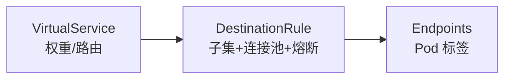

# 第4章 DestinationRule：服务治理的幕后推手

## 4.1 项目背景

**业务场景（拟真）：订单服务 v2 灰度 +「别拖垮全站」**

订单团队要上线 v2：产品要求先 **10% 流量**，错误率超阈值就缩回；SRE 要求 **连接池有上限**，避免促销洪峰把下游 MySQL 连接打满；还要在 **多可用区** 优先本地转发以省延迟。**VirtualService** 只能回答「流量按权重去哪个子集」，但「每个子集连接上限多少、连续 5xx 是否驱逐、跨区如何 failover」需要另一份声明——这就是 **DestinationRule**。

**痛点放大**

- **子集与标签漂移**：Deployment 改了 `version` 标签，DR 未同步 → 流量黑洞或全部落到默认子集。
- **韧性参数拍脑袋**：无连接池/异常检测时，单实例抖动会放大成全链路排队与重试风暴。
- **与 VS 分工不清**：团队只配权重不配 DR，金丝雀「看起来切了」，数据面却仍用默认负载均衡与连接行为。



**本章主题**：DestinationRule 定义 **host 级与子集级 trafficPolicy**，与 VirtualService 的 `subset` 字段联动。

## 4.2 项目设计：小胖、小白与大师的子集交锋

**场景设定**：金丝雀要切 10%；小胖问「为啥不直接 K8s 两个 Deployment」；小白关心 **subset、连接池、outlierDetection** 与 VirtualService 的边界。

**第一轮**

> **小胖**：两个 Deployment 我懂，再加个 DestinationRule 不是多此一举？
>
> **小白**：VirtualService 已经 `subset: v2` 了，DR 还要写什么？outlierDetection 和「熔断」到底谁触发？
>
> **大师**：Deployment 解决**副本与标签**；DestinationRule 把 **labels → 子集名**，并给每个子集 **连接池、LB、异常检测** 等「怎么去、坏了怎么办」。VS 管路由权重，DR 管到 host 的交通规则；`outlierDetection` 在 Envoy 侧驱逐不健康端点，不等同于业务「开关熔断」，但常一起谈。
>
> **大师 · 技术映射**：**subset.labels ↔ Pod 标签；trafficPolicy ↔ connectionPool + outlierDetection + loadBalancer。**

**第二轮**

> **小胖**：那 v2 挂了会不会把 v1 也拖死？
>
> **小白**：连接池 `maxConnections` 和 HPA 会不会打架？localityLb 需要 Pod 上什么标签？
>
> **大师**：连接池限制的是**到上游的并发与连接**，防止拖垮下游；要与容量规划、HPA 指标一起看。区域感知依赖拓扑标签（如 zone/region），并与 localityLbSetting 配合；否则「区域路由不生效」。
>
> **大师 · 技术映射**：**localityLbSetting ↔ topology 标签；熔断驱逐 ↔ maxEjectionPercent / minHealthPercent。**

**第三轮**

> **小白**：给我一份最小可用的 DR 长什么样？
>
> **大师**：见下一节「项目实战」中的完整 YAML；记住 **subset 名** 必须与 VirtualService `destination.subset` 一致，否则路由会落到未定义行为或默认集群。

**类比**：VirtualService 定「去哪个项目组」；DestinationRule 定「组内工位密度、迟到几次换岗」——项目组标签来自 Kubernetes，制度写在 DR。

## 4.3 项目实战：实现金丝雀发布与熔断保护

**环境准备**：已注入 Sidecar 的命名空间、待治理的 `Service` 与带 `version` 标签的 Pod。

**步骤 1：定义 DestinationRule 子集与默认策略（目标：subset 与标签对齐）**

完整金丝雀需要 DestinationRule 与 VirtualService 联动：

```yaml
# DestinationRule：定义子集和治理策略
apiVersion: networking.istio.io/v1beta1
kind: DestinationRule
metadata:
  name: order-service
  namespace: production
spec:
  host: order-service
  subsets:
  - name: stable
    labels:
      version: v1.0.0
    trafficPolicy:  # 稳定版：保守配置
      connectionPool:
        http:
          h2UpgradePolicy: UPGRADE
          http2MaxRequests: 1000
      outlierDetection:
        consecutive5xxErrors: 10
        interval: 60s
        baseEjectionTime: 300s  # 5分钟驱逐
  - name: canary
    labels:
      version: v2.0.0-rc1
    trafficPolicy:  # 金丝雀版：激进配置，快速发现问题
      connectionPool:
        http:
          http2MaxRequests: 100     # 限制并发，保护不稳定版本
      outlierDetection:
        consecutive5xxErrors: 2     # 更快熔断
        baseEjectionTime: 60s       # 更久恢复

---
# VirtualService：配置流量权重
apiVersion: networking.istio.io/v1beta1
kind: VirtualService
metadata:
  name: order-service-canary
  namespace: production
spec:
  hosts:
  - order-service
  http:
  - route:
    - destination:
        host: order-service
        subset: stable
      weight: 95    # 初始95%稳定流量
    - destination:
        host: order-service
        subset: canary
      weight: 5     # 5%金丝雀流量
    retries:
      attempts: 3
      perTryTimeout: 2s
      retryOn: gateway-error,connect-failure,refused-stream
    timeout: 10s
```

**预期**：`istioctl proxy-config cluster <pod> --fqdn order-service.production.svc.cluster.local` 可见 `outbound|...|subset=stable` 等集群名。

**可能踩坑**：subset 标签与 Pod 不一致；字段名随 API 版本有 `consecutiveErrors` / `consecutive5xxErrors` 等差异，以当前 Istio CRD 为准。

**步骤 2：按阶段调权重（VirtualService 与 DR 联动）**

| 阶段 | stable权重 | canary权重 | 观察指标 | 决策动作 |
|:---|:---|:---|:---|:---|
| 初始 | 95% | 5% | 错误率、P99延迟 | 无异常则进入下一阶段 |
| 第2天 | 75% | 25% | 业务指标、用户反馈 | 监控客服工单 |
| 第3天 | 50% | 50% | 全量对比测试 | A/B测试显著性验证 |
| 第4天 | 25% | 75% | 系统稳定性 | 准备全量切换 |
| 第5天 | 0% | 100% | 最终验证 | 保留stable一周观察 |

**步骤 3：调 connectionPool、outlierDetection（目标：防级联与误杀）**

```yaml
# 生产级熔断配置
trafficPolicy:
  connectionPool:
    tcp:
      maxConnections: 100           # 全局最大TCP连接
      connectTimeout: 30ms          # TCP连接建立超时
      tcpKeepalive:
        time: 300s                  # 保活探测间隔
        interval: 75s
        probes: 9
    http:
      h2UpgradePolicy: UPGRADE      # 优先HTTP/2
      http1MaxPendingRequests: 100  # HTTP/1.1等待队列
      http2MaxRequests: 1000        # HTTP/2并发流限制
      maxRequestsPerConnection: 100 # 连接复用限制
      maxRetries: 3                 # 最大重试次数
  outlierDetection:
    consecutive5xxErrors: 5         # 连续5xx错误阈值
    consecutiveGatewayErrors: 3     # 连续502/503/504阈值（更敏感）
    interval: 10s                   # 检测间隔
    baseEjectionTime: 30s           # 最小驱逐时间
    maxEjectionPercent: 50          # 最大驱逐比例
    minHealthPercent: 40            # 最小健康实例比例
```

**步骤 4（可选）：locality 负载均衡**

```yaml
apiVersion: networking.istio.io/v1beta1
kind: DestinationRule
metadata:
  name: multi-zone-service
spec:
  host: api-service
  trafficPolicy:
    loadBalancer:
      simple: LEAST_REQUEST
      localityLbSetting:
        enabled: true
        distribute:
        - from: us-east-1a
          to:
            "us-east-1a": 80   # 80%留在本可用区
            "us-east-1b": 15   # 15% failover到同区域
            "us-east-1c": 5    # 5% 到第三可用区
        failover:
        - from: us-east-1
          to: us-west-2        # 区域级故障转移
        - from: us-west-2
          to: us-east-1
    outlierDetection:
      consecutive5xxErrors: 5
      interval: 30s
```

**测试验证**

```bash
# 查看某 Pod 对 order-service 的 cluster 与 endpoint
istioctl proxy-config cluster <pod-name> | grep -E "order-service|subset"
istioctl proxy-config endpoint <pod-name> | grep order-service -A2
```

## 4.4 项目总结

**优点与缺点（与「仅 VirtualService」对比）**

| 维度 | 搭配 DestinationRule | 仅 VS / 默认集群 |
|:---|:---|:---|
| 子集与连接行为 | 显式子集 + 连接池/LB/异常检测 | 默认 LB，易与业务预期不符 |
| 金丝雀 | 权重 + 每版本不同韧性参数 | 难对 canary 单独限并发 |
| 复杂度 | 多 CRD 协同 | 配置少但缺少治理深度 |

**适用场景**：金丝雀/蓝绿；多区域 locality；连接敏感下游（DB、缓存）；差异化子集策略。

**不适用场景**：极简 demo 仅需路由、且默认连接行为足够；无标签治理的小服务（仍建议逐步引入 DR 防级联）。

**注意事项**：subset 与 Pod 标签一致；outlier 与重试叠加；HPA 与连接池；拓扑标签与 locality。

**典型生产故障与根因**

1. **流量黑洞**：subset 名或 labels 与 Endpoint 不匹配。
2. **健康实例被大量驱逐**：阈值过严或 `maxEjectionPercent` 过大。
3. **区域路由无效**：缺少 zone/region 标签或未启用 locality 设置。

**思考题（参考答案见第5章或附录）**

1. VirtualService 引用 `subset: canary`，但 DR 中无该 subset 名，数据面通常会出现什么现象？
2. 连接池 `maxConnections` 过小、同时 VirtualService 配置较高 `retries`，可能引发什么系统性风险？

**推广与协作**：开发维护版本标签与 subset 命名规范；SRE 调连接池与 outlier；测试在预发压测验证「驱逐+恢复」曲线。

---

## 编者扩展

> **本章导读**：VS 定方向，DR 定「怎么去、坏了怎么办」；**实战演练**：`proxy-config cluster` 对照 subset；**深度延伸**：连接池 + outlier + 重试的「重试风暴」。

---

上一章：[第3章 Gateway与VirtualService：流量入口的守门人](第3章 Gateway与VirtualService：流量入口的守门人.md) | 下一章：[第5章 ServiceEntry：打破网格边界](第5章 ServiceEntry：打破网格边界.md)

*返回 [专栏目录](README.md)*
