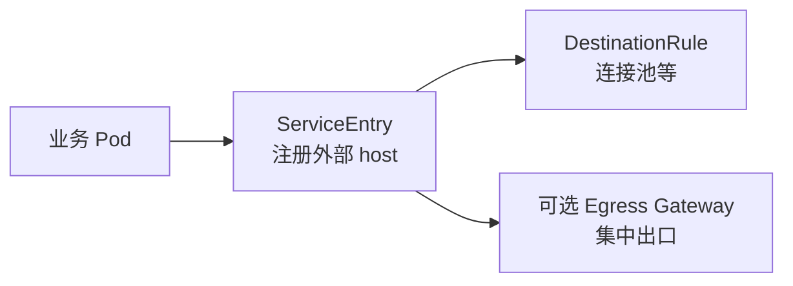

# 第5章 ServiceEntry：打破网格边界

## 5.1 项目背景

**业务场景（拟真）：订单连 RDS、还要调物流 SaaS**

订单服务要访问 **AWS RDS MySQL**（域名）和 **第三方物流 HTTPS API**。Kiali 拓扑里这些依赖是「未知」节点或缺失指标；安全组要求 **出站可审计**；SRE 希望对外部调用同样能配 **超时、熔断、连接池**。若不做任何登记，流量可能仍「能通」，但**网格侧没有统一 host 对象**，策略与观测难以对齐——这就是 **ServiceEntry** 要解决的「外交通行证」问题。

**痛点放大**

- **可观测性**：外部依赖与内部调用指标/日志口径不一致，排障时无法对比「谁慢」。
- **安全与合规**：出站需要白名单、Egress 集中出口、审计日志时，裸 DNS 直连无法落到策略层。
- **配置漂移**：应用写死主机名，运维侧若改 IP/域名，需与网格配置同步。



**本章主题**：**ServiceEntry** 将外部主机纳入网格服务发现；**MESH_EXTERNAL**、**resolution**、与 **Egress Gateway** 组合实现分级治理。

## 5.2 项目设计：小胖、小白与大师的外网交锋

**场景设定**：小白发现外部依赖在拓扑里「不体面」；小胖说「能 curl 通就行」；大师要讲 **ServiceEntry / TLS / Egress** 的边界。

**第一轮**

> **小胖**：外网服务又不归我们管，登记进网格有啥用？还多写 YAML。
>
> **小白**：不登记的话，DestinationRule 的 `host` 写啥？`resolution: DNS` 和静态 IP 啥时选？
>
> **大师**：登记是为了让**网格有一个与内部 Service 同构的 host 对象**，才能挂 DR、VS、策略。应用仍用原主机名访问；Sidecar 根据 ServiceEntry 建 cluster。DNS 解析用 `resolution: DNS`；要固定 IP 或绕 DNS 可用 `endpoints`。
>
> **大师 · 技术映射**：**ServiceEntry.spec.hosts ↔ Envoy cluster 名；location: MESH_EXTERNAL ↔ 网格外。**

**第二轮**

> **小胖**：HTTPS 外面包一层，你们还能看见里头？
>
> **小白**：TLS 透传 vs 网格 origination 怎么选？和 Sidecar 的 SNI 啥关系？
>
> **大师**：应用侧 HTTPS 时，若不在网格做 origination，L7 可见性有限；若需统一证书、明文到 Sidecar，可用 **Istio TLS origination**（需额外配置与 Secret）。是否走 **Egress Gateway** 取决于审计、固定源 IP、防火墙策略——不是每个调用都必走。
>
> **大师 · 技术映射**：**Egress Gateway ↔ 出站集中与审计；VirtualService/Gateway 组合 ↔ 路由到 egressgateway。**

**第三轮**

> **小白**：`exportTo` 与多命名空间共享怎么搞？
>
> **大师**：默认 ServiceEntry 可能仅本命名空间可见；共享需 `exportTo` 或集中命名空间治理。与 **AuthorizationPolicy** 组合可限制「谁可访问此外部 host」。

**类比**：ServiceEntry 像给外方发「外交护照」——仍在外国，但进出网格的规则、观测与合规能对齐。

## 5.3 项目实战：统一管理外部服务访问

**环境准备**：Sidecar 已注入；明确应用真实连接的主机名（大小写一致）。

**步骤 1：注册外部服务（ServiceEntry + 可选 DR）**

```yaml
# ServiceEntry: 注册RDS MySQL端点
apiVersion: networking.istio.io/v1beta1
kind: ServiceEntry
metadata:
  name: order-db-rds
  namespace: order-service
spec:
  hosts:
  - order-db.abcdefghijkl.us-west-2.rds.amazonaws.com
  ports:
  - number: 3306
    name: tcp-mysql
    protocol: TCP
  location: MESH_EXTERNAL  # 明确标记为网格外服务
  resolution: DNS          # 动态解析域名到IP
  endpoints:  # 可选：指定具体IP，绕过DNS
  - address: 10.0.1.100
    ports:
      tcp-mysql: 3306

---
# DestinationRule: 配置连接池和熔断
apiVersion: networking.istio.io/v1beta1
kind: DestinationRule
metadata:
  name: order-db-rds-policy
  namespace: order-service
spec:
  host: order-db.abcdefghijkl.us-west-2.rds.amazonaws.com
  trafficPolicy:
    connectionPool:
      tcp:
        maxConnections: 100          # 数据库连接数限制
        connectTimeout: 100ms
      tcpKeepalive:
        time: 300s                   # TCP保活探测间隔
        interval: 75s
    outlierDetection:
      consecutiveErrors: 5           # 连续5次错误触发熔断
      interval: 30s                  # 检测间隔
      baseEjectionTime: 30s          # 最小驱逐时间
      maxEjectionPercent: 50         # 最大驱逐比例

---
# AuthorizationPolicy: 限制哪些服务可以访问数据库
apiVersion: security.istio.io/v1beta1
kind: AuthorizationPolicy
metadata:
  name: rds-access-control
  namespace: order-service
spec:
  selector:
    matchLabels:
      app: order-service  # 仅应用于order-service
  action: ALLOW
  rules:
  - to:
    - operation:
        hosts: ["order-db.abcdefghijkl.us-west-2.rds.amazonaws.com"]
        ports: ["3306"]
```

**预期**：`istioctl proxy-config cluster deploy/order-service -n order-service | grep rds` 可见对应 cluster。

**可能踩坑**：`hosts` 与应用程序连接名不一致；DNS 缓存与 TTL 导致 endpoint 陈旧。

**步骤 2（可选）：Egress Gateway 集中管控**

```yaml
# 1. 部署Egress Gateway（专用节点池）
apiVersion: install.istio.io/v1alpha1
kind: IstioOperator
spec:
  components:
    egressGateways:
    - name: istio-egressgateway
      enabled: true
      k8s:
        nodeSelector:
          node-type: egress-gateway  # 专用节点标签
        resources:
          requests:
            cpu: 2000m
            memory: 2Gi
        hpaSpec:
          minReplicas: 2
          maxReplicas: 5

---
# 2. ServiceEntry指向Egress Gateway
apiVersion: networking.istio.io/v1beta1
kind: ServiceEntry
metadata:
  name: external-svcs-via-egress
spec:
  hosts:
  - api.logistics-provider.com
  - payment.gateway.com
  ports:
  - number: 443
    name: tls
    protocol: TLS
  location: MESH_EXTERNAL
  resolution: DNS
  exportTo: ["."]  # 仅当前命名空间可见

---
# 3. VirtualService强制流量经过Egress Gateway
apiVersion: networking.istio.io/v1beta1
kind: VirtualService
metadata:
  name: force-egress-gateway
spec:
  hosts:
  - api.logistics-provider.com
  tls:
  - match:
    - port: 443
      sniHosts:
      - api.logistics-provider.com
    route:
    - destination:
        host: istio-egressgateway.istio-system.svc.cluster.local
        port:
          number: 443
      weight: 100

---
# 4. Egress Gateway的路由配置
apiVersion: networking.istio.io/v1beta1
kind: Gateway
metadata:
  name: egress-gateway-routing
  namespace: istio-system
spec:
  selector:
    istio: egressgateway
  servers:
  - port:
      number: 443
      name: tls-egress
      protocol: TLS
    hosts:
    - api.logistics-provider.com
    - payment.gateway.com
    tls:
      mode: ISTIO_MUTUAL  # 与Sidecar之间使用mTLS

---
# 5. 出站访问控制策略
apiVersion: security.istio.io/v1beta1
kind: AuthorizationPolicy
metadata:
  name: egress-access-control
  namespace: istio-system
spec:
  selector:
    matchLabels:
      istio: egressgateway
  action: ALLOW
  rules:
  - from:
    - source:
        namespaces: ["order-service", "payment-service"]  # 仅允许特定命名空间
    to:
    - operation:
        hosts: ["api.logistics-provider.com", "payment.gateway.com"]
        ports: ["443"]
    when:
    - key: request.auth.claims[scope]
      values: ["external-api:read"]  # 需要特定JWT scope
```

**步骤 3：调试与验证**

```bash
# 查看Sidecar识别的外部服务端点
istioctl proxy-config cluster deploy/order-service -n order-service | grep -E "(rds|logistics)"

# 检查Egress Gateway端点
istioctl proxy-config endpoint deploy/istio-egressgateway -n istio-system | grep logistics

# 验证Egress Gateway路由
istioctl proxy-config route deploy/istio-egressgateway -n istio-system

# 实时流量分析（需要启用访问日志）
kubectl logs -l app=istio-egressgateway -n istio-system -f | grep logistics

# DNS解析测试（从Sidecar容器）
kubectl exec <pod-name> -c istio-proxy -- nslookup api.logistics-provider.com
```

**测试验证**

```bash
kubectl exec deploy/sleep -c sleep -- curl -sS -o /dev/null -w "%{http_code}\n" https://httpbin.org/get
```

## 5.4 项目总结

**优点与缺点（与「不登记、直连外网」对比）**

| 维度 | ServiceEntry（+ 可选 Egress） | 裸直连 |
|:---|:---|:---|
| 策略与 DR | 可对齐 host | 无网格对象 |
| 观测 | cluster/指标可对齐 | 依赖应用自建 |
| 出站审计 | Egress 可集中 | 分散难审计 |
| 复杂度 | YAML 与 DNS/TLS 维护 | 简单但治理弱 |

**适用场景**：SaaS/API 调用；多云 RDS；需 Egress 白名单与防火墙对账。

**不适用场景**：极低延迟且无需策略的极少数路径；或 **明确禁止** Sidecar 拦截外网（需架构例外流程）。

**注意事项**：hosts 精确匹配；DNS TTL 与 Envoy 缓存；`exportTo`；Egress 容量与延迟。

**典型生产故障与根因**

1. **配置了 ServiceEntry 仍无 cluster**：主机名与 app 不一致或未 `exportTo` 到客户端命名空间。
2. **外网 IP 变更后间歇失败**：DNS 缓存与 TTL。
3. **Egress 503**：VS/Gateway 路由与 SNI 不匹配或 egress Pod 不健康。

**思考题（参考答案见第6章或附录）**

1. `location: MESH_EXTERNAL` 与 `MESH_INTERNAL` 在选择时主要影响什么？
2. 什么场景下必须引入 Egress Gateway，而不是仅 ServiceEntry + Sidecar 直连？

**推广与协作**：平台维护 Egress 与全局白名单；业务声明依赖主机名；安全组与网格侧同步。

---

## 编者扩展

> **本章导读**：外部 host 登记进「通讯录」；**实战演练**：`httpbin.org` + `proxy-config cluster`；**深度延伸**：直连 vs Egress 的审计与源 IP。

---

上一章：[第4章 DestinationRule：服务治理的幕后推手](第4章 DestinationRule：服务治理的幕后推手.md) | 下一章：[第6章 可观测性基石：Telemetry API与Envoy访问日志深度解析](第6章 可观测性基石：Telemetry API与Envoy访问日志深度解析.md)

*返回 [专栏目录](README.md)*
