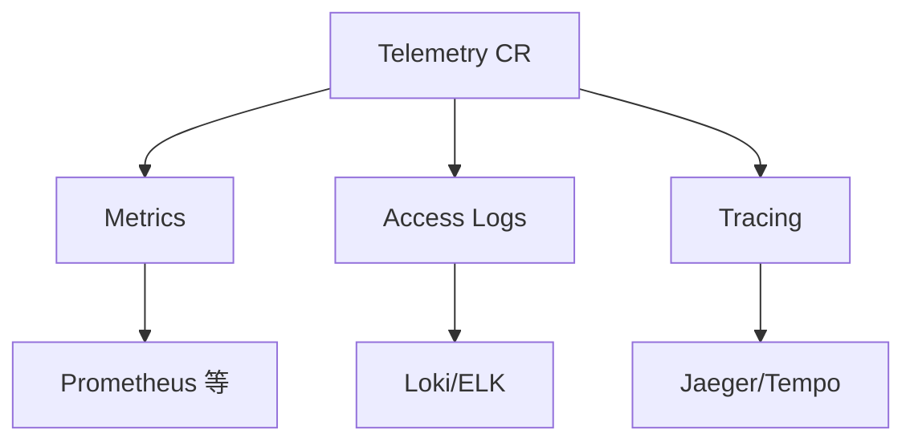

# 第6章 可观测性基石：Telemetry API与Envoy访问日志深度解析

## 6.1 项目背景

**业务场景（拟真）：间歇 500，应用日志却「一切正常」**

周五晚高峰，订单接口偶发 500，Pod 未重启、业务日志无栈；Grafana 只有聚合曲线，**看不到单次请求的 upstream 与 response_flags**。这类问题往往出在 **Sidecar/Envoy 层**：连接失败、路由缺失、重试耗尽——应用完全无感。团队需要 **统一指标 + 访问日志 + 追踪**，且可按命名空间/工作负载分层配置，而不是改全局 MeshConfig 或手写 EnvoyFilter 打补丁。

**痛点放大**

- **排障碎片化**：应用日志、Ingress 日志、网格侧各说各话，缺少 `trace_id` / `upstream_cluster` 对齐。
- **老路难维护**：依赖 Mixer（已移除）或全局配置，变更风险大、无法按团队定制。
- **成本与合规**：全量日志与高开销指标标签会导致 **基数爆炸** 与 **PII 泄露**。



**本章主题**：**Telemetry API** 将指标、日志、追踪声明式化；**Envoy 访问日志** 提供 `%RESPONSE_FLAGS%` 等排障金字段。

## 6.2 项目设计：小胖、小白与大师的观测交锋

**场景设定**：线上间歇 500；小胖认为「加日志就是浪费磁盘」；小白要弄清 **Telemetry vs MeshConfig** 与 **response_flags**。

**第一轮**

> **小胖**：多打日志不要钱啊？用户又看不见，搞那么细干嘛。
>
> **小白**：应用日志干净但用户报错，该看哪？`RESPONSE_FLAGS` 里 UF、NR 啥意思？
>
> **大师**：Envoy 在 Sidecar 里终止/转发连接，**应用日志看不到路由失败、TLS、上游连接错误**。访问日志里的 `response_code`、`response_flags`、`upstream_cluster` 是网格排障的第一现场。
>
> **大师 · 技术映射**：**数据面观测 = Envoy access log + metrics；Telemetry CR = 选择 provider 与过滤策略。**

**第二轮**

> **小白**：以前改 `meshConfig` 还要重启吗？Telemetry 的优先级和命名空间层级怎么叠？
>
> **大师**：Telemetry API 用声明式 CR 分层：**网格级（如 istio-system）** 定默认，**工作负载级** 可覆盖。Provider 在 IstioOperator 或 mesh 中扩展定义一次，Telemetry 引用名字即可。具体合并规则以当前版本文档为准，原则是「越具体越优先」。
>
> **大师 · 技术映射**：**extensionProviders ↔ 投递端；Telemetry.spec ↔ metrics/accessLogging/tracing 块。**

**第三轮**

> **小胖**：全量日志存得下吗？
>
> **大师**：用 **CEL filter** 或采样，只记录 4xx/5xx 与慢请求；指标侧 **禁用高基数标签**（如 `REQUEST_SIZE` 在高压下）。**PII** 进日志前必须脱敏。

**类比**：Telemetry 像「体检套餐」——Provider 是检验科，Telemetry 是自选套餐与加项。

## 6.3 项目实战：Telemetry API完整配置与访问日志分析

**环境准备**：可修改 IstioOperator 或 mesh 扩展；集群已安装 Prometheus/日志栈等（按需）。

**步骤 1：Provider（目标：定义 prometheus / jaeger / envoy 等投递端）**

```yaml
# IstioOperator中配置扩展Provider
apiVersion: install.istio.io/v1alpha1
kind: IstioOperator
spec:
  meshConfig:
    defaultProviders:
      metrics:
        - prometheus
      tracing:
        - jaeger
      accessLogging:
        - envoy
    
    extensionProviders:
      # Prometheus：指标收集的标准后端
      - name: prometheus
        prometheus: {}
      
      # Jaeger：分布式追踪
      - name: jaeger
        zipkin:
          service: jaeger-collector.istio-system.svc.cluster.local
          port: 9411
      
      # OpenTelemetry Collector：统一遥测接收端
      - name: otel-collector
        opentelemetry:
          service: otel-collector.observability.svc.cluster.local
          port: 4317
      
      # Envoy原生访问日志：输出到stdout，JSON格式
      - name: envoy
        envoyFileAccessLog:
          path: /dev/stdout
          logFormat:
            labels:
              start_time: "%START_TIME%"
              method: "%REQ(:METHOD)%"
              path: "%REQ(X-ENVOY-ORIGINAL-PATH?:PATH)%"
              protocol: "%PROTOCOL%"
              response_code: "%RESPONSE_CODE%"
              response_flags: "%RESPONSE_FLAGS%"
              bytes_received: "%BYTES_RECEIVED%"
              bytes_sent: "%BYTES_SENT%"
              duration: "%DURATION%"
              upstream_service_time: "%RESP(X-ENVOY-UPSTREAM-SERVICE-TIME)%"
              forwarded_for: "%REQ(X-FORWARDED-FOR)%"
              user_agent: "%REQ(USER-AGENT)%"
              request_id: "%REQ(X-REQUEST-ID)%"
              authority: "%REQ(:AUTHORITY)%"
              upstream_host: "%UPSTREAM_HOST%"
              upstream_cluster: "%UPSTREAM_CLUSTER%"
              trace_id: "%REQ(X-B3-TRACEID)%"
```

**步骤 2：网格级 Telemetry（目标：基线指标、采样、访问日志过滤）**

```yaml
apiVersion: telemetry.istio.io/v1
kind: Telemetry
metadata:
  name: mesh-default
  namespace: istio-system  # 根命名空间 = 网格范围生效
spec:
  # 指标配置：启用Prometheus收集，精简高基数标签
  metrics:
    - providers:
        - name: prometheus
      overrides:
        # 为所有指标添加集群标识标签
        - match:
            metric: ALL_METRICS
            mode: CLIENT_AND_SERVER
          tagOverrides:
            cluster_name:
              operation: UPSERT
              value: "production-cluster-01"
        # 禁用高基数字节大小指标
        - match:
            metric: REQUEST_SIZE
          disabled: true
  
  # 追踪配置：1%采样率
  tracing:
    - providers:
        - name: jaeger
      randomSamplingPercentage: 1.0
      customTags:
        environment:
          literal:
            value: "production"
  
  # 访问日志：仅记录错误和慢请求
  accessLogging:
    - providers:
        - name: envoy
      filter:
        expression: "response.code >= 400 || response.duration > 2000"
```

**预期**：`kubectl get telemetry -n istio-system`；新 Pod 或配置传播后 Sidecar 访问日志出现 JSON 行。

**可能踩坑**：Provider 名未在 mesh 注册；过滤表达式语法与版本不匹配；日志量过大拖慢节点。

**步骤 3：对照字段与 response_flags 排障**

| 字段 | 示例值 | 诊断意义 |
|:---|:---|:---|
| `response_code` | 503 | HTTP响应码，直接指示错误类型 |
| `response_flags` | "UF,URX" | Envoy内部标志：UF=Upstream Failure，URX=Retry Exceeded |
| `duration` | 15420 | 总处理时间（毫秒），定位慢请求 |
| `upstream_service_time` | null | 上游服务处理时间，null表示未到达上游 |
| `upstream_host` | "10.244.3.87:8080" | 实际连接的后端Pod IP，验证负载均衡 |
| `upstream_cluster` | "outbound|8080\|\|payment-service" | 目标服务名称，验证路由正确性 |
| `trace_id` | "4f3e8d7c..." | 分布式追踪ID，关联全链路日志 |

**典型错误模式识别**：

| response_flags | 含义 | 根因分析 | 解决方向 |
|:---|:---|:---|:---|
| `NR` | No Route | VirtualService配置错误，无匹配路由 | 检查hosts、match条件 |
| `UF` | Upstream Failure | 无法连接到上游服务 | 检查Service、Endpoint、网络策略 |
| `UO` | Upstream Overflow | 连接池耗尽 | 调大maxConnections，或扩容上游 |
| `LR` | Local Rate Limited | 本地限流触发 | 调整限流阈值，或优化突发处理 |
| `UH` | No Healthy Upstream | 所有上游实例不健康 | 检查Pod健康状态、熔断配置 |
| `URX` | Retry Exceeded | 重试次数耗尽仍失败 | 检查重试策略，或上游根本故障 |

**测试验证**

```bash
# 查看某 Pod Sidecar 访问日志（示例）
kubectl logs <pod> -c istio-proxy --tail=20 | head -5

# Prometheus 示例（按你环境调整 job）
# rate(istio_requests_total{reporter="source"}[5m])
```

## 6.4 项目总结

**优点与缺点（与「仅应用日志」对比）**

| 维度 | Telemetry + Envoy 日志 | 仅应用日志 |
|:---|:---|:---|
| 网络层故障 | 可见 flags、upstream_cluster | 常缺失 |
| 统一格式 | 网格级字段约定 | 各服务不一 |
| 成本 | 需过滤与采样 | 应用日志也需治理 |

**适用场景**：间歇性故障；SLO 与 RED 指标；安全审计；性能剖析。

**不适用场景**：无 Sidecar 的工作负载；或 **极严格** 禁止日志落盘/stdout 的环境（需合规评估）。

**注意事项**：采样与基数；PII 脱敏；Telemetry 命名空间与合并规则；日志轮转。

**典型生产故障与根因**

1. **日志不生效**：Provider 未注册或 Telemetry 未应用到工作负载。
2. **存储爆炸**：未过滤全量访问日志。
3. **排障仍看不懂**：未对照 `response_flags` 表，误判为应用 bug。

**思考题（参考答案见第7章或附录）**

1. `NR` 与 `UH` 在 Envoy 语义上的区别是什么？各对应哪类配置排查？
2. 指标侧 `tagOverrides` 若引入高基数标签（如 user_id），可能引发什么风险？

**推广与协作**：平台定义 Provider 与网格基线；业务组定制 workload Telemetry；测试验证「错误注入」下日志是否捕获；合规参与脱敏规则。

---

## 编者扩展

> **本章导读**：黑匣子 = 指标 + 访问日志 + 追踪；**实战演练**：成功/失败请求各一行日志解读；**深度延伸**：标签白名单与日志脱敏原则。

---

上一章：[第5章 ServiceEntry：打破网格边界](第5章 ServiceEntry：打破网格边界.md) | 下一章：[第7章 故障注入与流量镜像：在可控范围内验证韧性](第7章 故障注入与流量镜像：在可控范围内验证韧性.md)

*返回 [专栏目录](README.md)*
