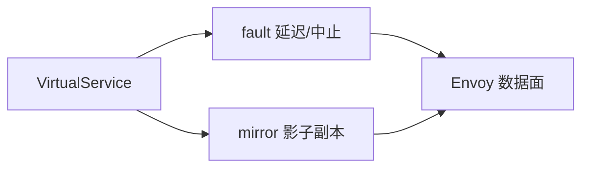

# 第7章 故障注入与流量镜像：在可控范围内验证韧性

## 7.1 项目背景

**业务场景（拟真）：支付大促前夜的「可控事故」与「影子验收」**

支付团队要在低峰验证：**下游延迟 500ms 时**熔断与告警是否触发；产品则希望把 **1% 真实流量**复制到 canary，对比错误率——但绝不能写进生产库。前者需要 **故障注入** 可开关、可限定 Header/子集；后者需要 **流量镜像** 与只读影子、幂等策略配套，否则「验收变事故」。

**痛点放大**

- **不可复现**：没有注入能力时，只能等线上自然故障，演练无法排期。
- **镜像误伤**：影子请求触发写接口、计费或打爆 canary，属于典型二次事故源。
- **工具碎片化**：若用 iptables/脚本注入，与金丝雀 YAML 脱节，难以审计。



**本章能力**：VirtualService 的 **`fault`** 与 **`mirror`**，与路由 `match`、权重组合，缩小爆炸半径。

## 7.2 项目设计：小胖、小白与大师的「可控事故」

**场景设定**：小白要低峰做延迟演练并开镜像；小胖担心「搞挂了支付」；大师定 **时间窗、范围、回滚**。

**第一轮**

> **小胖**：人为加延迟？产品经理同意吗？搞出客诉谁写检讨？
>
> **小白**：fault 能只对有 `x-drill: true` 的请求生效吗？镜像和主路是同一个 `x-request-id` 吗？
>
> **大师**：fault 挂在 **VirtualService 的 match 上**，可限定 Header、子集、比例；演练窗口、审批、监控要在 Runbook 里写死。镜像会**额外发一条请求**，响应不回客户端；`x-request-id` 是否复制取决于 Envoy 行为与配置，不要依赖镜像做强一致验收。
>
> **大师 · 技术映射**：**fault.delay / fault.abort ↔ Envoy 过滤器；mirror ↔ 影子 cluster。**

**第二轮**

> **小胖**：镜像过去会不会双倍打数据库？
>
> **小白**：镜像到 canary 若连同一 RDS，怎么隔离？
>
> **大师**：工程上要么 **只读副本/影子库**，要么应用侧拒绝写、或独立命名空间+假依赖。镜像比例与下游容量要单独评估，和 HPA 无关——那是第二条并行负载。

**第三轮**

> **大师**：演练结束必须 **删除 fault 或 Git 回滚**，否则配置漂移会变成「长期人为故障」。

**类比**：fault 像演习发烟弹；mirror 像监控室回放——不能联动真喷淋（生产写路径）。

## 7.3 项目实战：fault 与 mirror 配置

**步骤 1：fault（延迟与中止）**

```yaml
apiVersion: networking.istio.io/v1beta1
kind: VirtualService
metadata:
  name: payment-fault-drill
  namespace: production
spec:
  hosts:
  - payment-service
  http:
  - match:
    - headers:
        x-drill:
          exact: "true"   # 仅带头部的测试流量注入故障
    fault:
      delay:
        percentage:
          value: 100
        fixedDelay: 500ms
      abort:
        percentage:
          value: 0        # 可与 delay 组合；生产演练建议先 delay 后 abort
        httpStatus: 503
    route:
    - destination:
        host: payment-service
        subset: stable
  - route:
    - destination:
        host: payment-service
        subset: stable
```

**步骤 2：mirror（影子流量）**

```yaml
apiVersion: networking.istio.io/v1beta1
kind: VirtualService
metadata:
  name: order-mirror
  namespace: production
spec:
  hosts:
  - order-service
  http:
  - route:
    - destination:
        host: order-service
        subset: stable
      weight: 100
    mirror:
      host: order-service
      subset: canary
    mirrorPercentage:
      value: 1.0   # 镜像 1% 流量；按环境调整
```

**预期**：`istioctl proxy-config route` 可见 mirror 子集；canary 访问日志出现并行请求。

**可能踩坑**：前序 `http` 规则先匹配导致 fault/mirror 未命中；镜像放大下游负载。

**步骤 3：排查与验证**

```bash
# 确认路由已下发到客户端 Sidecar
istioctl proxy-config route deploy/order-service -n production --name inbound|grep -i mirror

# 对比 stable 与 canary 的访问日志（response_flags、duration）
kubectl logs -l app=order-service -c istio-proxy --tail=200
```

**测试验证**：对带 `x-drill: true` 的请求打支付接口，确认延迟/503 与监控告警；对镜像目标查看 QPS 是否按 `mirrorPercentage` 比例上升。

## 7.4 项目总结

**优点与缺点（与 Chaos Mesh 等对比）**

| 维度 | Istio fault/mirror | 独立混沌平台 |
|:---|:---|:---|
| 侵入性 | 声明式、与路由同仓 | 常需 Agent/CRD |
| 粒度 | L7 路由级 | 更丰富（节点/网络包级） |
| 组合 | 与金丝雀天然一体 | 需额外编排 |

**适用场景**：路由级演练；影子验收；与灰度同一变更单。

**不适用场景**：需内核/网络包级故障；未经过 Sidecar 的流量。

**注意事项**：镜像写路径隔离；fault 与重试叠加拉长尾延迟；生产演练审批。

**典型生产故障与根因**：前序规则吞掉 mirror；演练后未删 fault；镜像压垮 canary。

**思考题（参考答案见第8章或附录）**

1. `fault` 与 `retry` 同时配置时，对用户感知延迟可能产生什么叠加效应？
2. 镜像请求失败是否影响主路径响应？依据是什么？

**推广与协作**：SRE 定演练窗口；开发确认幂等与只读策略；测试验收影子环境隔离。

---

## 编者扩展

> **本章导读**：演习发烟弹与幽灵车；**实战演练**：Header 限定 fault + 镜像 canary；**深度延伸**：镜像写路径与幂等。

---

上一章：[第6章 可观测性基石：Telemetry API与Envoy访问日志深度解析](第6章 可观测性基石：Telemetry API与Envoy访问日志深度解析.md) | 下一章：[第8章 重试、超时与路由优先级：把偶发失败变成可预期行为](第8章 重试、超时与路由优先级：把偶发失败变成可预期行为.md)

*返回 [专栏目录](README.md)*
