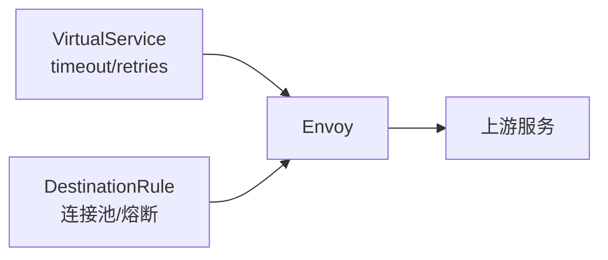

# 第8章 重试、超时与路由优先级：把偶发失败变成可预期行为

## 8.1 项目背景

**业务场景（拟真）：checkout 加了重试，P99 却炸了**

大促前，`checkout` 对支付接口配置了 **3 次重试**，错误率略降，但 **P99 翻倍**，日志里出现 `URX`、`upstream_reset`。根因往往是：**重试风暴**放大下游 QPS、**perTryTimeout 与总 timeout 关系错误**、或 **POST 非幂等** 不应重试。本章把 **timeout / retries / 路由顺序** 与 DestinationRule 联动讲清。

**痛点放大**

- **代理层 vs 应用层**：只调 Sidecar 而应用线程仍阻塞，用户照样超时。
- **路由顺序**：金丝雀规则写在默认路由之后，**永远匹配不到**。
- **韧性预算**：重试次数 × 并发 = 下游放大倍数，需与连接池/熔断对齐。



## 8.2 项目设计：小胖、小白与大师的「503 之谜」

**第一轮**

> **小胖**：失败就重试，多试几次总有一次成功吧？
>
> **小白**：`retryOn` 和 gRPC 状态怎么对应？`timeout` 与 `perTryTimeout` 啥关系？
>
> **大师**：重试会放大**下游负载**；支付等写接口要**幂等**或禁用重试。总 `timeout` 应覆盖「尝试次数 × 单次尝试」的合理窗口，否则出现 `URX`——重试耗尽仍失败。
>
> **大师 · 技术映射**：**timeout ↔ 路由级总超时；perTryTimeout ↔ 单次尝试；retryOn ↔ 可重试条件集合。**

**第二轮**

> **小白**：为什么第一条路由总抢走流量？
>
> **大师**：`http` 列表**自上而下**匹配，首个命中即停。金丝雀、Header 必须放在**通用 default** 之前。

**第三轮**

> **大师**：把 **DestinationRule** 里连接池、熔断拉进 checklist，否则重试会把「已熔断的上游」打得更满。

**类比**：重试像对超载分拣线反复投件；超时是「最晚送达」承诺。

## 8.3 项目实战：timeout、retries 与优先级

**步骤 1：推荐配置骨架（目标：超时与重试窗口一致）**

```yaml
apiVersion: networking.istio.io/v1beta1
kind: VirtualService
metadata:
  name: checkout-timeout-retry
  namespace: production
spec:
  hosts:
  - checkout-service
  http:
  - match:
    - uri:
        prefix: /api/v1/checkout
    route:
    - destination:
        host: checkout-service
        subset: stable
    timeout: 2s
    retries:
      attempts: 2
      perTryTimeout: 800ms
      retryOn: connect-failure,refused-stream,unavailable,reset,gateway-error
      retryRemoteLocalities: true
  - route:
    - destination:
        host: checkout-service
        subset: stable
```

**步骤 2：与 DestinationRule 联动检查**

| 检查项 | 说明 |
|:---|:---|
| 连接池 | `http2MaxRequests`、`maxConnections` 是否足以承载重试倍数 |
| 熔断 | `outlierDetection` 是否因重试放大而频繁驱逐 |
| 幂等性 | POST 是否允许重试；若不允许，仅在 GET/幂等接口开启 |
| 优先级 | 细粒度 `match` 是否排在通用路由之前 |

```bash
istioctl proxy-config route deploy/checkout-service -n production -o json | jq '.[] | .virtualHosts[] | select(.name|test("checkout"))'
```

**测试验证**：压测下对比「仅超时」「仅重试」「两者组合」的下游 QPS 与 `istio_requests_total` 中重试相关指标（若启用）。

## 8.4 项目总结

**优点与缺点**

| 维度 | 网格侧 timeout/retry | 仅应用内重试 |
|:---|:---|:---|
| 一致性 | 全集群可统一 | 各语言不一致 |
| 风险 | 误配放大负载 | 同样存在，需幂等 |
| 观测 | Envoy flags 可分解 | 依赖应用日志 |

**适用场景**：跨 AZ 调用；外部 HTTP；与金丝雀分路由重试策略。

**不适用场景**：强实时且不允许任何尾延迟放大；非幂等写接口禁止重试。

**典型故障与根因**：`URX` 重试耗尽；路由顺序错误；连接池与重试倍数不匹配。

**思考题（参考答案见第9章或附录）**

1. 写出 `timeout`、`perTryTimeout`、`attempts` 之间应满足的一个不等式关系（文字描述即可）。
2. 为何金丝雀 `match` 必须放在默认 `route` 之前？

**推广与协作**：开发标注幂等接口；SRE 设全局重试预算；测试压测验证重试风暴。

---

## 编者扩展

> **本章导读**：韧性预算 = 超时 + 重试 + 路由顺序；**实战演练**：故障注入 + 对比 P99；**深度延伸**：路由决策树。

---

上一章：[第7章 故障注入与流量镜像：在可控范围内验证韧性](第7章 故障注入与流量镜像：在可控范围内验证韧性.md) | 下一章：[第9章 网格运维基础：istioctl 诊断、分析与升级意识](第9章 网格运维基础：istioctl 诊断、分析与升级意识.md)

*返回 [专栏目录](README.md)*
