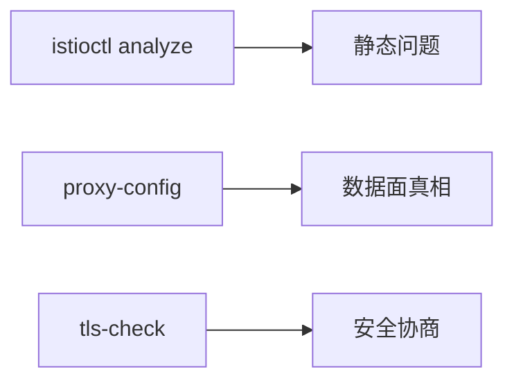

# 第9章 网格运维基础：istioctl 诊断、分析与升级意识

## 9.1 项目背景

**业务场景（拟真）：升级前夜与「能 apply 不等于对」**

平台组计划把小版本升级 Istio：变更单已写好，但没人敢点「发布」——怕 CRD 弃用、怕 VirtualService 引用幽灵子集、怕证书窗口内握手异常。**`kubectl apply` 成功**只代表对象入库，**语义正确**要靠 `istioctl analyze`、proxy-config 与 tls-check 交叉验证。本章建立 **SRE 体检表** 与 **revision 金丝雀** 意识。

**痛点放大**

- **静态错误**：hosts 不对齐、subset 不存在，运行时表现为 404/503。
- **版本矩阵**：istioctl 与集群 Minor 不一致时，analyze 结果不可信。
- **升级回滚**：无 revision 时全集群「一刀切」风险高。



## 9.2 项目设计：小胖、小白与大师的「上线前体检表」

**第一轮**

> **小胖**：升级不就是换个镜像？有啥好查的？
>
> **小白**：`analyze` 和 `kubectl get` 差在哪？revision 标签怎么回滚？
>
> **大师**：`analyze` 做**跨资源引用与弃用 API** 检查；Sidecar 真实配置要看 `proxy-config`。升级先读 Release Notes，非生产并行装 **revision**，命名空间 `istio.io/rev` 试点再推广。
>
> **大师 · 技术映射**：**analyze ↔ 配置语义；proxy-status ↔ 同步状态；revision ↔ 控制面多版本共存。**

**第二轮**

> **小白**：analyze 干净为什么还 503？
>
> **大师**：静态分析覆盖不了**运行时**——端点不健康、网络策略、上游过载，要日志与 metrics。

**类比**：analyze 像年检；revision 像新款试产车小批量上路。

## 9.3 项目实战：分析与升级前检查

**步骤 1：集群配置诊断**

```bash
# 全集群分析（关注 Error 与 Warning）
istioctl analyze --all-namespaces

# 针对单次变更命名空间
istioctl analyze -n production

# 输出机器可读
istioctl analyze -o json | jq '.[] | select(.severity=="Error")'
```

**步骤 2：配置与证书抽检**

```bash
istioctl proxy-status
istioctl authn tls-check deployment/order-service -n production
istioctl x auth check -n production
```

**步骤 3：revision 并行（概念示例）**

```bash
# 安装新版本控制平面（具体参数以官方文档为准）
istioctl install --set revision=canary -y

# 试点命名空间切换注入标签（示例）
kubectl label namespace pilot-ns istio.io/rev=canary --overwrite
```

**测试验证**：故意制造错误配置后 `analyze` 应报 Error；修复后 Error 消失；`proxy-status` 显示 NOT SENT 需排查。

## 9.4 项目总结

**优点与缺点**

| 维度 | istioctl 工具链 | 仅 kubectl |
|:---|:---|:---|
| 语义检查 | analyze 跨资源 | 无 |
| 数据面 | proxy-config _dump_ | 无原生等价 |

**适用场景**：CI 门禁；升级演练；事故后审计。

**不适用场景**：纯运行时性能问题（需 profiling）。

**典型故障**：analyze 通过仍异常；升级后未重建 Pod 导致版本不一致。

**思考题（参考答案见第10章或附录）**

1. `istioctl proxy-status` 中 `NOT SENT` 可能表示什么？
2. 为何升级控制面后有时必须滚动工作负载 Pod？

**推广与协作**：平台把 analyze 接 CI；开发提交前本地跑；变更窗口双人复核 proxy-status。

---

## 编者扩展

> **本章导读**：听诊三角 = analyze + proxy-config + describe；**实战演练**：故意错误 VS；**深度延伸**：revision 金丝雀路径。

---

上一章：[第8章 重试、超时与路由优先级：把偶发失败变成可预期行为](第8章 重试、超时与路由优先级：把偶发失败变成可预期行为.md) | 下一章：[第10章 mTLS基础：服务间通信的自动加密](第10章 mTLS基础：服务间通信的自动加密.md)

*返回 [专栏目录](README.md)*
