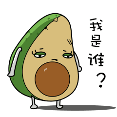

本故事纯属虚构，如有雷同，纯属巧合。

**故事背景**

为了公司的财务信息化，公司上线了一套自主研发的财务系统，上班第一天，测试 MM 小 T 就扔过来一个 bug，结算结果出现了一个诡异的结果。小白有点慌，马上就要上线了，冒烟测试就发现问题了，搞不好无法按时上线，就赶紧让小T重现了一下问题。测试用例场景：一个商户去年欠下公司一笔账务，今年又欠下一笔，但测试出来的结果却是正数。为公司机密，抽取代码如下：

```java
	public static void main(String[] args){	
		int x = -2000000000;
		int z = 2000000000;
		System.out.println(x - z);
		}
```

小白用肉眼看了一下，这个结果应该为负数，不该为正数呀，运行程序，结果显示为：294967296。



**寻求解决**

很明显，x 比 z 小，它的结果为一个负数，但是程序打印的是 294967296，它是一个正数。突然想到是不是两个数的差超过了 int 最大最小值的范围，然后溢出了？那就验证一下吧 !

```java
/**
 * A constant holding the maximum value an {@code int} can
 * have, 2<sup>31</sup>-1.
 */
 @Native public static final int MAX_VALUE = 0x7fffffff;
```

int 的最大值为 2,147,483,647，最小值为 -2,147,483,648，故 -2,000,000,000--2,000,000,000 的值为 -4,000,000,000 小于最小值 -2,147,483,648，产生了溢出，溢出的值又如何得到的呢？

```java
	public static void main(String[] args){
		int x = -2000000000;
		int z = 2000000000;
		int max=Integer.MAX_VALUE;
		System.out.println(Integer.toHexString(x));
		System.out.println(Integer.toHexString(z));
		System.out.println(Integer.toHexString(x-z));
		}
```

-2,000,000,000 的 16 进制数值为：0x88ca6c00。

2,000,000,000 的 16 进制数值为：0x77359400。

两个数值相减的 16 进制数值为：0x1194d800 (十进制数值294967296)

**总结**

不止 int 会碰到这种问题，byte、char、long 等都会碰到溢出，故了解它们的范围很有必要：

• **byte ：** 从 -128 到 127，包含；

• **short ：**从 -32768 到 32767，包含；

• **int ：**从 -2147483648 到 2147483647，包含；

• **long ：**从 -9223372036854775808 到 9223372036854775807，包含；

• **char ：** 从 '\u0000' 到 '\uffff' 包含，即从 0 到 65535。