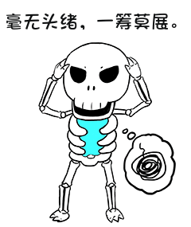

本故事纯属虚构，如有雷同，纯属巧合！

**故事背景**

经过上次的上次的教训后，小白端正了态度，小 L 明显感受到小白的变化，也更愿意让小白承担更多的任务。

早上，小白边听歌，边写代码，耳边正在播放蔡依林的《看我七十二变》，悠扬的歌声加上立体音，小白的键盘敲的更起劲了：

> 。。。。。。。。。。。
>
> 看我七十二变
>
> 今天新鲜改变再见
>
> 美丽极限爱漂亮没有终点
>
> 追求完美的境界
>
> 人不爱美天诛地灭
>
> 别气馁旧观念抛到一边
>
> 现在就开始改变
>
> 麻雀也能飞上青天
>
> 。。。。。。。。。

小白正听的有劲，有人拍自己肩膀，原来是旁白的同事小胖，小胖说小 L 要找小白，让他去会议室。原来的一个同事离职了，但他负责的项目马上就要上线了，但现在测出了一个 bug，想让小白去支持一下，他手头的活暂时放一下。

“这是一个表现自己的好机会呀！最近几个月的苦练，看看有没有效果？“     小白想着，

经过一番辛苦调试，终于定位到问题的点，为了还原错误情况，我们将 Bug 处抽离出来，逻辑有点绕，看看问题所在：

```java
public class Multicast{
	public static void main (String[] args){
		System.out.println((int)(char)(byte) -1);
	}
}
```

本来期望的结果为 -1，但调试结果返回 65535。

为什么会这样呢？

**发现问题**

小白知道，类型转换从`小`到`大`一般是不会丢失精度的，但这次的值发生了改变。

为了调试方便，小白将程序细分了好几步：

```java
 public static void main (String[] args){
 int i=-1;
 byte b=(byte)i; //1
 char c=(char)b; //2
 int r=(int)c; //3
 System.out.println(r);
 }
```

第一步：int 转 byte

byte b=-1

第二步：byte 转 char

char c=65535

第三步：char 转 int

int r=65535

那么到底是什么原因导致 byte 转 char 的时候出现问题呢？小白一筹莫展。



**扫地僧救场**	

扫地僧恰巧经过，扫了一眼，小声的说：“因为 byte 是一个有符号类型，而 char 是一个无符号类型。在将一个整数类型转换成另一个宽度更宽的整数类型时，通常是可以保持其数值的，但是却不可能将一个负的 byte 数值表示成一个char。因此，从 byte 到 char 的转换被认为不是一个拓宽原始类型的转换，而是一个拓宽并窄化原始类型的转换：byte 被转换成了 int，而这个 int 又被转换成了 char”

扫地僧小白是知道，姓曾，公司初创时的进来的，算是元老员工，现在挂着公司技术顾问的头衔，没有具体负责的事务，后面不知道什么原因，就传出了扫地僧的名声。小白知道他是技术大神，赶紧端茶倒水，当面请教。

扫地僧看小白很是恭敬，也比较勤奋，就拿出笔画了步骤：

1.-1 是 int 类型，它的二进制结构

**0b1111_1111_1111__1111_1111_1111_1111_1111**

int 转成 byte，截取低 8 位 **0b1111_1111** 值也为 -1

2.byte 转 char，需要先拓展到 int 型，然后转成 char

2.1 byte 转 int 

**0b1111_1111_1111__1111_1111_1111_1111_1111**

2.2 int 转 char 

**0b1111_1111_1111__1111** 

值位 65535

3.char 转 int (补零)

**0b0000_0000_0000__0000_1111_1111_1111_1111**

其值位 65535

**扫地僧点化**

经过这一讲解，小白顿时明白了，但本着追根问底的精神。

**小白**：”讲过您老这么讲解，我是明白了，但我不知道为什么要这样处理？您老可以再指点一番吗？“

**扫地僧**：”小伙子很好，知道刨根究底。其实 《Java language Specification》第五章里明确定义了各种转换的规则，小伙子可以好好研究一下，网上都有资料。“

解决 Bug 并通过了冒烟测试之后，小白找到了传说中的宝典《Java language Specification》,找到了第五章，发现真是个宝藏呀：

JLS-5 强制类型转换，定义标识如下：

\- 表示不运行任何强制类型转换

≈ 表示标识抓获(§5.1.1)

ω 表示拓宽基本类型转换 (§5.1.2)

η 表示窄化基本类型转换 (§5.1.3)

ωη 表示拓宽和窄化类型转换 (§5.1.4)

⇑ 表示拓宽引用类型转换 (§5.1.5)

⇓ 表示窄化引用类型转换(§5.1.6)

⊕ 表示装箱转换 (§5.1.7)

⊗表示拆卸类型转换 (§5.1.8)


更详细的资料请参照 JSL5 描述，链接地址见参考资料【3】

参考资料

【1】https://baike.baidu.com/item/%E7%9C%8B%E6%88%9172%E5%8F%98/6364210?fromtitle=%E7%9C%8B%E6%88%91%E4%B8%83%E5%8D%81%E4%BA%8C%E5%8F%98&fromid=10315618&fr=aladdin

【2】https://docs.oracle.com/javase/specs/jls/se12/html/jls-5.html

【3】《Java解惑》

