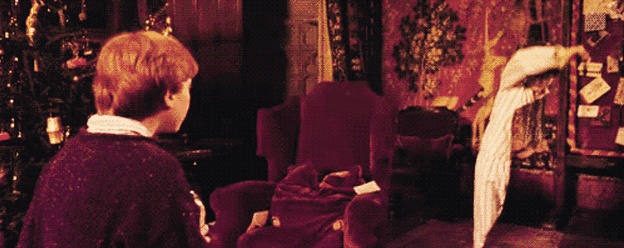

本故事纯属虚构，如有雷同，纯属巧合。

**故事背景**

看过《哈利·波特》的娃们，想必一定还记得电影中的“隐形斗篷”。这件隐形衣是哈利收到的圣诞礼物，也是死亡圣器中的三件套之一，它让哈利小盆友在执行任务的过程中简直是如虎添翼！



 其实说白了，隐身衣所包裹的就是人类本能的掌控欲与窥探欲，我们渴望知道和了解所有事，但很多时候又不想让别人知道，所以我们需要“隐身衣”。如果你想让 Java 中某些方法或者属性隐藏，该如何做呢？

 


 **继承 Inheritance / 隐藏hide / 覆写 override**

Java 中有继承 Inheritance/隐藏 hide/覆写override 的概念，我们暂且不管他们的区别，先看看最近发生的一件小事，Boss 在开会时说错了一个数字，Leader 赶紧说：”那是我弄错的“，程序猿想找到 Boss 说的数字时，却怎么也不行，这是怎么回事呢？请看案情回放：

```java
public class Conference {
    public static void main(String[] args) {
        System.out.println(new Leader().sales);
    }
}
class Boss {
    public Integer sales=10000;
}
class Leader extends Boss{
    private Integer sales=9000;
}
```

咋一看，会打印 Leader 的销售量数据 9000，但仔细分析来看，Leader 类的 sales 变量是私有的，程序不能编译通过。该程序确实不能编译，但是错误出在 Conference 类中。原因：在 Conference 中调用的是 new Leader() 即 leader 的实例，不是 Leader 类，一个覆写方法的访问修饰符，所提供的访问权限与被覆写方法的访问修饰符所提供的访问权限相比，至少要一样多[JLS 8.4.8.3]。

因为 sales 是一个域，所以 Leader.sales 隐藏（hide）了 Boss.sales，而不是覆盖了它 [JLS 8.3]。对一个域来说，当它要隐藏另一个域时，如果隐藏域的访问修饰符提供的访问权限比被隐藏域的少，尽管这么做不可取的，但是它确实是合法的。

其实我们还是可以找到老板的所说的 sales 的。如下：

```java
public class Conference {
    public static void main(String[] args) {
        System.out.println(((Boss)new Leader()).sales);
    }
}
class Boss {
    public Integer sales=10000;
}
class Leader extends Boss{
    private Integer sales=9000;
}
```

**总结**

覆写与隐藏之间的一个非常大的区别。一旦一个方法在子类中被覆写，你就不能在子类的实例上调用它了（除了在子类内部，通过使用 super 关键字来方法）。然而，你可以通过将子类实例转型为某个超类类型来访问到被隐藏的域，在这个超类中该域未被隐藏。

参考资料

【1】《Java解惑》