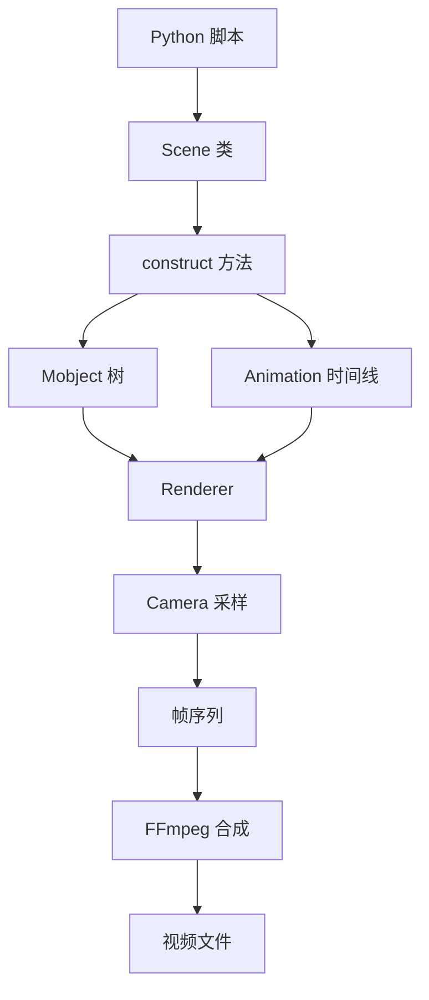

# Manim 动画编程与可视化实战专栏大纲

> 版本：Manim Community Edition v0.20.1
> 面向人群：新人开发、测试、数学/物理教师、内容创作者、核心开发、架构师
> 总章节：40 章（基础篇 16 章 / 中级篇 15 章 / 高级篇 9 章）
> 每章独立成文件，字数 3000-5000 字

---

## 专栏定位

本专栏以 Manim Community Edition 为主线，面向想用代码制作数学动画、工程讲解视频、数据可视化短片和自动化教学内容的读者。整体采用「业务痛点 → 三人剧本对话 → 代码实战 → 总结思考」的四段式结构，强调先做出可运行作品，再回到 Scene、Mobject、Animation、渲染器、插件与源码机制中理解原理。

专栏不把 Manim 当成单纯 API 手册，而是把它当成一个“用 Python 编排视觉叙事”的工程工具。基础篇解决从零上手和小作品交付；中级篇训练复杂动画编排、数据驱动、组件复用和视频生产流程；高级篇进入渲染管线、源码剖析、自定义扩展和团队级内容生产体系。

---

## 阅读路线建议

| 角色 | 建议阅读顺序 | 重点章节 |
|------|-------------|---------|
| 新人开发/测试 | 基础篇全读 → 中级篇选读 | 第 1-16 章 |
| 教师/内容创作者 | 基础篇全读 → 中级篇项目章节精读 | 第 1-16、20-31 章 |
| 核心开发/工具链维护者 | 基础篇速读 → 中级篇精读 → 高级篇选读 | 第 17-40 章 |
| 架构师/资深开发 | 高级篇为主线，按需回溯中级篇 | 第 32-40 章，辅以第 21-31 章 |

---

# 基础篇（第 1-16 章）

> **核心目标**：建立 Manim 核心概念，掌握本地环境、基础对象、常用动画、坐标系统、文本公式、渲染调试与初级实战。
> **源码关联**：manim/scene/、manim/mobject/、manim/animation/、manim/utils/、manim/config/。

---

## 第1章：Manim 术语全景与动画渲染工作原理
**定位**：专栏总览与开篇，建立统一语系，理解 Manim 从 Python 脚本到视频文件的完整链路。
**核心内容**：
- 术语词典：Scene、Mobject、VMobject、Animation、Renderer、Camera、Timeline、Frame、Updater、ValueTracker
- Manim 的工作模式：Python 描述画面，Scene 编排时间线，Renderer 输出媒体文件
- Cairo 与 OpenGL 渲染器的基础差异
- 命令行执行流程：manim script.py SceneName -pql
- 配置优先级：命令行参数、manim.cfg、默认配置
- 架构图：

**实战目标**：编写第一个 `HelloManim` 场景，渲染出包含标题、公式、图形变换和淡出效果的 10 秒开场动画。

---

## 第2章：环境安装与第一个可交付动画
**定位**：从“能跑起来”开始，解决安装、依赖、字体、LaTeX 与 FFmpeg 的常见问题。
**核心内容**：
- Python 版本、虚拟环境、pip/uv/conda 安装方式
- FFmpeg、LaTeX、字体依赖的作用与验证命令
- Windows、macOS、Linux 的安装差异与路径问题
- 常用渲染质量参数：-ql、-qm、-qh、-p、--format
- 项目目录结构：scenes/、assets/、media/、manim.cfg
**实战目标**：创建一个最小 Manim 项目，完成 3 个场景的批量渲染，并整理出团队可复用的环境检查脚本。

---

## 第3章：Scene 生命周期与时间线编排
**定位**：理解 Manim 动画脚本的入口，掌握场景如何组织画面和时间。
**核心内容**：
- Scene、construct、setup、tear_down 的职责
- add、remove、clear、wait、play 的区别
- run_time、rate_func、lag_ratio 对节奏的影响
- 多个 Animation 的并行与串行执行
- 渲染缓存与 partial movie files 的基础认识
- 源码关联：manim/scene/scene.py
**实战目标**：制作一个“知识点引入 → 例子演示 → 总结收束”的 30 秒教学片段，要求节奏清晰、转场自然。

---

## 第4章：Mobject 基础——万物皆可动画
**定位**：掌握 Manim 中视觉对象的核心抽象。
**核心内容**：
- Mobject、VMobject、VGroup 的关系
- add、submobjects、copy、become 的使用边界
- move_to、shift、scale、rotate、next_to、align_to 等常用变换
- z_index、颜色、透明度、描边与填充
- 对象树与分组思维
- 源码关联：manim/mobject/mobject.py、manim/mobject/types/vectorized_mobject.py
**实战目标**：用基础图形搭建一个“代码积木工厂”动画，演示对象创建、组合、复制、移动与消失。

---

## 第5章：Animation 入门——让对象动起来
**定位**：从静态画面进入动态叙事，掌握最常用动画类。
**核心内容**：
- Create、Write、FadeIn、FadeOut、Transform、ReplacementTransform
- GrowFromCenter、Indicate、Circumscribe、Flash 的强调效果
- AnimationGroup、Succession、LaggedStart 的组合方式
- rate_functions：linear、smooth、there_and_back、rush_into
- 什么时候使用 animate 语法，什么时候使用显式 Animation
- 源码关联：manim/animation/creation.py、manim/animation/transform.py
**实战目标**：制作一个“排序算法可视化开场”，用柱状条的出现、交换、强调解释冒泡排序第一轮。

---

## 第6章：坐标系统与画面布局
**定位**：建立空间感，避免动画对象“凭感觉摆放”。
**核心内容**：
- Manim 坐标系：ORIGIN、UP、DOWN、LEFT、RIGHT
- config.frame_width、config.frame_height 与画面比例
- NumberPlane、Axes、CoordinateSystem 的基本用法
- to_edge、to_corner、arrange、arrange_in_grid 的布局策略
- 设计安全区、标题区、内容区、注释区
**实战目标**：制作一个坐标轴讲解动画，展示点、线、向量在平面中的移动与坐标读数变化。

---

## 第7章：文本、中文字体与数学公式
**定位**：解决教学视频最常见的文字与公式表达问题。
**核心内容**：
- Text、MarkupText、Paragraph、Title 的使用场景
- 中文字体配置、fallback 字体与跨平台兼容
- MathTex、Tex、SingleStringMathTex 的差异
- 公式拆分、按字符上色、局部 Transform
- LaTeX 报错定位与模板定制
- 源码关联：manim/mobject/text/
**实战目标**：制作一个“勾股定理公式推导”片段，实现中文说明、公式逐步变形和重点项高亮。

---

## 第8章：基础几何图形与视觉风格
**定位**：掌握图形表达的基本素材，形成统一画面风格。
**核心内容**：
- Dot、Line、Arrow、Circle、Square、Polygon、Arc、Brace
- Stroke、Fill、Opacity、Gradient 的视觉效果
- TipableVMobject 与箭头族对象
- DashedLine、Angle、RightAngle 的几何辅助表达
- 配色方案、字号层级与风格一致性
**实战目标**：制作一个“向量加法”动画，用箭头、虚线、角度标注和颜色层级讲清平行四边形法则。

---

## 第9章：图像、SVG 与外部素材管理
**定位**：把 Manim 从纯几何动画扩展到真实项目素材制作。
**核心内容**：
- ImageMobject、SVGMobject 的加载与缩放
- assets 目录组织与相对路径管理
- SVG 分层、路径拆分与局部上色
- 图片透明背景、分辨率与压缩问题
- 版权素材、图标库与团队素材规范
**实战目标**：制作一个产品功能介绍短片，组合 Logo、图标、流程箭头和关键文字，输出 15 秒宣传动画。

---

## 第10章：常用变换技巧与镜头感
**定位**：让动画不仅“能动”，还具备清晰的视觉引导。
**核心内容**：
- TransformMatchingTex、TransformMatchingShapes 的匹配规则
- save_state、restore、generate_target 与 MoveToTarget
- FocusOn、ApplyWave、ShowPassingFlash 的视线引导
- MovingCameraScene 入门：缩放、平移、聚焦
- 转场的叙事意义：进入、关联、替换、收束
**实战目标**：制作一个“函数从表达式到图像”的片段，通过公式变形、坐标轴生成和镜头推进完成知识点过渡。

---

## 第11章：颜色、主题与可读性设计
**定位**：建立适合长期专栏或课程使用的视觉规范。
**核心内容**：
- Manim 颜色常量与自定义颜色
- 深色主题、浅色主题与投影环境适配
- 重点色、辅助色、危险色、成功色的语义设计
- 对比度、字号、留白与信息密度
- 主题配置抽取：constants.py 与 style.py
**实战目标**：为后续章节创建一套统一动画主题，包括标题样式、公式样式、提示框、错误框和总结卡片。

---

## 第12章：配置文件、命令行与渲染输出
**定位**：让动画制作从临时脚本进入可重复构建。
**核心内容**：
- manim.cfg 常用配置：quality、resolution、frame_rate、background_color
- CLI 参数与配置文件的覆盖关系
- 输出目录 media/ 的结构
- GIF、PNG、MP4、透明背景视频的输出选择
- 缓存清理、跳过缓存与渲染速度优化入门
**实战目标**：搭建一个课程项目模板，支持低清预览、高清发布、透明背景导出和指定章节批量渲染。

---

## 第13章：错误排查与调试工作流
**定位**：从“报错看不懂”到能独立定位问题。
**核心内容**：
- 常见错误：找不到 Scene、LaTeX 编译失败、字体缺失、FFmpeg 不存在
- Python 异常栈与 Manim 渲染日志阅读
- print、logger、临时辅助线与边界框调试
- 最小复现脚本的写法
- Windows 路径、中文目录与编码问题
**实战目标**：模拟 8 类常见 Manim 故障，整理一份“错误信息 → 根因 → 修复动作”的排查手册。

---

## 第14章：基础交互式演示与参数化动画
**定位**：把一次性动画改造成可调参、可复用的小实验。
**核心内容**：
- Python 函数封装场景片段
- 使用变量控制颜色、速度、数量和布局
- ValueTracker 初识：让数值驱动画面变化
- always_redraw 入门与刷新机制
- 参数化设计的可维护性收益
**实战目标**：制作一个可调参数的“二次函数开口变化”动画，只修改参数即可生成多个版本。

---

## 第15章：从脚本到作品——短视频结构拆解
**定位**：连接技术实现与内容表达，形成可交付作品意识。
**核心内容**：
- 30 秒、60 秒、3 分钟教学视频的结构差异
- 镜头脚本：画面、旁白、动画、时长四列表
- 开场钩子、概念解释、例子演示、总结回扣
- Manim 与剪辑软件的协作边界
- 代码文件、素材文件、输出文件的归档规范
**实战目标**：为一个“为什么圆的面积是 pi r^2”选题设计完整镜头脚本，并实现其中 3 个关键镜头。

---

## 第16章：【基础篇综合实战】制作一个数学科普短视频
**定位**：融会贯通基础篇知识，完成第一支可发布作品。
**核心内容**：
- 场景：制作 2-3 分钟“从斜率理解导数”的数学科普视频
- 需求拆解：标题开场、函数图像、割线到切线、公式推导、总结卡片
- 分步实现：项目结构、主题样式、场景拆分、批量渲染、素材整理
- 验收标准：画面清晰、节奏自然、公式无错、可复现渲染
- 交付物：源码、镜头脚本、渲染视频、问题复盘
**实战目标**：输出一支完整 MP4 视频，并形成可复用的基础篇项目模板。

---

# 中级篇（第 17-31 章）

> **核心目标**：掌握复杂动画编排、数据驱动可视化、3D 场景、组件化工程、音画同步、批量渲染与团队协作。
> **源码关联**：manim/animation/、manim/mobject/graphing/、manim/scene/three_d_scene.py、manim/renderer/。

---

## 第17章：复杂动画编排与时间控制
**定位**：从单个动画升级为多对象、多节奏的完整段落。
**核心内容**：
- AnimationGroup、LaggedStart、Succession、LaggedStartMap 深入使用
- 动画时长统一规划与节奏表
- 多层对象的进入、强调、退场策略
- rate_func 自定义与运动曲线设计
- 复杂段落的可读性拆分
**实战目标**：制作一个“HTTP 请求生命周期”动画，让客户端、网关、服务端、数据库按时间线协同运动。

---

## 第18章：Updater 与动态响应式画面
**定位**：让对象跟随状态实时变化，构建更自然的动态系统。
**核心内容**：
- add_updater、remove_updater、clear_updaters
- dt 参数与帧率相关动画
- always、always_redraw、f_always 的使用边界
- Updater 的性能风险与调试方式
- 动态标签、动态曲线、动态连接线
**实战目标**：制作一个“弹簧振子”动画，实现小球运动、弹簧伸缩、速度箭头和能量柱状图同步刷新。

---

## 第19章：ValueTracker 驱动的数学实验
**定位**：用数值变化控制动画，让数学过程可视化。
**核心内容**：
- ValueTracker、DecimalNumber、Variable 的组合
- 通过 tracker 控制位置、角度、颜色、透明度
- 多 tracker 协同与状态同步
- 参数扫描动画的设计方法
- 常见陷阱：闭包、刷新对象、对象引用
**实战目标**：制作一个“傅里叶级数逼近方波”的动画，通过阶数变化展示曲线逐渐逼近目标函数。

---

## 第20章：函数图像、坐标轴与数据曲线
**定位**：掌握 Manim 最核心的数学可视化能力。
**核心内容**：
- Axes、NumberPlane、PolarPlane 的选择
- plot、plot_parametric_curve、plot_implicit_curve
- 坐标点转换：coords_to_point、point_to_coords
- 曲线标注、切线、面积填充、动态采样
- 坐标轴范围、刻度与标签可读性
**实战目标**：制作一个“梯度下降寻找最小值”的动画，展示曲线、切线、迭代点和损失值变化。

---

## 第21章：表格、矩阵与算法可视化
**定位**：面向开发者，将抽象数据结构变成可解释画面。
**核心内容**：
- Table、MathTable、Matrix、IntegerMatrix
- 数组、链表、栈、队列、树的视觉建模
- 颜色高亮、指针移动、元素交换
- 算法步骤与画面步骤的映射
- 复杂算法动画的状态管理
**实战目标**：制作一个“Dijkstra 最短路径”动画，展示图结构、距离表、候选节点与路径更新过程。

---

## 第22章：3D 场景与空间几何
**定位**：进入三维表达，制作更具空间感的数学与工程动画。
**核心内容**：
- ThreeDScene、ThreeDAxes、Surface、ParametricFunction
- 相机角度：phi、theta、zoom、focal_distance
- ambient_camera_rotation 与镜头运动
- 3D 对象的颜色、透明度与遮挡关系
- 3D 渲染的性能与可读性取舍
**实战目标**：制作一个“多元函数曲面与梯度方向”动画，展示曲面、等高线、移动点和梯度箭头。

---

## 第23章：概率统计与数据可视化实战
**定位**：把真实数据变成可讲故事的动态画面。
**核心内容**：
- BarChart、LineGraph、Axes 与自定义图表
- CSV/JSON 数据读取与清洗
- 动态柱状图、折线趋势、散点分布
- 分布、均值、方差、置信区间的动画表达
- 数据准确性与视觉夸张的边界
**实战目标**：用一份真实或模拟销售数据制作“月度增长分析”动画，包含趋势、异常点和结论卡片。

---

## 第24章：物理模拟与工程过程可视化
**定位**：把公式、模型和工程过程转化为动态演示。
**核心内容**：
- 基于 Python 计算结果驱动画面
- 运动学、碰撞、波动、场线的简化模拟
- 数值计算与动画帧的解耦
- scipy/numpy 与 Manim 的协作方式
- 精确模拟与教学表达之间的取舍
**实战目标**：制作一个“双摆运动”动画，先用 scipy 求解轨迹，再用 Manim 展示摆杆、轨迹和能量变化。

---

## 第25章：可复用组件与场景工程化
**定位**：让 Manim 项目从脚本集合变成可维护工程。
**核心内容**：
- 组件封装：标题卡片、步骤条、代码块、提示框
- BaseScene 与公共方法抽取
- constants.py、style.py、assets.py 的职责划分
- 包结构、导入路径与测试脚本
- 组件 API 设计：简单、稳定、少副作用
**实战目标**：封装一套教学视频组件库，支持 5 类常用卡片和 3 类转场动画，并在两个场景中复用。

---

## 第26章：代码演示与技术架构动画
**定位**：面向技术讲解视频，展示代码、流程和架构关系。
**核心内容**：
- Code 对象与语法高亮
- 代码行高亮、片段替换、注释浮层
- 流程图、时序图、系统架构图的 Manim 实现
- 服务节点、消息流、队列、数据库的视觉模型
- 技术视频的信息密度控制
**实战目标**：制作一个“消息队列削峰填谷”技术动画，包含流量曲线、队列堆积、消费者扩容和代码片段。

---

## 第27章：音画同步、旁白与字幕
**定位**：把动画片段升级为完整教学视频。
**核心内容**：
- add_sound 与音频插入
- 旁白脚本、时间码与动画节奏对齐
- 字幕文件生成与烧录方案
- Manim Voiceover 插件生态概览
- 重录旁白、局部重渲染与版本管理
**实战目标**：为一个 60 秒动画添加旁白、背景音乐和字幕，确保关键动画与语音重点同步。

---

## 第28章：批量渲染与自动化生产
**定位**：提升多章节课程的生产效率和一致性。
**核心内容**：
- 场景命名规范与批量选择
- Makefile、PowerShell、Python 脚本自动渲染
- 低清预览、高精终版、失败重试
- 渲染产物归档与版本号管理
- CI 中运行 Manim 的依赖与缓存策略
**实战目标**：搭建一个一键渲染流水线，支持渲染全部章节、指定章节和只渲染改动场景。

---

## 第29章：性能优化与大场景拆分
**定位**：解决复杂动画变慢、卡顿、内存占用高的问题。
**核心内容**：
- 渲染慢的常见原因：对象过多、Updater 过重、LaTeX 重复编译
- 缓存机制与局部预渲染
- VGroup 层级优化与对象复用
- 图像/SVG 简化与采样点控制
- 性能分析方法：日志、计时器、分段渲染
**实战目标**：优化一个包含上千个对象的粒子动画，将预览渲染时间降低 50% 以上。

---

## 第30章：插件生态与第三方工具集成
**定位**：借助生态提升生产能力，避免重复造轮子。
**核心内容**：
- Manim 插件发现、安装与启用方式
- manim-slides、manim-voiceover、manim-physics 等常见插件
- numpy、scipy、pandas、networkx 与 Manim 的配合
- Jupyter 与交互式预览工作流
- 插件版本兼容与风险管理
**实战目标**：用 networkx + Manim 制作一个社交网络传播动画，并导出为演示用 slides。

---

## 第31章：【中级篇综合实战】构建一套数据可视化教学视频工程
**定位**：融会贯通中级篇知识，产出可持续维护的课程工程。
**核心内容**：
- 场景：为一家在线教育团队制作“数据分析入门”系列动画课
- 功能需求：统一主题、组件复用、图表动画、旁白字幕、批量渲染、产物归档
- 架构设计：Manim 项目模板 + 组件库 + 数据读取层 + 自动化渲染脚本
- 分步实现：主题配置、数据图表、章节场景、音画同步、流水线
- 验收标准：10 个场景可一键渲染，样式一致，修改数据后自动更新动画
**实战目标**：交付一套可复用的 Manim 课程工程模板，支持后续扩展新章节。

---

# 高级篇（第 32-40 章）

> **核心目标**：源码级理解 Manim 的对象模型、动画系统、渲染管线与扩展机制，掌握性能调优、插件开发和团队级生产落地。
> **源码关联**：manim/mobject/、manim/animation/、manim/renderer/、manim/camera/、manim/cli/。

---

## 第32章：源码目录与启动流程剖析
**定位**：从使用者视角进入维护者视角，理解 Manim 如何启动一次渲染。
**核心内容**：
- 源码目录全览：animation、camera、cli、config、mobject、renderer、scene
- CLI 入口与参数解析
- 配置加载、Scene 发现与实例化流程
- render 方法调用链与媒体文件写入
- 阅读源码的断点与日志策略
- 源码关联：manim/cli/、manim/config/、manim/scene/scene.py
**实战目标**：跟踪一次 `manim scene.py Demo -pql` 的完整调用链，输出一张启动流程图和关键函数清单。

---

## 第33章：Mobject 源码——对象树、点集与变换
**定位**：理解“对象为什么能被动画”，掌握 Manim 的视觉数据结构。
**核心内容**：
- Mobject 的 submobjects、updaters、points 核心字段
- VMobject 的贝塞尔点集与路径表达
- family 成员遍历与对象树操作
- copy、deepcopy、become 的内部机制
- 变换矩阵、缩放、旋转、平移的源码实现
- 源码关联：manim/mobject/mobject.py、manim/mobject/types/vectorized_mobject.py
**实战目标**：实现一个自定义 `PolylineMobject`，支持动态添加点、局部变色和路径长度统计。

---

## 第34章：Animation 源码——插值、时间与状态过渡
**定位**：深入理解动画如何从起点平滑过渡到终点。
**核心内容**：
- Animation 的 begin、interpolate、finish 生命周期
- alpha、rate_func、run_time 的协作关系
- Transform 如何保存起始状态与目标状态
- AnimationGroup 如何调度多个子动画
- 自定义 Animation 的设计原则
- 源码关联：manim/animation/animation.py、manim/animation/transform.py、manim/animation/composition.py
**实战目标**：编写一个自定义 `TypewriterNumber` 动画，让数字像打字机一样逐位变化。

---

## 第35章：渲染管线——Camera、Renderer 与 FFmpeg
**定位**：理解 Manim 从对象树到视频帧的核心路径。
**核心内容**：
- Scene.render、Renderer.render、Camera.capture_mobjects 的协作
- CairoRenderer 与 OpenGLRenderer 的职责差异
- 帧缓存、partial movie、movie writer 的工作机制
- 像素、帧率、分辨率与码率的关系
- FFmpeg 合成、音频混流与格式输出
- 源码关联：manim/renderer/、manim/camera/、manim/scene/scene_file_writer.py
**实战目标**：修改渲染参数并对比 720p、1080p、4K 输出的画质、体积和渲染耗时。

---

## 第36章：OpenGL 渲染与实时预览优化
**定位**：面向大规模图形和交互预览，理解 GPU 渲染路径。
**核心内容**：
- OpenGL 渲染器的启用方式与适用场景
- Shader、buffer、texture 的基础概念
- OpenGLMobject 与传统 Mobject 的差异
- 实时预览、交互调试与性能瓶颈
- Cairo 与 OpenGL 的兼容性边界
- 源码关联：manim/renderer/opengl_renderer.py、manim/mobject/opengl/
**实战目标**：将一个粒子系统从 Cairo 渲染切换到 OpenGL 渲染，对比预览流畅度与输出一致性。

---

## 第37章：自定义 Mobject、Scene 与组件库发布
**定位**：从项目内复用升级为可发布的团队工具包。
**核心内容**：
- 自定义 Mobject 的构造、样式、布局与更新接口
- 自定义 Scene 基类与团队规范
- Python 包结构、pyproject.toml 与版本管理
- 文档、示例、测试与发布流程
- 组件向后兼容与弃用策略
**实战目标**：开发并发布一个内部 Manim 组件包，包含流程节点、代码卡片、公式推导面板和统一转场。

---

## 第38章：插件开发与 Manim 扩展机制
**定位**：掌握 Manim 插件化能力，扩展命令、对象与生产流程。
**核心内容**：
- Manim 插件的发现机制与入口配置
- 扩展 CLI 命令、配置项与模板命令
- 插件中的 Mobject、Animation、Scene 组织方式
- 与第三方库集成时的依赖隔离
- 插件测试、示例与版本兼容矩阵
**实战目标**：开发一个 `manim-course-kit` 插件，提供课程初始化、章节渲染、字幕检查和封面生成命令。

---

## 第39章：极端场景性能调优与生产稳定性
**定位**：面向长视频、大项目和团队流水线，建立可观测、可恢复的生产能力。
**核心内容**：
- 长视频渲染的失败恢复与断点续渲
- LaTeX、SVG、图像、音频的缓存治理
- 大量对象的内存管理与生命周期控制
- 渲染日志结构化、耗时统计与告警
- 容器化渲染、字体镜像与跨平台一致性
**实战目标**：为一个 60 分钟课程项目设计渲染稳定性方案，支持失败重试、耗时报告和产物校验。

---

## 第40章：【高级篇综合实战】从零构建 Manim 课程生产平台
**定位**：融会贯通高级篇知识，交付团队级 Manim 内容生产系统。
**核心内容**：
- 场景：为一家技术教育团队搭建 Manim 课程生产平台
- 架构设计：课程脚本规范 + Manim 组件库 + 插件命令 + 批量渲染服务 + 产物管理
- 功能实现：
  - 课程初始化：自动生成章节目录、模板场景、主题配置
  - 数据驱动：从 YAML/JSON 生成动画参数和字幕时间轴
  - 渲染调度：低清预览、高清终版、失败重试、并发控制
  - 质量检查：字体、公式、字幕、分辨率、黑帧检测
  - 发布归档：视频、封面、字幕、源码、变更记录统一输出
- 性能指标：单机并行渲染稳定，章节失败可恢复，团队成员本地与 CI 输出一致
- 推广方案：内容创作者负责脚本，开发负责组件和插件，测试负责渲染验收，运维负责 CI 与产物归档
**实战目标**：交付一个可在团队内落地的 Manim 课程生产平台原型，并沉淀完整操作手册。

---

# 附录与资源

## 附录 A：Manim 源码阅读路线图
1. 入口：manim/cli/ 的命令行解析与配置加载
2. 场景：manim/scene/scene.py 的 Scene.render 与 play 流程
3. 对象：manim/mobject/ 的 Mobject、VMobject、Text、Graphing 体系
4. 动画：manim/animation/ 的 Animation、Transform、Composition
5. 渲染：manim/renderer/、manim/camera/ 与 scene_file_writer.py

## 附录 B：环境与调试指南
- Python：建议使用受 Manim CE 当前版本支持的稳定 Python 版本
- 依赖：FFmpeg、LaTeX、字体、可选 OpenGL 驱动
- 常用命令：manim scene.py Demo -pql、manim scene.py Demo -pqh、manim --config_file manim.cfg
- 调试方法：最小复现、日志定位、分段渲染、临时辅助线、缓存清理

## 附录 C：推荐工具链
- 包管理：uv、pip、conda、poetry
- 数学计算：numpy、scipy、sympy
- 数据处理：pandas、polars、json、csv
- 图结构：networkx
- 音视频：FFmpeg、Audacity、DaVinci Resolve、Premiere
- 自动化：Makefile、PowerShell、GitHub Actions
- 文档：MkDocs、Sphinx、README 模板

## 附录 D：项目模板建议
- scenes/：按章节存放 Scene 文件
- assets/：图片、SVG、字体、音频
- data/：CSV、JSON、YAML 等数据源
- components/：可复用 Mobject、Animation、Scene 基类
- scripts/：批量渲染、字幕检查、产物归档脚本
- media/：Manim 输出目录，不建议提交到 Git

## 附录 E：思考题参考答案索引
- 基础篇思考题答案：见各章末尾或本附录对应小节
- 中级篇思考题答案：见各章末尾或本附录对应小节
- 高级篇思考题答案：见各章末尾或本附录对应小节

---

> **版权声明**：本专栏基于 Manim Community Edition 开源项目编写，所有源码引用与示例使用均应遵循原项目许可证及第三方素材授权要求。
