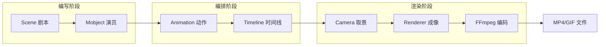

# 第1章：Manim 术语全景与动画渲染工作原理

---

## 1. 项目背景

某在线教育团队接到一个紧急需求：制作一部 5 分钟的"傅里叶变换可视化"教学视频，要求在三天内完成脚本到成片的全流程。团队共有三人：一位数学教研老师负责内容脚本，一位前端实习生负责画面设计，一位全栈工程师负责技术实现。

前端实习生小李打开 After Effects，花了整整一天画出一条正弦曲线和几个旋转箭头，第二天想修改曲线频率时，发现需要手动重新调整几十个关键帧的位置。数学老师看完初稿后说："函数参数要改三个地方，能不能换一种颜色突出主频？"——小李沉默了，这意味着又要花半天逐帧调整。

全栈工程师老王提议："试试 Manim？用 Python 写动画，改个参数重新渲染就行。"

小李反问："一个 Python 库而已，真有这么神？它凭什么能替代 AE 做数学动画？"

这个场景揭示了一个核心痛点：传统动画工具（AE、Flash、PPT 动画）擅长"手动逐帧绘制"，但在需要精确数学表达、参数化调整、批量生成的场景下，手工操作的效率极低。而 Manim 恰好填补了这个空缺——用代码精确描述数学关系，渲染管线自动生成流畅动画。

学习 Manim 的第一道门槛，不是代码难度，而是理解它的运行哲学：**你写的不是"动画"，而是一份"画面的剧本"**——Scene 是舞台，Mobject 是演员，Animation 是动作指令，Renderer 是摄影师，Camera 是镜头。一旦理解了这套分工，后面的学习就有了清晰的坐标。



---

## 2. 剧本式交锋对话

> **场景**：技术讨论室里，三人围坐在白板前，白板上画满了箭头和方块。

**小胖**（抱着一袋薯片，边嚼边说）：

"我有个疑问。咱们做动画不就是把东西从这儿挪到那儿吗？我拿 PPT 也能做一个圆圈从左飞到右。为啥非得装个 Python 环境、写一堆代码，绕这么大一圈？这不就跟用挖掘机去撬个啤酒瓶盖一样——杀鸡用牛刀嘛！"

**小白**（推了推眼镜，翻开 Manim 文档首页）：

"这只是表面的。PPT 的动画是预设的，你很难在一个圆移动的过程中同时改变它的颜色、半径、透明度，而且精确按照正弦曲线运动。更重要的是，如果我明天想把这个圆换成方形，再把速度加快 30%，PPT 得重新调十几个关键帧。但 Manim 改一行数字就行。"

**大师**（从座椅上站起来，拿起白板笔）：

"小胖的问题问得好——它引出了一个本质区别：**声明式和命令式**。PPT 是命令式动画工具——你告诉它'第 2 秒挪到 x=3，第 3 秒挪到 x=5'，每个关键帧都是确切指令。Manim 更接近声明式——你描述'这个圆从 x=0 运动到 x=5，用时 2 秒，走平滑曲线'，由引擎自动插值生成中间帧。"

> **技术映射**：`Animation` 通过 `interpolate(alpha)` 在每帧计算中间态，你只定义起点和终点，Manim 自动生成中间的几十帧画面。

**小胖**（放下薯片，眨眨眼）：

"等等，你刚说到'插值'和'引擎'。这个'引擎'具体干了啥？它怎么知道中间每一帧该长啥样？"

**大师**：

"问到点子上了。Manim 的渲染引擎大体分三段——"

（大师在白板上快速画了一个流程图）

"第一步，**Scene 调度**：按 `construct()` 方法里定义的顺序，把每个 `play()` 里的 Animation 依次推进。第二步，**Animation 插值**：每个 Animation 都有一个 `interpolate(alpha)` 方法，alpha 从 0 到 1 表示动画进度，引擎每帧调用这个方法更新 Mobject 的状态。第三步，**Camera 采样**：Camera 拿到当前帧所有 Mobject 的位置、颜色、形状，拍一张'快照'——这就是一帧画面。第四步，**Renderer 合成**：把一帧一帧的快照传给 FFmpeg 打成视频。"

**小白**（皱着眉头）：

"那 Mobject 和 Animation 之间是什么关系？Animation 是修改 Mobject 的？还是创建新的？我担心的是，如果一个圆先后被五个 Animation 操作，它会不会变成五个不同的对象，内存炸掉？"

**大师**：

"好问题，这正是初学者最容易踩的坑。答案是：**Animation 修改的是同一个 Mobject 的属性，不创建新对象**。当你调用 `self.play(Circle.animate.shift(RIGHT))` 时，Animation 记录了起点和终点，每帧插值后直接修改这个 Circle 的属性。调用完五个 `play`，内存里还是那个圆，只是它的 `shift`、`scale`、`color` 发生过变化。唯一的例外是 `Transform` 类动画——它在起点保存目标状态快照（deepcopy），在插值时从当前对象 morph 到目标对象。"

> **技术映射**：`Mobject` 持有 `points`（贝塞尔点集）、`color`、`opacity` 等字段，`Animation` 通过修改这些字段驱动视觉变化。

**小胖**（突然灵光一闪）：

"那我懂了！这就好比——Scene 是导演，Mobject 是演员本人，Animation 是剧本里的动作描写。导演按剧本喊'Action'，演员就按动作指示表演，摄影师（Camera）拍下来，剪辑师（Renderer）合成片子。对吧？"

**大师**（笑着点头）：

"完全正确。小胖这个比方可能是今天最精确的一句话。那我再补充一个关键角色：**ValueTracker**——它是一个特殊的 Mobject，本身不渲染到画面，而是作为一个'实时数值'存在。其他 Mobject 可以通过 Updater 机制监听它，当它的值变化时，自动刷新自己的位置、大小、颜色。这就好比——ValueTracker 是配乐里的节拍器，所有演员听到节拍变化自动调整舞步。"

**小白**（掏出笔记本快速记录）：

"那 Updater 和 Animation 有什么区别？一个是自动响应，一个是主动命令？"

**大师**：

"对。Updater 是'被动跟随'——你在构造 Mobject 时注册一个函数到它的 updaters 列表里，之后**每一帧**这个函数都会被调用。Animation 是'主动执行'——只在它激活的时间段内，每帧调用 interpolate。典型用法：用 Animation 做核心动作（入场、变换、退场），用 Updater 做附属效果（连接线跟随、动态标签更新、尾迹效果）。"

> **技术映射**：Animation 有自己的 `run_time` 生命周期，Updater 则从被 add_updater 之后持续运行，直到被 remove_updater 或场景结束。

---

## 3. 项目实战

### 3.1 环境准备

| 依赖 | 版本要求 | 用途 |
|------|----------|------|
| Python | 3.9 – 3.12 | 运行环境 |
| ManimCE | >= 0.20.0 | 动画引擎 |
| FFmpeg | 4.0+ | 视频编码与合成 |
| MiKTeX / TeX Live（可选） | 最新版 | LaTeX 公式渲染 |

**最小化安装命令**：

```bash
python -m venv manim-env
source manim-env/bin/activate   # Windows: manim-env\Scripts\activate
pip install manim
manim --version                 # 验证安装
```

---

### 3.2 分步实现

> **本章实战目标**：编写一个 `HelloManim` 场景，呈现标题 → 形状变换 → 公式弹出 → 淡出结束的完整链路，验证 Manim 从脚本到视频的全流程。

---

#### 步骤一：创建项目骨架

**步骤目标**：搭建最小可运行的 Manim 项目结构。

```python
# hello_manim.py
from manim import *

class HelloManim(Scene):
    def construct(self):
        # 第一步：创建标题
        title = Text("Hello, Manim!", font_size=72, color=BLUE)
        self.play(Write(title))
        self.wait(0.5)

        # 第二步：标题上移并缩小，腾出空间
        self.play(title.animate.to_edge(UP).scale(0.7))
        self.wait(0.3)
```

**运行命令**：

```bash
manim -pql hello_manim.py HelloManim
```

- `-p`：渲染完成后自动打开播放器预览
- `-q`：quality，`l`/`m`/`h` 分别对应 480p/720p/1080p
- `-l`：low quality，渲染速度快，适合快速检查效果

**预期输出**：

终端打印渲染进度，`media/videos/hello_manim/480p15/` 目录下生成 `HelloManim.mp4`。视频内容：蓝色标题"Hello, Manim!"从中心出现（逐字书写效果），然后上移到顶部并缩小，整个片段约 2 秒。

---

#### 步骤二：加入图形变换

**步骤目标**：在标题下方生成一个圆形，演示 `Create` 和 `Transform` 动画。

```python
class HelloManim(Scene):
    def construct(self):
        # ... 标题部分不变 ...

        # 第三步：创建一个圆形并做变换
        circle = Circle(radius=1.5, color=YELLOW, fill_opacity=0.3)
        circle.next_to(title, DOWN, buff=1.0)

        self.play(Create(circle), run_time=1.5)
        self.wait(0.3)

        # 第四步：圆形变成方形
        square = Square(side_length=3.0, color=GREEN, fill_opacity=0.3)
        square.next_to(title, DOWN, buff=1.0)
        self.play(Transform(circle, square), run_time=2)
        self.wait(0.3)

        # 第五步：方形做旋转强调
        self.play(Rotate(square, angle=2 * PI, run_time=1.5))
        self.wait(0.3)
```

**运行结果**：

黄色半透明圆形从中心生长出现（`Create` 动画逐步绘制贝塞尔曲线），停留 0.3 秒，然后通过 `Transform` 平滑变形为绿色半透明方形——Manim 自动做形状插值，圆上的贝塞尔点逐渐移向方的顶点。最后方形原地旋转一圈，整个过程约 5 秒。

**可能遇到的坑**：

1. **`Transform` 后的对象引用**：执行 `Transform(circle, square)` 后，`circle` 对象本身变成了 `square` 的形状，原先的 `square` 对象已与 `circle` 合并。后续操作应使用 `circle`（即 transform 的目标变量），而不是原来的 `square`。
2. **位置错乱**：每次 `Transform` 只改变形状/颜色，不改变位置。如果 `circle` 和 `square` 初始位置不同，transform 后会保持 `circle` 的位置。建议先给两个对象设置相同的初始位置。

---

#### 步骤三：加入公式和淡出

**步骤目标**：展示 LaTeX 公式，并用淡出收尾。

```python
class HelloManim(Scene):
    def construct(self):
        title = Text("Hello, Manim!", font_size=72, color=BLUE)
        self.play(Write(title))
        self.wait(0.5)
        self.play(title.animate.to_edge(UP).scale(0.7))
        self.wait(0.3)

        circle = Circle(radius=1.5, color=YELLOW, fill_opacity=0.3)
        circle.next_to(title, DOWN, buff=1.0)
        self.play(Create(circle), run_time=1.5)
        self.wait(0.3)

        square = Square(side_length=3.0, color=GREEN, fill_opacity=0.3)
        square.next_to(title, DOWN, buff=1.0)
        self.play(Transform(circle, square), run_time=2)
        self.wait(0.3)

        self.play(Rotate(square, angle=2 * PI, run_time=1.5))
        self.wait(0.3)

        # 第六步：展示数学公式
        formula = MathTex(r"e^{i\pi} + 1 = 0", font_size=64, color=WHITE)
        formula.next_to(circle, DOWN, buff=1.0)
        self.play(Write(formula), run_time=2)
        self.wait(1.0)

        # 第七步：全部对象淡出
        self.play(
            FadeOut(title),
            FadeOut(circle),
            FadeOut(formula),
            run_time=2
        )
        self.wait(0.5)
```

**运行结果**：

在方形旋转后，下方弹出欧拉公式 `e^{iπ} + 1 = 0`，每个字符按照 LaTeX 渲染的顺序逐个出现。最后所有对象同时淡出，画面回归黑色背景。总时长约 12 秒。

---

#### 步骤四：验证架构各环节

**步骤目标**：通过修改代码验证 Scene、Mobject、Animation、Camera 的关系。

```python
class ArchitectureDemo(Scene):
    def construct(self):
        # 验证 Camera 影响：修改 frame_width 观察画面缩放
        self.camera.frame_width = 20  # 默认 14.2，值越大画面越"远"

        # 多对象测试
        dots = VGroup(*[Dot(radius=0.1, color=interpolate_color(
            RED, BLUE, i / 10)) for i in range(11)])
        dots.arrange(RIGHT, buff=0.5)

        # Animation 串行
        self.play(LaggedStart(*[Create(d) for d in dots], lag_ratio=0.2), run_time=3)
        self.play(dots.animate.arrange(DOWN, buff=0.5), run_time=2)
        self.wait(1)
```

**测试验证**：

| 验证项 | 操作 | 预期结果 |
|--------|------|----------|
| Scene 调度 | 观察 `construct` 中 `play` 的串行执行 | 动画按代码顺序依次播放，不重叠 |
| Mobject 状态变化 | 在 `play` 后打印 `dots[0].get_center()` | 位置从 (LEFT) 变为 (DOWN) |
| Animation 插值 | `lag_ratio=0.2` 观察滞后效果 | 各点之间有 0.2 比例的时间差进入动画 |
| Camera 变更 | 改变 `self.camera.frame_width` | 画面整体视野变化，对象大小相对改变 |

---

### 3.3 完整代码清单

> 代码仓库：`https://github.com/yourteam/manim-column-src/tree/main/chapter01`

```python
# chapter01/hello_manim.py
from manim import *

class HelloManim(Scene):
    def construct(self):
        # 1. 标题
        title = Text("Hello, Manim!", font_size=72, color=BLUE)
        self.play(Write(title))
        self.wait(0.5)
        self.play(title.animate.to_edge(UP).scale(0.7))
        self.wait(0.3)

        # 2. 圆形→方形变换
        circle = Circle(radius=1.5, color=YELLOW, fill_opacity=0.3)
        circle.next_to(title, DOWN, buff=1.0)
        self.play(Create(circle), run_time=1.5)
        self.wait(0.3)

        square = Square(side_length=3.0, color=GREEN, fill_opacity=0.3)
        square.next_to(title, DOWN, buff=1.0)
        self.play(Transform(circle, square), run_time=2)
        self.wait(0.3)
        self.play(Rotate(circle, angle=2 * PI, run_time=1.5))
        self.wait(0.3)

        # 3. 公式
        formula = MathTex(r"e^{i\pi} + 1 = 0", font_size=64, color=WHITE)
        formula.next_to(circle, DOWN, buff=1.0)
        self.play(Write(formula), run_time=2)
        self.wait(1.0)

        # 4. 淡出
        self.play(FadeOut(title), FadeOut(circle), FadeOut(formula), run_time=2)
        self.wait(0.5)


# 架构验证
class ArchitectureDemo(Scene):
    def construct(self):
        self.camera.frame_width = 20
        dots = VGroup(*[Dot(radius=0.1, color=interpolate_color(
            RED, BLUE, i / 10)) for i in range(11)])
        dots.arrange(RIGHT, buff=0.5)
        self.play(LaggedStart(*[Create(d) for d in dots], lag_ratio=0.2), run_time=3)
        self.play(dots.animate.arrange(DOWN, buff=0.5), run_time=2)
        self.wait(1)
```

```bash
# 渲染命令
manim -pql chapter01/hello_manim.py HelloManim
manim -pql chapter01/hello_manim.py ArchitectureDemo
```

---

## 4. 项目总结

### 优点 & 缺点

| 维度 | 优点 | 缺点 |
|------|------|------|
| 精确性 | 数学公式、几何布局精确到像素，可复现 | 需要手动计算位置关系（`next_to`、`to_edge`） |
| 可维护性 | 改参数→重新渲染→新视频，零手工干预 | 代码改动后看不出效果差异，必须完整渲染 |
| 自动化 | 支持批量渲染、参数扫描、CI 集成 | 首次搭建环境和学习曲线较高 |
| 扩展性 | 可自定义 Mobject/Animation/Scene，Python 生态全可用 | 自定义扩展需要阅读源码，文档覆盖率有限 |
| 视觉效果 | 内置 LaTeX、贝塞尔曲线、渐变、3D 等专业效果 | 与 AE/Blender 相比，粒子特效和视觉风格不够丰富 |

### 适用场景

| 典型场景 | 说明 |
|----------|------|
| 数学/物理教学视频 | 3Blue1Brown 风格，公式推导、函数可视化 |
| 算法演示 | 排序、搜索、图遍历等过程动画 |
| 技术架构讲解 | 微服务调用链、消息流转、数据库交互 |
| 数据可视化故事 | 趋势图、对比图、动画化展示数据变化 |
| 学术报告插图 | 生成学术论文中的辅助说明动画 |

**不适用场景**：影视级特效制作（应使用 Houdini/Blender）、UI 交互动效原型（应使用 Figma/Principle）、大规模 3D 场景渲染（应使用 Unity/Unreal）。

### 注意事项

1. **LaTeX 依赖**：使用 `MathTex` 前必须安装 LaTeX 发行版（MiKTeX 或 TeX Live），否则会报 `LaTeX Error`。如果不需要公式，可以用 `Text` 代替。
2. **FFmpeg 路径**：确保 `ffmpeg` 在系统 PATH 中，运行 `ffmpeg -version` 验证。Windows 用户需手动添加安装目录到环境变量。
3. **Python 版本兼容**：ManimCE 0.20.x 支持 Python 3.9–3.12，Python 3.13 暂不支持，安装前确认版本。
4. **内存占用**：-qh（1080p）渲染 60fps 的复杂场景，内存峰值可达 1-2GB。渲染长视频时注意内存监控。

### 常见踩坑经验

**故障一：`ModuleNotFoundError: No module named 'manim'`**

根因：虚拟环境未激活，或 `pip install` 安装到了系统 Python 而非虚拟环境中。

解决：确认 `which python` 指向虚拟环境路径，重新执行 `pip install manim`。

**故障二：`LaTeX Error: File 'xxx.sty' not found`**

根因：LaTeX 发行版缺少所需宏包。Manim 使用了 `standalone`、`amsmath` 等包。

解决：MiKTeX 用户启用"自动安装缺失包"选项；TeX Live 用户运行 `tlmgr install standalone amsmath`。

**故障三：视频只能看到黑屏，没有报错**

根因：Mobject 的初始位置在画面之外，或被其他大物件遮挡（`z_index` 问题）。Camera 视角过大/过小也可能导致看不见对象。

解决：临时添加 `NumberPlane` 作为坐标参考，或在 `construct` 末尾加 `self.wait(3)` 检查画面内容。

### 思考题

1. 修改 `ArchitectureDemo` 代码，让彩色圆点按照正弦曲线排列（而不是直线），并在排列过程中同时改变颜色。提示：使用 `Dot.animate.move_to()` 配合 `np.sin()` 计算目标位置。

2. 在 `HelloManim` 的圆形变方形过程中，圆形的颜色从黄色变为绿色的方式是"线性插值"。请思考：如果想在变换前半段保持黄色，后半段快速变为绿色，应该修改 Animation 的哪个参数？查阅 Manim 文档中的 `rate_func` 相关内容。

---

### 推广计划提示

| 角色 | 本章阅读重点 | 协作事项 |
|------|-------------|----------|
| 新人开发 | 完整通读，重点是场景模拟和代码实战 | 动手运行所有代码，验证环境可用 |
| 测试 | 关注"可能遇到的坑"和"故障排查" | 整理一份环境检查清单，供后续章节使用 |
| 运维 | 阅读环境准备和依赖管理部分 | 评估 CI 中集成 Manim 渲染的可行性 |
