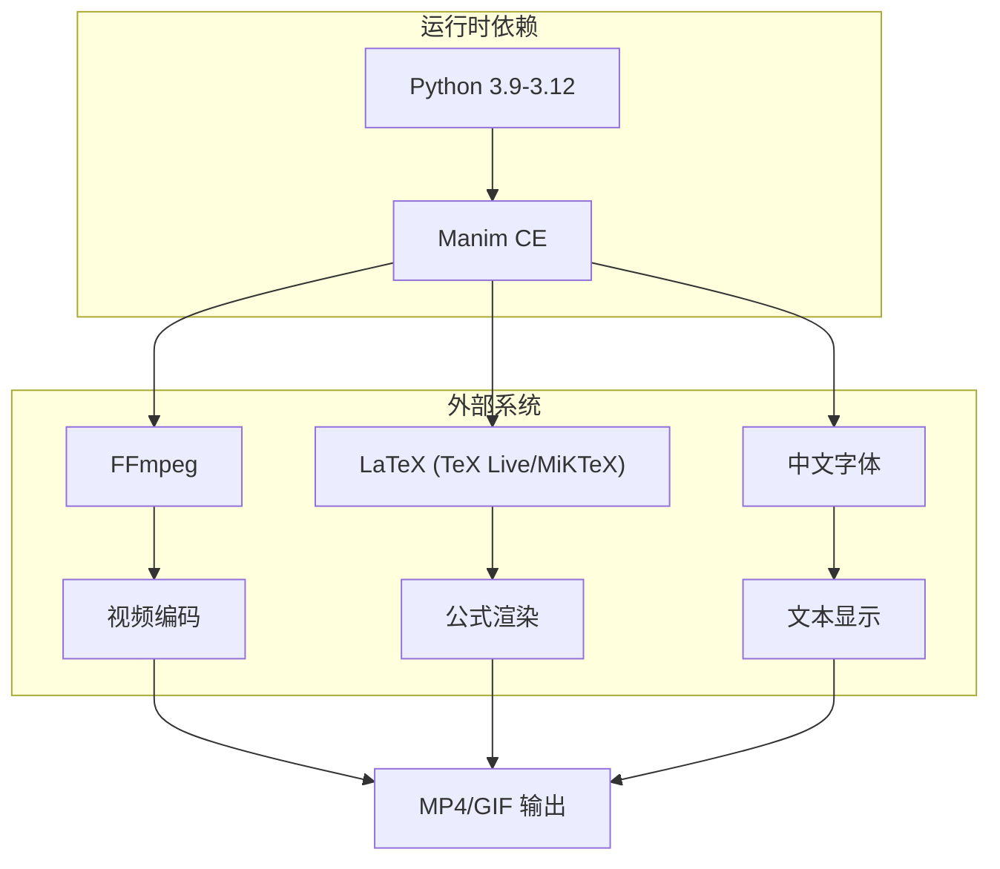

# 第2章：环境安装与第一个可交付动画

---

## 1. 项目背景

某中学数学教研组决定引入 Manim 制作"三角函数图像变换"系列微课。教研组长王老师拿到设备的当天就尝试安装 Manim，结果遇到了连环挫折：先是用 Python 3.13 安装报错"不支持的 Python 版本"；换成 3.11 后 `pip install manim` 卡在编译 `cairo` 依赖半小时没动静；好不容易装完，渲染时又报了 `FFmpeg is not installed`；重新装上 FFmpeg 后，LaTeX 公式渲染失败——`dvisvgm` 不在 PATH 里。

王老师感叹："我只是想画个正弦曲线而已，怎么就掉进环境地狱了？"

这个场景极具代表性。Manim 不像普通 Python 库那样"pip install 即用"——它依赖三个独立的外部系统：Python 运行环境、FFmpeg 视频编码器、LaTeX 公式排版引擎。任何一环缺失或版本不匹配，都会导致安装失败或渲染异常。

更麻烦的是，不同操作系统的安装路径和权限策略截然不同：Windows 用户需要手动管理 PATH 和字体，macOS 用户面临 Homebrew 和系统权限问题，Linux 用户则要处理依赖库的版本冲突。

本章的目标就是打穿这堵"环境墙"：先梳理 Manim 依赖链的完整构成，再给出 Windows/macOS/Linux 三平台的可靠安装流程，最终让读者产出第一个可交付的动画作品——不是 Hello World，而是一个包含了文字、图形、动画和外部素材的完整小场景。



---

## 2. 剧本式交锋对话

> **场景**：技术讨论室里，王老师带着一台笔记本电脑愁眉不展。小胖正在吃包子，小白已经在命令行里敲了一会儿。

**小胖**（咽下一口包子）：

"我说王老师，您这折腾半天了，一个动画都没出来。Manim 不是个 Python 库吗？`pip install manim` 不就完了？怎么还有 FFmpeg、LaTeX 这么多'亲戚'要伺候？这玩意儿比装个游戏还麻烦！"

**小白**（把屏幕转过来）：

"你这还真说到点子上了。Manim 其实不是'一个'库，它是一个'调度中心'。你写的 Python 代码告诉它'画个圆、写个公式、挪到右边'，但具体怎么画、怎么写入视频文件，都外包给了其他工具。FFmpeg 负责把一帧帧图片缝合成视频流，LaTeX 负责把 `\frac{1}{2}` 这种代码渲染成名副其实的分数，dvisvgm 再把 LaTeX 输出转成 SVG 给 Manim 用。缺一个，整条链路就断了。"

**大师**（端起茶杯）：

"我换个比方——Manim 像个电影制片人。他自己不扛摄像机、不做特效、不配字幕，但手里有一份'剧组通讯录'。拍电影时，他打电话给摄影师（FFmpeg）去录像，给打字员（LaTeX）去排版面字幕，给道具师（字体系统）去布置美术字。如果通讯录里没有这些人的电话，剧组就瘫痪了。这也就是为什么 `pip install manim` 之后还得单独装 FFmpeg 和 LaTeX——它们不在 Manim 的包里，它们是独立的外部'承包商'。"

> **技术映射**：Manim 通过 Python 的 `subprocess` 调用外部可执行文件：渲染 LaTeX → `latex` + `dvisvgm`；合成视频 → `ffmpeg`；这些可执行文件必须在系统 PATH 中。

**小胖**（抹了抹嘴）：

"行，外部依赖我理解了。那为啥不同操作系统装起来还不一样？Windows 上 `pip install manim` 要花 20 分钟，macOS 一会儿要 Xcode 一会儿要 Homebrew，这不能统一一下？"

**小白**（接过话头）：

"这其实不是 Manim 的问题，是它的底层依赖 `pycairo` 和 `pangocairo` 的问题。这两个库是 C 语言写的，需要通过编译器从源码构建 Python 绑定。Windows 上没有默认的 C 编译器，pip 就得去下载预编译的 wheel 包——祈祷有对应你 Python 版本的预编译包；如果没有，咳咳，编译会直接报错。macOS 上 Apple Clang 编译器版本经常和 pip 预编译包不兼容，就会触发从源码构建。"

**大师**：

"小白说的很到位。我补充一个实操结论：为了绕过编译地狱，官方建议 Windows 和 macOS 用户优先用 `conda` 安装，因为 conda 维护了自己的预编译二进制仓库。或者用 `uv`——它是 Rust 写的包管理器，安装速度比 pip 快 10 倍以上，而且默认从 PyPI 下载 wheel，减少源码构建的概率。"

> **技术映射**：推荐安装顺序 `uv pip install manim` > `conda install -c conda-forge manim` > `pip install manim`。`uv` 速度最快且与 pip 兼容；`conda` 最稳定但占用空间大。

**小胖**（若有所思）：

"那中文字体呢？我上次试了一个叫 Text 的东西，写中文全是方块——口口口口。Python 库还管字体？"

**大师**：

"Manim 渲染文本用的是 `Pango` 库，它会根据操作系统的字体配置来查找字体。你电脑上装了 SimHei（黑体）或 Microsoft YaHei，但 Pango 可能没识别到，或者默认优先选了不支持中文的英文字体。所以中文字体问题有两层：一是系统有没有装中文字体，二是 Manim/Pango 的配置里有没有把它列为候选字体。解决方案是在 `Text("你好", font="SimHei")` 中显式指定字体名，或者在 `manim.cfg` 里设置全局默认中文字体。"

> **技术映射**：`Text` 类的 `font` 参数直接传递给 Pango 的 `font_description`，Pango 使用 `fontconfig`（Linux/macOS）或系统字体注册表（Windows）查找字体文件。

---

## 3. 项目实战

### 3.1 环境准备

**目标**：在三类主流操作系统上搭建能渲染文字、公式、图形的完整 Manim 运行环境。

| 操作系统 | 推荐 Python 管理 | 推荐安装方式 | 额外命令 |
|----------|-----------------|-------------|----------|
| Windows | 从 python.org 下载 3.11 | `pip install manim` | 手动添加 FFmpeg 到 PATH |
| macOS | Homebrew 的 python@3.11 | `uv pip install manim` | `brew install ffmpeg mactex` |
| Linux (Ubuntu) | 系统 apt 安装 | `pip install manim` | `sudo apt install ffmpeg texlive` |

**最小化验证脚本**（保存为 `check_env.py`）：

```python
# check_env.py —— 验证 Manim 环境是否完整
import shutil
import importlib

def check():
    errors = []

    # 1. 检查 Manim 核心包
    try:
        import manim
        print(f"[OK] manim version: {manim.__version__}")
    except ImportError:
        errors.append("Manim 未安装，请运行: pip install manim")

    # 2. 检查 FFmpeg
    if shutil.which("ffmpeg") is None:
        errors.append("FFmpeg 未找到，请安装并添加到 PATH")
    else:
        print(f"[OK] ffmpeg found at: {shutil.which('ffmpeg')}")

    # 3. 检查 LaTeX (dvisvgm)
    if shutil.which("dvisvgm") is None:
        errors.append("dvisvgm 未找到（LaTeX 不完整），公式渲染将不可用")
    else:
        print(f"[OK] dvisvgm found at: {shutil.which('dvisvgm')}")

    # 4. 检查中文字体
    try:
        from manim import Text
        t = Text("测试")
        print(f"[OK] 中文 Text 对象创建成功（不代表字体正确，需实际渲染验证）")
    except Exception as e:
        errors.append(f"创建中文 Text 失败: {e}")

    if errors:
        print("\n[FAIL] 发现问题:")
        for e in errors:
            print(f"  - {e}")
    else:
        print("\n[ALL OK] Manim 环境就绪！")

if __name__ == "__main__":
    check()
```

---

### 3.2 分步实现

> **本章实战目标**：从零搭建一个包含标题、形状变换、公式、外部图片和音频的完整动画，渲染为 720p MP4 文件。

---

#### 步骤一：创建项目结构

**步骤目标**：建立规范的文件夹布局，支持后续章节复用。

```bash
manim-course/
├── manim.cfg              # 全局配置
├── scenes/                # 场景脚本
├── assets/                # 图片、字体、音频
│   ├── images/
│   ├── fonts/
│   └── audio/
├── media/                 # Manim 渲染输出（建议 .gitignore）
├── check_env.py           # 环境检查脚本
└── README.md
```

`manim.cfg` 内容（基础配置）：

```ini
[CLI]
output_dir = ./media
media_dir = ./media
quality = m          # m = 720p, 渲染速度快
frame_rate = 30
preview = True
```

---

#### 步骤二：编写第一个可交付动画

**步骤目标**：实现一个数学科普开场，内容包含标题、公式变换、图形运动和强调效果。

```python
# scenes/chapter02_intro.py
from manim import *

class MathIntro(Scene):
    def construct(self):
        # --- 第1段：开场标题 ---
        title = Text("三角函数图像变换", font_size=60, color=BLUE)
        subtitle = Text("正弦、余弦与相位", font_size=36, color=GRAY)
        subtitle.next_to(title, DOWN, buff=0.4)

        self.play(Write(title), run_time=1.5)
        self.play(FadeIn(subtitle, shift=UP * 0.3), run_time=1)
        self.wait(1)

        # --- 第2段：标题上移，引入公式 ---
        self.play(
            title.animate.to_edge(UP, buff=0.3).scale(0.6),
            FadeOut(subtitle),
            run_time=1.5,
        )

        formula = MathTex(
            r"y = A \sin(\omega x + \varphi)", font_size=54, color=YELLOW
        )
        formula.next_to(title, DOWN, buff=1.2)
        self.play(Write(formula), run_time=2)
        self.wait(0.5)

        # --- 第3段：参数 A 高亮 ---
        box_A = SurroundingRectangle(formula[0][3:4], color=RED, buff=0.1)  # 包围 "A"
        label_A = MathTex(r"A \text{ 振幅}", font_size=36, color=RED)
        label_A.next_to(box_A, DOWN, buff=0.5)

        self.play(Create(box_A), FadeIn(label_A), run_time=1.5)
        self.wait(0.8)

        # --- 第4段：参数 omega 高亮 ---
        box_omega = SurroundingRectangle(formula[0][9:14], color=GREEN, buff=0.1)
        label_omega = MathTex(r"\omega \text{ 角频率}", font_size=36, color=GREEN)
        label_omega.next_to(box_omega, DOWN, buff=0.5)

        self.play(
            ReplacementTransform(box_A, box_omega),
            ReplacementTransform(label_A, label_omega),
            run_time=1.5,
        )
        self.wait(0.8)

        # --- 第5段：全部淡出，结束 ---
        self.play(
            FadeOut(formula), FadeOut(box_omega),
            FadeOut(label_omega), FadeOut(title),
            run_time=2,
        )
        self.wait(1)
```

**运行命令**：

```bash
manim -pqm scenes/chapter02_intro.py MathIntro
```

- `-q m`：720p 中等画质，文件小、渲染快，适合反复调试
- `-p`：渲染完自动播放

**运行结果**：

终端输出渲染进度条，每帧约 0.1-0.3 秒。最终 `media/videos/chapter02_intro/720p30/` 下生成 `MathIntro.mp4`，时长约 13 秒。画面流：蓝色标题 + 灰色副标题 → 标题缩放到顶部 → 正弦公式从中间展开 → 红色框高亮"A" → 绿色框高亮"ω" → 全体淡出。

**可能遇到的坑**：

1. **Tex 编译慢**：首次渲染 `MathTex` 时，LaTeX 需要下载和编译基础宏包，可能耗时 30 秒到 2 分钟。之后 LaTeX 有缓存，后续渲染会很快。
2. **下标索引易错**：`formula[0][3:4]` 选取的是第 0 个子对象中第 3-4 个字符。`MathTex` 按空格和运算符自动分组，不清楚分组时可用 `for i, part in enumerate(formula[0]): print(i, part)` 打印所有子部分。

---

#### 步骤三：加入外部素材

**步骤目标**：引入外部图片和音频，验证 Manim 的多媒体整合能力。

```python
# scenes/chapter02_multimedia.py
from manim import *

class MultimediaDemo(Scene):
    def construct(self):
        # 封面文字
        cover = Text("欢迎来到 Manim 实战课", font_size=52, color=WHITE)
        self.play(Write(cover), run_time=2)
        self.wait(0.5)

        # 插入 SVG 图标
        logo = SVGMobject("assets/images/logo.svg", height=2.0)
        logo.next_to(cover, DOWN, buff=1.0)
        self.play(DrawBorderThenFill(logo), run_time=2)
        self.wait(1)

        # 插入外部图片
        photo = ImageMobject("assets/images/demo.jpg")
        photo.height = 3
        photo.to_edge(DOWN, buff=0.5)
        self.play(FadeOut(cover), FadeOut(logo), FadeIn(photo), run_time=2)
        self.wait(0.5)

        # 图片缩小并加说明
        caption = Text("一份示例图片", font_size=28, color=GRAY)
        caption.next_to(photo, DOWN, buff=0.2)
        self.play(photo.animate.scale(0.5), Write(caption), run_time=1.5)
        self.wait(2)

        # 尝试播放音频（需先准备音频文件）
        # self.add_sound("assets/audio/bgm.mp3")
```

**运行结果**：

支持 SVG/PNG/JPG 等格式的外部素材加载。SVG 会被解析为矢量路径（`VMobject`），支持 `DrawBorderThenFill`、颜色修改等矢量操作。JPG/PNG 创建为 `ImageMobject`，支持位置和缩放变换。

**可能遇到的坑**：

1. **SVG 解析失败**：部分复杂 SVG（包含裁剪路径、滤镜、渐变等）可能解析异常。解决：用 Inkscape 将 SVG 存为"Plain SVG"格式。
2. **音频需手动管理**：`add_sound` 本身只是将音频内嵌到视频中，不负责混音。如需旁白 + 背景音混音，建议先用 Audacity 合成后再导入。

---

### 3.3 完整代码清单

> 代码仓库：`https://github.com/yourteam/manim-column-src/tree/main/chapter02`

```python
# scenes/chapter02_hello.py -- 完整交付动画
from manim import *

class Chapter02Deliverable(Scene):
    def construct(self):
        # ========== 开场 ==========
        bg_rect = Rectangle(
            width=config.frame_width, height=config.frame_height,
            color=BLACK, fill_opacity=1
        )
        self.add(bg_rect)

        title = Text("Manim 环境验证成功", font_size=56, gradient=(BLUE, PURPLE))
        self.play(Write(title), run_time=2)
        self.wait(0.5)
        self.play(title.animate.to_edge(UP, buff=0.5).scale(0.6))
        self.wait(0.3)

        # ========== 图形变换 ==========
        circle = Circle(radius=1.2, color=TEAL, fill_opacity=0.2, stroke_width=4)
        circle.next_to(title, DOWN, buff=1.5)
        self.play(Create(circle), run_time=1.5)

        formula = MathTex(r"f(x) = x^2", font_size=48, color=YELLOW)
        formula.next_to(circle, DOWN, buff=1.0)
        self.play(Write(formula), run_time=1.5)
        self.wait(0.5)

        self.play(
            circle.animate.set_color(RED).scale(1.3),
            formula.animate.set_color(ORANGE).shift(UP * 0.3),
            run_time=2,
        )
        self.wait(1)

        # ========== 结尾 ==========
        self.play(
            FadeOut(circle), FadeOut(formula),
            FadeOut(title),
            run_time=2,
        )
        self.wait(0.5)
```

```bash
# 渲染命令
manim -pqm scenes/chapter02_hello.py Chapter02Deliverable
```

### 3.4 测试验证

| 验证项 | 测试命令 | 通过标准 |
|--------|----------|----------|
| 环境完整性 | `python check_env.py` | 全部 `[OK]`，无错误 |
| 基础渲染 | `manim -pql scenes/chapter02_hello.py Chapter02Deliverable` | 生成 `.mp4` 文件，自动播放 |
| 公式渲染 | 查看公式 `f(x) = x^2` 是否正确显示 | 无 LaTeX 报错，公式排版正常 |
| 中文显示 | 标题"Manim 环境验证成功"无方块 | 中文正确显示 |
| 画质切换 | 分别用 `-ql`、`-qm`、`-qh` 渲染 | 分辨率依次为 480p/720p/1080p |

---

## 4. 项目总结

### 优点 & 缺点

| 维度 | 优点 | 缺点 |
|------|------|------|
| 安装速度 | `uv pip install manim` 通常 < 30 秒完成 | 首次 LaTeX 编译可能超过 2 分钟 |
| 跨平台 | Windows/macOS/Linux 均可使用 | 各平台安装步骤差异大，缺乏统一指导 |
| 依赖解耦 | FFmpeg/LaTeX 可独立升级 | 任一依赖缺失都会导致渲染失败 |
| 低清预览 | `-ql` 几秒出片，快速验证想法 | 低清画质不适合检查精细细节 |
| 字体管理 | 支持系统字体和自定义字体路径 | 中文字体跨平台兼容需额外处理 |

### 适用场景

| 场景 | 说明 |
|------|------|
| 本地开发与调试 | 一台机器配置好环境后，反复迭代动画 |
| CI 自动化渲染 | 在 GitHub Actions 中自动渲染和发布动画 |
| 数学公式演示 | 利用 LaTeX 渲染复杂公式，比手写精准 |
| 视频课程制作 | 批量渲染系列课程的每一集 |
| 技术分享与博客 | 制作配套的动图/短视频 |

**不适用场景**：对安装和理解成本有极高要求的零基础用户（建议先用在线 Manim 编辑器体验）、完全脱离命令行的内容创作者。

### 注意事项

1. **LaTeX 宏包缺失**：首次使用 `MathTex` 渲染复杂公式时，LaTeX 可能报"宏包未找到"错误。解决：MiKTeX 开启"自动安装缺失包"，TeX Live 提前安装 `standalone`、`amsmath`、`amssymb` 等常用包。
2. **路径中不要含中文和空格**：Windows 上如果项目路径含中文，LaTeX/dvisvgm 可能无法正确解析路径。建议将项目放在纯英文路径下。
3. **Python 版本锁定**：团队协作时应在 `README.md` 写明推荐 Python 版本（如 3.11），并在 `pyproject.toml` 或 `requirements.txt` 中锁定 `manim` 版本。

### 常见踩坑经验

**故障一：Windows 上 `pip install manim` 报 `Microsoft Visual C++ 14.0 is required`**

根因：找不到预编译的 wheel 包，pip 尝试从源码构建 pycairo，需要 C++ 编译工具链。

解决：安装 Visual Studio Build Tools（勾选"C++生成工具"），或改用 `conda install -c conda-forge manim`。

**故障二：渲染时提示 `dvisvgm: not found`**

根因：LaTeX 安装不完整，`dvisvgm` 是可执行文件但不在 PATH。

解决：macOS 用户 `brew install mactex`（MacTeX 自带 dvisvgm）。Linux 用户 `sudo apt install texlive-extra-utils`。Windows 用户安装 MiKTeX 完整版。

**故障三：中文全部显示为方块 □□□**

根因：Pango 选用的默认字体不支持中文。

解决：在 `Text("你好", font="SimHei")` 中显式指定字体，或修改 Manim 中 `manim/utils/config_utils.py` 的默认字体配置，或 Windows 上安装"思源黑体"等开源字体。

### 思考题

1. 编写一个脚本 `render_all.py`，通过 Python 的 `subprocess` 模块自动调用 `manim` 命令，批量渲染 `scenes/` 目录下所有 `.py` 文件中的 Scene 类。提示：可以先 `grep` 每个文件中以 `class ...(Scene)` 开头的内容来发现场景。

2. 如果团队中有三台机器（Windows 11、macOS 14、Ubuntu 22.04），请设计一份 Docker 化的 Manim 渲染方案。目的是让三台机器渲染的输出完全一致（字体、分辨率、编码参数），且新成员加入时只需 `docker pull` 一个镜像。提示：Dockerfile 中需要安装 Python、FFmpeg、LaTeX、中文字体。

---

### 推广计划提示

| 角色 | 本章阅读重点 | 协作事项 |
|------|-------------|----------|
| 新人开发 | 完整通读，在本地跑通全部代码 | 输出一份本机环境检查报告 |
| 测试 | 关注"测试验证"表和脚本书写 | 编写自动化环境验证脚本 |
| 运维 | 阅读 Docker 部分和 CI 集成 | 准备 Docker 镜像和 CI 渲染流水线 |
