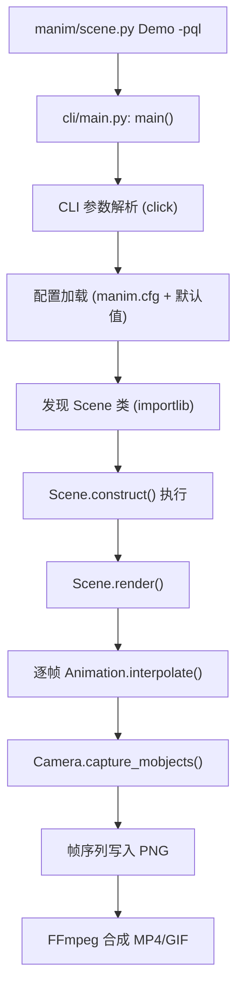
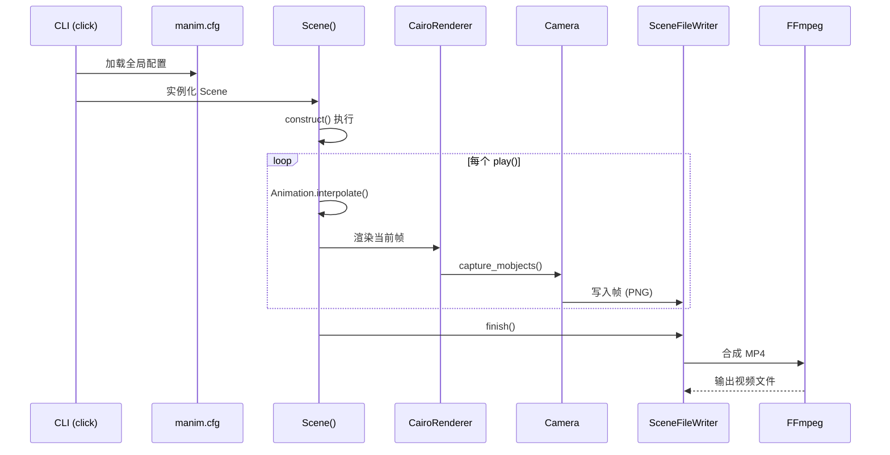

# 第32章：源码目录与启动流程剖析

---

## 1. 项目背景

经过基础篇和中级篇 31 章的学习，读者已经能熟练使用 Manim 的各项功能。但从本章开始，我们要进入**高级篇**——不再满足于"会用"，而是理解 Manim 的**内部运作机制**，以便对其进行定制、扩展和优化。

某工具链团队的工程师老郑接到一个任务：修改 Manim 的渲染输出格式，使其支持输出 WebP 动图（Manim 默认不支持）。这需要他理解 Manim 从接收命令行参数到产出视频文件的**完整调用链**。

老郑打开 Manim 的 GitHub 仓库，面对 `manim/` 目录下的 20+ 个子模块——`animation/`、`camera/`、`cli/`、`config/`、`mobject/`、`renderer/`、`scene/`、`utils/`……他不知道从哪个文件开始读，也不知道一次渲染的启动流程经过哪些函数。

这个痛点正是高级篇的起点——**源码导航**。本章要讲清 Manim 的源码目录结构、核心模块的职责划分，以及从敲下 `manim scene.py Demo -pql` 到视频文件写入磁盘的完整调用链路。



---

## 2. 剧本式交锋对话

> **场景**：老郑的屏幕上，左边是 Manim 的源码树，右边是 `cProfile` 生成的火焰图。

**小胖**（咬着一根冰棍）：

"郑哥，你要想给 Manim 加个 WebP 输出，应该改哪个文件？我看了目录，`animation/`、`camera/`、`renderer/` 哪个像管输出的？"

**老郑**（苦笑）：

"就是这个问题。我猜是 `renderer/`——但里面有 `cairo_renderer.py`、`opengl_renderer.py`，还有一个 `scene_file_writer.py`。到底哪个是入口？"

**小白**（打开 `manim/cli/render/commands.py`）：

"Manim 的源码阅读路线不是'从头到尾顺序读'——那样你会在 import 语句里迷失。正确的方法是从 **CLI 入口** 开始，顺着调用链往下走。

核心调用链只有 6 个关键节点：

1. **`manim/cli/main.py`** → CLI 入口，click 框架解析参数
2. **`manim/cli/render/commands.py`** → `render()` 函数，根据参数发现 Scene 并实例化
3. **`manim/scene/scene.py`** → `Scene.render()` 方法，渲染主循环
4. **`manim/renderer/cairo_renderer.py`** → CairoRenderer，逐帧绘制 Mobject 到画布
5. **`manim/camera/camera.py`** → Camera，将画布内容采样为像素数组
6. **`manim/scene/scene_file_writer.py`** → SceneFileWriter，将帧序列交给 FFmpeg 合成

要加 WebP 输出，你应该看第 6 步——`SceneFileWriter` 调用了 `ffmpeg` 命令来编码视频。找到生成 CLI 参数的位置，加上 `-c:v libwebp` 之类的编码参数。"

**大师**（打开一张手绘的目录职责表）：

"我画一张源码目录导航图——"

| 目录 | 职责 | 核心文件 | 何时读 |
|------|------|----------|--------|
| `cli/` | 命令行入口 | `main.py`, `render/commands.py` | 改 CLI 参数时 |
| `config/` | 配置管理 | `config.py` | 改默认配置时 |
| `scene/` | 场景调度 | `scene.py`, `scene_file_writer.py` | 改渲染流程时 |
| `mobject/` | 图形对象 | `mobject.py`, `types/vectorized_mobject.py` | 自定义 Mobject 时 |
| `animation/` | 动画引擎 | `animation.py`, `transform.py` | 自定义 Animation 时 |
| `renderer/` | 渲染后端 | `cairo_renderer.py` | 切换渲染引擎时 |
| `camera/` | 取景投影 | `camera.py`, `three_d_camera.py` | 3D / 投影变换时 |
| `utils/` | 工具函数 | `color/`, `tex_templates.py` | 查 API 细节时 |

"建议的阅读顺序：cli → scene → camera → renderer → mobject → animation。从外到内，从调用到实现。"

> **技术映射**：`Scene.render()` 是渲染的核心入口。它调用 `Renderer.render()` 逐帧渲染，最后调用 `SceneFileWriter.finish()` 触发 FFmpeg 合成。

---

## 3. 项目实战

### 3.1 环境准备

```bash
# 克隆 Manim 源码（如果只是用 pip 安装的）
# 可以直接看 site-packages/manim/ 目录的源码
python -c "import manim; print(manim.__file__)"  # 输出源码路径

# 安装源码阅读辅助工具
pip install snakeviz  # 火焰图可视化（可选）
```

---

### 3.2 分步实现

> **本章实战目标**：跟踪一次 `manim scene.py Demo -pql` 的完整调用链，绘制启动流程图。

---

#### 步骤一：理解 CLI 入口

**步骤目标**：阅读 `manim/cli/main.py` 和 `render/commands.py`，理解参数解析和 Scene 发现机制。

打开 `manim/cli/main.py`（简化版注释）：

```python
# manim/cli/main.py —— CLI 入口
import click
from .render.commands import render

@click.group()
def main():
    pass  # click 会自动发现子命令

main.add_command(render)  # 注册 render 子命令

if __name__ == "__main__":
    main()
```

打开 `manim/cli/render/commands.py`（简化版注释）：

```python
# manim/cli/render/commands.py —— 渲染命令
@click.command()
@click.argument("file")
@click.argument("scene_names", nargs=-1)
@click.option("-p", "--preview", is_flag=True)
@click.option("-q", "--quality", default="h")
def render(file, scene_names, preview, quality, ...):
    # 1. 加载配置
    config = manim.config  # 全局配置对象

    # 2. 动态导入 Python 文件
    module = importlib.import_module(file)  # 如 'scenes.hello_manim'

    # 3. 发现所有 Scene 子类
    for name in scene_names or _find_scene_classes(module):
        SceneClass = getattr(module, name)
        scene = SceneClass()  # 实例化

        # 4. 执行 construct() 并渲染
        scene.render()
```

**运行验证命令**：

```bash
# 在终端执行并观察日志中的调用过程
manim -pql scenes/basic.py HelloManim --log_level DEBUG
```

观察日志中打印的模块加载顺序：`cli/main` → `config` → `scene` → `renderer` → `camera`。

---

#### 步骤二：跟踪 Scene.render() 主循环

**步骤目标**：阅读 `scene.py` 中的 `render()` 方法，理解渲染主循环。

```python
# manim/scene/scene.py —— Scene.render()（简化版）
def render(self, preview=False):
    # 1. 初始化渲染器和文件写入器
    self.renderer = CairoRenderer(...)
    self.file_writer = SceneFileWriter(...)

    # 2. 执行 construct() —— 用户定义的场景内容
    self.construct()

    # 3. 处理剩余的动画（construct 中未播放完的）
    self.wait_until_complete()

    # 4. 通知文件写入器完成
    self.file_writer.finish()

    # 5. 可选：打开播放器预览
    if preview:
        open_file(self.file_writer.movie_file_path)
```

**关键点**：
- `construct()` 执行时，用户的所有 `play()`/`wait()` 语句被转换为 Animation 时间轴
- 每个 `play()` 内部调用了 `Animation.begin()` → 逐帧 `Animation.interpolate(alpha)` → `Animation.finish()`
- 每一帧调用了 `Camera.capture_mobjects(scene.mobjects)` 将对象列表渲染为像素
- 渲染完成后 `SceneFileWriter.finish()` 调用 FFmpeg 合成为视频

---

#### 步骤三：绘制启动流程图

**步骤目标**：用 mermaid 画出完整调用链路。



---

### 3.3 完整代码清单

无独立渲染脚本——本章为源码阅读章节。产出物为启动流程图（mermaid 格式）。

### 3.4 测试验证

| 验证项 | 操作 | 预期结果 |
|--------|------|----------|
| CLI 入口确认 | `manim --help` 查看子命令 | 显示 `render` 等命令 |
| 配置优先级 | `manim -ql scene.py Demo --show_config` | 显示 -ql 覆盖后的配置 |
| DEBUG 日志 | `manim scene.py Demo --log_level DEBUG` | 打印完整的模块加载链 |
| 调用链确认 | 在 `scene.py:render()` 中加 `print("RENDER START")` | 渲染时终端打印 |

---

#### 补充实战：手动模拟一次最小启动流程

**步骤目标**：绕过 CLI，用纯 Python 脚本手动触发一次渲染。

```python
# manual_render.py —— 手动调用 Manim 渲染
import sys
sys.path.insert(0, ".")  # 确保场景文件在搜索路径中

from manim import *

# 1. 手动加载配置
config.quality = "l"
config.preview = False
config.frame_rate = 15

# 2. 手动创建 Scene 实例
from scenes.my_scene import MyScene
scene = MyScene()

# 3. 手动触发渲染（等价于 manim -pql scenes/my_scene.py MyScene）
scene.render()

print(f"渲染完成: {scene.renderer.file_writer.movie_file_path}")
```

**运行命令**：
```bash
python manual_render.py
```

**理解价值**：这个脚本揭示了 Manim 的 CLI 实际上只是"配置 → 实例化 Scene → 调用 render()"的薄封装。开发者可以绕开 CLI 直接编排渲染流程，为自定义渲染流水线打下基础。

#### 补充探索：全局 config 对象的内部机制

```python
# 探索 config 对象
from manim import config
print(f"config 类型: {type(config)}")  # ManimConfig
print(f"当前 frame_width: {config.frame_width}")
print(f"当前 quality: {config.quality}")

# config 的属性修改会立即生效（线程安全除外）
config.frame_width = 20   # 扩大画幅
config.background_color = ManimColor("#FFFFFF")  # 白底
```

**注意**：`config` 对象是**全局单例**。在多 Scene 环境中（如测试套件），修改 config 会影响后续所有 Scene。

---

#### 补充对话：从源码维护者的视角看架构

**小胖**（冰棍啃得只剩棒子了）：

"郑哥，你读了这么多源码，Manim 的架构有什么明显不足吗？如果让你重构一个模块，你会重构哪个？"

**老郑**（沉思片刻）：

"两个明显痛点——

1. **全局 config 单例**：`manim/config.py` 的 `config` 是全局对象。多个 Scene 并发渲染时共享同一个 config，改一个参数可能影响其他 Scene。理想设计是每个 Scene 带独立的 config 实例。

2. **scene_file_writer 和 renderer 的紧耦合**：`Scene.render()` 中直接创建 `CairoRenderer` 实例。如果要切换渲染器，需要修改 `Scene` 的源码。理想设计是依赖注入——Scene 接受一个 `Renderer` 接口。

不过这些是'事后聪明'——Manim 从一个个人项目演化到社区项目，架构债不可避免。理解这些局限后，你做扩展时就知道'哪里可以改，哪里是雷区'。"

---

## 4. 项目总结

### 优点 & 缺点

| 维度 | 优点 | 缺点 |
|------|------|------|
| 模块化设计 | cli/scene/renderer/camera 职责清晰 | 模块间通过全局 config 共享状态 |
| CLI 框架 | click 生态成熟，参数定义清晰 | CLI 参数和 config 的映射关系不直观 |
| 源码可读性 | Python 原生，代码注释覆盖率中等 | 部分参数命名使用缩写（c2p、p2c） |
| 扩展入口 | Scene/Animation/Mobject 三个核心基类提供继承点 | 没有官方的"插件开发指南" |

### 适用场景

| 场景 | 说明 |
|------|------|
| 自定义渲染后端 | 增加 WebGL/Canvas 渲染器 |
| 自定义输出格式 | 增加 WebP/AVIF 等格式 |
| CLI 扩展 | 增加自定义命令和参数 |
| 配置扩展 | 增加新的配置段和参数 |
| 启动优化 | 修改 Scene 发现和加载流程 |

### 注意事项

1. **Manim 使用全局 `config` 对象**：不推荐在运行中动态修改 config，可能导致多 Scene 共享不一致的配置状态。
2. **`importlib.import_module` 会执行模块级代码**：场景文件中的全局变量和 `print` 语句会在 Scene 实例化之前执行。
3. **`Scene.render()` 是阻塞调用**：在 `construct()` 中的 `play()` 语句才是异步的（逐帧渲染）。

### 常见踩坑经验

**故障一：修改源码后 import 报 `ModuleNotFoundError`**

根因：`pip install -e .` 安装的开发模式失效，Python 仍在用 site-packages 中的旧版本。

解决：确认 `pip list | grep manim` 显示路径指向本地克隆的仓库。

**故障二：加了 `print` 日志但在控制台中不显示**

根因：Manim 使用了 `logging` 模块，`print` 默认输出可能被缓冲。

解决：使用 `import logging; logging.getLogger("manim").info("msg")` 而非 `print`。

**故障三：场景发现失败——明明定义了 Scene 但 Manim 找不到**

根因：`importlib.import_module` 的路径必须相对于 Python 的 `sys.path`。

解决：确保执行 `manim` 命令的目录在 `PYTHONPATH` 中，或使用 `manim -cwd . scene.py`。

**故障四：`pip install -e .` 后修改了源码但不生效**

根因：Python 缓存了 `.pyc` 字节码，修改源码后缓存未更新。

解决：`find . -name "*.pyc" -delete` 清除字节码缓存，或使用 `python -B` 禁用写入 `.pyc`。

**故障五：在不同虚拟环境中 manim 版本混用**

根因：全局安装了 manim，又在虚拟环境中用 pip install -e 安装了开发版，两个版本可能冲突。

解决：用 `which manim` 确认使用的是虚拟环境中的 manim。退出所有环境后 `pip uninstall manim` 清理全局版本。

### 思考题

1. 修改 Manim 源码中的 `SceneFileWriter`，增加对 WebP 动图的支持。提示：在 `finish()` 方法中的 FFmpeg 命令添加 `-c:v libwebp` 编码选项和 `-lossless 0` 质量参数。

2. 绘制一张"Manim 配置优先级"流程图：从 CLI 参数 → 环境变量 → manim.cfg → 默认值，展示每层的覆盖关系和最终生效的配置值。提示：核心代码在 `manim/config/config.py` 的 `_config_parser`。

3. 实现一个自定义 CLI 命令 `manim benchmark scene.py`，自动渲染指定场景并输出耗时、内存峰值、产物大小等性能指标到 JSON 文件。提示：在 `manim/cli/render/commands.py` 旁边新增 `benchmark/commands.py`。

---

### 推广计划提示

| 角色 | 本章阅读重点 | 协作事项 |
|------|-------------|----------|
| 架构师/资深开发 | 完整通读，绘制调用链 | 建立团队源码知识库 |
| 核心开发 | 理解 CLI → Scene → Renderer 链 | 准备自定义渲染后端原型 |
| 运维 | 关注 CLI 入口和配置加载 | 优化 CI 中的 Manim 启动速度 |

#### 附录：Manim 源码关键入口速查表

| 你想做…… | 看这个文件 | 关注函数/类 |
|----------|-----------|-------------|
| 改输出格式 | `scene/scene_file_writer.py` | `SceneFileWriter.finish()` |
| 加新 CLI 参数 | `cli/render/commands.py` | `render()` 的 `@click.option` |
| 改渲染器 | `renderer/cairo_renderer.py` | `CairoRenderer.render()` |
| 改摄像行为 | `camera/camera.py` | `Camera.capture_mobjects()` |
| 加新 Mobject | `mobject/mobject.py` | `Mobject` 基类 |
| 加新 Animation | `animation/animation.py` | `Animation` 基类 |
| 改 LaTeX 模板 | `utils/tex_templates.py` | `TexTemplate` |
