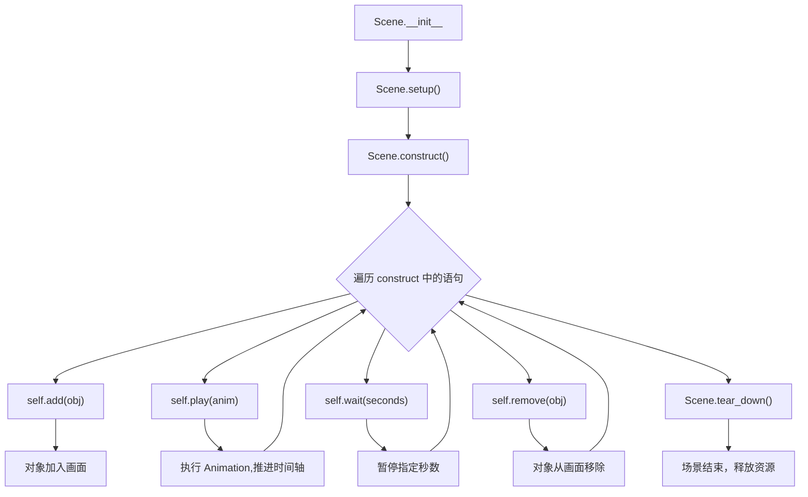

# 第3章：Scene 生命周期与时间线编排

---

## 1. 项目背景

某在线教育平台的内容团队正在用 Manim 批量生产"每日一题"教学短视频。编辑小张负责将老师提供的解题步骤转化为动画脚本。流程很简单：题目展示 → 解题步骤 → 答案解析 → 总结收束。

但小张交出的第一版作品就出了问题：部分动画的节奏忽快忽慢——有的步骤一闪而过看不清，有的停顿太久节奏拖沓；更严重的是，由于没有控制好对象生命周期，上一道题的元素残留到了下一道题的画面里，出现了"画面上同时有两个题"的尴尬。

教研主管看完后评价："解题过程是对的，但像是一个不会剪辑的新手拍的视频——转场生硬，画面混乱，节奏完全不对。"

这个痛点指向了 Manim 最核心的控制层面——**Scene 的时间线编排**。很多初学者以为 Manim 就是"按顺序写 `play`"，但实际上 Scene 是一个完整的状态机：

- `play()` 不仅执行动画，还推进了场景的"时间轴"
- `add()` / `remove()` 控制哪些对象出现在画面上
- `wait()` 决定画面的"留白"时长
- `setup()` / `tear_down()` 控制资源的初始化和清理

如果把这些方法当黑盒使用，动手时就会出现"对象幽灵"（忘记 remove）、"节奏失控"（wait 过长/过短）、"垃圾堆积"（旧对象未清理导致内存增长）等问题。

本章的目标是：**建立 Scene 作为"分镜导演"的心智模型**，理解它如何调度 Mobject 的增删和 Animation 的执行顺序，最终产出一段节奏清晰、画面干净的完整教学片段。



---

## 2. 剧本式交锋对话

> **场景**：小张把一段满屏混乱的动画投到大屏幕上。画面中两个题目重叠显示，按钮到处乱飞。

**小胖**（指着屏幕哈哈大笑）：

"小张你这个动画太有纪念意义了！它同时展示了两道题——买一送一！我感觉像在看一部双屏电影，左半边是鸡兔同笼，右半边是牛吃草，是不是用 Manim 就会这样？那我可不敢碰了！"

**小张**（窘迫地抓头发）：

"我也不知道怎么回事。我就是先写了一个 `play` 显示第一题，然后又 `play` 显示了第二题，写完回头一看——两个题都在画面上，旧的没消失！"

**小白**（冷静地调出代码）：

"这就是 Scene 和 `play` 的最大误解。你以为 `play` 是'场景切换'——播完一个动画，场景就翻页了。实际上 Manim 的每个新动画是**叠加**到当前画面上的，除非你主动 `self.remove()` 把旧对象拿掉，或者用 `FadeOut` 之类的动画让它消失。Scene 不是 PPT 的幻灯片——它是画布，你不擦，上面的东西就一直留着。"

**大师**（站起来走到白板前）：

"小白说得对。我来把 Scene 比作一个**舞台**，把 Mobject 比作**道具**，把 Animation 比作**灯光效果和幕间动作**。PPT 模式是你演完一场戏，幕布一拉，下一场所有道具都换了。但 Manim 的模式是：道具一直在舞台上，除非你亲手把它搬下去。`add()` 就是搬道具上台，`remove()` 就是搬道具下台，`play()` 就是打灯光做效果——它不负责搬道具。"

> **技术映射**：Scene 内部维护一个 `mobjects` 列表。`add(obj)` 将 obj 加入列表 → Camera 下一帧开始绘制它；`remove(obj)` 将 obj 从列表移除 → Camera 下一帧不再绘制它。`play` 不自动清理旧对象。

**小胖**（举手打断）：

"等等等等，那 `FadeOut` 和 `remove` 有啥区别？`FadeOut` 不是也让对象消失吗？"

**小白**：

"区别很大。`FadeOut` 是一个**动画**——它让对象在指定时间内逐渐透明，最终 opacity 变为 0。但动画结束后，对象**仍然在 Scene 的 mobjects 列表中**，只是透明到看不见。`remove` 是**直接从列表删除**，对象下一帧就彻底不在画面上了。如果你只是 `FadeOut`，对象还占用内存，还会被后续动画的 `animate` 影响——虽然看不见，但它在'后台表演'。"

**大师**：

"小白提了一个性能层面的关键问题。如果你渲染一个 10 分钟的视频，中间创建了上百个对象，只用 `FadeOut` 不用 `remove`，到视频末尾这些透明幽灵全堆在内存里，渲染越来越慢。最佳实践是：**FadeOut 动画结束后立即紧跟 `self.remove(obj)`**，既保证了视觉上的优雅退场，又释放了资源。"

> **技术映射**：`FadeOut(obj)` 将 `obj.opacity` 从当前值插值到 0；`remove(obj)` 将 obj 从 Scene 的渲染列表删除。两者配合使用可兼顾视觉效果和性能。

**小张**（猛敲键盘做笔记）：

"原来如此！那再问一个——`wait()` 到底等多久合适？我看网上教程，有的写 `wait(1)`，有的写 `wait(0.5)`，有的不写 wait 直接接下一个 play。有没有标准？"

**大师**：

"好问题，这恰恰是区分新手和老手的分水岭。`wait()` 没有'标准值'，它取决于你要营造的'叙事节奏'。我总结了一个经验法则：`wait(0.3)` 用于快速过渡——两个紧密关联的动作之间；`wait(0.5-1.0)` 用于段落内换气——让观众有时间消化刚看到的东西；`wait(1.5-3)` 用于章节末尾——留给观众思考和喘息的空间。如果一段视频全程没有 wait，观众会感觉被信息轰炸；wait 太多，又拖沓。建议你渲染后看一遍成片，哪里觉得'赶'就加 wait，哪里觉得'慢'就减。"

> **技术映射**：`wait(seconds)` 本质是在动画时间轴上暂停 `seconds` 秒。Scene 的全局 timer 会推进，但期间没有 Animation 执行。

**小白**（追问）：

"那 `run_time` 和 `wait` 有什么关系？我在 play 里设置 `run_time=2`，跟在外面写 `wait(2)` 效果一样吗？"

**大师**：

"完全不一样。打个比方——你让演员表演一段台词，`run_time=2` 意思是'这段表演持续 2 秒'，演员的速度会根据时长自动调整（慢速表演）。而 `wait(2)` 是'表演结束后，舞台上安静 2 秒'。`run_time` 控制的是**动作本身的节奏**，`wait` 控制的是**动作间的留白**。一段 30 秒的好动画，通常用 run_time 分配在哪段时间做什么动作，用 wait 在段落间制造停顿感。"

---

## 3. 项目实战

### 3.1 环境准备

本章沿用第 2 章搭建的环境，额外要求：项目中已有 `assets/` 目录和 `manim.cfg` 配置文件。

```bash
# 确认环境正常
python check_env.py
# 应全部显示 [OK]
```

---

### 3.2 分步实现

> **本章实战目标**：制作一段"鸡兔同笼"数学题讲解动画，包含题目展示、对象增删、节奏控制和转场设计，总时长约 25 秒。

---

#### 步骤一：理解 Scene 的基本调度

**步骤目标**：通过对比代码运行效果，理解 `add` / `remove` / `play` / `wait` 各自的作用。

```python
# scenes/chapter03_basics.py
from manim import *

class SceneBasicDemo(Scene):
    def construct(self):
        # --- 创建三个圆形，观察 add/remove 的效果 ---
        red_circle   = Circle(radius=0.6, color=RED, fill_opacity=0.5).shift(LEFT * 3)
        blue_circle  = Circle(radius=0.6, color=BLUE, fill_opacity=0.5)
        green_circle = Circle(radius=0.6, color=GREEN, fill_opacity=0.5).shift(RIGHT * 3)

        # 用 add 一次性放入三个圆 —— 它们立即出现在画面上
        self.add(red_circle)
        self.wait(0.5)

        # 用 play 让蓝色圆出现 —— 有过程动画
        self.play(Create(blue_circle), run_time=1)
        self.wait(0.3)

        # 用 play 让绿色圆出现
        self.play(Create(green_circle), run_time=1)
        self.wait(0.5)

        # 用 remove 直接拿掉红色圆 —— 立即消失，没有动画
        self.remove(red_circle)
        self.wait(0.5)

        # 用 FadeOut 让蓝色圆消失 —— 有淡出动画
        self.play(FadeOut(blue_circle), run_time=1)
        # 动画结束后移除，避免残留
        self.remove(blue_circle)
        self.wait(0.5)

        # 用 FadeOut 让绿色圆消失，并用 FadeIn 展示文字
        text = Text("场景调度完成", font_size=36, color=YELLOW)
        text.next_to(green_circle, UP, buff=0.5)
        self.play(FadeOut(green_circle), FadeIn(text), run_time=1.5)
        self.remove(green_circle)
        self.wait(1)
```

**运行结果**：

画面依次出现：红色圆（瞬间）→ 蓝色圆（被"画"出来）→ 绿色圆（被"画"出来）→ 红色圆消失（瞬间）→ 蓝色圆淡出 → 绿色圆淡出同时文字淡入。整个过程清晰地区分了 `add`（闪现）、`remove`（瞬删）、`play(Create)`（有过程）、`play(FadeOut)`（有过程）的区别。

---

#### 步骤二：制作"鸡兔同笼"教学动画

**步骤目标**：制作一个结构完整的教学片段，实现题目展示 → 解题步骤 → 答案揭晓 → 画面收束的完整流程。

```python
# scenes/chapter03_chicken_rabbit.py
from manim import *

class ChickenRabbit(Scene):
    def construct(self):
        # ========== 第1段：题目展示 ==========
        # 背景卡片
        card = RoundedRectangle(
            width=12, height=6, corner_radius=0.2,
            color=WHITE, fill_opacity=0.1, stroke_width=2,
        )

        title = Text("鸡兔同笼问题", font_size=48, color=BLUE, weight=BOLD)
        title.to_edge(UP, buff=0.6)

        question = Text(
            "今有鸡兔同笼，上有 35 头，下有 94 足，问鸡兔各几何？",
            font_size=28, color=WHITE, line_spacing=0.8,
            width=9,
        )
        question.next_to(title, DOWN, buff=0.8)

        self.play(
            FadeIn(card, scale=0.95),
            Write(title), run_time=1.5
        )
        self.wait(0.2)
        self.play(FadeIn(question, shift=DOWN * 0.3), run_time=1.5)
        self.wait(1.5)

        # ========== 第2段：设未知数 ==========
        # 先清理题目区域（保留标题和卡片），让出新空间
        self.play(FadeOut(question, shift=UP * 0.2), run_time=0.8)
        self.remove(question)

        step1 = MathTex(
            r"\text{设：鸡 } x \text{ 只，兔 } y \text{ 只}",
            font_size=36, color=YELLOW,
        )
        step1.move_to(card.get_center() + UP * 0.6)
        self.play(Write(step1), run_time=1.5)
        self.wait(0.5)

        # ========== 第3段：列方程 ==========
        eq1 = MathTex(r"x + y = 35", font_size=36, color=TEAL)
        eq1.next_to(step1, DOWN, buff=0.8, aligned_edge=LEFT)
        eq2 = MathTex(r"2x + 4y = 94", font_size=36, color=TEAL)
        eq2.next_to(eq1, DOWN, buff=0.4, aligned_edge=LEFT)

        self.play(Write(eq1), run_time=1.5)
        self.wait(0.2)
        self.play(Write(eq2), run_time=1.5)
        self.wait(0.8)

        # ========== 第4段：解方程 ==========
        # 先清步骤（保留题目框架）
        self.play(FadeOut(step1), FadeOut(eq1), FadeOut(eq2), run_time=0.8)
        self.remove(step1, eq1, eq2)

        solve_line1 = MathTex(r"2x + 4y - 2(x + y) = 94 - 2 \times 35", font_size=30, color=ORANGE)
        solve_line2 = MathTex(r"2y = 24 \quad \Rightarrow \quad y = 12", font_size=30, color=ORANGE)
        solve_line3 = MathTex(r"x = 35 - 12 = 23", font_size=30, color=ORANGE)

        solve_lines = VGroup(solve_line1, solve_line2, solve_line3)
        solve_lines.arrange(DOWN, buff=0.5, aligned_edge=LEFT)
        solve_lines.move_to(card.get_center())

        for line in solve_lines:
            self.play(Write(line), run_time=1.5)
            self.wait(0.3)

        self.wait(0.5)

        # ========== 第5段：答案揭晓 ==========
        self.play(FadeOut(solve_lines), run_time=0.8)
        self.remove(solve_lines)

        answer = Text(
            "答：鸡 23 只，兔 12 只",
            font_size=40, color=GREEN, weight=BOLD,
        )
        answer.move_to(card.get_center())

        self.play(Write(answer), run_time=1.5)
        # 强调效果
        self.play(Indicate(answer, color=YELLOW, scale_factor=1.05), run_time=1.5)
        self.wait(1)

        # ========== 第6段：收束画面 ==========
        self.play(
            FadeOut(answer), FadeOut(card), FadeOut(title),
            run_time=2,
        )
        self.wait(0.5)
```

**运行命令**：

```bash
manim -pqm scenes/chapter03_chicken_rabbit.py ChickenRabbit
```

**运行结果**：

生成一段约 22-25 秒的教学动画，分为 6 个自然段落：开场（卡片+标题+题目）→ 设未知数 → 列方程组 → 解方程 → 答案揭晓与强调 → 淡出收束。每个段落之间有 wait 换气，对象按段落清理（上一段的内容 FadeOut 后 remove），画面始终保持干净有序。

**可能遇到的坑**：

1. **对象没有完全移除**：如果忘记在 `FadeOut` 后写 `self.remove(obj)`，对象会留在 Scene 的列表中。虽然不是立即可见的问题，但在长动画中会导致对象累积、渲染变慢、甚至 `animate` 影响到不该影响的对象。
2. **run_time 分配不当**：解题步骤如果全部用相同的 `run_time=1.5`，三步求解连在一起会让观众来不及想。应在复杂步骤适当延长 `run_time`，简单步骤缩短。
3. **过渡动画方向感**：`FadeOut(obj, shift=UP*0.2)` 加一个微小的上移会让过渡更自然（"翻页"的感觉），不加 shift 的单纯 fade 略显生硬。

---

#### 步骤三：多场景协作进阶

**步骤目标**：了解如何通过继承共享公共逻辑，为多集制作打好基础。

```python
# scenes/chapter03_base.py
from manim import *

class BaseLesson(Scene):
    """所有课程场景的基类，封装公共动画元素"""
    def setup(self):
        super().setup()
        self.card = RoundedRectangle(
            width=12, height=6, corner_radius=0.15,
            color=WHITE, fill_opacity=0.08, stroke_width=1.5,
        )

    def show_card(self):
        self.play(FadeIn(self.card, scale=0.95), run_time=1.0)

    def hide_card(self):
        self.play(FadeOut(self.card), run_time=0.8)
        self.remove(self.card)

    def section_title(self, text, color=BLUE, **kwargs):
        title = Text(text, font_size=48, color=color, weight=BOLD, **kwargs)
        title.to_edge(UP, buff=0.6)
        self.play(Write(title), run_time=1.5)
        return title

    def tear_down(self):
        self.card.clear_updaters()
        super().tear_down()


class Lesson01(BaseLesson):
    def construct(self):
        self.show_card()
        title = self.section_title("第 1 课：Scene 入门")
        content = Text("这是一节测试课", font_size=32, color=WHITE)
        content.move_to(self.card.get_center())
        self.play(Write(content), run_time=1.5)
        self.wait(1)
        self.play(FadeOut(title), FadeOut(content), run_time=1.5)
        self.remove(title, content)
        self.hide_card()
        self.wait(0.5)
```

---

### 3.3 完整代码清单

> 代码仓库：`https://github.com/yourteam/manim-column-src/tree/main/chapter03`

```python
# scenes/chapter03_chicken_rabbit.py
from manim import *

class ChickenRabbit(Scene):
    def construct(self):
        # 背景
        card = RoundedRectangle(
            width=12, height=6, corner_radius=0.2,
            color=WHITE, fill_opacity=0.1, stroke_width=2,
        )
        title = Text("鸡兔同笼问题", font_size=48, color=BLUE, weight=BOLD)
        title.to_edge(UP, buff=0.6)

        question = Text(
            "今有鸡兔同笼，上有 35 头，下有 94 足，问鸡兔各几何？",
            font_size=28, color=WHITE, line_spacing=0.8, width=9,
        )
        question.next_to(title, DOWN, buff=0.8)

        self.play(FadeIn(card, scale=0.95), Write(title), run_time=1.5)
        self.wait(0.2)
        self.play(FadeIn(question, shift=DOWN * 0.3), run_time=1.5)
        self.wait(1.5)

        # 设未知数
        self.play(FadeOut(question, shift=UP * 0.2), run_time=0.8)
        self.remove(question)

        step1 = MathTex(
            r"\text{设：鸡 } x \text{ 只，兔 } y \text{ 只}",
            font_size=36, color=YELLOW,
        )
        step1.move_to(card.get_center() + UP * 0.6)
        self.play(Write(step1), run_time=1.5)
        self.wait(0.5)

        # 列方程
        eq1 = MathTex(r"x + y = 35", font_size=36, color=TEAL)
        eq1.next_to(step1, DOWN, buff=0.8, aligned_edge=LEFT)
        eq2 = MathTex(r"2x + 4y = 94", font_size=36, color=TEAL)
        eq2.next_to(eq1, DOWN, buff=0.4, aligned_edge=LEFT)
        self.play(Write(eq1), run_time=1.5)
        self.wait(0.2)
        self.play(Write(eq2), run_time=1.5)
        self.wait(0.8)

        # 解方程
        self.play(FadeOut(step1), FadeOut(eq1), FadeOut(eq2), run_time=0.8)
        self.remove(step1, eq1, eq2)

        solve_line1 = MathTex(
            r"2x + 4y - 2(x + y) = 94 - 2 \times 35",
            font_size=30, color=ORANGE
        )
        solve_line2 = MathTex(
            r"2y = 24 \quad \Rightarrow \quad y = 12",
            font_size=30, color=ORANGE
        )
        solve_line3 = MathTex(r"x = 35 - 12 = 23", font_size=30, color=ORANGE)

        solve_lines = VGroup(solve_line1, solve_line2, solve_line3)
        solve_lines.arrange(DOWN, buff=0.5, aligned_edge=LEFT)
        solve_lines.move_to(card.get_center())

        for line in solve_lines:
            self.play(Write(line), run_time=1.5)
            self.wait(0.3)

        self.wait(0.5)
        self.play(FadeOut(solve_lines), run_time=0.8)
        self.remove(solve_lines)

        # 答案
        answer = Text("答：鸡 23 只，兔 12 只", font_size=40, color=GREEN, weight=BOLD)
        answer.move_to(card.get_center())
        self.play(Write(answer), run_time=1.5)
        self.play(Indicate(answer, color=YELLOW, scale_factor=1.05), run_time=1.5)
        self.wait(1)

        self.play(FadeOut(answer), FadeOut(card), FadeOut(title), run_time=2)
        self.wait(0.5)
```

---

### 3.4 测试验证

| 验证项 | 操作 | 预期结果 |
|--------|------|----------|
| 对象清理 | 在代码中添加 `print(len(self.mobjects))` 在各段边界 | 每次 remove 后数量减少 |
| 画面无缝 | 观察相邻段落的过渡 | 无"重叠显示"现象 |
| 节奏合理 | 观看 3 遍渲染输出 | 无"太快看不清楚"或"太慢走神" |
| 基类复用 | 派生两个不同 Scene，只写 `construct`，共享标题和卡片逻辑 | 两段视频画面风格一致 |
| 内存稳定 | 使用 memory-profiler 监控渲染过程 | 对象数稳定，无线性增长 |

---

## 4. 项目总结

### 优点 & 缺点

| 维度 | 优点 | 缺点 |
|------|------|------|
| 画面管理 | `add/remove` 精确控制对象生命周期，画面干净 | 需手动管理清理，遗忘会导致对象残留 |
| 节奏控制 | `wait/run_time` 组合灵活控制叙事节奏 | 节奏好坏依赖主观判断，缺乏客观标准 |
| 代码复用 | 基类封装公共动画，派生类只写业务 | 基类改动可能影响所有子场景 |
| 调试能力 | 可打印 `len(self.mobjects)` 实时监控对象数 | 对象数多时不直观，难以发现"幽灵对象" |
| 转场效果 | FadeOut+shift 组合可营造自然转场 | 复杂转场（如推拉摇移）需额外 Camera 控制 |

### 适用场景

| 场景 | 说明 |
|------|------|
| 解题视频 | 分步骤展示数学/物理题解 |
| 知识卡片 | 逐条展示概念和定义 |
| 产品演示 | 步骤化讲解产品功能 |
| 流程教学 | 分阶段展示操作步骤 |
| 叙事动画 | 有明确起承转合的故事 |

**不适用场景**：实时交互式动画（应用 ManimGL）、画面元素长时间持续滚动（应用 Updater 机制）。

### 注意事项

1. **`remove` 的时机**：务必在动画播放完之后再 `remove`，否则对象会在动画播放中突然消失。正确的模式是 `self.play(FadeOut(obj)); self.remove(obj)`。
2. **`wait` 的积累效应**：每个 `wait` 都会累加总时长。在长视频中，如果每个步骤都 `wait(1)`，30 个步骤就多了 30 秒纯停顿。建议在成片后快速过一遍，删掉不必要的 wait。
3. **基类的 `setup/tear_down`**：如果重写了基类的 `setup`，务必调用 `super().setup()`，否则 Scene 的初始化不完整。

### 常见踩坑经验

**故障一：两个场景的对象同时显示**

根因：上一个 Scene 结束后，Mobject 没有从内存中清除（如果使用了全局变量或模块级 Mobject）。Manim 每个 Scene 内部独立管理对象，但如果你在 Scene 外部创建了 Mobject 并传入，它可能被两个 Scene 共享。

解决：始终在 Scene 内部（`construct` 或 `setup`）创建 Mobject，不要使用模块级全局 Mobject。

**故障二：`remove` 后试图 `animate` 报错**

根因：对象已从 mobjects 列表移除，`animate` 找不到目标对象。

解决：确保 `remove` 发生在所有对该对象的动画操作之后。使用 `self.play(obj.animate.xxx); self.remove(obj)` 的顺序。

**故障三：`wait` 期间画面闪烁**

根因：`wait` 期间如果有未完成的 Updater 或 `always_redraw` 对象持续刷新，可能导致画面不稳定。

解决：在 `wait` 前检查是否有活跃的 updater（`obj.clear_updaters()`），必要时临时暂停。

### 思考题

1. 修改 `ChickenRabbit` 代码，在"列方程"步骤中增加一个**回溯机制**：让观众可以"回到上一步"。实现方案：当某一个步骤完成时，用 `Indicate` 高亮该步骤，然后提供视觉反馈表示"这一步已经理解，可以继续"。提示：利用 `self.play()` 的返回值不阻塞后续代码这个特性。

2. 设计一个 `class SlideShow(Scene)`，实现类似 PPT 的上下页切换效果：翻页时，旧内容从左侧滑出，新内容从右侧滑入。要求使用 `animate.shift()` 实现位移转场，并保证旧对象在动画结束后被 `remove`。

---

### 推广计划提示

| 角色 | 本章阅读重点 | 协作事项 |
|------|-------------|----------|
| 新人开发 | 完整通读，理解 add/remove/play/wait 的差异 | 完成鸡兔同笼动画并提交 PR |
| 测试 | 设计对象生命周期测试用例 | 编写脚本验证每个 Scene 结束时 mobjects 为空 |
| 运维 | 关注渲染效率 | 统计不同 wait/run_time 策略对渲染总时长的影响 |
