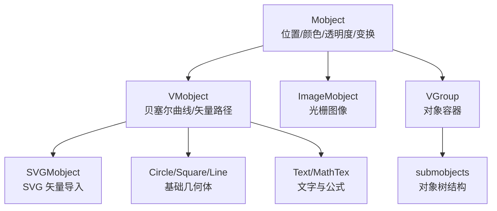

# 第4章：Mobject 基础——万物皆可动画

---

## 1. 项目背景

某技术培训机构正在开发一套"Python 数据结构可视化"课程。讲师周老师负责"链表"这一章，他想用一个动画展示链表的插入过程——每个节点是一个带箭头的方块，新节点从上方滑入，箭头重新连接。

周老师的直觉做法是：每次插入都创建新的方块和箭头，播放完就删掉。然而当链表达到 20 个节点时，画面变得惨不忍睹——节点大小不一、间距对不齐、箭头方向歪歪扭扭。更麻烦的是，当他想统一调大所有节点时，发现每个节点都是独立创建的对象，需要逐个修改参数。

"我写了 300 行代码，只为了 20 个方块和箭头。这肯定不对——Manim 应该有办法把多个对象当做一组来操作吧？"周老师抱怨道。

这个痛点的本质是对 Manim 对象模型的误解。Manim 不是"画啥算啥"的绘图工具，而是有一套完整的对象层级体系：

- **Mobject** 是所有视觉对象的基类，定义了位置、颜色、透明度等通用属性，以及 `shift`、`scale`、`rotate` 等变换方法
- **VMobject** 继承了 Mobject，增加了贝塞尔曲线控制（`points`），是矢量图形的基类
- **VGroup** 是 Mobject 的容器，可以将多个子对象编组，统一变换、对齐和布局
- **submobjects** 是对象树的核心——每个 Mobject 可以包含子对象，形成一棵树

理解了这套体系，周老师只需要：创建 `VGroup` 作为链表容器，往里面 add 节点和箭头 Mobject，然后用 `VGroup.arrange()` 自动对齐，用 `VGroup.scale()` 统一缩放。本章就是要讲透这套对象模型。



---

## 2. 剧本式交锋对话

> **场景**：周老师对着满屏代码发愁。小胖一边吃锅巴一边刷手机。

**小胖**（瞥了一眼屏幕）：

"周老师，您这代码看着比我今天中午点的麻辣烫还乱啊。三十多个 `shift`、二十多个 `set_color`——就不能像 PPT 一样，按住 Ctrl 全选，然后统一拖拽对齐吗？"

**周老师**（叹了口气）：

"我也想要这个功能啊！但这些方块和箭头全是我一行行手写的，每个对象的坐标、颜色、大小都单独设的。现在想统一调大一点，得一个一个改。Manim 是不是没有'编组'的概念？"

**小白**（放下手中的《Python Cookbook》）：

"恰恰相反，Manim 的编组机制非常强大。你缺的只是一层抽象——`VGroup`。它可以把你那些方块和箭头包在一起，然后统一 `arrange` 对齐、统一 `scale` 缩放、统一 `set_color` 改色。你甚至可以把它当做一个整体，对它玩 `shift`、`rotate`、`animate`。你现在的做法等于是在用像素画画，而 Manim 本来支持的是矢量构图。"

**大师**（合上笔记本）：

"我补充一个更底层的视角。在 Manim 的设计里，**一切皆 Mobject**——包括 VGroup 本身。VGroup 继承自 Mobject，这意味着它和被它包裹的方块拥有同一套变换接口。你可以对 VGroup 做 `scale(2)`，它会把缩放矩阵传给所有的子对象，让每个子对象按照同一个变换矩阵缩放。这就是统一操作不会'散架'的原因。"

> **技术映射**：`Mobject` 内部持有 `transform_matrix` 和 `points`。`shift`/`scale`/`rotate` 本质上是在修改这个矩阵。VGroup 的变换会递归应用到所有 `submobjects`。

**小胖**（突然放下锅巴）：

"等等，你说 VGroup 本身也是 Mobject。那它是不是也能被另一个 VGroup 包起来？就像俄罗斯套娃——大组套小组，小组套对象？"

**大师**（赞赏地点头）：

"宾果！这就是 Manim 的**对象树**。每个 Mobject 都有一个 `submobjects` 列表，VGroup 就是把这个列表对外暴露了。你可以在 VGroup 里嵌套 VGroup——外层管章节标题布局，中层管段落内的对象群，内层管单个对象的子部件。当你对外层 VGroup 做整体动画时，所有子子孙孙一起动。这就是为什么 3Blue1Brown 的视频里，复杂的画面可以作为一个整体移动或缩放——因为所有的东西都在一棵对象树下。"

> **技术映射**：`Mobject.submobjects` 是 `List[Mobject]`，保存了子对象引用。`VGroup.add(obj)` 将 obj 加入父对象的 `submobjects` 列表。

**小白**（追问）：

"那 `copy` 和 `become` 在对象树上的行为是怎样的？如果我 copy 一个 VGroup，里面的子对象是浅拷贝还是深拷贝？"

**大师**：

"好问题，这是另一个常见的坑。`copy()` 默认是**深拷贝**——连子对象一起复制。但要注意，`copy()` 复制的 Mobject 和原对象之间完全独立，修改一个不会影响另一个。而 `become()` 则是把当前对象'变成'另一个对象的样子——底层是把目标对象的 `points`、`color`、`stroke_width` 等属性一批量拷过来。`become` **不改变**当前对象的 `submobjects` 列表，所以如果你想让一个 VGroup 完全变成另一个 VGroup 的样子（包括子对象树），需要用 `Transform` 动画。"

> **技术映射**：`copy()` 调用 Python 的 `copy.deepcopy()`；`become()` 拷贝源对象的视觉属性（points、color、opacity 等），但保持目标对象的结构。

**周老师**（恍然大悟）：

"原来如此！那我是不是应该先梳理一遍最常用的 Mobject 变换方法？不然我每次都在翻文档。"

**大师**：

"来，我帮你列一张最小必备清单——"

（在白板上快速书写）

| 方法 | 效果 | 常用参数 |
|------|------|----------|
| `shift(direction)` | 整体平移 | UP、DOWN、LEFT*2、RIGHT*3 |
| `scale(factor)` | 等比缩放 | 0.5=缩小一半，2=放大两倍 |
| `rotate(angle)` | 旋转 | PI/4 即 45°，about_point=ORIGIN |
| `move_to(point)` | 移到指定坐标 | ORIGIN、LEFT*2+UP |
| `next_to(ref, dir)` | 对齐到参照物旁边 | buff=间距，aligned_edge=对齐边 |
| `to_edge(dir)` | 贴到画面边缘 | LEFT、UP、RIGHT、DOWN |
| `align_to(ref, dir)` | 与参照物对齐 | 只对齐不移动位置 |
| `set_color(color)` | 设置颜色 | YELLOW、#FF6600 |
| `set_opacity(val)` | 设置透明度 | 0=完全透明，1=完全不透明 |
| `flip(axis)` | 翻转 | RIGHT=左右翻转，UP=上下翻转 |

---

## 3. 项目实战

### 3.1 环境准备

沿用第 2 章搭建的 Manim 环境。本章不需要额外依赖。

---

### 3.2 分步实现

> **本章实战目标**：制作一个"链表插入"的可视化动画，用 VGroup 管理节点和箭头，展示对象树、布局对齐、统一变换的能力。

---

#### 步骤一：理解 Mobject 核心变换

**步骤目标**：通过对比代码加深对 `shift`、`scale`、`rotate`、`next_to` 的理解。

```python
# scenes/chapter04_transforms.py
from manim import *

class TransformDemo(Scene):
    def construct(self):
        # --- 创建编号平面作为参考 ---
        plane = NumberPlane(
            x_range=[-8, 8, 1], y_range=[-5, 5, 1],
            background_line_style={"stroke_opacity": 0.4},
        )
        self.add(plane)

        # --- 基础对象 ---
        dot = Dot(color=RED)
        self.add(dot)
        self.wait(0.3)

        # shift: 点移到 (3, 2)
        self.play(dot.animate.shift(RIGHT * 3 + UP * 2), run_time=1.5)
        self.wait(0.3)

        # scale: 点放大（点缩放不明显，换成圆的效果更好）
        circle = Circle(radius=0.8, color=BLUE, fill_opacity=0.3)
        circle.move_to(dot.get_center())   # 移到点的位置
        self.play(ReplacementTransform(dot, circle), run_time=0.5)
        self.wait(0.2)
        self.play(circle.animate.scale(2), run_time=1.5)
        self.wait(0.3)

        # rotate: 用一个有方向的三角形来演示旋转
        triangle = Triangle(color=GREEN, fill_opacity=0.5)
        triangle.move_to(circle.get_center())
        self.play(ReplacementTransform(circle, triangle), run_time=0.5)
        self.play(Rotate(triangle, angle=2 * PI, run_time=2))
        self.wait(0.3)

        # next_to 与 to_edge
        square = Square(side_length=1.2, color=YELLOW, fill_opacity=0.4)
        square.next_to(triangle, RIGHT, buff=1.0, aligned_edge=UP)
        self.play(Create(square), run_time=1)
        self.wait(0.3)

        self.play(square.animate.to_edge(DR, buff=0.5), run_time=1.5)
        self.wait(1)

        self.play(FadeOut(triangle), FadeOut(square), FadeOut(plane), run_time=1.5)
```

**运行结果**：

一个 12 秒的演示动画，清晰展示了：
- `shift` 沿向量方向移动对象
- `scale` 以对象中心为锚点等比缩放
- `rotate` 绕对象中心旋转
- `next_to` 将对象贴到参照物指定方向，支持 `buff`（间隙）和 `aligned_edge`（对齐边）
- `to_edge` 将对象贴到画面指定边角

---

#### 步骤二：VGroup 编组与布局

**步骤目标**：使用 VGroup 管理一组节点，实现自动对齐、统一变换。

```python
# scenes/chapter04_linkedlist.py
from manim import *

class LinkedListDemo(Scene):
    def construct(self):
        # --- 创建链表节点 ---
        def make_node(value, color=TEAL):
            """封装：创建一个链表节点——方块 + 文字"""
            box = Square(side_length=1.2, color=color, fill_opacity=0.3, stroke_width=3)
            text = Text(str(value), font_size=28, color=WHITE)
            node = VGroup(box, text)
            return node

        # 创建 4 个节点
        nodes = VGroup(
            make_node(3),
            make_node(7),
            make_node(12),
            make_node(25),
        )
        # 自动排列，均匀分布
        nodes.arrange(RIGHT, buff=1.5)
        nodes.move_to(ORIGIN)

        # --- 创建箭头（节点之间的连接线） ---
        arrows = VGroup()
        for i in range(len(nodes) - 1):
            arrow = Arrow(
                nodes[i].get_right(), nodes[i + 1].get_left(),
                buff=0.1, color=GRAY,
            )
            arrows.add(arrow)

        # --- 表演：整体出现 ---
        title = Text("单向链表", font_size=40, color=BLUE)
        title.to_edge(UP, buff=0.5)

        self.play(Write(title), run_time=1)
        self.wait(0.2)

        # LaggedStart 让节点从左到右依次出现
        self.play(
            LaggedStart(*[Create(n) for n in nodes], lag_ratio=0.3),
            LaggedStart(*[Create(a) for a in arrows], lag_ratio=0.3),
            run_time=3,
        )
        self.wait(0.5)

        # --- VGroup 整体变换：放大并移动到上方 ---
        all_objects = VGroup(title, nodes, arrows)
        self.play(all_objects.animate.scale(0.7).to_edge(UP, buff=0.3), run_time=2)
        self.wait(0.3)

        # --- 插入新节点 ---
        new_node = make_node(99, color=RED)
        # 定位到第 2 和第 3 个节点之间
        insert_pos = (nodes[1].get_right() + nodes[2].get_left()) / 2 + UP * 2
        new_node.move_to(insert_pos)

        self.play(
            FadeIn(new_node, scale=0.3, shift=UP * 1.5),
            run_time=1.5,
        )
        self.wait(0.2)

        # 重新排列——将新节点插入到 nodes[2] 前面
        nodes_after = VGroup(*[nodes[0], nodes[1], new_node, nodes[2], nodes[3]])
        arrows_after = VGroup()
        for i in range(len(nodes_after) - 1):
            a = Arrow(
                nodes_after[i].get_right(), nodes_after[i + 1].get_left(),
                buff=0.1, color=GRAY,
            )
            arrows_after.add(a)

        self.play(
            nodes_after.animate.arrange(RIGHT, buff=1.5).move_to(ORIGIN),
            ReplacementTransform(arrows, arrows_after),
            run_time=2,
        )
        self.wait(0.5)

        # 高亮新节点
        self.play(Indicate(new_node, color=YELLOW, scale_factor=1.2), run_time=1.5)
        self.wait(1)

        self.play(FadeOut(all_objects), FadeOut(arrows_after), FadeOut(new_node), run_time=2)
        self.wait(0.5)
```

**运行命令**：

```bash
manim -pqm scenes/chapter04_linkedlist.py LinkedListDemo
```

**运行结果**：

一段链表可视化的教学动画。首先 4 个节点带箭头从左到右依次出现（`LaggedStart`），然后整体缩放到顶部；一个新节点（红色）从上方滑入插入到第 2 和第 3 个节点之间，整条链表平滑重排，最后高亮新插入的节点。全程用 VGroup 统一管理节点和箭头，插入后只需重新 `arrange`。

**可能遇到的坑**：

1. **`arrange` 会覆盖手动设置的坐标**：如果在 `VGroup` 中已经有手动 `move_to` 定位的对象，`arrange()` 会重新计算所有对象的坐标，覆盖之前的手动设定。如果需要"自动排列 + 手动微调"，应该是先 `arrange`，再对特定对象调 `set_x` 或 `shift`。
2. **箭头不会自动跟随**：当节点 `arrange` 后坐标变了，之前创建的箭头依然指向旧坐标。需要重新创建箭头或使用 Updater（第 5 章会涉及）。

---

#### 步骤三：对象树的 copy 与继承

**步骤目标**：理解 `copy()` 和 `submobjects` 的机制。

```python
# scenes/chapter04_tree.py
from manim import *

class ObjectTreeDemo(Scene):
    def construct(self):
        # 创建一个父子对象树
        parent = VGroup()
        child1 = Circle(radius=0.5, color=RED, fill_opacity=0.5)
        child2 = Square(side_length=0.8, color=BLUE, fill_opacity=0.5)
        child2.next_to(child1, RIGHT, buff=0.5)
        parent.add(child1, child2)
        parent.to_corner(UL, buff=1)

        # parent.copy() —— 深拷贝整棵树
        parent_copy = parent.copy()
        parent_copy.to_corner(UR, buff=1).set_color(GREEN)

        self.play(Create(parent), Create(parent_copy), run_time=2)
        self.wait(0.5)

        # 打印对象树结构
        print(f"parent.submobjects: {len(parent.submobjects)}")
        print(f"parent_copy.submobjects: {len(parent_copy.submobjects)}")
        print(f"parent[0] is parent_copy[0]: {parent[0] is parent_copy[0]}")
        # 输出应为 False —— 深拷贝，独立对象

        # 验证：旋转 parent，parent_copy 不受影响
        self.play(Rotate(parent, angle=PI / 4), run_time=1.5)
        self.wait(1)

        self.play(FadeOut(parent), FadeOut(parent_copy), run_time=1.5)
        self.wait(0.5)
```

**运行结果**：

两个 VGroup 并列显示在屏幕左上角和右上角。旋转左侧的 parent 后，右侧的 parent_copy 不受影响——验证了 `copy()` 的深拷贝独立性。终端打印结果也确认两个对象不共享子对象。

---

### 3.3 完整代码清单

> 代码仓库：`https://github.com/yourteam/manim-column-src/tree/main/chapter04`

```python
# scenes/chapter04_linkedlist.py —— 完整链表动画
from manim import *

class LinkedListDemo(Scene):
    def construct(self):
        def make_node(value, color=TEAL):
            box = Square(side_length=1.2, color=color, fill_opacity=0.3, stroke_width=3)
            text = Text(str(value), font_size=28, color=WHITE)
            return VGroup(box, text)

        nodes = VGroup(make_node(3), make_node(7), make_node(12), make_node(25))
        nodes.arrange(RIGHT, buff=1.5).move_to(ORIGIN)

        arrows = VGroup()
        for i in range(len(nodes) - 1):
            arrows.add(Arrow(
                nodes[i].get_right(), nodes[i + 1].get_left(),
                buff=0.1, color=GRAY,
            ))

        title = Text("单向链表", font_size=40, color=BLUE).to_edge(UP, buff=0.5)

        self.play(Write(title), run_time=1)
        self.wait(0.2)
        self.play(
            LaggedStart(*[Create(n) for n in nodes], lag_ratio=0.3),
            LaggedStart(*[Create(a) for a in arrows], lag_ratio=0.3),
            run_time=3,
        )
        self.wait(0.5)

        all_objects = VGroup(title, nodes, arrows)
        self.play(all_objects.animate.scale(0.7).to_edge(UP, buff=0.3), run_time=2)
        self.wait(0.3)

        new_node = make_node(99, color=RED)
        insert_pos = (nodes[1].get_right() + nodes[2].get_left()) / 2 + UP * 2
        new_node.move_to(insert_pos)
        self.play(FadeIn(new_node, scale=0.3, shift=UP * 1.5), run_time=1.5)
        self.wait(0.2)

        nodes_after = VGroup(*[nodes[0], nodes[1], new_node, nodes[2], nodes[3]])
        arrows_after = VGroup()
        for i in range(len(nodes_after) - 1):
            arrows_after.add(Arrow(
                nodes_after[i].get_right(), nodes_after[i + 1].get_left(),
                buff=0.1, color=GRAY,
            ))

        self.play(
            nodes_after.animate.arrange(RIGHT, buff=1.5).move_to(ORIGIN),
            ReplacementTransform(arrows, arrows_after),
            run_time=2,
        )
        self.wait(0.5)
        self.play(Indicate(new_node, color=YELLOW, scale_factor=1.2), run_time=1.5)
        self.wait(1)
        self.play(FadeOut(all_objects), FadeOut(arrows_after), FadeOut(new_node), run_time=2)
        self.wait(0.5)
```

---

### 3.4 测试验证

| 验证项 | 操作 | 预期结果 |
|--------|------|----------|
| 对象树结构 | `print(len(nodes.submobjects))` | 输出 4（4 个节点 VGroup） |
| 深拷贝 | `cp = nodes.copy(); print(nodes[0] is cp[0])` | `False` |
| VGroup 统一变换 | 对 nodes.scale(2) 后检查每个节点的方块大小 | 全部等比放大 |
| arrange 对齐 | arrange(RIGHT, buff=1) 后检查间距 | 所有间距一致 |
| 子对象颜色不泄漏 | set_color 只作用于 VGroup 本身，不影响子对象 | 子对象保持原色（VGroup 默认 transparent） |

---

## 4. 项目总结

### 优点 & 缺点

| 维度 | 优点 | 缺点 |
|------|------|------|
| 对象编组 | VGroup 提供统一的布局、变换和颜色接口 | 嵌套过深时 debug 困难 |
| 变换体系 | shift/scale/rotate/move_to 语义统一且链式调用 | 没有"以某点为锚点"的直接参数（需手动 about_point） |
| 对象树 | 子树可独立操作，整体可递归变换 | copy 默认深拷贝有时非预期（想共享引用时） |
| 布局引擎 | arrange/next_to/align_to 覆盖大部分排版需求 | 没有 Flexbox/Grid 那样的弹性布局 |
| 动画兼容 | Mobject → Animation → animate 语法全链路通用 | `animate` 链式调用时参数顺序敏感 |

### 适用场景

| 场景 | 说明 |
|------|------|
| 数据结构可视化 | 链表、树、栈、队列的节点管理 |
| UI 布局 | 按钮、卡片、菜单的排列 |
| 图表标注 | 坐标轴刻度、标签、图例的组合 |
| 数学图示 | 几何图形 + 文字标注的编组 |
| 组件封装 | 可复用的 Mobject 子类 |

**不适用场景**：需要像素级控制的图像编辑（应使用 PIL/OpenCV）、海量对象（建议用 OpenGLRenderer 或图像合批）。

### 注意事项

1. **VGroup 的颜色行为**：默认 VGroup 的 fill_color 是 `None`（透明），设置 `set_color()` 只会影响 VGroup 中支持颜色继承的子 Mobject。
2. **`arrange` 的 buff 和坐标中心**：`arrange(RIGHT, buff=0.5)` 将子对象从左到右排列，中心对齐。排列后 VGroup 的几何中心自动更新为所有子对象的包围盒中心。
3. **`next_to` 的 aligned_edge**：默认 `aligned_edge` 是 `ORIGIN`，即两对象中心对齐。用 `aligned_edge=UP` 对齐顶部边。

### 常见踩坑经验

**故障一：VGroup 的 `set_color` 不生效**

根因：子对象已经显式设置过颜色（如 `Square(color=RED)`），VGroup 的颜色继承机制不会覆盖子对象的显式设置。

解决：对 VGroup 中的每个子对象单独 `set_color`，或用 `for s in group: s.set_color(BLUE)`。

**故障二：`arrange` 后坐标"不对"**

根因：`arrange` 会将 VGroup 的中心移动到 `ORIGIN`（或之前设置的位置），子对象的绝对坐标被重置。

解决：如果需要在原始位置基础上排列，先记下位置再 `arrange`，或使用 `set_x`/`set_y` 逐个调整。

**故障三：深拷贝后动画"串台"**

根因：`copy()` 创建了独立对象，但如果在 `Transform` 动画中不小心把原始对象和目标对象混淆，会导致不可预期的 morph。

解决：命名时用有区分的变量名（如 `original_nodes` 和 `target_nodes`），避免在 Transform 中混用同一对象的不同 copy。

### 思考题

1. 实现一个 `class TreeNode(VGroup)`，包含一个圆形节点和两个指向左右子节点的箭头。要求：构造时传入值（value），自动创建圆形和文字，箭头创建但不指向（初始为 None）。当调用 `node.connect_left(child)` 时，自动更新左箭头指向 child。提示：利用 `Arrow.put_start_and_end_on()` 更新箭头位置。

2. 在 `LinkedListDemo` 中，当插入新节点后，老箭头被 `ReplacementTransform` 替换成新箭头，但中间有一个瞬间出现两套箭头。请思考：如何用 `Transform` 而非 `ReplacementTransform`，让老箭头平滑变形为新箭头的形状和位置？提示：需要将新旧箭头一一对应，使用 `Transform(old_arrow, new_arrow)`。

---

### 推广计划提示

| 角色 | 本章阅读重点 | 协作事项 |
|------|-------------|----------|
| 新人开发 | 完整通读，掌握 VGroup 和常用变换 | 完成链表插入动画每一帧的截图存档 |
| 测试 | 关注对象树的 copy/remove 行为 | 编写测试验证 VGroup 的 arrange 和 scale 的幂等性 |
| 运维 | 了解对象层级对渲染性能的影响 | 记录不同 VGroup 深度下的渲染耗时 |
