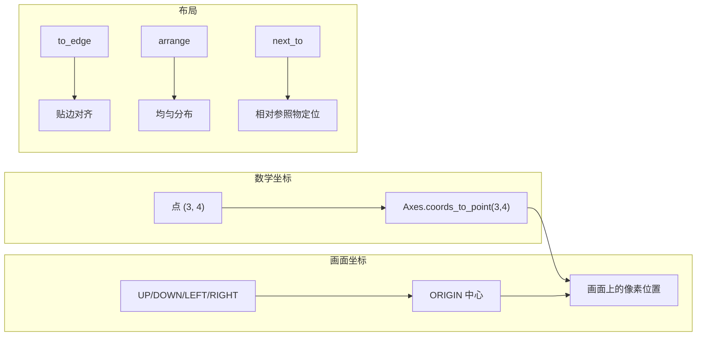

# 第6章：坐标系统与画面布局

---

## 1. 项目背景

某培训机构的美术老师孙老师接了一个任务：用 Manim 制作一套"解析几何入门"教学动画，内容包括坐标系、点的运动、向量运算和函数图像。孙老师有良好的数学功底，但这是他第一次用代码做动画。

他很快写出了第一个场景——在画面上放一个坐标轴，画一个点从 (0, 0) 移动到 (3, 4)。代码跑完后，他发现点虽然动了，但运动路径看起来很奇怪：根据数学计算，点应该从原点到右上角，但画面上看，点似乎只移了一小段。更糟的是，他想在画面右下角加一段文字说明，但文字要么被坐标轴遮挡，要么跑到画面外面去了。

孙老师叹气："我知道数学坐标是 (3, 4)，但我根本不知道它在画面上对应哪个像素位置！而且我想把标题放上面、坐标轴放中间、图例放右上角、注释放左下角——这些位置该怎么算？难道要一个一个试坐标？"

这个痛点反映了 Manim 坐标系统的核心学习难点：**数学坐标系与画面坐标系的映射关系**。Manim 的画面是一个虚拟的"摄影棚"：

- 默认画面宽度 14.2 个单位（`config.frame_width`），高度 8.0 个单位（`config.frame_height`）
- 坐标原点 `ORIGIN` 在画面正中心
- `UP`/`DOWN`/`LEFT`/`RIGHT` 是单位方向向量
- `Axes`/`NumberPlane` 等坐标系对象有自己的内部坐标→画面坐标映射

如果不理解这套映射规则，就只能靠"猜位置"来摆放元素，效率极低且无法复用。本章就是要建立 Manim 的**空间感**——从 `frame_width` 到 `arrange` 布局，从坐标映射到安全区设计，让每一帧画面都有清晰的空间规划。



---

## 2. 剧本式交锋对话

> **场景**：孙老师把画的乱七八糟的坐标轴投到屏幕上。小胖刚吃完一包辣条，手指还红红的。

**小胖**（指着屏幕上的点）：

"孙老师您这坐标轴挺有艺术感的——抽象派。这个点按理说应该在 (3, 4)，但我拿尺子量了一下屏幕，它离原点也就一厘米。您是不是忘了 Manim 有自己的'尺子'？"

**孙老师**（苦笑）：

"我就是没搞懂这个'尺子'。我以为 `Axes` 的坐标直接就是画面像素，结果 (3, 4) 画出来只移了一丁点。后来我试了 `Axes(x_range=[-10,10], y_range=[-10,10])`，好家伙，整个坐标轴缩成指甲盖大小挤在屏幕中间。这到底什么逻辑？"

**小白**（已经在命令行里跑了一遍）：

"你的问题出在没理解两层坐标系。第一层是 Manim 的**画面坐标系**——它是固定的，原点在画面中心，单位长度由 `frame_width` 决定（默认 14.2）。第二层是你创建的 `Axes` 对象的**内部坐标系**——它的 x_range/y_range 是你自己定义的数学范围，但它在画面上的显示尺寸取决于你给了它多少'物理空间'。"

**大师**（拿起白板笔，画了两个重叠的网格）：

"我来打个比方。想象你在墙上贴了一张 1 米 × 0.56 米的画纸（这就是 `frame_width` × `frame_height`）。然后你在画纸上手绘了一个坐标轴——如果你标注 X 轴范围是 [-10, 10] 但只画了 10 厘米长，那每个单位就只有 0.5 厘米，点 (3,4) 自然只移动了不到两厘米。反之，如果你把 x_range 设成 [-2, 2]，用满整张纸画，每个单位就有 25 厘米，移动效果就非常明显。"

> **技术映射**：`Axes(x_range=[-10, 10], x_length=10)` 中，`x_range` 定义数学上的取值范围，`x_length` 定义在画面上占据的物理长度（单位与 `frame_width` 一致）。`coords_to_point(x, y)` 方法负责把数学坐标转换为画面坐标。

**小胖**（挠挠头）：

"那为什么还要有 `x_length` 这个参数？我直接用 `x_range` 不就行了？"

**小白**：

"因为你不一定想让坐标轴占满整个画面。比如你也许想把坐标轴放在画面左半边（x_length=6），右边留空放公式。如果我只能设 `x_range` 来决定大小，那 x_range 就既管数学范围又管画面尺寸——两个目的绑在一块了，灵活性很差。"

**大师**：

"对。`x_length` 和 `x_range` 是解耦的：`x_range` 管'我要显示哪些数学值'，`x_length` 管'这个轴在画面上占多大地方'。用单位长度来理解就是——轴上 1 个数学单位对应的画面物理长度 = `x_length / (x_range_max - x_range_min)`。"

> **技术映射**：`Axes` 的坐标映射公式是 `画面坐标 = ORIGIN + (数学坐标 - 范围起点) / 范围跨度 * length * 方向向量`。`coords_to_point` 封装了这层转换。

**孙老师**（豁然开朗）：

"原来如此！那布局呢？我想把标题放上面、图例放右上角、注释放左下角——这些标准位置有快捷方式吗？"

**大师**（在白板上快速列举）：

"Manim 给你准备了四层布局工具，从粗到精——"

| 层次 | 方法 | 用途 | 示例 |
|------|------|------|------|
| 第一层 | `to_edge()` / `to_corner()` | 贴到画面边缘或角落 | `title.to_edge(UP)` |
| 第二层 | `next_to()` | 靠在参照物旁边 | `label.next_to(dot, RIGHT)` |
| 第三层 | `arrange()` | 一组对象均匀排列 | `nodes.arrange(RIGHT, buff=0.5)` |
| 第四层 | `move_to()` / `shift()` | 精确像素级控制 | `icon.move_to(ORIGIN + RIGHT * 3)` |

"建议的使用策略：**先顶层后底层**。先用 `to_edge`/`to_corner` 确定大区块（标题区、内容区、注释区），再用 `arrange` 和 `next_to` 做区块内精确排版，最后用 `move_to` 做微调。不要一上来就 `move_to`——那是用绣花针盖房子。"

---

## 3. 项目实战

### 3.1 环境准备

沿用第 2 章搭建的 Manim 环境。本章无需额外依赖。

---

### 3.2 分步实现

> **本章实战目标**：制作一个"二次函数图像分析"教学动画，包含坐标轴、函数曲线、关键点标注和规范布局。

---

#### 步骤一：理解画面坐标系

**步骤目标**：通过 `NumberPlane` 可视化画面坐标系，理解 `frame_width`、`frame_height` 和方向向量的实际含义。

```python
# scenes/chapter06_coords.py
from manim import *

class CoordinateBasics(Scene):
    def construct(self):
        # 显示画布坐标系参考网格
        plane = NumberPlane(
            x_range=[-7, 7, 1],
            y_range=[-4, 4, 1],
            background_line_style={"stroke_opacity": 0.4, "stroke_color": BLUE_D},
            axis_config={"stroke_opacity": 0.6},
        )
        self.add(plane)

        # 用不同颜色的点标记关键方向向量
        origin_dot = Dot(ORIGIN, color=WHITE)
        origin_label = Text("ORIGIN (0,0)", font_size=20, color=WHITE)
        origin_label.next_to(origin_dot, DOWN, buff=0.2)

        right_dot = Dot(RIGHT * 3, color=YELLOW)
        right_label = Text("RIGHT*3", font_size=20, color=YELLOW)
        right_label.next_to(right_dot, UP, buff=0.2)

        up_dot = Dot(UP * 2, color=GREEN)
        up_label = Text("UP*2", font_size=20, color=GREEN)
        up_label.next_to(up_dot, RIGHT, buff=0.2)

        corner_dot = Dot(UP * 2 + RIGHT * 3, color=RED)
        corner_label = Text("UP*2+RIGHT*3", font_size=20, color=RED)
        corner_label.next_to(corner_dot, UR, buff=0.1)

        self.play(
            FadeIn(origin_dot), Write(origin_label),
            FadeIn(right_dot), Write(right_label),
            FadeIn(up_dot), Write(up_label),
            FadeIn(corner_dot), Write(corner_label),
            run_time=3,
        )
        self.wait(1.5)

        # 验证 frame_width 的实际效果
        info_text = Text(
            f"frame_width = {config.frame_width:.1f}\n"
            f"frame_height = {config.frame_height:.1f}",
            font_size=28, color=GRAY,
        )
        info_text.to_corner(DL, buff=0.5)
        self.play(Write(info_text), run_time=1.5)
        self.wait(1)

        self.play(FadeOut(VGroup(plane, origin_dot, origin_label,
            right_dot, right_label, up_dot, up_label,
            corner_dot, corner_label, info_text)), run_time=2)
```

---

#### 步骤二：Axes 坐标轴实战

**步骤目标**：创建数学坐标轴，绘制函数图像，标注关键点。

```python
# scenes/chapter06_axes.py
from manim import *

class AxesPractical(Scene):
    def construct(self):
        # ---- 创建坐标轴 ----
        axes = Axes(
            x_range=[-5, 5, 1],      # 数学范围：-5 到 5，步长 1
            y_range=[-2, 10, 2],     # 数学范围：-2 到 10，步长 2
            x_length=10,             # 在画面上物理宽度
            y_length=6,              # 在画面上物理高度
            axis_config={"color": BLUE, "include_tip": True},
            x_axis_config={"numbers_to_include": range(-4, 5, 2)},
            y_axis_config={"numbers_to_include": range(-2, 11, 2)},
        )
        axes.shift(DOWN * 0.5)  # 整体下移，给标题留空间

        # 坐标轴标签
        x_label = axes.get_x_axis_label("x", edge=RIGHT, direction=DOWN, buff=0.3)
        y_label = axes.get_y_axis_label("y", edge=UP, direction=LEFT, buff=0.3)

        title = Text("二次函数 y = x² 的图像", font_size=36, color=BLUE)
        title.to_edge(UP, buff=0.3)

        self.play(Write(title), run_time=1)
        self.play(Create(axes), Write(x_label), Write(y_label), run_time=2)
        self.wait(0.5)

        # ---- 绘制函数图像 ----
        graph = axes.plot(
            lambda x: x ** 2,
            x_range=[-3, 3],
            color=YELLOW,
            stroke_width=3,
        )
        graph_label = MathTex(r"y = x^2", font_size=32, color=YELLOW)
        graph_label.next_to(
            axes.coords_to_point(2, 4), UR, buff=0.2
        )

        self.play(Create(graph), Write(graph_label), run_time=2)
        self.wait(0.5)

        # ---- 标注关键点 ----
        points = [
            (-2, 4, "(-2, 4)"),
            (-1, 1, "(-1, 1)"),
            (0, 0, "(0, 0)"),
            (1, 1, "(1, 1)"),
            (2, 4, "(2, 4)"),
        ]
        dots_and_labels = VGroup()
        for x, y, label_text in points:
            dot = Dot(axes.coords_to_point(x, y), color=RED, radius=0.08)
            label = MathTex(label_text, font_size=22, color=RED)
            label.next_to(dot, UP + RIGHT * 0.3, buff=0.1)
            dots_and_labels.add(VGroup(dot, label))

        self.play(LaggedStart(
            *[GrowFromCenter(dot) for dot in dots_and_labels],
            lag_ratio=0.2,
        ), run_time=3)
        self.wait(1)

        # ---- 对称轴虚线 ----
        symmetry_line = DashedLine(
            axes.coords_to_point(0, -2),
            axes.coords_to_point(0, 10),
            color=GRAY, stroke_opacity=0.6,
        )
        symmetry_label = Text("对称轴", font_size=24, color=GRAY)
        symmetry_label.next_to(symmetry_line, UP, buff=0.1)

        self.play(Create(symmetry_line), Write(symmetry_label), run_time=1.5)
        self.wait(1.5)

        self.play(FadeOut(VGroup(axes, x_label, y_label, graph, graph_label,
            dots_and_labels, symmetry_line, symmetry_label, title)), run_time=2)
```

**运行结果**：

一段 15 秒的解析几何动画。坐标轴占据画面主体（宽度 10、高度 6），x 轴范围 [-5, 5] 每 2 个单位标注一次数字，y 轴范围 [-2, 10] 每 2 个单位标注。黄色抛物线 `y = x²` 横跨 x ∈ [-3, 3]，5 个红色关键点用圆点和坐标标签标注，灰色虚线标出对称轴 x = 0。

**可能遇到的坑**：

1. **`coords_to_point` 返回的是画面坐标**：不要把 `Axes` 的内部坐标和画面坐标混用。`axes.coords_to_point(2, 4)` 返回画面上的位置向量（如 `[1.8, 1.5, 0]`），而 `axes.c2p(2, 4)` 是它的简写。
2. **刻度数字重叠**：如果 `x_range` 步长太小而 `x_length` 不够大，刻度数字会挤在一起。解决：增大步长或 `x_length`，或用 `numbers_to_include` 手动选择显示哪些数字。
3. **`plot` 的采样点不足**：函数变化剧烈时，默认采样密度可能导致曲线不平滑。解决：设置 `plot(f, x_range=[-3,3], use_smoothing=True)` 或增加 `dt` 参数。

---

#### 步骤三：画面布局实战

**步骤目标**：用 `to_edge`、`next_to`、`arrange` 实现规范的画面分区布局。

```python
# scenes/chapter06_layout.py
from manim import *

class LayoutStandard(Scene):
    def construct(self):
        # ---- 1. 标题区（顶部） ----
        title = Text("画面布局规范演示", font_size=36, color=BLUE, weight=BOLD)
        title.to_edge(UP, buff=0.3)
        title_line = Line(LEFT * config.frame_width / 2, RIGHT * config.frame_width / 2,
                          color=BLUE, stroke_opacity=0.3)
        title_line.next_to(title, DOWN, buff=0.1)

        self.play(Write(title), Create(title_line), run_time=1.5)
        self.wait(0.3)

        # ---- 2. 内容区（中央偏上） ----
        content_box = RoundedRectangle(
            width=10, height=5.5, corner_radius=0.1,
            color=WHITE, fill_opacity=0.05, stroke_opacity=0.5,
        )
        content_box.next_to(title_line, DOWN, buff=0.3)

        content_label = Text("内容区", font_size=24, color=GRAY)
        content_label.move_to(content_box.get_top() + DOWN * 0.3)

        self.play(Create(content_box), Write(content_label), run_time=1.5)
        self.wait(0.3)

        # ---- 3. 在内容区放置子元素 ----
        # 左侧放一个坐标轴小样
        mini_axes = Axes(
            x_range=[-1, 5, 1], y_range=[-1, 5, 1],
            x_length=3.5, y_length=3,
            axis_config={"include_tip": False},
        )
        mini_axes.move_to(content_box.get_left() + RIGHT * 2.2 + DOWN * 0.3)

        curve = mini_axes.plot(lambda x: x ** 0.5, x_range=[0, 4], color=ORANGE)
        label_axes = Text("图表示例", font_size=18, color=ORANGE)
        label_axes.next_to(mini_axes, DOWN, buff=0.2)

        # 右侧放文字说明
        desc_text = VGroup(
            Text("• 标题区：页面顶部", font_size=22, color=WHITE),
            Text("• 内容区：画面中央", font_size=22, color=WHITE),
            Text("• 注释区：底部或角落", font_size=22, color=WHITE),
            Text("• 图例：右上角", font_size=22, color=WHITE),
        )
        desc_text.arrange(DOWN, buff=0.3, aligned_edge=LEFT)
        desc_text.move_to(content_box.get_right() + LEFT * 2.5 + UP * 0.3)

        self.play(Create(mini_axes), Create(curve), Write(label_axes),
                  Write(desc_text), run_time=3)
        self.wait(0.5)

        # ---- 4. 底部注释区 ----
        footer = Text("本章演示 Manim 画面布局的四个基本区域划分", font_size=22, color=GRAY)
        footer.to_edge(DOWN, buff=0.3)

        self.play(Write(footer), run_time=1.5)
        self.wait(1)

        self.play(FadeOut(VGroup(title, title_line, content_box,
            content_label, mini_axes, curve, label_axes,
            desc_text, footer)), run_time=2)
```

---

### 3.3 完整代码清单

> 代码仓库：`https://github.com/yourteam/manim-column-src/tree/main/chapter06`

```python
# scenes/chapter06_parabola.py —— 二次函数完整分析动画
from manim import *

class ParabolaAnalysis(Scene):
    def construct(self):
        # 标题
        title = Text("二次函数 y = x² - 2x - 3 分析", font_size=36, color=BLUE)
        title.to_edge(UP, buff=0.3)

        # 坐标轴
        axes = Axes(
            x_range=[-3, 5, 1], y_range=[-5, 6, 1],
            x_length=9, y_length=5.5,
            axis_config={"color": BLUE, "include_tip": True},
        )
        axes.shift(DOWN * 0.4)

        axes_labels = axes.get_axis_labels(x_label="x", y_label="y")

        self.play(Write(title))
        self.play(Create(axes), Write(axes_labels), run_time=2)
        self.wait(0.3)

        # 抛物线
        graph = axes.plot(
            lambda x: x ** 2 - 2 * x - 3,
            x_range=[-2, 4], color=YELLOW, stroke_width=3,
        )
        graph_label = MathTex(r"y = x^2 - 2x - 3", font_size=28, color=YELLOW)
        graph_label.next_to(axes.coords_to_point(3, 3), UR, buff=0.3)

        self.play(Create(graph), Write(graph_label), run_time=2)
        self.wait(0.3)

        # 标注关键特征
        # 顶点 (1, -4)
        vertex = Dot(axes.coords_to_point(1, -4), color=RED)
        vertex_label = Text("顶点(1,-4)", font_size=22, color=RED)
        vertex_label.next_to(vertex, DR, buff=0.1)

        # x 轴交点 (-1, 0) 和 (3, 0)
        root1 = Dot(axes.coords_to_point(-1, 0), color=GREEN)
        root1_label = Text("(-1,0)", font_size=20, color=GREEN)
        root1_label.next_to(root1, DOWN, buff=0.1)

        root2 = Dot(axes.coords_to_point(3, 0), color=GREEN)
        root2_label = Text("(3,0)", font_size=20, color=GREEN)
        root2_label.next_to(root2, DOWN, buff=0.1)

        # y 轴交点 (0, -3)
        y_int = Dot(axes.coords_to_point(0, -3), color=PURPLE)
        y_int_label = Text("(0,-3)", font_size=20, color=PURPLE)
        y_int_label.next_to(y_int, LEFT, buff=0.1)

        self.play(
            GrowFromCenter(vertex), Write(vertex_label),
            GrowFromCenter(root1), Write(root1_label),
            GrowFromCenter(root2), Write(root2_label),
            GrowFromCenter(y_int), Write(y_int_label),
            run_time=3,
        )
        self.wait(1.5)

        self.play(FadeOut(VGroup(title, axes, axes_labels,
            graph, graph_label, vertex, vertex_label,
            root1, root1_label, root2, root2_label,
            y_int, y_int_label)), run_time=2)
        self.wait(0.5)
```

```bash
# 渲染命令
manim -pqm scenes/chapter06_parabola.py ParabolaAnalysis
manim -pql scenes/chapter06_coords.py CoordinateBasics
manim -pql scenes/chapter06_axes.py AxesPractical
manim -pql scenes/chapter06_layout.py LayoutStandard
```

### 3.4 测试验证

| 验证项 | 操作 | 预期结果 |
|--------|------|----------|
| 坐标映射 | 在终端打印 `axes.coords_to_point(0, 0)` 的值 | 返回值接近画面中心坐标（即 axes 的位置） |
| 轴刻度 | 观察 x 轴和 y 轴的刻度标签 | 数字清晰不重叠，对齐正确 |
| 画面边界 | 设置 `obj.to_edge(UP, buff=0)` 观察 | 对象不超出画面可视范围 |
| arrange 间距 | 排列 VGroup，打印相邻元素的位置差 | 间距与 buff 参数一致 |
| 布局层级 | 同时使用 to_edge + next_to + arrange | 无重叠或错位 |

---

## 4. 项目总结

### 优点 & 缺点

| 维度 | 优点 | 缺点 |
|------|------|------|
| 坐标映射 | `coords_to_point` 自动完成数学→画面转换 | 需要手动管理 x_length/y_length，初学者易混 |
| 布局工具 | to_edge/next_to/arrange 三级布局覆盖大部分需求 | 缺少 CSS 那样的弹性盒模型，复杂布局代码冗长 |
| NumberPlane | 内置网格 + 刻度，调试布局时非常直观 | 只适合开发期间参考，成品中需要移除 |
| 方向向量 | UP/DOWN/LEFT/RIGHT 语义清晰，支持数学运算 | 向量的"长度"含义不直观（如 RIGHT*3 的距离取决于 frame_width） |
| 自定义轴 | x_range/y_range/x_length 全部可配置 | 参数组合多，不同组合间的视觉差异不适合枚举测试 |

### 适用场景

| 场景 | 说明 |
|------|------|
| 解析几何教学 | 函数图像、曲线交点、切线 |
| 数据可视化 | 折线图、散点图、柱状图 |
| 物理模拟 | 运动轨迹、力场、波动 |
| PPT 排版 | 标题/内容/注释的标准布局 |
| 界面演示 | UI 组件的布局与对齐 |

**不适用场景**：地理地图投影（需专用库如 Cartopy）、3D 场景的精确定位（应使用 `ThreeDScene` + `ThreeDAxes`，在第 22 章介绍）。

### 注意事项

1. **Axes 的 `y_length` 方向问题**：`y_length` 为正时 Y 轴向上，与数学常规一致。但如果设置 `y_range=[5, -5]`（反向），刻度绘制可能出现异常。
2. **`to_edge` 和标题空间**：如果标题用了 `to_edge(UP)`，内容区的 `to_edge(UP)` 会与标题重叠。应将标题 `to_edge(UP, buff=0.3)`，内容放在标题下方。
3. **`arrange` 后 VGroup 的包围盒更新**：`arrange` 后 VGroup 的内部几何中心可能改变。如果之后还要用 `move_to`，注意顺序。

### 常见踩坑经验

**故障一：`plot` 函数曲线出现锐角或断线**

根因：Manim 的 `plot` 使用均匀采样点（默认 dt=0.01 倍范围），当函数在局部变化剧烈时，样本不足。

解决：减小 `dt` 参数如 `plot(f, dt=0.001)`，或使用 `ParametricFunction` 实现非均匀采样。

**故障二：刻度数字和坐标轴重叠**

根因：`y_axis_config={"numbers_to_include": range(0, 10, 1)}` 步长太密。

解决：增大步长（如 range(0, 10, 2)），或减小轴上的 `font_size`。

**故障三：`next_to` 后对象瞬间消失**

根因：方向参数用了 `UP` 但参照对象在画面底部，导致新对象被挤出画面边界。

解决：先用 `to_edge` 把参照对象控制在画面安全区内，再 `next_to`。

### 思考题

1. 修改 `ParabolaAnalysis`，增加一条从坐标原点出发、经过抛物线顶点的射线，并标注射线的斜率。提示：使用 `Line(ORIGIN, vertex.get_center())` 和 `axes.point_to_coords()` 反算数学坐标。

2. 设计一个通用的 `class LayoutHelper`，它能自动画出标题区、内容区、注释区的虚线边界框，并在每个框内标注其名称。要求支持自定义区域比例（如 `LayoutHelper(top=0.1, content=0.7, bottom=0.2)`），可用于任意 Scene 的布局规划。提示：使用 `config.frame_height` 计算各区域的高度。

---

### 推广计划提示

| 角色 | 本章阅读重点 | 协作事项 |
|------|-------------|----------|
| 新人开发 | 完整通读，掌握 coords_to_point 和三级布局 | 完成抛物线分析动画 |
| 测试 | 验证 coords_to_point 对边界值的处理 | 编写测试覆盖所有 Axes 参数组合 |
| 运维 | 了解 frame_width/frame_height 对渲染分辨率的影响 | 整理不同画幅比下的输出对比 |
