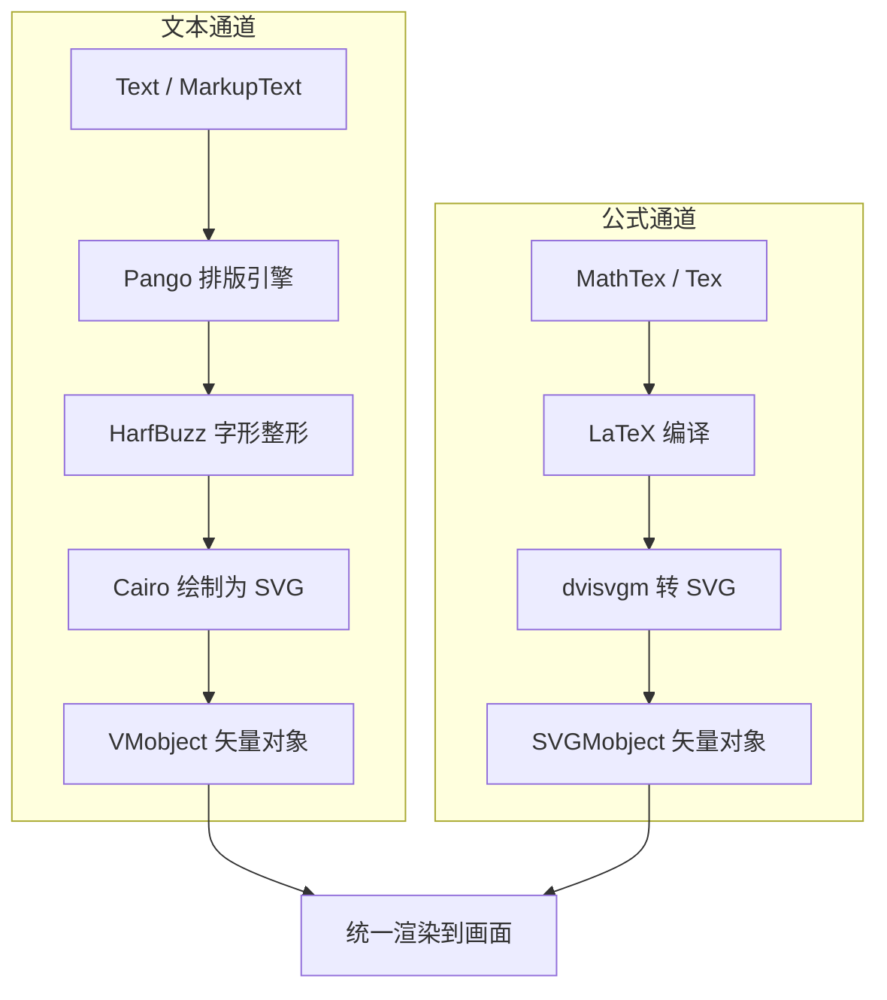

# 第7章：文本、中文字体与数学公式

---

## 1. 项目背景

某高校数学系副教授刘老师正在用 Manim 录制一套"线性代数精讲"MOOC 课程。第一讲的主题是"矩阵乘法"，包含大量中英文混排的文字说明和矩阵公式。

刘老师信心满满地写完了第一集脚本——包含矩阵运算、中文定理名称和步骤说明。然而渲染过程却接连踩坑：

1. **中文全是方块**：标题"矩阵乘法的定义"渲染成"□□□□□的□□"，完全不可读。调试了半天发现是 Pango 的字体回退策略问题——默认字体不支持中文，又没有正确配置 fallback。

2. **公式渲染失败**：`MathTex(r"\begin{bmatrix} a & b \\ c & d \end{bmatrix}")` 报 `LaTeX Error`，排查后发现 LaTeX 安装了但缺少 `amsmath` 宏包。

3. **公式和文字对齐混乱**：想在同一行显示"其中 A ="后面接一个矩阵，但 `Text` 和 `MathTex` 的基线、字号完全不同，拼在一起歪歪扭扭。

4. **排版批量低效**：50 页课件每页都有标题、正文、公式，刘老师每页都手写 `Text("...", font_size=28).next_to(...)`，代码量爆炸。

这个场景的痛点集中在 Manim 的**文本渲染管线**——它不像 Word 或 PowerPoint 那样对中文有原生支持，而是通过 Pango + HarfBuzz（文本）和 LaTeX（公式）两条独立通道渲染，两者有各自的字体系统、基线规则和错误处理机制。

本章就是要打通"文字+公式"这一关：从 Text/MarkupText 的字体配置，到 MathTex/Tex 的 LaTeX 调试，再到中英文混排的基线对齐和 VGroup 封装策略。



---

## 2. 剧本式交锋对话

> **场景**：刘老师的屏幕上显示着满屏的方块字和错位的矩阵。小胖端着奶茶，小白的屏幕上开着字体配置文档。

**小胖**（指着屏幕上的"□□□□□的□□"）：

"刘老师，您这课件挺有赛博朋克风格的——全是方块。我上次看到一个哥们说 Manim 对中文的支持就跟'去川菜馆点日料'一样——它本行是数学动画，中文是它不太擅长的副业。"

**刘老师**（叹气）：

"可不是嘛。我以为 Python 嘛，写中文肯定没问题，结果啪啪打脸。字体、编码、LaTeX 每一个环节都能给你挖坑。"

**小白**（推了推眼镜）：

"其实不是 Manim 的锅。Manim 自己不处理文字——它把文本渲染外包给了 Pango 库。Pango 是一个专业的国际化文本排版引擎，但它需要你告诉它'用哪个字体渲染中文'。如果你不显式指定，Pango 就会用系统默认字体，而你的系统默认字体——比如 DejaVu Sans——只包含拉丁字符，遇到中文字符就回退到一个空字形，也就是方块。"

**大师**（端起保温杯）：

"小白把原理讲清楚了。我来给一个实操口诀——**三招搞定中文**：

第一招——显式指定系统字体：`Text("你好", font="SimHei")`，SimHei 是 Windows 黑体。macOS 用 `PingFang SC` 或 `Heiti SC`，Linux 用 `Noto Sans CJK SC`。

第二招——全局配置默认字体：在 `manim.cfg` 里加一行 `[tex]` 段中设置，或者在代码开头写 `config.font = "Noto Sans CJK SC"`。

第三招——准备 fallback 字体：如果实在不确定目标平台的字体名，下载开源字体（如思源黑体）放到 `assets/fonts/` 目录，用 `Text("你好", font="Source Han Sans SC")` 加载。"

> **技术映射**：`Text(font="xxx")` 中的 `font` 参数会传给 Pango 的 `PangoFontDescription.from_string()`，Pango 按照 fontconfig（Linux/macOS）或 DirectWrite（Windows）规则查找该字体。

**小胖**（放下奶茶）：

"等等，那公式又是怎么回事？`MathTex` 报了一堆 LaTeX 错误。LaTeX 不是已经装了吗？"

**小白**：

"LaTeX 装了不代表宏包齐了。Manim 的 `MathTex` 用的 LaTeX 模板默认就依赖几个基础宏包：`standalone`（独立文档类）、`amsmath`（数学公式）、`amssymb`（数学符号）、`[utf8]{inputenc}`（编码）。如果这些包没装齐，公式就编译失败。特别是 `standalone` 这个包——它不是标准 TeX Live 的默认安装包，很多精简安装会漏掉。"

**大师**：

"装宏包很简单：TeX Live 用户 `tlmgr install standalone amsmath amssymb`；MiKTeX 用户设置中勾选'自动安装缺失包'，或者第一次渲染时看着弹窗点'Install'。我遇到过最坑的情况是——第一次渲染时 LaTeX 需要从 CTAN 镜像下载宏包，网络慢的话下载超时，就会报错。所以建议首次使用 `MathTex` 前，先跑一个简单的 `manim -pql test.py`，提前触发宏包下载。"

> **技术映射**：`MathTex` 的 LaTeX 模板位于 `manim/utils/tex_templates.py` 中。可以自定义模板来增加宏包、修改页面大小、添加 `\usepackage`。

**刘老师**（边记边说）：

"还有一个问题——文字和公式混排。比如'其中 A = '后面接一个矩阵，但 Text 和 MathTex 的基线不一样，拼在一起一高一低。"

**大师**（站起身在白板上画了两个框）：

"这是 Manim 的经典混排问题。`Text` 的基线是 Pango 根据字体的 `ascent/descent` 计算出来的，`MathTex` 的基线是 LaTeX 渲染后 SVG 的 geometric center。两者天然不对齐。解决方案有两条路线：

路线一——手动对齐：分别创建 Text 和 MathTex，用 `VGroup(text, formula).arrange(RIGHT, buff=0.3, aligned_edge=DOWN)`，让底部对齐。

路线二——全用 MathTex：`MathTex(r"\text{其中 } A = \begin{bmatrix} a & b \\ c & d \end{bmatrix}")`。MathTex 支持 `\text{}` 命令插入中文，而且所有内容在同一个 LaTeX 编译单元中，基线天然一致。缺点是需要配置 LaTeX 的中文支持（用 `ctex` 宏包或 `xeCJK`）。"

> **技术映射**：`MathTex` 中插入中文需要 LaTeX 支持，推荐在模板中加入 `\usepackage[UTF8]{ctex}`，即可在 `\text{中文}` 中正常显示。

---

## 3. 项目实战

### 3.1 环境准备

本章需要在基础环境上验证中文字体和 LaTeX 的可用性：

```bash
# 检查系统中文字体
# Windows: Get-ChildItem C:\Windows\Fonts\* -Include *simhei*,*yahei*,*songti*
# macOS: fc-list :lang=zh | head -5
# Linux: fc-list :lang=zh | grep -i "noto\|wqy\|source"

# 检查 LaTeX 宏包
kpsewhich standalone.cls    # 应返回路径
kpsewhich amsmath.sty       # 应返回路径
```

> **本章实战目标**：制作一个矩阵乘法教学动画，包含中文标题、文字说明、矩阵公式和最终结果验证的完整内容。

---

### 3.2 分步实现

#### 步骤一：Text 基础与字体配置

**步骤目标**：掌握 Text/MarkupText 的中文支持与常用参数。

```python
# scenes/chapter07_text.py
from manim import *

class TextBasics(Scene):
    def construct(self):
        # 基础文本（指定中文字体）
        t1 = Text("欢迎来到 Manim 实战课", font="SimHei", font_size=48, color=BLUE)
        self.play(Write(t1), run_time=2)
        self.wait(0.5)

        # MarkupText：使用 HTML 标签按字符着色
        t2 = MarkupText(
            '这是 <span fgcolor="yellow">黄色强调</span> '
            '和 <span fgcolor="red">红色警告</span> 的文字',
            font="SimHei", font_size=32,
        )
        t2.next_to(t1, DOWN, buff=0.8)
        self.play(FadeIn(t2, shift=DOWN * 0.3), run_time=1.5)
        self.wait(1)

        self.play(FadeOut(t1), FadeOut(t2), run_time=1.5)
        self.wait(0.3)

        # Paragraph：多行文本
        p = Paragraph(
            "第一行：线性代数是数学的一个分支",
            "第二行：研究向量空间与线性变换",
            "第三行：矩阵是其核心表示工具",
            font="SimHei", font_size=28, line_spacing=0.6,
            alignment="left",
        )
        self.play(FadeIn(p, shift=UP * 0.3), run_time=2)
        self.wait(1.5)

        self.play(FadeOut(p), run_time=1)
```

**运行结果**：

三组文本依次出现：标题（蓝色大号）、带 HTML 着色的强调文本、多行段落文本。验证中文正确显示（无方块）、`MarkupText` 的按字符着色功能、`Paragraph` 的多行排版功能。

**可能遇到的坑**：

1. **字体名大小写敏感**：Windows 上 `"simhei"` 和 `"SimHei"` 可能行为不同。建议用 `fc-list`（Linux/macOS）或字体文件夹查看精确名称。
2. **MarkupText 中的 `<` 和 `>`**：这些字符在 `MarkupText` 中有特殊含义。如需显示，用 `&lt;` 和 `&gt;` 转义。

---

#### 步骤二：MathTex 公式实战

**步骤目标**：使用 MathTex 创建矩阵公式，解决 LaTeX 编译问题。

```python
# scenes/chapter07_latex.py
from manim import *

class LatexBasics(Scene):
    def construct(self):
        # 1. 简单公式
        f1 = MathTex(r"f(x) = \frac{1}{\sqrt{2\pi}\sigma} e^{-\frac{(x-\mu)^2}{2\sigma^2}}",
                     font_size=36, color=WHITE)
        f1.to_edge(UP, buff=0.8)
        self.play(Write(f1), run_time=3)
        self.wait(0.5)

        # 2. 矩阵
        matrix = MathTex(
            r"A = \begin{bmatrix} a_{11} & a_{12} & a_{13} \\ "
            r"a_{21} & a_{22} & a_{23} \\ a_{31} & a_{32} & a_{33} \end{bmatrix}",
            font_size=40, color=TEAL,
        )
        matrix.next_to(f1, DOWN, buff=1.0)
        self.play(Write(matrix), run_time=2.5)
        self.wait(0.5)

        # 3. 公式拆分上色
        formula = MathTex(
            r"a^2", r"+", r"b^2", r"=", r"c^2",
            font_size=48,
        )
        formula[0].set_color(RED)
        formula[2].set_color(BLUE)
        formula[4].set_color(GREEN)
        formula.next_to(matrix, DOWN, buff=0.8)
        self.play(Write(formula), run_time=2)
        self.wait(1)

        self.play(FadeOut(f1), FadeOut(matrix), FadeOut(formula), run_time=2)
```

**运行结果**：

三段公式依次展示：正态分布概率密度函数（复杂分式）→ 3×3 矩阵（`bmatrix` 环境）→ 勾股定理的按字符着色版（`a²` 红色、`b²` 蓝色、`c²` 绿色）。

**可能遇到的坑**：

1. **LaTeX 转义字符**：Python 字符串中 `\b` 是退格符。写 `\begin{bmatrix}` 需要用 `r"..."` 原始字符串，否则 `\b` 会被转义。
2. **MathTex 的子对象索引**：`formula[0]` 对应 `a^2`，`formula[1]` 对应 `+`，依此类推。每个 MathTex 按照 LaTeX 的 token 自动拆分为子对象。

---

#### 步骤三：制作矩阵乘法教学动画

**步骤目标**：整合文字与公式，制作一段矩阵乘法的完整教学动画。

```python
# scenes/chapter07_matrix_multi.py
from manim import *

class MatrixMultiplication(Scene):
    def construct(self):
        # ---- 标题（中文） ----
        title = Text("矩阵乘法的定义", font="SimHei", font_size=40, color=BLUE, weight=BOLD)
        title.to_edge(UP, buff=0.4)
        self.play(Write(title), run_time=1.5)
        self.wait(0.3)

        # ---- 说明文字 ----
        desc = Paragraph(
            "设 A 为 m×n 矩阵，B 为 n×p 矩阵",
            "则 C = AB 为 m×p 矩阵，其中",
            "C[i][j] = Σ A[i][k] × B[k][j]",
            font="SimHei", font_size=26, line_spacing=0.5,
            alignment="left",
        )
        desc.to_edge(LEFT, buff=0.8).shift(UP * 0.3)
        self.play(FadeIn(desc, shift=RIGHT * 0.3), run_time=2)
        self.wait(0.3)

        # ---- 矩阵 A ----
        A = MathTex(
            r"A = \begin{bmatrix} "
            r"1 & 2 \\ 3 & 4 "
            r"\end{bmatrix}",
            font_size=42, color=YELLOW,
        )
        A.next_to(desc, DOWN, buff=0.8, aligned_edge=LEFT)

        # ---- 矩阵 B ----
        B = MathTex(
            r"B = \begin{bmatrix} "
            r"2 & 0 \\ 1 & 3 "
            r"\end{bmatrix}",
            font_size=42, color=ORANGE,
        )
        B.next_to(A, DOWN, buff=0.6, aligned_edge=LEFT)

        self.play(Write(A), run_time=1.5)
        self.wait(0.2)
        self.play(Write(B), run_time=1.5)
        self.wait(0.5)

        # ---- 计算步骤（右侧） ----
        calc_title = Text("计算过程：", font="SimHei", font_size=28, color=GRAY)
        calc_title.to_edge(RIGHT, buff=0.8).shift(UP * 1.5)

        self.play(Write(calc_title), run_time=0.8)

        calc_lines = VGroup(
            MathTex(r"C[0][0] = 1 \times 2 + 2 \times 1 = 4", font_size=28, color=WHITE),
            MathTex(r"C[0][1] = 1 \times 0 + 2 \times 3 = 6", font_size=28, color=WHITE),
            MathTex(r"C[1][0] = 3 \times 2 + 4 \times 1 = 10", font_size=28, color=WHITE),
            MathTex(r"C[1][1] = 3 \times 0 + 4 \times 3 = 12", font_size=28, color=WHITE),
        )
        calc_lines.arrange(DOWN, buff=0.3, aligned_edge=LEFT)
        calc_lines.next_to(calc_title, DOWN, buff=0.4)

        for line in calc_lines:
            self.play(Write(line), run_time=1.2)
            self.wait(0.2)

        # ---- 结果矩阵 C ----
        C = MathTex(
            r"C = \begin{bmatrix} "
            r"4 & 6 \\ 10 & 12 "
            r"\end{bmatrix}",
            font_size=42, color=GREEN,
        )
        C.next_to(calc_lines, DOWN, buff=0.6, aligned_edge=LEFT)

        box = SurroundingRectangle(C, color=GREEN, buff=0.15)
        self.play(Write(C), Create(box), run_time=1.5)
        self.wait(1.5)

        self.play(FadeOut(VGroup(title, desc, calc_title,
            A, B, calc_lines, C, box)), run_time=2)
        self.wait(0.5)
```

**运行命令**：

```bash
manim -pqm scenes/chapter07_matrix_multi.py MatrixMultiplication
```

---

### 3.3 完整代码清单

```python
# scenes/chapter07_matrix_multi.py —— 矩阵乘法教学动画
from manim import *

class MatrixMultiplication(Scene):
    def construct(self):
        title = Text("矩阵乘法的定义", font="SimHei", font_size=40, color=BLUE, weight=BOLD)
        title.to_edge(UP, buff=0.4)
        self.play(Write(title), run_time=1.5)
        self.wait(0.3)

        desc = Paragraph(
            "设 A 为 m×n 矩阵，B 为 n×p 矩阵",
            "则 C = AB 为 m×p 矩阵，其中",
            "C[i][j] = Σ A[i][k] × B[k][j]",
            font="SimHei", font_size=26, line_spacing=0.5, alignment="left",
        )
        desc.to_edge(LEFT, buff=0.8).shift(UP * 0.3)
        self.play(FadeIn(desc, shift=RIGHT * 0.3), run_time=2)
        self.wait(0.3)

        A = MathTex(r"A = \begin{bmatrix} 1 & 2 \\ 3 & 4 \end{bmatrix}",
                    font_size=42, color=YELLOW)
        A.next_to(desc, DOWN, buff=0.8, aligned_edge=LEFT)

        B = MathTex(r"B = \begin{bmatrix} 2 & 0 \\ 1 & 3 \end{bmatrix}",
                    font_size=42, color=ORANGE)
        B.next_to(A, DOWN, buff=0.6, aligned_edge=LEFT)

        self.play(Write(A), Write(B), run_time=2)
        self.wait(0.5)

        calc_title = Text("计算过程：", font="SimHei", font_size=28, color=GRAY)
        calc_title.to_edge(RIGHT, buff=0.8).shift(UP * 1.5)
        self.play(Write(calc_title), run_time=0.8)

        calc_data = [
            r"C[0][0] = 1 \times 2 + 2 \times 1 = 4",
            r"C[0][1] = 1 \times 0 + 2 \times 3 = 6",
            r"C[1][0] = 3 \times 2 + 4 \times 1 = 10",
            r"C[1][1] = 3 \times 0 + 4 \times 3 = 12",
        ]
        calc_lines = VGroup()
        for line in calc_data:
            calc_lines.add(MathTex(line, font_size=28, color=WHITE))
        calc_lines.arrange(DOWN, buff=0.3, aligned_edge=LEFT)
        calc_lines.next_to(calc_title, DOWN, buff=0.4)

        for line in calc_lines:
            self.play(Write(line), run_time=1.2)
            self.wait(0.2)

        C = MathTex(r"C = \begin{bmatrix} 4 & 6 \\ 10 & 12 \end{bmatrix}",
                    font_size=42, color=GREEN)
        C.next_to(calc_lines, DOWN, buff=0.6, aligned_edge=LEFT)
        box = SurroundingRectangle(C, color=GREEN, buff=0.15)
        self.play(Write(C), Create(box), run_time=1.5)
        self.wait(1.5)
        self.play(FadeOut(VGroup(title, desc, calc_title,
            A, B, calc_lines, C, box)), run_time=2)
        self.wait(0.5)
```

### 3.4 测试验证

| 验证项 | 操作 | 预期结果 |
|--------|------|----------|
| 中文显示 | 渲染 `Text("测试", font="SimHei")` | 无方块，字体正确 |
| 公式编译 | 渲染 `MathTex(r"\frac{a}{b}")` | 无 LaTeX 错误 |
| 字体回退 | 不指定 font，渲染中英文混合 | Pango 自动选择系统字体 |
| MarkupText | 用 `<span>` 着色 "测试" | 颜色正确，无语法错误 |
| 公式对齐 | VGroup(Text("A="), MathTex("...")).arrange(RIGHT, aligned_edge=DOWN) | 底部对齐 |

---

## 4. 项目总结

### 优点 & 缺点

| 维度 | 优点 | 缺点 |
|------|------|------|
| 公式渲染 | LaTeX 排版专业，支持矩阵/分数/积分等复杂结构 | LaTeX 环境和宏包配置较重，首次使用易出错 |
| 文本功能 | MarkupText 支持 HTML 内联着色，Paragraph 支持多行排版 | 中文支持需要额外配置字体，跨平台兼容性不佳 |
| 公式着色 | MathTex 按 token 拆分，每部分可独立设色 | 拆分粒度不可控，LaTeX 分词逻辑有时不如预期 |
| 缓存机制 | LaTeX 编译结果有缓存，二次渲染秒出 | 缓存路径变更或清理不当会导致"公式不更新" |
| 混排能力 | 可将 Text 和 MathTex 编入 VGroup 统一管理 | 基线不对齐是常态，需要手动调整 |

### 适用场景

| 场景 | 说明 |
|------|------|
| 数学/物理课件 | 公式推导、定理证明、计算展示 |
| 数据科学讲解 | 损失函数、优化公式的逐步拆分 |
| 算法原理动画 | 复杂度公式、数学建模的步骤演示 |
| 中文教学视频 | 需要中英文混排和公式结合的课程 |
| 代码+数学混合演示 | 用 Text 展示伪代码，用 MathTex 展示数学结果 |

**不适用场景**：全文中文排版（大段文字说明应配外部字幕或分屏）、特殊数学符号不支持的场景（Manim 的 LaTeX 模板可能不包含特定宏包，需要手动扩展）。

### 注意事项

1. **LaTeX 模板缓存**：修改了 LaTeX 模板文件（`manim/utils/tex_templates.py`）后，需要删除 `media/Tex/` 缓存目录，否则 Manim 可能继续使用缓存结果。
2. **字体文件路径**：如果使用非系统字体，需要将 `.ttf`/`.otf` 文件放到 `assets/fonts/` 目录，代码中写 `Text("你好", font="assets/fonts/SourceHanSans.ttf")`。路径相对于运行 Manim 的当前目录。
3. **`\text{}` 中文依赖**：`MathTex` 中使用 `\text{中文}` 需要 LaTeX 支持 Unicode。TeX Live 2018+ 和 MiKTeX 新版默认支持，旧版本可能需要 `\usepackage[UTF8]{ctex}`。

### 常见踩坑经验

**故障一：`MathTex` 渲染结果与预期不符**

根因：LaTeX 字符串中的特殊字符转义不正确。如 `\b` 被 Python 解释为退格符，`\f` 被解释为换页符。

解决：始终使用 `r"..."` 原始字符串包裹 LaTeX 内容，避免 Python 的转义干扰。

**故障二：中文 Text 出现"空心框"而不是方块**

根因：Pango 找到了支持中文的字体，但字体的渲染模式配置异常（Cairo 的 `font_options` 设置问题）。

解决：在 `Text()` 调用中尝试 `disable_ligatures=True`，或在创建 Text 前设置 `config.renderer = "cairo"` 确认渲染后端。

**故障三：批量渲染时公式位置随机偏移**

根因：`MathTex` 的 SVG 解析过程中，LaTeX 每次编译的包围盒可能有微小差异（与 `\phantom`、空格、当前工作目录变化有关）。

解决：所有 `MathTex` 在创建后统一用 `move_to` 或 `align_to` 重新定位，不依赖初始坐标。

### 思考题

1. 封装一个函数 `mixed_text(chinese, formula)`，接受中文字符串和 LaTeX 公式字符串，返回一个 VGroup，其中 Text 和 MathTex 的基线自动对齐。提示：使用 `align_to(ref, DOWN)` 而不是 `arrange`，控制对齐边。

2. 在 `MatrixMultiplication` 中增加一个"交互元素"：在每一步计算时，高亮矩阵 A 和矩阵 B 中正在参与计算的元素（如计算 C[0][0] 时，A 的第一行和 B 的第一列变为红色）。提示：`MathTex` 中的每个元素都可以通过 `formula[i]` 独立控件和着色。

---

### 推广计划提示

| 角色 | 本章阅读重点 | 协作事项 |
|------|-------------|----------|
| 新人开发 | 完整通读，配置好中文字体和 LaTeX | 完成矩阵乘法动画 |
| 测试 | 验证多平台字体兼容性 | 编写自动化脚本检测各平台字体可用性 |
| 运维 | 准备统一的 LaTeX 宏包依赖清单 | 配置 CI 中的 LaTeX 安装脚本 |
