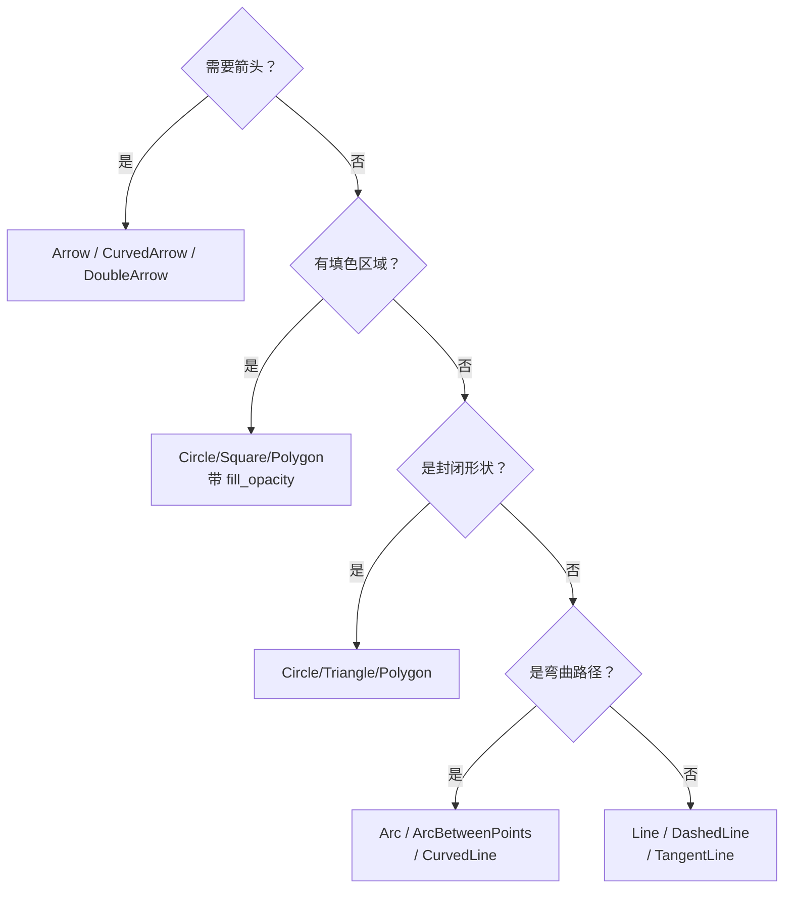

# 第8章：基础几何图形与视觉风格

---

## 1. 项目背景

一家 STEM 教育初创公司的内容团队正在用 Manim 批量制作"初中物理力学"系列动画。设计师小赵负责统一画面的视觉风格——所有力的箭头要用实线、颜色按力的大小渐变、标注角度用虚线弧线、文字用一个统一的配色方案。

然而小赵发现团队交上来的初稿"画风迥异"：有人用 `Line` 画力箭头（没有箭头尖角），有人用 `Arrow` 但 stroke_width 写了 20（像一根粗棍），有人把角度标注画成了实线弧形（让人误以为是运动轨迹）。更糟的是，不同人做的场景放到一起看，颜色完全不在一个调色板里——有人用 `#FF0000` 正红，有人用 `#CC3333` 暗红，有人直接用 `RED` 常量。

教研负责人看完后说："内容是对的，但画面像是在五个不同的宇宙里各自拍的。"

这个痛点的核心是 Manim 的图形系统既有丰富的几何原语（`Dot`、`Line`、`Circle`、`Square`、`Polygon`、`Arrow`、`Arc`、`Brace` 等），又有灵活的样式系统（`stroke_width`、`fill_opacity`、`stroke_color`、`gradient`），但缺乏"风格约束"——每个开发者都可以自由组合，导致同类型作品视觉不统一。

本章就是要讲清两件事：**几何素材**的正确选用（什么东西用哪种图形），以及**视觉风格**的工程化管理（怎么让所有动画看起来像出自同一个团队）。

---

## 2. 剧本式交锋对话

> **场景**：小赵把团队不同人做的三版力分析动画并排投在大屏幕上——画面颜色和线型完全不一致。

**小胖**（啃着苹果指着一个粗得像擀面杖的箭头）：

"哇，这个箭头好有气势！这是分析力呢还是分析推土机？stroke_width 写了多少？"

**小赵**（无奈）：

"20。小林说他觉得默认的 stroke_width=4 太细了'看不见'，于是他设了 20。还有小王——他用 `Line` 画箭头，画完发现忘了加箭头尖，又 `add_tip()` 补了一个，结果尖角的大小和线段完全不成比例。"

**小白**（冷静地调出文档）：

"问题出在 Manim 有两套画线体系。`Line` 是纯粹的线段，可以通过 `add_tip()` 加箭头，但 tip 的样式和长度需要手动设置。`Arrow` 是 `Line` 的子类，自动带了箭头尖，而且尖角大小与线段粗细成比例。画力分析时应该用 `Arrow`，画辅助线用 `Line`，画运动轨迹用 `DashedLine`。选错工具，后面的补救就越来越歪。"

**大师**（放下咖啡杯）：

"我来给几何图形分个类——选择决策树如下："

（在白板上快速画出分类树）



> **技术映射**：`Arrow` 继承自 `Line`，并通过 `TipableVMobject` 混入类添加箭头尖。箭头尖的样式由 `tip_shape` 参数控制，默认是 `ArrowTriangleFilledTip`。

**小胖**（举手）：

"我打断一下。颜色这块呢？不就是 `set_color(RED)` 搞定了吗？"

**小白**：

"画面上可不止一个红色。你以为你写的是 `RED`，实际 Manim 的 `RED` 是 `#FC6255`——这是一个略偏粉的暖红。如果你同事用了 `PURE_RED`（`#FF0000`），两个红色放到一起就打架了。Manim 有 40+ 种预设颜色，但团队需要统一选一个调色板，而不是每人随机挑。"

**大师**：

"对。我建议团队维护一个 `style.py` 文件，定义语义化颜色变量——"

```python
# style.py —— 团队统一调色板
PRIMARY = "#2B6CB0"      # 主色：标题、重点框
ACCENT = "#F6AD55"       # 强调色：当前步骤、高亮
SUCCESS = "#48BB78"      # 正确色：答案、归位
DANGER = "#FC8181"       # 危险色：错误、警告
TEXT_MAIN = "#FFFFFF"    # 主文字色
TEXT_SUB = "#A0AEC0"     # 辅助文字色
BG_DARK = "#1A202C"      # 深色背景
```

"然后所有场景 `from style import PRIMARY, SUCCESS, DANGER`，确保调色板只有一个来源。"

> **技术映射**：Manim 预定义颜色常量位于 `manim/utils/color/Colors.py`，团队自定义颜色可以从该模块导入所需常量。

**小赵**（快速记下）：

"还有个问题——填空题和答案的样式怎么统一？比如所有'提示框'都是圆角矩形加半透背景，'正确答案'是绿色边框加勾号？"

**大师**：

"这是组件封装的范畴。下一章我们会深入讲，但第八章可以先建立最小组件库：一个 `class HintBox`、一个 `class AnswerCard`、一个 `class StepIndicator`。每个类在内部封装颜色、圆角、字号、阴影等细节，外部只暴露几个参数。这样单个场景的代码量减少 80%，视觉一致性提升 100%。"

---

## 3. 项目实战

### 3.1 环境准备

沿用第 2 章搭建的环境。在项目中创建 `constants/style.py` 文件：

```python
# constants/style.py
from manim import *

# ---- 调色板 ----
PRIMARY = "#4A90D9"
ACCENT  = "#F5A623"
SUCCESS = "#7ED321"
DANGER  = "#D0021B"
NEUTRAL = "#9B9B9B"
BG_CARD = "#2C3E50"       # 卡片背景
TEXT_PRIMARY = WHITE
TEXT_SECONDARY = LIGHT_GRAY

# ---- 字号层级 ----
FONT_TITLE = 44
FONT_SUBTITLE = 32
FONT_BODY = 26
FONT_SMALL = 20

# ---- 线型 ----
STROKE_THIN = 1
STROKE_NORMAL = 3
STROKE_THICK = 5
STROKE_ARROW = 4
CORNER_RADIUS = 0.15
```

---

### 3.2 分步实现

> **本章实战目标**：制作一个"力的合成——平行四边形法则"物理教学动画，使用统一的几何图形和视觉风格。

---

#### 步骤一：几何图形类型实践

**步骤目标**：对比 Dot/Line/Arrow/Circle/Square/Arc/Brace 的不同用法。

```python
# scenes/chapter08_shapes.py
from manim import *

class ShapeGallery(Scene):
    def construct(self):
        title = Text("几何图形类型总览", font_size=36, color=BLUE)
        title.to_edge(UP, buff=0.4)
        self.play(Write(title), run_time=1.5)

        # 1. Dot —— 标记点
        dot = Dot(ORIGIN + LEFT * 4 + UP * 1.5, color=RED, radius=0.1)
        dot_label = Text("Dot", font_size=18, color=RED)
        dot_label.next_to(dot, DOWN, buff=0.2)

        # 2. Line —— 线段
        line = Line(LEFT * 3, RIGHT * 3, color=BLUE, stroke_width=3)
        line.shift(UP * 3)
        line_label = Text("Line", font_size=18, color=BLUE)
        line_label.next_to(line, DOWN, buff=0.2)

        # 3. Arrow —— 箭头（自动带尖）
        arrow = Arrow(LEFT * 3 + UP * 0.5, RIGHT * 3 + UP * 0.5, color=YELLOW,
                      stroke_width=4)
        arrow.shift(UP * 0.5)
        arrow_label = Text("Arrow", font_size=18, color=YELLOW)
        arrow_label.next_to(arrow, DOWN, buff=0.2)

        # 4. Circle —— 圆
        circle = Circle(radius=0.6, color=GREEN, fill_opacity=0.3)
        circle.move_to(ORIGIN + LEFT * 4 + DOWN * 2)
        circle_label = Text("Circle", font_size=18, color=GREEN)
        circle_label.next_to(circle, DOWN, buff=0.2)

        # 5. Square —— 正方形
        square = Square(side_length=1.2, color=ORANGE, fill_opacity=0.3)
        square.move_to(ORIGIN + DOWN * 2)
        square_label = Text("Square", font_size=18, color=ORANGE)
        square_label.next_to(square, DOWN, buff=0.2)

        # 6. Arc —— 弧线
        arc = Arc(radius=1.0, angle=PI / 2, color=PURPLE, stroke_width=3)
        arc.move_to(ORIGIN + RIGHT * 4 + DOWN * 2)
        arc_label = Text("Arc", font_size=18, color=PURPLE)
        arc_label.next_to(arc, DOWN, buff=0.2)

        # 7. Brace —— 花括号标注
        brace = Brace(Line(LEFT*2, RIGHT*2), direction=UP, color=GRAY)
        brace.shift(DOWN * 1.2)
        brace_label = Text("Brace", font_size=18, color=GRAY)
        brace_label.next_to(brace, DOWN, buff=0.2)

        all_shapes = VGroup(dot, dot_label, line, line_label,
                           arrow, arrow_label, circle, circle_label,
                           square, square_label, arc, arc_label,
                           brace, brace_label)
        self.play(LaggedStart(*[Create(s) for s in [line, arrow, circle,
            square, arc, brace, dot]], Write(VGroup(dot_label, line_label,
            arrow_label, circle_label, square_label, arc_label, brace_label)),
            lag_ratio=0.15), run_time=4)
        self.wait(1.5)

        self.play(FadeOut(VGroup(title, all_shapes)), run_time=2)
```

---

#### 步骤二：平行四边形法则动画

**步骤目标**：制作力的合成教学动画，应用统一视觉风格。

```python
# scenes/chapter08_force.py
from manim import *
# 假设 style.py 在 constants/ 目录，已在 PYTHONPATH 中
# 实际使用时确保路径正确

# 内联色板（避免导入问题）
from manim.utils.color import BLUE, YELLOW, ORANGE, GREEN, GRAY, WHITE

class ParallelogramForce(Scene):
    def construct(self):
        # ---- 标题 ----
        title = Text("力的合成——平行四边形法则", font_size=36, color=BLUE, weight=BOLD)
        title.to_edge(UP, buff=0.4)
        self.play(Write(title), run_time=1.5)

        # ---- 力 F1（蓝色，向右） ----
        origin_point = ORIGIN + DOWN * 1.2
        f1_vec = RIGHT * 3.5 + UP * 0.5  # F1 的方向和大小
        f1_arrow = Arrow(origin_point, origin_point + f1_vec,
                         color="#4A90D9", stroke_width=5, buff=0)
        f1_label = MathTex(r"\vec{F}_1", font_size=32, color="#4A90D9")
        f1_label.next_to(f1_arrow.get_end(), UR, buff=0.1)

        self.play(Create(f1_arrow), Write(f1_label), run_time=1.5)
        self.wait(0.2)

        # ---- 力 F2（橙色，向上偏右） ----
        f2_vec = UP * 2.8 + RIGHT * 1.2
        f2_arrow = Arrow(origin_point, origin_point + f2_vec,
                         color="#F5A623", stroke_width=5, buff=0)
        f2_label = MathTex(r"\vec{F}_2", font_size=32, color="#F5A623")
        f2_label.next_to(f2_arrow.get_end(), LEFT, buff=0.1)

        self.play(Create(f2_arrow), Write(f2_label), run_time=1.5)
        self.wait(0.2)

        # ---- 平行四边形辅助线（虚线） ----
        diag_end = origin_point + f1_vec + f2_vec  # 对角线终点

        line1 = DashedLine(
            origin_point + f1_vec, diag_end,
            color=GRAY, stroke_opacity=0.6,
        )
        line2 = DashedLine(
            origin_point + f2_vec, diag_end,
            color=GRAY, stroke_opacity=0.6,
        )

        self.play(Create(line1), Create(line2), run_time=1.5)
        self.wait(0.2)

        # ---- 合力 F（绿色，对角线） ----
        f_result_arrow = Arrow(origin_point, diag_end,
                               color="#7ED321", stroke_width=5, buff=0)
        f_result_label = MathTex(r"\vec{F}_{\text{合}}", font_size=32, color="#7ED321")
        f_result_label.next_to(f_result_arrow.get_end(), UP, buff=0.1)

        self.play(Create(f_result_arrow), Write(f_result_label), run_time=1.5)
        self.wait(0.3)

        # ---- 角度标注 ----
        angle = Angle(
            f1_arrow, f_result_arrow,
            radius=0.8, color=GRAY, stroke_width=2,
        )
        angle_label = MathTex(r"\theta", font_size=24, color=GRAY)
        angle_label.move_to(
            Angle(f1_arrow, f_result_arrow, radius=1.2).point_from_proportion(0.5)
        )

        self.play(Create(angle), Write(angle_label), run_time=1.5)
        self.wait(1)

        # 高亮强调合力
        self.play(Indicate(f_result_arrow, color=GREEN, scale_factor=1.05), run_time=1.5)
        self.wait(1)

        self.play(FadeOut(VGroup(title, f1_arrow, f1_label,
            f2_arrow, f2_label, line1, line2,
            f_result_arrow, f_result_label, angle, angle_label)), run_time=2)
        self.wait(0.5)
```

**运行命令**：

```bash
manim -pqm scenes/chapter08_force.py ParallelogramForce
```

**运行结果**：

一段约 15 秒的物理力学动画。首先蓝色箭头 `F₁` 出现（沿 3.5→, 0.5↑），然后橙色 `F₂` 出现（沿 1.2→, 2.8↑），接着灰色虚线补全平行四边形，绿色对角线 `F_合` 出现并用角度标注 θ。最后合力闪烁强调。整个画面配色统一（蓝主 → 橙辅 → 绿结果 → 灰辅助），线型一致（stroke_width=5 实线为主，虚线为辅）。

**可能遇到的坑**：

1. **Arrow 的 buff 参数**：`Arrow(start, end, buff=0)` 让箭头尖正好抵达终点。默认 `buff=0.1` 会在两端留空，如果不注意可能导致箭头"没画到目标点"。
2. **Angle 的定位**：`Angle(a, b)` 创建从 a 到 b 的角度弧线。`angle.point_from_proportion(0.5)` 返回弧线 50% 处的位置，常用于放标签。
3. **虚线辅助线的层级**：虚线应放在实线之前、实线之后创建，或者设置较低的 `z_index`，避免虚线条被遮挡。

---

#### 步骤三：封装风格组件

**步骤目标**：创建可复用的卡片和步骤指示器。

```python
# scenes/chapter08_components.py
from manim import *

class HintBox(VGroup):
    """提示框：圆角矩形 + 半透明背景 + 文字"""
    def __init__(self, text, width=8, height=1.5, **kwargs):
        super().__init__(**kwargs)
        self.box = RoundedRectangle(
            width=width, height=height, corner_radius=0.15,
            color="#4A90D9", fill_opacity=0.1, stroke_width=2,
        )
        self.text = Text(text, font_size=26, color=WHITE)
        self.text.move_to(self.box.get_center())
        self.add(self.box, self.text)


class StepIndicator(VGroup):
    """步骤指示器：带编号的圆形 + 文字标签"""
    def __init__(self, number, label_text, **kwargs):
        super().__init__(**kwargs)
        self.circle = Circle(radius=0.35, color="#F5A623", fill_opacity=0.3)
        self.number_text = Text(str(number), font_size=22, color="#F5A623", weight=BOLD)
        self.number_text.move_to(self.circle.get_center())
        self.label = Text(label_text, font_size=20, color=GRAY)
        self.label.next_to(self.circle, DOWN, buff=0.2)
        self.add(self.circle, self.number_text, self.label)


class StepFlow(Scene):
    def construct(self):
        title = Text("封装组件演示", font_size=36, color=BLUE)
        title.to_edge(UP, buff=0.4)
        self.play(Write(title))

        # 提示框
        hint = HintBox("提示：每次按压都可能产生弹跳")
        hint.next_to(title, DOWN, buff=0.6)
        self.play(FadeIn(hint, scale=0.95), run_time=1)
        self.wait(0.5)

        # 步骤指示器
        steps = VGroup(
            StepIndicator(1, "准备数据"),
            StepIndicator(2, "执行算法"),
            StepIndicator(3, "验证结果"),
        )
        steps.arrange(RIGHT, buff=1.5)
        steps.next_to(hint, DOWN, buff=1.0)

        self.play(LaggedStart(*[FadeIn(s, scale=0.5) for s in steps],
                              lag_ratio=0.3), run_time=2)
        self.wait(1.5)

        self.play(FadeOut(VGroup(title, hint, steps)), run_time=1.5)
```

---

### 3.3 完整代码清单

`scenes/chapter08_force.py` 已在上方完整展示。

### 3.4 测试验证

| 验证项 | 操作 | 预期结果 |
|--------|------|----------|
| 线型一致 | 比较所有实线箭头的 stroke_width | 统一为 5 |
| 颜色规范 | 检查 F1/F2/合力箭头的颜色值 | 分别匹配 #4A90D9 / #F5A623 / #7ED321 |
| 虚线辅助 | 检查平行四边形虚线的 stroke_opacity | 不高于 0.6，不喧宾夺主 |
| 角度标注 | 检查弧线 stroke_width | 不粗于 3 |
| 组件复用 | 在两个不同 Scene 中使用 HintBox | 视觉一致 |

---

## 4. 项目总结

### 优点 & 缺点

| 维度 | 优点 | 缺点 |
|------|------|------|
| 图形丰富度 | 内置 20+ 种几何图形，覆盖教学动画 90% 需求 | 无现成的齿轮/弹簧/波轮等物理组件 |
| 样式系统 | stroke_width/fill_opacity/color/gradient 参数灵活 | 参数自由度过高，缺乏风格约束机制 |
| Arrow 体系 | 支持单/双箭头、弧线箭头、自定义箭尖形状 | 曲线箭头长度不好预估，位置调整需要反复尝试 |
| 组件化 | VGroup 封装后可实现统一风格复用 | 组件内部样式硬编码，跨项目迁移需修改源码 |
| 角度标注 | Angle 类支持半径/颜色/弧度/直角标多种配置 | RightAngle 与 Angle 的接口不完全一致 |

### 适用场景

| 场景 | 说明 |
|------|------|
| 物理力学教学 | 力分析图、运动轨迹、矢量和 |
| 几何证明 | 三角形、圆的辅助线、角平分线 |
| 界面设计原型 | 按钮、卡片、图标的几何原型 |
| 数据标注 | 柱状图边框、折线拐点标记 |
| 流程图绘制 | 节点 → 箭头 → 标签的标准组件 |

**不适用场景**：复杂的 3D 几何体（应使用 `ThreeDScene`+`Sphere`/`Cube`）、需要精确尺寸标注的工程图纸。

### 注意事项

1. **`Arrow` 与 `Vector` 的区别**：`Vector(direction)` 等价于 `Arrow(ORIGIN, direction, buff=0)`，适用于从原点出发的向量。`Arrow` 更灵活，可自定义起点终点。
2. **`Brace` 的方向**：`Brace(line, direction=UP)` 花括号向上开口，文字应放在 `brace.get_top()` 上。方向参数影响括号朝向和文字位置。
3. **`Arc` 的角度参数**：`arc = Arc(radius=1, angle=PI/2, start_angle=PI/4)`——`angle` 是弧度跨度（不是圆心角），`start_angle` 是起始角度。初学者容易混淆。

### 常见踩坑经验

**故障一：Arrow 的箭头尖只指向起点方向**

根因：`Arrow(start, end)` 的方向由 end-start 决定。如果传的 start 和 end 顺序反了，箭头会指向起点。

解决：始终按 `Arrow(起点, 终点)` 的顺序传参。

**故障二：`add_tip()` 后箭头的 `get_end()` 返回旧值**

根因：`add_tip()` 是在 Line 上追加 Tip 对象，但 Line 的长度不变，Tip 是绘制在线段终点的额外图形。

解决：用 `arrow.tip.get_center()` 获取箭尖的实际位置。

**故障三：大面积的 `fill_opacity` 导致画面"糊"**

根因：多个透明重叠的对象叠加后，视觉效果变成浓重的色块。

解决：减小 fill_opacity（0.05–0.2 通常足够），或使用 `z_index` 控制渲染顺序，确保背景先画。

### 思考题

1. 实现一个 `class ForceArrow(Arrow)`：它继承自 Arrow，默认 `stroke_width=5`、`color=R`（按力的大小映射颜色）、`max_tip_length_to_length_ratio=0.15`。使用时只需 `ForceArrow(ORIGIN, RIGHT*3, magnitude=5)`。提示：重写 `__init__`，内部调用 `super().__init__()` 并设置默认参数。

2. 在 `ParallelogramForce` 的基础上，增加一条"力的分解"演示：给定合力（绿色对角线），用虚线展示它可以分解为水平和垂直两个分力。提示：用 `DashedLine` 从对角线的终点向两个坐标轴投影。

---

### 推广计划提示

| 角色 | 本章阅读重点 | 协作事项 |
|------|-------------|----------|
| 新人开发 | 完整通读，掌握图形分类选择和样式统一 | 完成平行四边形法则动画 |
| 测试 | 验证跨场景的样式一致性 | 编写视觉回归测试（截图对比） |
| 运维 | 关注 style.py 的版本管理和分发 | 将 style.py 纳入代码仓库，设置 CI 检查 |
