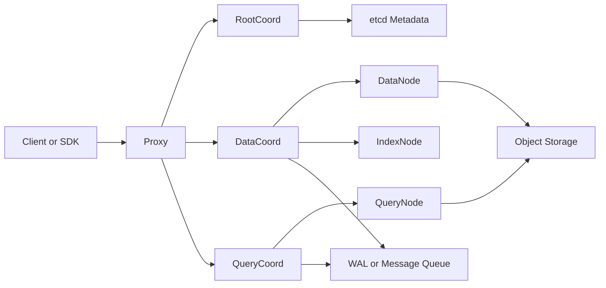

# Milvus 向量数据库实战修炼专栏大纲

> 版本：Milvus 2.5.x / 2.6.x
> 面向人群：新人开发、测试、核心开发、运维、架构师、资深开发
> 总章节：40 章（基础篇 16 章 / 中级篇 14 章 / 高级篇 10 章）
> 每章独立成文件，字数 3000-5000 字

---

## 专栏定位

本专栏以 Milvus 向量数据库为主线，围绕「能跑起来、能用起来、能调起来、能看懂源码、能落地生产」逐层展开。内容不把 Milvus 当成孤立组件讲解，而是放到 AI 搜索、RAG 知识库、推荐系统、图文检索、风控相似样本召回等真实场景中，用项目需求带出概念，用动手实验验证原理，用源码阅读解释边界。

每一章均建议采用模板中的「项目背景 → 三人剧本对话 → 项目实战 → 项目总结」四段式结构：小胖负责用生活化场景抛问题，小白负责追问原理、边界和风险，大师负责把业务约束、架构选择和源码实现讲透。整体风格要求实战为主、理论为辅，由浅入深，最终让开发能写业务、测试能设计验证、运维能稳定部署、架构师能做技术选型和容量规划。

---

## 阅读路线建议

| 角色 | 建议阅读顺序 | 重点章节 |
|------|-------------|---------|
| 新人开发/测试 | 基础篇全读 → 中级篇按需选读 | 第 1-16 章 |
| 核心开发/运维 | 基础篇速读 → 中级篇精读 → 高级篇选读 | 第 17-30 章，辅以第 31-40 章 |
| 架构师/资深开发 | 中级篇与高级篇为主线，按需回溯基础篇 | 第 17-40 章 |

---

# 基础篇（第 1-16 章）

> **核心目标**：建立 Milvus 术语体系，完成单机部署，掌握 Collection、Schema、索引、搜索、过滤、SDK 与初级 RAG 实战。
> **源码关联**：cmd/、internal/proxy/、internal/rootcoord/、internal/datacoord/、internal/querycoordv2/、internal/querynodev2/、internal/datanode/、pkg/。

---

## 第1章：Milvus 术语全景与向量检索工作原理
**定位**：专栏总览与开篇，建立统一语系。
**核心内容**：
- 术语词典：Vector、Embedding、Collection、Schema、Field、Primary Key、Segment、Partition、Shard、Index、Metric Type、Load、Search、Query
- Milvus 适合解决什么问题：语义搜索、图片检索、RAG、推荐召回、异常样本发现
- 向量检索基本流程：原始数据 -> Embedding -> 写入 Milvus -> 构建索引 -> 搜索召回 -> 业务重排
- Milvus 核心组件：Proxy、RootCoord、DataCoord、QueryCoord、DataNode、QueryNode、IndexNode、StreamingNode、Object Storage、etcd、消息队列
- 架构图建议：

- 源码文件关联：cmd/milvus/、internal/proxy/、internal/types/types.go、internal/rootcoord/、internal/datacoord/、internal/querycoordv2/
**实战目标**：画出一张团队可复用的 Milvus 架构图，并用 10 条术语解释一次完整搜索请求的生命周期。

---

## 第2章：用 Docker 启动第一个 Milvus 单机环境
**定位**：从零搭建可实验的本地环境。
**核心内容**：
- Milvus Standalone、Cluster、Lite 的差异
- Docker Compose 中 etcd、MinIO、Milvus 的职责划分
- Attu 可视化管理工具与基础连接配置
- 常用运维命令：启动、停止、查看日志、健康检查
- 最小资源配置与本机开发环境避坑
**实战目标**：使用 Docker Compose 启动 Milvus Standalone + Attu，创建第一个连接并完成健康检查。

---

## 第3章：Collection 与 Schema 设计入门
**定位**：理解 Milvus 中数据建模的第一步。
**核心内容**：
- Collection、Field、Primary Key、Vector Field、Scalar Field 的关系
- 动态字段、AutoID、Nullable、Default Value 的使用边界
- 向量维度如何确定：Embedding 模型输出维度与 Schema 的绑定
- Metric Type：L2、IP、COSINE 的业务含义
- Schema 变更的限制与设计前置原则
**实战目标**：为一个商品语义搜索系统设计 Collection Schema，并用 Python SDK 创建集合。

---

## 第4章：Embedding 生成与数据写入实战
**定位**：把业务文本变成可检索的向量数据。
**核心内容**：
- Embedding 模型选择：本地模型、云模型、稀疏向量模型
- 数据清洗：去重、截断、分块、元数据提取
- Insert、Upsert、Flush 的差异
- 批量写入大小、失败重试与幂等键设计
- 写入链路初识：Proxy -> DataCoord -> DataNode -> Object Storage
**实战目标**：把 1000 条商品标题生成向量并写入 Milvus，记录批量大小对写入耗时的影响。

---

## 第5章：索引类型入门与首次向量搜索
**定位**：让数据从“能存”变成“能搜”。
**核心内容**：
- 为什么需要 ANN 索引：暴力检索与近似检索的取舍
- FLAT、IVF_FLAT、IVF_SQ8、HNSW 的入门对比
- Index Params 与 Search Params 的关系
- Load Collection 与 Release Collection 的含义
- TopK、Distance、Score 的解释方式
**实战目标**：为商品向量分别创建 FLAT 与 HNSW 索引，对比 TopK 结果、延迟和资源占用。

---

## 第6章：标量过滤与混合条件查询
**定位**：从纯向量搜索走向真实业务检索。
**核心内容**：
- Search 与 Query 的差异
- Expr 表达式：比较、范围、IN、LIKE、JSON 字段过滤
- 向量召回 + 标量过滤的执行方式
- 商品类目、价格区间、上架状态等典型过滤场景
- 过滤条件过窄导致召回不足的排查思路
**实战目标**：实现“搜索相似商品，同时限定类目、价格和库存状态”的业务接口。

---

## 第7章：Python SDK 项目化封装
**定位**：把零散 API 调用封装成可维护的业务模块。
**核心内容**：
- PyMilvus 连接管理、超时设置与异常处理
- Collection 初始化、索引检查、Load 状态检查的封装
- DAO 层设计：insert、upsert、search、delete、query
- 配置文件与环境变量管理
- 单元测试与本地集成测试组织方式
**实战目标**：封装一个可复用的 `MilvusRepository`，支持商品写入、搜索、删除和测试验证。

---

## 第8章：Java 与 Go SDK 接入实战
**定位**：覆盖企业后端常见技术栈。
**核心内容**：
- Java SDK、Go SDK 与 Python SDK 的 API 风格差异
- 连接池、超时、重试、批量写入的工程化处理
- Spring Boot 接入 Milvus 的服务分层
- Go 服务中上下文取消、错误处理与并发搜索
- 多语言团队的接口契约与测试数据复用
**实战目标**：分别用 Java 和 Go 实现相同的“写入商品向量并搜索相似商品”接口。

---

## 第9章：删除、更新与数据生命周期管理
**定位**：理解 Milvus 中数据不是简单覆盖文件。
**核心内容**：
- Delete、Upsert、Compaction 的关系
- 主键删除与表达式删除
- 软删除、硬删除与查询可见性
- 数据过期、冷热分层与归档策略
- 常见误区：为什么删除后磁盘没有立刻下降
**实战目标**：实现一套商品下架与重新上架流程，并观察删除、压缩、搜索结果变化。

---

## 第10章：分区与分片的业务建模
**定位**：用正确的数据组织方式降低查询成本。
**核心内容**：
- Partition 与 Shard 的职责差异
- 按租户、时间、业务线、类目划分 Partition 的利弊
- 分区过多带来的管理和加载成本
- 查询时指定 Partition 的收益
- 初识 Segment：Growing Segment 与 Sealed Segment
**实战目标**：为多租户商品库设计分区策略，并压测指定分区与全库搜索的延迟差异。

---

## 第11章：RAG 知识库最小闭环
**定位**：用 Milvus 完成第一个 AI 应用闭环。
**核心内容**：
- RAG 流程：文档解析、切块、Embedding、向量召回、Prompt 组装、LLM 生成
- Chunk 大小、Overlap、Metadata 的设计
- Milvus 在 RAG 中承担的召回角色
- 相似度阈值与召回 TopK 的调参
- 幻觉、漏召回与重复召回的入门治理
**实战目标**：构建一个企业制度问答知识库，支持上传文档、向量化入库和基于 Milvus 的问答召回。

---

## 第12章：图片相似检索项目实战
**定位**：从文本检索扩展到多模态检索。
**核心内容**：
- 图片 Embedding 模型与特征向量生成
- 图片 URL、标签、时间、来源等元数据设计
- 以图搜图的请求流程
- TopK 结果可视化与人工评估
- 多模态场景中的召回质量指标
**实战目标**：实现一个“上传图片找相似商品图”的小项目，并输出召回结果页面。

---

## 第13章：备份恢复与数据迁移入门
**定位**：让实验数据具备可恢复能力。
**核心内容**：
- Milvus Backup 工具的基本使用
- Collection 级备份、恢复与跨环境迁移
- 对象存储、元数据与索引文件的关系
- 备份窗口、恢复演练与校验策略
- 从开发环境迁移到测试环境的注意事项
**实战目标**：对商品向量库执行一次完整备份恢复，并验证恢复后搜索结果一致。

---

## 第14章：基础性能测试与容量估算
**定位**：建立“多少数据、多少机器、多少延迟”的直觉。
**核心内容**：
- 数据量、维度、索引类型、TopK 对资源的影响
- 写入吞吐、搜索 QPS、P95/P99 延迟的基础统计
- Milvus Sizing Tool 与手工估算思路
- 测试数据集构造与压测脚本设计
- 初级调优：批量大小、并发度、索引参数
**实战目标**：针对 100 万条 768 维向量做一次基础容量估算和搜索压测报告。

---

## 第15章：新人常见故障排查
**定位**：从“能跑”到“知道哪里坏了”。
**核心内容**：
- 连接失败、端口冲突、容器启动失败
- Collection 未 Load、索引未构建、维度不匹配
- Insert 成功但 Search 没结果的排查路径
- MinIO、etcd、Milvus 日志分别看什么
- Attu、SDK、命令行三种验证方式
**实战目标**：模拟 6 类入门故障并整理一份 Milvus 新人排查 SOP。

---

## 第16章：【基础篇综合实战】搭建商品语义搜索系统
**定位**：融会贯通基础篇知识。
**核心内容**：
- 场景：电商平台希望支持“口语化搜索商品”，例如“适合露营的轻便椅子”
- 功能需求：商品导入、Embedding 生成、向量写入、索引构建、标量过滤、相似商品推荐
- 架构设计：业务 API + Embedding 服务 + Milvus Standalone + Attu
- 分步实现：Schema 设计、批量导入、搜索接口、结果评估、故障演练
- 验收标准：100 万商品内 Top10 搜索 P95 < 200ms，支持类目和价格过滤
**实战目标**：交付一个可演示的商品语义搜索 Demo，并形成基础篇复盘报告。

---

# 中级篇（第 17-30 章）

> **核心目标**：掌握 Milvus 分布式架构、写入链路、查询链路、索引构建、可观测性、性能调优、K8s 部署与生产级项目落地。
> **源码关联**：internal/proxy/、internal/datacoord/、internal/datanode/、internal/querycoordv2/、internal/querynodev2/、internal/indexnode/、internal/streamingnode/。

---

## 第17章：Milvus 分布式架构与组件职责
**定位**：从单机使用进入集群视角。
**核心内容**：
- Standalone 与 Cluster 的部署形态差异
- RootCoord、DataCoord、QueryCoord 的协调职责
- DataNode、QueryNode、IndexNode 的执行职责
- 元数据、对象存储、WAL 或消息队列在集群中的位置
- 组件扩缩容、故障迁移与系统边界
**实战目标**：用 Docker Compose 或 Helm 部署 Milvus Cluster，并观察各组件日志和健康状态。

---

## 第18章：写入链路深度解析
**定位**：理解一条向量从 SDK 到存储落盘的全过程。
**核心内容**：
- Insert 请求在 Proxy 中的校验、分片与转发
- DataCoord 的 Segment 分配与元数据管理
- DataNode 的写入缓冲、Flush 与 Binlog 生成
- WAL 或消息队列在可靠写入中的作用
- 写入乱序、重复写入、批量失败的工程处理
**实战目标**：追踪一次批量 Insert 的日志链路，并用压测脚本找到最佳批量大小。

---

## 第19章：查询与搜索链路深度解析
**定位**：理解搜索请求如何被调度到 QueryNode。
**核心内容**：
- Search 请求在 Proxy 中的解析与计划生成
- QueryCoord 的 Collection Load、Replica 与 Segment 分配
- QueryNode 的检索执行、结果归并与返回
- Growing Segment 与 Sealed Segment 的搜索差异
- Query Plan、Expr 过滤与向量检索的协同
**实战目标**：对一次带标量过滤的向量搜索做链路追踪，输出从 Proxy 到 QueryNode 的调用图。

---

## 第20章：索引构建机制与参数调优
**定位**：用索引参数平衡召回率、延迟和资源。
**核心内容**：
- IndexNode 的构建任务调度
- IVF、HNSW、DISKANN、SCANN 等常见索引的适用场景
- nlist、nprobe、M、efConstruction、efSearch 等参数解释
- 召回率评估方法：Ground Truth 与 Recall@K
- 索引构建失败、构建慢、加载慢的排查
**实战目标**：对同一数据集构建三类索引，产出召回率、延迟、内存和构建耗时对比报告。

---

## 第21章：稠密向量、稀疏向量与混合检索
**定位**：让 Milvus 支持更贴近搜索引擎的召回能力。
**核心内容**：
- Dense Vector 与 Sparse Vector 的差异
- BM25、SPLADE、BGE-M3 等稀疏检索思路
- Hybrid Search 与 Rerank 的基本流程
- Weighted Ranker、RRFRanker 等融合策略
- 语义召回和关键词召回互补的业务价值
**实战目标**：实现一个“关键词 + 语义”的混合检索问答系统，对比纯向量召回与混合召回效果。

---

## 第22章：分区键、动态字段与多租户隔离
**定位**：面向真实 SaaS 业务设计数据隔离方案。
**核心内容**：
- Partition Key 的使用方式与限制
- 多租户隔离：Collection 隔离、Partition 隔离、字段过滤隔离
- 动态字段存储元数据的便利与代价
- 租户级容量、QPS、权限和审计设计
- 误用分区导致性能下降的典型案例
**实战目标**：设计一个 1000 租户知识库平台的数据模型，并验证租户过滤与分区键检索效果。

---

## 第23章：一致性级别与可见性控制
**定位**：解释为什么刚写入的数据不一定立刻被搜到。
**核心内容**：
- Strong、Bounded、Eventually、Session 一致性级别
- Timestamp Oracle 与 Guarantee Timestamp 的作用
- Flush、Load、Search 可见性之间的关系
- 在线写入与实时搜索的取舍
- 不同业务场景下的一致性选择
**实战目标**：构造实时写入实时搜索实验，对比不同一致性级别下的可见性和延迟。

---

## 第24章：资源组、Replica 与高可用搜索
**定位**：让查询服务从“能用”变成“抗压”。
**核心内容**：
- Resource Group 的概念与隔离能力
- Replica 与 QueryNode 扩容策略
- Collection Load 的资源规划
- 热点 Collection 与冷门 Collection 的调度
- 节点故障、Segment 转移与查询可用性
**实战目标**：为核心业务 Collection 配置多副本搜索，模拟 QueryNode 故障并验证恢复时间。

---

## 第25章：Compaction、GC 与存储治理
**定位**：控制长期运行后的存储膨胀。
**核心内容**：
- Segment 生命周期：Growing、Flushed、Sealed、Compacted
- DataCoord 如何触发 Compaction
- 删除数据、Upsert、TTL 对存储的影响
- 对象存储文件布局与垃圾回收
- 存储成本、压缩窗口与业务低峰期设计
**实战目标**：模拟频繁更新和删除场景，观察 Compaction 前后的磁盘占用与搜索性能变化。

---

## 第26章：Milvus 可观测性与 Prometheus 告警
**定位**：建立生产运维的监控基线。
**核心内容**：
- Milvus Metrics 分类：请求、延迟、Segment、Load、Index、Compaction、存储
- Prometheus + Grafana 部署方式
- 关键指标：QPS、P99、QueryNode 内存、Segment 数量、Index 任务积压、Flush 延迟
- 告警规则：服务不可用、搜索延迟突增、写入积压、存储空间不足
- 日志、Metrics、Trace 的联合排查
**实战目标**：搭建 Milvus 监控大盘，配置 5 条核心告警并模拟触发。

---

## 第27章：性能压测与系统调优实战
**定位**：形成可复用的压测方法论。
**核心内容**：
- 压测维度：数据规模、向量维度、并发、TopK、过滤条件、索引类型
- 搜索延迟拆解：SDK、Proxy、QueryCoord、QueryNode、存储
- 写入吞吐调优：批量大小、并发度、Flush 频率
- 查询调优：索引参数、加载策略、Replica、资源组
- 压测报告的结构与容量规划建议
**实战目标**：完成 1000 万向量规模的搜索压测，给出扩容建议和调优前后对比。

---

## 第28章：Kubernetes 与 Helm 生产部署
**定位**：把 Milvus 放进云原生生产环境。
**核心内容**：
- Helm Chart 关键配置：组件副本、资源限制、存储、服务暴露
- etcd、对象存储、消息队列的生产化选择
- Pod 反亲和、节点选择、滚动升级
- PVC、S3、MinIO、云对象存储的取舍
- 版本升级、回滚与配置变更流程
**实战目标**：在 K8s 中部署一个高可用 Milvus 集群，并完成一次灰度升级演练。

---

## 第29章：RAG 生产化治理与质量评估
**定位**：让知识库从 Demo 变成可运营系统。
**核心内容**：
- 文档切块策略、元数据治理和版本管理
- 召回评估：Recall@K、MRR、NDCG、人工标注集
- Query 改写、Hybrid Search、Rerank 的组合策略
- 多知识库隔离、权限过滤与审计
- 线上反馈闭环：差评样本、漏召回样本、重建索引
**实战目标**：为企业知识库建立一套检索质量评估集，并通过混合检索和重排提升命中率。

---

## 第30章：【中级篇综合实战】构建生产级 RAG 检索平台
**定位**：融会贯通中级篇知识。
**核心内容**：
- 场景：为公司内部知识库构建高可用 RAG 检索平台
- 功能需求：多租户、多知识库、文档增量同步、混合检索、权限过滤、监控告警
- 架构设计：API 服务 + Embedding Worker + Milvus Cluster + Reranker + LLM + Prometheus
- 分步实现：K8s 部署、数据模型、写入队列、索引构建、搜索接口、质量评估
- 验收标准：1000 万 Chunk 内搜索 P95 < 300ms，核心服务可用性 99.9%，召回准确率持续可评估
**实战目标**：交付一套可在测试环境运行的 RAG 检索平台，并输出架构设计与压测报告。

---

# 高级篇（第 31-40 章）

> **核心目标**：源码级理解 Milvus 的核心实现，掌握组件调试、调度机制、查询执行、索引扩展、极端场景优化、SRE 落地与二次开发能力。
> **源码关联**：cmd/milvus/、internal/types/、internal/proxy/、internal/rootcoord/、internal/datacoord/、internal/querycoordv2/、internal/querynodev2/、internal/core/、pkg/。

---

## 第31章：源码目录结构与本地调试环境
**定位**：从使用者进入源码读者视角。
**核心内容**：
- Milvus Go、C++、Rust 相关目录分工
- cmd/milvus 启动入口与组件启动参数
- internal/、pkg/、configs/、deployments/ 的职责
- 本地编译、单元测试与调试参数
- Mock、Proto、配置文件等生成物边界
**实战目标**：在本地编译 Milvus，启动一个 debug standalone，并用断点观察服务初始化流程。

---

## 第32章：Proxy 源码剖析与请求入口
**定位**：理解所有客户端请求进入 Milvus 的第一站。
**核心内容**：
- Proxy 的任务队列、请求校验和限流入口
- Insert、Search、Query、CreateCollection 的处理差异
- Timestamp、Channel、Shard、权限校验的入口逻辑
- Proxy 与 RootCoord、DataCoord、QueryCoord 的交互
- 常见客户端错误如何在 Proxy 层产生
**实战目标**：给一次 Search 请求打日志，追踪 Proxy 中从 gRPC 入口到任务执行的完整路径。

---

## 第33章：RootCoord 与元数据管理源码
**定位**：理解 Collection、Database、Alias 等元数据的控制中心。
**核心内容**：
- RootCoord 的核心职责与状态机
- Collection 创建、删除、别名变更的元数据流程
- ID 分配、Timestamp 分配与 etcd 元数据写入
- 元数据一致性与异常恢复
- 与 DataCoord、QueryCoord 的协作边界
**实战目标**：追踪一次 CreateCollection 的源码调用链，输出元数据写入和组件通知流程图。

---

## 第34章：DataCoord 与 DataNode 写入源码
**定位**：深入写入、Flush、Segment 生命周期的实现。
**核心内容**：
- DataCoord Segment 分配、Flush 调度与 Compaction 调度
- DataNode 消费消息、写入缓冲、生成 Binlog 的流程
- Channel 与 Segment 的映射关系
- Import、Bulk Insert 与普通 Insert 的实现差异
- 写入积压和 Flush 慢的源码级排查
**实战目标**：在 DataNode 写入路径增加调试日志，观察 1 万条数据从消息到 Binlog 的过程。

---

## 第35章：QueryCoord 与 QueryNode 搜索调度源码
**定位**：深入查询节点调度、加载和副本管理。
**核心内容**：
- QueryCoord v2 的调度模型与任务队列
- Collection Load、Partition Load、Replica 管理
- Segment 分配、Balance、Handoff 与故障恢复
- QueryNode 加载 Segment、执行搜索、结果归并
- 查询延迟突增的源码级定位思路
**实战目标**：模拟 QueryNode 下线，跟踪 QueryCoord 如何重新调度 Segment 并恢复搜索能力。

---

## 第36章：向量执行引擎与 Knowhere 索引源码
**定位**：理解 Milvus 高性能检索的核心计算层。
**核心内容**：
- internal/core/ 与 Knowhere 的职责
- C++ 检索执行路径与 Go 层调用关系
- HNSW、IVF、DISKANN 等索引的封装方式
- SIMD、内存布局、批量计算对性能的影响
- Metric 计算与过滤表达式协同
**实战目标**：跟踪一次 HNSW Search 从 QueryNode 到 C++ 执行引擎的调用链，并生成火焰图。

---

## 第37章：StreamingNode、WAL 与实时数据链路
**定位**：理解实时写入、可见性和消息流的底层支撑。
**核心内容**：
- StreamingNode 在新架构中的定位
- WAL、消息队列、Channel 与消费位点
- 实时数据如何进入 Growing Segment
- 故障恢复、重复消费与幂等处理
- 实时搜索延迟与可靠性的权衡
**实战目标**：构造高频写入实验，观察消息积压、消费位点和搜索可见性的变化。

---

## 第38章：极端规模性能优化与成本治理
**定位**：面向亿级、十亿级向量规模做系统设计。
**核心内容**：
- 亿级向量下的数据分片、索引选择和冷热分层
- QueryNode 内存、对象存储 IO、索引加载时间的瓶颈分析
- 批量导入、离线建库与在线增量更新
- 多副本成本、资源组隔离和弹性扩缩容
- 压测、火焰图、pprof、系统指标联合定位
**实战目标**：为 10 亿 768 维向量设计容量方案，估算机器、内存、存储、QPS 和成本。

---

## 第39章：Milvus SRE 落地与生产故障演练
**定位**：把 Milvus 纳入企业级稳定性体系。
**核心内容**：
- SLO 设计：可用性、搜索延迟、写入成功率、恢复时间
- 灾备方案：备份、跨集群恢复、对象存储容灾
- 故障演练：etcd 异常、对象存储抖动、QueryNode OOM、索引任务积压
- Runbook、值班告警和容量巡检
- 安全治理：鉴权、网络隔离、租户权限、审计日志
**实战目标**：设计并执行一次 Milvus 生产故障演练，输出 Runbook 和复盘报告。

---

## 第40章：【高级篇综合实战】从零打造企业级向量检索中台
**定位**：融会贯通高级篇知识，产出可交付的生产级平台方案。
**核心内容**：
- 场景：为大型企业构建统一向量检索中台，服务 RAG、推荐、图文搜索、风控召回
- 架构设计：多租户 API 网关 + Embedding 平台 + Milvus 多集群 + 质量评估 + 监控告警 + 备份恢复
- 功能实现：租户隔离、Collection 生命周期、索引模板、混合检索、权限过滤、成本看板
- 源码扩展：定制调度策略、增强指标、扩展索引实验
- 验收标准：支持 50+ 业务方，十亿级向量，核心检索 P99 < 500ms，具备灾备恢复能力
**实战目标**：交付企业级向量检索中台方案，包括系统设计、核心代码、压测报告、SRE Runbook 和演示 Demo。

---

# 附录与资源

## 附录 A：Milvus 源码阅读路线图
1. 入口：cmd/milvus 中的服务启动与组件注册。
2. API 入口：internal/proxy 中的请求校验、任务队列与转发。
3. 元数据：internal/rootcoord 管理 Collection、Database、Alias、ID 与时间戳。
4. 写入链路：internal/datacoord 与 internal/datanode 管理 Segment、Flush、Binlog 与 Compaction。
5. 查询链路：internal/querycoordv2 与 internal/querynodev2 管理 Load、Replica、Segment 调度与搜索执行。
6. 执行引擎：internal/core 与 Knowhere 负责底层向量索引和检索计算。

## 附录 B：推荐实战工具链
- 部署：Docker Compose、Helm、Kubernetes
- 管理：Attu、Milvus CLI、Milvus Backup
- SDK：PyMilvus、Java SDK、Go SDK
- Embedding：BGE、E5、Sentence Transformers、OpenAI Embeddings、BGE-M3
- 评估：MTEB 思路、Recall@K、MRR、NDCG、人工标注集
- 压测：Locust、hey、自定义 Python/Go 压测脚本
- 观测：Prometheus、Grafana、Jaeger、pprof、火焰图

## 附录 C：每章写作模板提醒
- 项目背景：用真实或拟真的业务需求引出主题，突出没有该技术时的性能、一致性、可维护性痛点。
- 项目设计：固定角色小胖、小白、大师进行多轮剧本式交锋，并由大师给出技术映射。
- 项目实战：提供环境准备、分步实现、可运行代码、命令行输出、测试验证与常见坑。
- 项目总结：总结优缺点、适用场景、注意事项、生产踩坑、思考题和推广计划提示。

## 附录 D：部门协作推广建议
- 开发团队：重点阅读基础篇和中级篇，掌握 SDK、Schema、索引、搜索接口和 RAG 项目化封装。
- 测试团队：重点阅读第 14、15、20、23、27、29、39 章，建立性能、准确性、一致性和故障演练测试体系。
- 运维团队：重点阅读第 17、24、25、26、28、38、39 章，掌握部署、监控、扩容、备份和故障恢复。
- 架构团队：重点阅读第 17-40 章，关注多租户、容量规划、成本治理、SRE 和源码扩展能力。

---

> **版权声明**：本专栏基于 Milvus 开源项目编写，所有源码引用应遵循 Milvus 对应开源许可证与官方文档引用规范。
