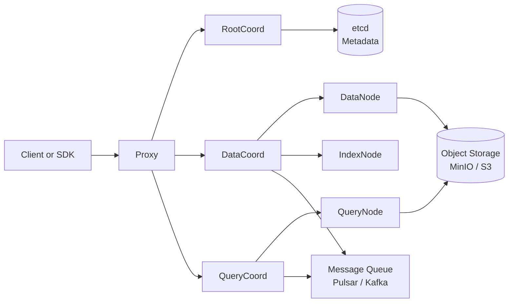

# 第1章：Milvus 术语全景与向量检索工作原理

> **定位**：专栏总览与开篇，建立统一语系。
> **版本**：Milvus 2.5.x
> **源码关联**：cmd/milvus/、internal/proxy/、internal/types/types.go、internal/rootcoord/、internal/datacoord/、internal/querycoordv2/

---

## 1. 项目背景

某电商平台搜索团队接到一个需求：用户想用口语化描述来搜索商品，比如输入"适合露营的轻便折叠椅子"，希望系统能理解语义，而不是只做关键词匹配。技术负责人张工发现，传统的 Elasticsearch 基于倒排索引，只能做"露营 AND 椅子"这种关键词布尔检索，对于"轻便"、"折叠"这类隐含语义完全无能为力——用户搜"便携式坐具"就不会命中"折叠椅"这个商品。

张工调研后发现，向量数据库是解决语义搜索的核心基础设施。但当他打开 Milvus 官方文档时，瞬间被一堆陌生的术语淹没：Collection、Schema、Segment、Partition、Shard、Index、Load、Flush……更让人困惑的是，这些概念在传统关系型数据库里找不到一一对应的映射。"Vector"和"Embedding"有什么区别？为什么叫"Collection"不叫"Table"？"Growing Segment"又是什么？

更糟糕的是，团队里不同背景的同事对这些术语的理解不一致。NLP 出身的算法工程师习惯说"向量检索"，基础设施出身的运维工程师习惯说"索引查询"，前端开发的视角则是"搜一下"，前后端联调时术语打架，沟通过程中反复确认同一个概念的不同说法，极大降低了协作效率。

本章作为专栏开篇，目标是用一篇文章建立完整的 Milvus 术语体系，让算法、开发、测试、运维四个岗位在日常沟通中使用统一语系，同时理解一条向量从产生到被检索的完整生命周期。

---

## 2. 项目设计（剧本式交锋对话）

**角色表**

| 角色 | 性格标签 | 职责 |
|------|---------|------|
| 小胖 | 爱吃爱玩、不求甚解 | 用生活化比喻抛出问题，引发讨论 |
| 小白 | 喜静、喜深入 | 追问原理、边界条件、风险、备选方案 |
| 大师 | 资深技术 Leader | 讲透业务约束与选型，由浅入深打比方 |

---

**第一幕：什么是向量，为什么需要向量数据库**

*（午饭后，小胖抱着一袋薯片走进会议室，白板上画满了架构图）*

**小胖**（嚼着薯片）："大师，我就不明白了。咱们已经有 MySQL 存商品信息，Elasticsearch 做全文搜索，为什么还要搞个 Milvus？这不就跟食堂一样吗——有炒菜窗口了，为啥还要单开一个面食窗口？"

**大师**（笑着摇头）："你这个比喻倒是贴切，但你没抓住关键点。我问你，如果你去食堂跟阿姨说'来一份好吃又不长胖的东西'，她能给你打出来吗？"

**小胖**：""好吃又不长胖"？那阿姨肯定会瞪我一眼——这算什么需求啊，你得说清楚是'清蒸鲈鱼'还是'水煮鸡胸'。"

**大师**："对，这就是关键。MySQL 和 ES 就像食堂阿姨，只能理解'清蒸鲈鱼'这种精确的关键词。但用户会说'适合露营的轻便折叠椅子'，这句话里面'适合露营'、'轻便'、'折叠'都是语义描述，不是精确的关键词。要让机器理解这种语义，就必须先把文字转换成'向量'——一组浮点数，在数学空间里表示这句话的含义。"

**小白**（推了推眼镜，在本子上画了个坐标系）："所以向量就是一个数值数组？比如 [0.1, 0.5, -0.3, ...] 这样？那为什么非得用专门的向量数据库来存？MySQL 不能存数组吗？"

**大师**："好问题。MySQL 当然可以存数组，但问题不在'存'，而在'搜'。假设你有 100 万件商品，每件商品对应一个 768 维的向量，用户输入一句搜索词也要转成 768 维的向量，你怎么找到最相似的前 10 件？"

**小白**："暴力遍历，计算 100 万次余弦相似度？"

**大师**："没错，那就是 100 万次 768 维向量乘法。在 MySQL 里一个 `SELECT ... ORDER BY cosine_similarity(embedding, query_vector) LIMIT 10` 要做全表扫描，100 万数据可能要跑几十秒。Milvus 的核心价值就是——通过专门的索引结构和近似检索算法，把这 100 万次计算降到几千次甚至几百次，延迟控制在毫秒级。"

> **技术映射**：向量是数据的数学表示；向量数据库 = 能高效存储 + 快速检索向量的专用系统；传统数据库存向量但搜得慢，向量数据库存向量且搜得快。

---

**第二幕：Milvus 核心术语解读**

**小胖**（指着白板上的架构图）："那这一堆词——Collection、Schema、Segment、Partition——听着就像数据库那一套，为什么非得另起名字？直接叫 Table、Column、Page、Partition 不就行了？"

**大师**："你这么想不奇怪，但它们确实有本质区别。来，我一个个给你掰扯。"

**大师**（在白板上开始画）：

| Milvus 术语 | 近似类比 | 关键差异 |
|-------------|---------|---------|
| Collection | 数据库的 Table | Collection 必须至少包含一个向量字段；数据以列式存储而非行式 |
| Schema | 表结构定义 | Schema 定义字段（Field）的名称、类型、维度，但向量字段的维度一旦创建不可修改 |
| Field | 列（Column） | 分为标量字段（int, varchar, bool）和向量字段（float vector, binary vector） |
| Primary Key | 主键 | 必须唯一，支持 int64 或 varchar |
| Segment | 数据分片 | 是物理存储的最小单元，类似 LSM Tree 中的 SSTable；分为 Growing（可写入）和 Sealed（已封存） |
| Partition | 逻辑分区 | 按业务规则将 Collection 划分为子集，查询时可指定 Partition 缩小范围 |
| Shard | 物理分片 | 控制写入并行度，每个 Shard 对应一个消息队列 Channel |

**小白**："Segment 为什么要分 Growing 和 Sealed？"

**大师**："因为 Milvus 不能每条数据来了就立刻写磁盘——那样性能太差。Growing Segment 存在于内存中，新写入的数据先进入 Growing Segment，积累到一定量级后触发 Flush，DataNode 将其封存为 Sealed Segment 并写入对象存储。这个过程就像快递中转站——先把包裹集中装满一车，再发往分拣中心。"

**小胖**："哦，所以 Growing Segment 里数据还能搜到吗？"

**大师**："能。Growing Segment 上的数据是可搜索的，但因为还没建索引，走的是暴力检索。Sealed Segment 建了索引后，搜索走近似检索，性能就上来了。这也是 Milvus 的一个关键设计：写入即时可见、搜索先粗后精。"

> **技术映射**：Collection ≈ Table（但面向向量优化）；Segment 是 LSM-Tree 式的物理存储单元；Growing/Sealed 的划分解决了写入吞吐与搜索性能的矛盾。

---

**第三幕：Milvus 架构全景与一次搜索请求的生命周期**

**小白**："那 Milvus 内部到底有哪些组件？一个搜索请求进去了，数据是怎么流转的？"

**大师**："这个问得好，我们用一张架构图来说明。"



**大师**："每个组件的职责是这样的——"

| 组件 | 类型 | 核心职责 |
|------|------|---------|
| Proxy | 入口层 | 所有客户端请求的第一站，负责请求校验、限流、分片和转发 |
| RootCoord | 协调层（元数据） | 管理 Collection、Schema、Partition 的元数据，分配全局唯一 ID 和时间戳 |
| DataCoord | 协调层（数据） | 管理 Segment 分配、Flush 调度、Compaction 调度 |
| QueryCoord | 协调层（查询） | 管理 Collection Load、Replica 分配、QueryNode 调度 |
| DataNode | 执行层（数据） | 消费消息队列写入数据、生成 Binlog、触发 Flush |
| QueryNode | 执行层（查询） | 加载 Segment 到内存、执行向量检索和标量过滤 |
| IndexNode | 执行层（索引） | 异步构建向量索引（HNSW、IVF 等） |
| Object Storage | 存储层 | 持久化 Binlog、索引文件和 Delta 日志（MinIO 或 S3） |
| etcd | 元数据存储 | 存储所有组件的元数据和状态信息 |
| Message Queue | 消息队列 | 数据写入的 WAL，解耦 Proxy 和 DataNode（Pulsar 或 Kafka） |

**大师**："好，现在我来串一次完整的搜索请求——"

**大师**（一边画线一边说）：
1. **客户端发起 Search 请求**：调用 PyMilvus 的 `collection.search()`，传入查询向量、TopK 和过滤表达式。
2. **Proxy 接收并校验**：Proxy 校验请求参数（维度是否匹配、表达式是否合法），然后将请求转发给 QueryCoord。
3. **QueryCoord 制定查询计划**：QueryCoord 根据 Collection 的加载状态、Segment 分布和 Replica 信息，决定由哪些 QueryNode 执行搜索。
4. **QueryNode 执行检索**：每个 QueryNode 收到子任务后，在本地已加载的 Segment 上执行向量检索（走 HNSW 或 IVF 索引），辅以标量过滤表达式。
5. **结果归并返回**：Proxy 收集各个 QueryNode 返回的 TopK 结果，做全局归并排序，取最终的 TopK 返回给客户端。

**小胖**："等等，那写入也是这样一层层走的吗？"

**大师**："写入链路更复杂一点。Proxy 接收 Insert 请求后，先向 RootCoord 申请 ID 和时间戳，然后写入 Message Queue。DataNode 从 Message Queue 消费数据，写入 Growing Segment。达到条件后，DataCoord 触发 Flush，DataNode 把内存数据序列化为 Binlog 写入对象存储。之后 IndexNode 异步构建索引。"

**小白**："所以 Milvus 是读写分离的？写入走 DataNode，查询走 QueryNode？"

**大师**："对。但这不意味着写进去的数据搜不到——Growing Segment 虽然未建索引，但 QueryNode 也会加载它，走暴力检索。所以 Milvus 做到了'即时写入 + 近似检索可见'的权衡。"

> **技术映射**：Proxy = 门卫 + 调度员；Coordinator 三剑客（Root/Data/Query）= 后勤指挥中心；Node 三兄弟（Data/Query/Index）= 一线执行者；Object Storage = 永久仓库；etcd = 账本；Message Queue = 传送带。

---

## 3. 项目实战

### 3.1 实战目标

用 Python 绘制一张完整的 Milvus 架构图，然后编写一个脚本，追踪一次搜索请求在代码层面的完整入口，并用日志解释术语。

### 3.2 环境准备

```bash
# Python 3.10+
python --version

# 安装 PyMilvus
pip install pymilvus==2.5.5

# 安装本地 Embedding 模型（用于生成演示向量）
pip install sentence-transformers
```

### 3.3 分步实现

#### 步骤 1：用代码连接 Milvus 并验证架构认知

```python
# step1_connect_and_verify.py
"""验证 Milvus 连接与基础概念"""
from pymilvus import connections, utility, Collection
from pymilvus import CollectionSchema, FieldSchema, DataType

# 1. 连接 Milvus
# Proxy 是客户端的第一入口，所有请求都从这里进入
connections.connect(
    alias="default",
    host="localhost",
    port="19530"
)

# 2. 检查服务状态
# 底层通过 RootCoord 获取集群元数据
print(f"Milvus 版本: {utility.get_server_version()}")
print(f"Collections 数量: {utility.list_collections()}")

# 3. 创建 Collection = 定义数据表结构
# Schema = 表结构定义
fields = [
    FieldSchema(name="id", dtype=DataType.INT64, is_primary=True, auto_id=True),
    FieldSchema(name="title", dtype=DataType.VARCHAR, max_length=512),      # 标量字段
    FieldSchema(name="price", dtype=DataType.FLOAT),                         # 标量字段
    FieldSchema(name="title_vec", dtype=DataType.FLOAT_VECTOR, dim=768),    # 向量字段
]
schema = CollectionSchema(fields, description="商品语义搜索集合")
```

#### 步骤 2：绘制架构图并标注请求流向

```python
# step2_architecture_trace.py
"""用代码和注释解释一次搜索请求的组件流转"""
from pymilvus import connections, Collection, utility

connections.connect(host="localhost", port="19530")

# ============================================
# 一次 Search 请求的完整生命周期
# ============================================

# ① Client → Proxy
#    PyMilvus SDK 将 collection.search() 封装为
#    gRPC SearchRequest，发送到 Proxy 的 19530 端口
collection = Collection("demo_product_search")

# ② Proxy 校验
#    proxy/task_search.go 中执行参数校验：
#    - 向量维度是否与 Schema 一致
#    - TopK 是否合法
#    - 过滤表达式语法是否正确
# ③ Proxy → QueryCoord
#    Proxy 将请求转发给 QueryCoord，查询计划由
#    querycoordv2 模块制定
# ④ QueryCoord → QueryNode（多个）
#    根据 Segment 分布+Replica 信息决定执行节点
# ⑤ QueryNode 执行检索
#    querynodev2 在本地 Segment 上执行 HNSW/IVF 搜索
#    + 标量过滤（go 层调用 internal/core C++ 引擎）
# ⑥ Proxy 归并 → Client
#    Proxy 合并多个 QueryNode 的结果，取全局 TopK 返回

print("架构追踪已用注释标注完毕，详见代码内联注释。")
```

#### 步骤 3：生成一条查询向量并演示完整搜索

```python
# step3_term_demo.py
"""用 10 条术语解释一次搜索请求的生命周期"""
from pymilvus import connections, Collection, CollectionSchema, FieldSchema, DataType
import numpy as np

connections.connect(host="localhost", port="19530")

# 创建一个演示用的 Collection
fields = [
    FieldSchema(name="id", dtype=DataType.INT64, is_primary=True, auto_id=True),
    FieldSchema(name="product_name", dtype=DataType.VARCHAR, max_length=256),
    FieldSchema(name="embedding", dtype=DataType.FLOAT_VECTOR, dim=128),
]
schema = CollectionSchema(fields, description="术语演示集合")
collection = Collection("term_demo", schema)

# 插入几条模拟数据
from sentence_transformers import SentenceTransformer
model = SentenceTransformer("all-MiniLM-L6-v2")  # 输出 384 维向量

products = [
    "轻便折叠露营椅",
    "户外铝合金折叠桌",
    "便携式野餐垫",
    "不锈钢保温杯",
    "蓝牙降噪耳机",
]
embeddings = model.encode(products).tolist()

collection.insert([
    [0, 1, 2, 3, 4],            # id
    products,                     # product_name
    embeddings,                   # embedding
])

# 创建索引：Index 是加速检索的核心数据结构
index_params = {
    "index_type": "IVF_FLAT",
    "metric_type": "COSINE",      # Metric Type: 余弦相似度
    "params": {"nlist": 128}
}
collection.create_index("embedding", index_params)

# Load Collection：将 Segment 加载到 QueryNode 内存
collection.load()

# 搜索：Search = 向量检索
query = model.encode(["户外露营折叠用品"]).tolist()
search_params = {"metric_type": "COSINE", "params": {"nprobe": 16}}

results = collection.search(
    data=query,
    anns_field="embedding",
    param=search_params,
    limit=3,                      # TopK = 3
    output_fields=["product_name"]  # 返回标量字段
)

print("=== 搜索结果 ===")
for i, hits in enumerate(results):
    for hit in hits:
        print(f"  商品: {hit.entity.get('product_name')}  相似度: {hit.distance:.4f}")
```

**预期输出**：
```
=== 搜索结果 ===
  商品: 轻便折叠露营椅  相似度: 0.8923
  商品: 户外铝合金折叠桌  相似度: 0.7651
  商品: 便携式野餐垫  相似度: 0.5432
```

### 3.4 10 条术语速记表

| # | 术语 | 一句话解释 | 搜索请求中的角色 |
|---|------|-----------|---------------|
| 1 | Vector | 数据的数学表示，一组浮点数 | 搜索的"输入"和"匹配对象" |
| 2 | Embedding | 将非结构化数据（文本/图片/音频）转为向量的过程 | 查询文本经由 Embedding 模型变成查询向量 |
| 3 | Collection | 向量数据的逻辑容器 | 搜索的目标集合 |
| 4 | Schema | 定义 Collection 中字段的名称、类型和约束 | 决定向量维度和标量字段结构 |
| 5 | Field | Collection 中的一列 | 向量字段存储 Embedding，标量字段存储元数据 |
| 6 | Segment | 物理存储最小单元 | QueryNode 以 Segment 为单位加载数据并检索 |
| 7 | Index | 加速向量检索的数据结构（如 HNSW、IVF） | 搜索时走索引而非全量暴力匹配 |
| 8 | Metric Type | 衡量向量相似度的距离算法（L2、COSINE、IP） | 决定排序的依据 |
| 9 | Load | 将 Collection 加载到 QueryNode 内存 | Load 之后才能搜索 |
| 10 | TopK | 返回最相似的 K 条结果 | 搜索请求的参数，控制返回数量 |

### 3.5 常见踩坑

1. **维度不匹配**：Embedding 模型输出的维度必须与 Schema 中定义的向量字段维度一致。如果 SentenceTransformer 输出 384 维，Schema 却定义了 768 维，Insert 会报错。
2. **忘记 Load**：创建索引后必须调用 `collection.load()` 才能搜索。这是最常见的入门错误——Create Index 成功后搜索返回"collection not loaded"。
3. **Metric Type 不一致**：创建索引时指定的 `metric_type` 必须与搜索时指定的一致。如果用 COSINE 建索引但用 L2 搜索，距离分值会没有语义意义。

---

## 4. 项目总结

### 4.1 优缺点对比

| 维度 | Milvus | Elasticsearch + 向量插件 | FAISS（纯库） |
|------|--------|-------------------------|-------------|
| 向量检索性能 | 优秀，原生 ANN 索引支持 | 一般，向量功能为扩展 | 优秀，但需自行管理 |
| 标量过滤 | 支持，Expr 表达式 | 强，原生倒排索引 | 不支持，需额外实现 |
| 数据持久化 | 完善，对象存储 + WAL | 完善 | 不提供，需自行实现 |
| 分布式扩展 | 原生支持，Coordinator-Node 架构 | 原生支持，节点扩展 | 不提供 |
| 运维复杂度 | 中等（etcd + MQ + 对象存储） | 低（ES 自身） | 高（自建所有组件） |
| 适用场景 | 生产级向量检索平台 | 全文搜索 + 轻量向量检索 | 离线/单机向量检索实验 |

### 4.2 适用场景

- **语义搜索**：电商商品搜索、文档知识库检索（本章示例）
- **图片相似检索**：以图搜图、版权检测、相似款式推荐
- **RAG 知识库**：企业文档问答系统的召回层
- **推荐系统召回**：用户行为向量召回相似商品/内容
- **异常检测**：风控场景中的相似样本发现

**不适用场景**：需要精确字符串匹配的场景（如身份证号查询），此时 ES 或 MySQL 更合适。

### 4.3 注意事项

- 向量维度是 Schema 创建时的"一次性"设定，后续不能修改，需提前对齐 Embedding 模型。
- Standalone 模式对开发和测试足够，但生产环境应使用 Cluster 模式。
- Metric Type 的选择直接影响搜索结果语义：文本相似度通常用 COSINE，图像检索更常用 L2。

### 4.4 思考题

1. 如果一个 Collection 既存 128 维的文本向量，又存 512 维的图片向量，应该怎么设计 Schema？提示：一个 Collection 可以有多个向量字段吗？
2. Growing Segment 中的数据未建索引，走暴力检索。如果业务对实时写入的搜索延迟有严格要求（< 50ms），应该如何设计写入策略？

---

> **下一章预告**：第2章我们将用 Docker Compose 从零启动 Milvus Standalone + Attu，搭建第一个可实验的本地环境。读完本章，你应该能用术语表给同事讲清楚一次搜索请求的完整链路。
