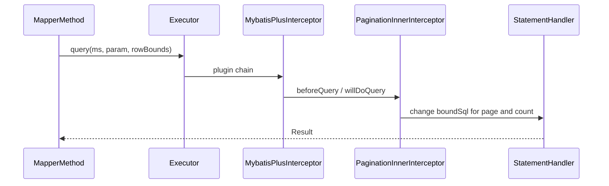

# 第 15 章选修：插件链与分页方言——源码导读提纲

**时长建议**：45～60 分钟（讲师演示 + 学员跟读）  
**前置**：已理解 MyBatis 的 `Interceptor` 与四大对象（Executor / StatementHandler 等）。  
**源码根目录**：与本仓库中 Gradle 工程 `mybatis-plus` 一致（非 `mybatis-plus-samples`）。

---

## 1. 教学目标

1. 说清 **`MybatisPlusInterceptor` 与 `InnerInterceptor` 链**的职责划分。  
2. 跟读 **`PaginationInnerInterceptor`** 如何改写 SQL、如何触发 count。  
3. 了解 **方言 `IDialect`** 的注册与选择入口，建立「换库只换方言」的心智。  
4. 能画出一次分页查询从 `Mapper` 方法到 JDBC 的**粗略调用栈**。

---

## 2. 导读路线（建议打开 IDE 顺序）

### 2.1 外层插件：`MybatisPlusInterceptor`

- **路径**：`mybatis-plus-extension/src/main/java/com/baomidou/mybatisplus/extension/plugins/MybatisPlusInterceptor.java`
- **看点**：
  - `@Intercepts` 挂在哪些 `Signature` 上（`StatementHandler#prepare`、`Executor#query/update` 等）。
  - `intercept` 内如何遍历 `List<InnerInterceptor> interceptors`，把调用委派给内层。
- **讲解话术**：MyBatis 只认一个「大」拦截器；MP 把多种能力拆成 **多个 `InnerInterceptor`**，由 `MybatisPlusInterceptor` 统一接入，**顺序由 Spring 配置里 `addInnerInterceptor` 顺序决定**（租户、分页、乐观锁等谁先谁后很重要）。

### 2.2 内层契约：`InnerInterceptor`

- **路径**：`mybatis-plus-extension/src/main/java/com/baomidou/mybatisplus/extension/plugins/inner/InnerInterceptor.java`
- **看点**：`beforeQuery`、`beforePrepare`、`beforeUpdate` 等钩子与分页、租户的关系。

### 2.3 分页实现：`PaginationInnerInterceptor`

- **路径**（随 jsqlparser 模块版本略有重复，选与你依赖一致的一份即可）：
  - `mybatis-plus-jsqlparser-support/mybatis-plus-jsqlparser/src/main/java/com/baomidou/mybatisplus/extension/plugins/inner/PaginationInnerInterceptor.java`
  - 或 `mybatis-plus-jsqlparser-4.9` / `mybatis-plus-jsqlparser-5.0` 子模块中同名类
- **看点**：
  - 如何识别参数里的 `IPage` / `Page`。
  - 何时生成 count SQL、何时改写 limit/offset（与数据库类型相关）。
  - `DbType` 未显式指定时的推断逻辑（可点到 `JdbcUtils`）。
- **课堂演示**：在 `PaginationTest` 或自写用例上打断点，从 `Mapper.selectPage` 步入拦截器，看 `BoundSql` 前后文本变化。

### 2.4 方言与工厂

- **路径**：`mybatis-plus-extension/src/main/java/com/baomidou/mybatisplus/extension/plugins/pagination/DialectFactory.java`
- **路径**：`.../pagination/dialects/MySqlDialect.java`、`PostgreDialect.java` 等
- **看点**：`IDialect` 如何拼分页语句；多租户、不同版本 Oracle/SQL Server 时分支差异。
- **讲解话术**：业务代码只传 `Page`；**方言隔离数据库分页语法**，避免业务层 if-else。

### 2.5 分页模型

- **路径**：`mybatis-plus-extension/.../plugins/pagination/Page.java`
- **看点**：`searchCount`、orders、`optimizeCountSql` 等与第 5 章课件中的「count 优化」对应。

---

## 3. 建议板书：调用栈示意（Mermaid）

（实际方法名以源码为准，课前讲师应对照当前版本核对。）

---

## 4. 与 `mybatis-plus-samples` 的衔接

| 示例模块 | 作用 |
|----------|------|
| `mybatis-plus-sample-pagination` | 课堂先跑通黑盒，再带源码 |
| `mybatis-plus-sample-performance-analysis` | 观察 SQL 耗时、与分页 count 成本联想 |
| `mybatis-plus-sample-execution-analysis` | 分析执行计划或插件输出（按模块内 README/代码实际为准） |

---

## 5. 课堂提问（检查理解）

1. 若分页插件放在租户插件**之前**，可能出现什么现象？（提示：count 或 limit 未带租户条件）  
2. `PaginationInnerInterceptor(DbType.MYSQL)` 与留空构造在使用上有何区别？  
3. 为什么分页能力实现在 **jsqlparser** 相关模块而不是纯 `core`？（提示：SQL 解析与改写）

---

## 6. 讲师备课自检

- [ ] 本地已能 Debug 进入 `PaginationInnerInterceptor`。  
- [ ] 已准备两种数据库方言对比（如 MySQL `LIMIT` vs Oracle 老版本 ROWNUM）。  
- [ ] 已提醒学员：**插件顺序**、**多数据源每套 SqlSessionFactory 各自注册拦截器**。  

---

## 7. 延伸阅读（不强制课堂讲）

- `TenantLineInnerInterceptor`：与分页 SQL 改写叠加时的顺序案例。  
- `mybatis-plus-core` 中 `TableInfo`、`SqlMethod`：理解 `BaseMapper` 方法名与注入 SQL 的映射。  
- 官方文档「插件」章节与当前大版本 Release Note（行为随版本微调，以源码为准）。
