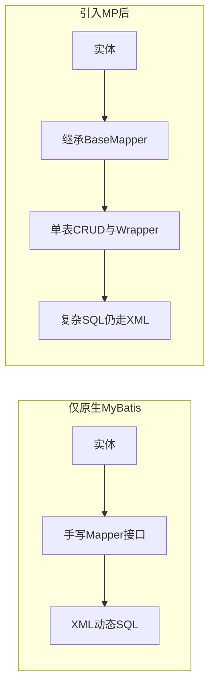

# 第 1 章：从 MyBatis 到 MyBatis-Plus——心智模型与快速上手

示例模块：`mybatis-plus-sample-quickstart`（进阶与排错见第 2 章同模块；可选 Spring MVC 见第 3 章）。

## 1）项目背景

某电商运营后台要做一个「用户列表」接口：按注册时间倒序、支持运营按手机号尾号筛选。表结构已经由 DBA 建好，字段与 Java 驼峰一致，主键为自增或雪花均可。团队里若只用**原生 MyBatis**，常见做法是：为 `sys_user` 再写一套 `SysUserMapper.xml`，里面至少要有 `selectList` 的 `SELECT`、动态 `WHERE`，以及后续订单、优惠券模块里大量类似的单表模板——**复制粘贴多、评审 diff 大、新人还要搞清楚「XML 放哪、namespace 与接口全限定名怎么对齐」**。更麻烦的是，产品每隔两周就加一个筛选条件，动态 SQL 的 `<if>` 越堆越长，可读性下降，还容易在联调阶段才发现字段名与列名不一致。

若不做任何增强，**痛点会集中在三件事**：一是**开发效率**，重复劳动挤占业务 SQL 与索引设计时间；二是**可维护性**，多人协作时同一实体的 CRUD 分散在多处；三是**心智负担**，新人误以为「上了框架就再也不用看 SQL」，反而在复杂场景里硬写难以维护的拼接逻辑。

MyBatis-Plus（MP）的定位是：**在保留 MyBatis 执行模型与生态的前提下**，用 `BaseMapper`、条件构造器、插件（分页、租户等）减少**可预期的单表样板代码**。它不是 Hibernate/JPA 那种全自动 ORM——复杂报表、多表关联、子查询，仍然可以也**应该**回到 XML 或 `@Select` 掌控 SQL。



**本章目标**：能一句话说清 MP 与原生 MyBatis 的分工；本地跑通「Spring Boot + `@MapperScan` + `BaseMapper` + 无 XML 查询」；知道自动配置类大致在哪个依赖里，便于以后对照文档排错。

## 2）项目设计：小胖、小白与大师的对话

**小胖**：这不就跟食堂窗口打饭一样吗？我只要知道「我要什么菜」，为啥还要自己写一张「打饭流程图」？

**大师**：如果只打**固定几样**单菜，窗口确实可以替你盛好——对应单表按主键查、简单条件列表。但如果你要「半份辣、不要葱、再拼两个凉菜」，就得把规则说清楚；对应到系统里就是**复杂条件、多表 join**，不能指望窗口替你猜。

**技术映射**：**单表可模板化 CRUD** ≈ 食堂标准套餐；**报表与多表 SQL** ≈ 定制拼菜，需要显式写 SQL。

---

**小白**：那我们上了 MyBatis-Plus，是不是以后都不用写 SQL 了？

**大师**：**单表**增删改查、常见条件，可以少写大量 XML；但一旦涉及多表、强一致报表、数据库方言特性（如窗口函数），照样写 XML 或注解 SQL，MP 不会拦你，也不该拦你。

**小白**：那跟 JPA 有啥本质区别？

**大师**：MP 底层仍是 **MyBatis 的 Statement + JDBC** 路线：SQL 长什么样，你心里有数；JPA 更偏「对象状态同步」与持久化上下文。团队若强调 **SQL 可审计、可压测、可上 DBA 评审**，MP 通常更顺。

---

**小白**：我实体类没加 `@TableName` 也能查吗？

**大师**：很多项目靠**默认驼峰 + 类名与表名对应**能跑起来；一旦表名带前缀、主键不叫 `id`，就要靠注解或全局策略（见第 4～5 章）。**本章先跑通 quickstart**，再谈规范，避免一上来被配置淹没。

**小白**：边界在哪？有没有「千万别用 MP 干这个」？

**大师**：别把**整页报表 SQL**用 `QueryWrapper` 拼成几百行字符串——可读性和执行计划都难维护。这类场景用 XML + 明确 SQL 更负责任。

**本章金句**：MP 省的是**样板代码**，不是**业务 SQL 与数据建模责任**。

## 3）项目实战

**环境准备**

- JDK 17+（与 samples 默认 Spring Boot 3 一致）；Maven 3.8+。
- 在仓库根目录进入 `mybatis-plus-samples`，默认使用 `spring-boot3` Profile（见根 `pom`）。
- 本章模块：`mybatis-plus-sample-quickstart`，内嵌 H2，`spring.sql.init` 加载 `schema`/`data`。

**步骤 1：确认启动类扫描 Mapper**

目标：让 Spring 管理 Mapper 接口代理。

```7:14:d:\software\workspace\mybatis-plus\mybatis-plus-samples\mybatis-plus-sample-quickstart\src\main\java\com\baomidou\mybatisplus\samples\quickstart\QuickstartApplication.java
@SpringBootApplication
@MapperScan("com.baomidou.mybatisplus.samples.quickstart.mapper")
public class QuickstartApplication {

    public static void main(String[] args) {
        SpringApplication.run(QuickstartApplication.class, args);
    }

}
```

**步骤 2：Mapper 继承 `BaseMapper`**

目标：零 XML 获得 `selectList`、`selectById` 等单表方法。

```1:8:d:\software\workspace\mybatis-plus\mybatis-plus-samples\mybatis-plus-sample-quickstart\src\main\java\com\baomidou\mybatisplus\samples\quickstart\mapper\SysUserMapper.java
package com.baomidou.mybatisplus.samples.quickstart.mapper;

import com.baomidou.mybatisplus.core.mapper.BaseMapper;
import com.baomidou.mybatisplus.samples.quickstart.entity.SysUser;

public interface SysUserMapper extends BaseMapper<SysUser> {

}
```

**步骤 3：用单元测试验收**

目标：验证能查出初始化数据条数（示例为 5 条）。

```12:24:d:\software\workspace\mybatis-plus\mybatis-plus-samples\mybatis-plus-sample-quickstart\src\test\java\com\baomidou\mybatisplus\samples\quickstart\QuickStartTest.java
@SpringBootTest
public class QuickStartTest {
    @Autowired
    private SysUserMapper userMapper;

    @Test
    public void testSelect() {
        System.out.println(("----- selectAll method test ------"));
        List<SysUser> userList = userMapper.selectList(null);
        Assertions.assertEquals(5, userList.size());
        userList.forEach(System.out::println);
    }
}
```

**运行结果（预期）**：控制台打印 `selectAll method test`，随后输出 5 行用户记录；测试通过。

**配置说明**：同模块 `application.yml` 配置数据源与 `spring.sql.init`；无需手写 `mapper-locations` 若当前模块无 XML。

**可能遇到的坑**

| 现象 | 根因 | 处理 |
|------|------|------|
| `Could not autowire SysUserMapper` | `@MapperScan` 包路径未覆盖 Mapper 所在包 | 核对包名与注解 value |
| 查询 0 条或报错表不存在 | H2 未执行 init 或 schema 路径错 | 检查 `spring.sql.init` 与 `schema-h2.sql` |
| 与文档示例不一致 | Boot 2 vs Boot 3、MP 大版本差异 | 使用与团队一致的 Profile 与 BOM |

**验证命令**（在 `mybatis-plus-samples` 根目录）：

```bash
mvn -pl mybatis-plus-sample-quickstart -am test
```

**完整代码清单**：模块路径 `mybatis-plus-samples/mybatis-plus-sample-quickstart/`。

**进阶（讲师可选）**：自动配置入口可参考源码中的 `MybatisPlusAutoConfiguration`（位于 `mybatis-plus-spring-boot3-starter` 模块），用于对照「为何没生效」类问题。

## 4）项目总结

| 优点 | 缺点 / 边界 |
|------|-------------|
| 上手快，单表 CRUD 与团队规范易统一 | 需团队约定「何时用 Wrapper、何时必须写 SQL」 |
| 与现有 MyBatis XML、第三方插件可共存 | 滥用动态条件拼复杂报表会导致难以维护的巨 SQL |
| 保留 MyBatis 透明 SQL 与插件模型 | 不是 JPA 式全自动 ORM，无持久化上下文语义 |

**适用场景**：新业务 Spring Boot 服务；以关系型数据库为主的 CRUD 型接口；需要渐进引入、与遗留 XML 共存。

**不适用场景**：以图数据库 / 文档库为主的数据访问；强依赖 JPA 级联与脏检查的团队规范；希望完全隐藏 SQL 且不接受 SQL 评审的流程。

**注意事项**：`@MapperScan` 与多数据源下每个 `SqlSessionFactory` 的 Mapper 集要一一对应；升级 MP 大版本前阅读 Release Note（拦截器、分页行为可能有调整）。

**常见踩坑（案例化）**

1. **现象**：本地能跑、测试环境报找不到 Mapper。**根因**：`@MapperScan` 漏扫子包或拼写错误。**处理**：用 IDE 全局搜接口全名与扫描路径比对。
2. **现象**：误连错误库或表。**根因**：实体未标 `@TableName` 却与默认推断表名不一致。**处理**：显式注解或统一全局表前缀策略。
3. **现象**：复杂统计接口被 Wrapper 拼成难以 EXPLAIN 的 SQL。**根因**：把 MP 当「万能 SQL 生成器」。**处理**：拆查询、上 XML、加索引与评审。

**思考题**

1. 若同一 JVM 内存在两个数据源，各有一套 Mapper，如何避免「注入错 Mapper」？（答案提示：见第 2 章与多数据源专题。）
2. `BaseMapper` 生成的语句在日志里可见，生产环境如何平衡**排障需要**与**敏感字段脱敏**？（答案提示：日志级别、脱敏组件、按需开启 `p6spy` 等。）

**课后动作**：详见 [LABS_CHECKLIST.md](LABS_CHECKLIST.md) 第 1 章必做实验。
