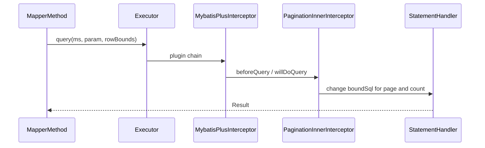

# 第 35 章：插件链与分页方言——源码导读（选修）

**前置知识**：理解 MyBatis `Interceptor` 与四大对象（`Executor`、`StatementHandler` 等）；已完成第 12～13 章分页实战与 [第 32 章](<第 32 章：SQL 日志与性能分析（慢 SQL 意识）.md>) 可观测意识。  
**源码位置**：Gradle 工程 `mybatis-plus`（与本仓库 `mybatis-plus` 目录一致），非 `mybatis-plus-samples`。

## 1）项目背景

在前序章节中，业务侧只传递 `Page` 对象，**分页语法**（`LIMIT`、Oracle ROWNUM、SQL Server `OFFSET FETCH` 等）由框架按数据库类型选择。若仅停留在黑盒，遇到「**租户条件没进 count**」「**换库后分页报错**」等问题时，会无处下断点。源码导读的目的不是背类名，而是建立**调用链**：从 `MapperProxy` 到 **插件链**，再到 **`PaginationInnerInterceptor`** 如何改写 `BoundSql`，最终理解 **「插件顺序」与「方言 `IDialect`」** 在排障中的位置。

**痛点放大**：多插件并存时，**先分页还是先租户**会直接影响 SQL 语义；若团队无人读过内层 `InnerInterceptor` 钩子，只能靠试或搜 issue，成本高且易复发。

**本章目标**：说清 `MybatisPlusInterceptor` 与 `InnerInterceptor` 的分工；能跟读 `PaginationInnerInterceptor` 与 `DialectFactory`；能手绘「一次分页查询」的粗略调用栈；知道 jsqlparser 相关模块与 SQL 改写的关系。

## 2）项目设计：小胖、小白与大师的对话

**小胖**：拦截器不就是 AOP 吗？我加个 `@Around` 行不行？

**大师**：MyBatis 插件挂在 **四大对象**的固定方法上，MP 又把这些能力拆成 **`InnerInterceptor` 链**；自己写 `@Around` 接不住 `BoundSql` 改写那条链，除非你很清楚 MyBatis 插件签名。

**技术映射**：**MybatisPlusInterceptor** ≈ 总机；**InnerInterceptor** ≈ 分机上的业务键。

---

**小白**：为啥租户插件和分页插件顺序错了会出大事？

**大师**：count 和 limit 改写发生在不同钩子；若租户条件应加在**最外层**却排在后面，可能出现 **count 不带租户** 或 **limit 与租户语义不一致**——数据隔离直接翻车。

**小白**：方言类 `MySqlDialect` 和 `PostgreDialect` 我什么时候该点进去看？

**大师**：换库、换驱动、分页报错**语法**时；业务代码应保持只传 `Page`，**不要在业务里 if-else 拼方言**。

**本章金句**：**插件顺序是数据语义的一部分**，不是「能跑就行」的配置细节。

## 3）项目实战

**环境准备**

- 克隆或打开 `mybatis-plus` 源码工程；IDE 全局搜索 `MybatisPlusInterceptor`、`PaginationInnerInterceptor`。
- 样本侧：在 `mybatis-plus-sample-pagination` 的 `PaginationTest#lambdaPagination` 上打断点，**Step Into** 直至进入拦截器（方法名以当前版本为准）。

**步骤 1：外层插件 `MybatisPlusInterceptor`**

目标：阅读 `@Intercepts` 的 `Signature`，理解 `intercept` 如何遍历 `List<InnerInterceptor>`。

**步骤 2：内层 `InnerInterceptor`**

目标：浏览 `beforeQuery`、`beforePrepare` 等钩子与分页、租户文档中的「顺序」说明。

**步骤 3：`PaginationInnerInterceptor`**

目标：找到识别 `IPage`/`Page` 参数的逻辑；区分 **list SQL 改写** 与 **count SQL** 的生成路径；记录 `DbType` 推断相关调用。

**步骤 4：方言 `DialectFactory` 与 `IDialect`**

目标：打开 `DialectFactory`、`MySqlDialect`（或当前库对应实现），理解「换库只换方言」的边界。

**步骤 5：对照板书**

在纸上或 IDE 中画出从 `Mapper.selectPage` 到 JDBC 的序列（可参考下列 mermaid，方法名以源码为准）。

**详细路径、课堂提问与讲师自检**：见 **[CHAPTER_15_SOURCE_DEEP_DIVE.md](CHAPTER_15_SOURCE_DEEP_DIVE.md)**（原第 15 章选修提纲，与本章正文互链）。

**与 samples 衔接**

| 示例模块 | 作用 |
|----------|------|
| `mybatis-plus-sample-pagination` | 先跑通黑盒再带源码 |
| `mybatis-plus-sample-performance-analysis` | 联系 SQL 耗时与 count 成本 |
| `mybatis-plus-sample-execution-analysis` | 理解插件与语句边界 |

**验证方式**：无单测；以本地 Debug 步入 `PaginationInnerInterceptor` 为准。

## 4）项目总结

| 优点 | 缺点 / 边界 |
|------|-------------|
| 排障时知道断点下在哪 | 源码随版本变动，需对照 tag |
| 理解插件顺序与数据安全 | 过度深入易脱离业务交付节奏 |
| 与 DBA、架构对话有共同语言 | 新成员上手曲线陡 |

**适用场景**：中级以上开发、排障与 SQL 治理；升级 MP 大版本前的行为差异分析。

**不适用场景**：尚未掌握基础分页与租户用法的团队——应先完成第 12、21 章。

**注意事项**：jsqlparser 子模块版本与 MP BOM 对齐；多数据源每套 `SqlSessionFactory` **各自**注册拦截器。

**常见踩坑（案例化）**

1. **现象**：分页结果串租户。**根因**：拦截器顺序错误。**处理**：按文档调整 `addInnerInterceptor` 顺序并写集成测试。
2. **现象**：换 PostgreSQL 后分页语法错误。**根因**：`DbType` 未切到 `POSTGRE_SQL`。**处理**：显式方言或修正推断条件。
3. **现象**：Debug 进不去插件。**根因**：走缓存或绕过了插件签名对应的方法。**处理**：对照 `@Intercepts` 与是否启用二级缓存。

**思考题**

1. `PaginationInnerInterceptor(DbType.MYSQL)` 与无参构造在实际运行时的差异是什么？（见 [CHAPTER_15_SOURCE_DEEP_DIVE.md](CHAPTER_15_SOURCE_DEEP_DIVE.md) 第 5 节。）
2. 为什么分页能力放在 **jsqlparser** 相关模块而非仅 `core`？（提示：SQL 解析与改写。）

**课后动作**：完成 [CHAPTER_15_SOURCE_DEEP_DIVE.md](CHAPTER_15_SOURCE_DEEP_DIVE.md) 讲师自检清单；复习 [第 12 章](<第 12 章：分页插件：`Page`、`selectPage` 与注册拦截器.md>)。
