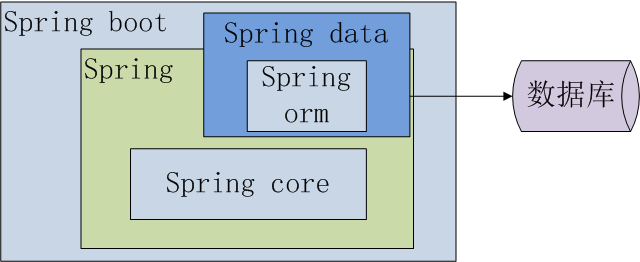

# 0 专栏介绍

[TOC]

## 为什么是Mybatis？

**SSH或者SSM是不是过时了？**

不论是传统的SSH或者SSM，还是现在的主流spring boot或者spring cloud，dubbo等都离不开ORM框架。现代开发者很少去使用jdbc直接操作数据库，而是通过ORM框架。

- SSH通常使用 Struts2为控制器(controller) ，spring 为事务层(service)， hibernate 负责持久层（dao）
- SSM通常使用 springMVC为控制器(controller) ，spring 为事务层(service)， MyBatis 负责持久层（dao）

有人会说，SSH或者SSM不是已经是老黄历了吗？老黄历确实要更新，我们不妨把SSH更新为:

- SSM通常使用 springMVC为控制器(controller) ，spring 为事务层(service)， hibernate 负责持久层（dao)

但还是太老对不对？那我们不妨把spring boot的包裹的外壳脱掉，看看它的核心是什么？

我们最终发现不管是使用JPA(底层是Hibernate，后面章节会专门来讨论JPA和hibenate的关系)，还是mybatis-spring-boot-starter，最终访问数据库的要么是Mybatis，要么是Hibernate，或者Spring jdbc(极少)。

**为什么国内公司首选Mybatis而不是Hibernate？**

工作中使用过JPA(Hibernate)，但我更喜欢Mybatis，主要原因有以下几点：

- Mybatis上手快。国内的产品信奉"快糙猛"，JPA适合业务模型固定的场景，适合比较稳定的需求，淘汰！
- Mybatis简洁易使用。JPA入门简单，因封装太多，要踩的坑太多。淘汰！
- Mybatis卓越的性能。简单的封装，不影响复杂查询的性能，JPA对复杂查询的性能调优支持不够好,淘汰！
- Mybatis排查bug容易。Mybatis写在配置文件或者注解里，出现问题可以随时找到，JPA层层封装，排除问题难度大，淘汰！。

另外还有一些其它好处：

- 对应不满足JDBC规范的遗留老数据库可以方便支持。

- 可以方便的和spring，spring boot，Guice框架集成

- 支持第三方缓存插件

**最熟悉的陌生人--Mybatis**

很多人用了多年的Mybatis，有没有自己的独门绝技？还是碰到问题还是百度第一？我仅仅使用一个金字塔模型来说说使用框架者的水平，不足之处敬请指正。

- 大部分人对工作中用的框架仅仅是使用，仿照别人或者网上的例子按部就班的工作，碰到不懂的问题就去问别人或者网上搜索，得到不同的答案不能分辨哪个是正确的，只能一个个的去尝试，这就是我们常说的CRUDer，一般工作0~3年常见。

- 一小部分人突破了这一层，有一定的技术积累。对常见的问题，能很快根据异常定位到错误原因，能不依赖别人或者网络独立完成工作，我们通常称这部分人为合格的软件工程师，一般工作3~5常见。

- 还有一部分人走的更高，能深入到使用的工具内部原理，积累了一些独门绝技，碰到疑难杂症也可以游刃有余，得心应手。这部分人一般我们常称之为"大神"，一般多见于工作经验5年以上的程序员。

你处于哪个阶段呢？

## 通过本专栏你将获得

- 面试中，从容面对面试官的Mybatis的考验，招数上有攻有守的，不再一味挨打！
- 工作中，Mybatis各种功能集萃，轻松应对业务的各种需求，不需要碰到问题就问人或者尝试网上的各种未经验证的解决方案，提升工作效率，减少996！
- 掌握mybatis的底层原理，即使工作拧螺丝也可以拧出花来。
- 超越Mybatis本身，了解Hibernate，JPA等其它orm框架的本质，理解底层的JDBC协议层。
- 理解Mybatis的设计模式，举一反三，学习其他框架可以得心应手。

## 内容简介

本专栏分六个部分来展开：

第一部分：从一个常见面试问题，引申出mybatis是如何找到sql，并执行的。并把我们常见的orm框架mybatis，hibernate，jpa，Spring jdbcTemplate各做个一个实例，然后进行了对比它们的优缺点。

第二部分：以面试或者工作中碰到的问题为引子，使用实例实现了Mybatis最常使用的功能，让你面试工作两不误！

第三部分：引入了mybatis的一些高级功能，掌握这些你就可以在工作中游刃有余或者面试时给面试官展示一下你的技术深度！

第四部分：针对一些喜欢追根究底的面试官，你也不用紧张，学上几招，来量量他的深度！

第五部分：既然面试要造航母，我们也要搞搞航母的架构原理。

第六部分：学了这么久，要不要下山闯江湖？试试十八罗汉阵吧！

## 适宜人群

适用于0~8年以工作经验的初中高级开发： 
1.有一定的java基础，为了以后工作需要，想要学习Mybatis，不知道如何入手；Say NO! 

2.仅限于mybatis的使用，慢慢变成了所谓的CRUDer，想要提升技术水平但不知如何入手；Say NO! 

3.为了面试需要，艰难困苦的记忆着内部原理，不能消化吸收；Say NO! 

4.想要系统的学习Mybatis，一页一页的翻着mybatis的官方文档，和英文做艰苦卓绝的对抗，最终从入门到放弃；Say NO! 

5.想要探究mybatis源码本身，但无从下手，debug中慢慢迷失方向，忘记初心；Say NO! 

## 讲师介绍

自由工作者，曾任多家互联网公司架构师，一线码农，十余年开发和架构经验。熟悉后端，大数据，数据中台，架构等。
信奉“一天不进步，就是退步”。希望我的专栏能给大家带来帮助，也希望能和大家互相陪伴，在技术问题上谈天说地！

## 讲师头像

