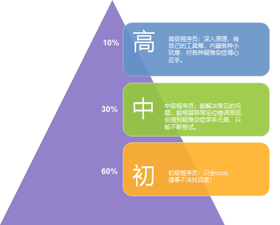
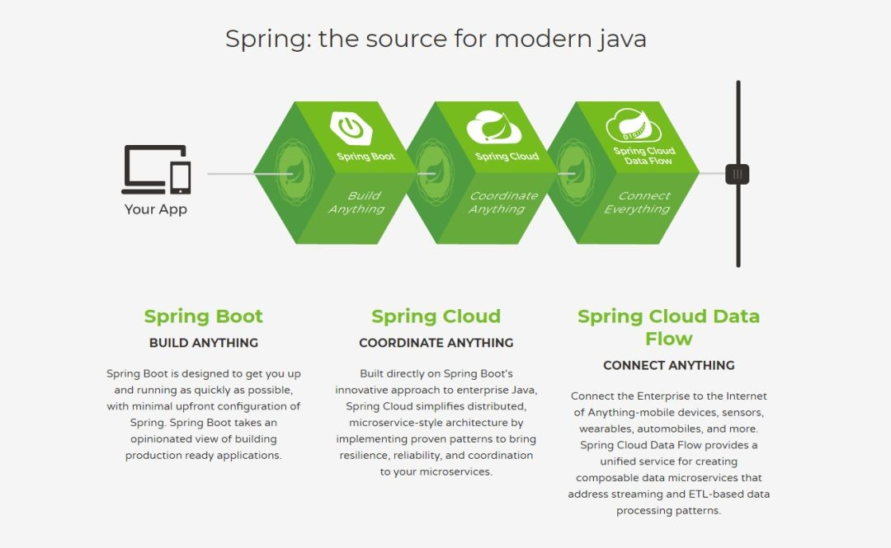

# 开篇词：天下大势，三分天下之SSH到SSM演义

## 背景

  在我的职业生涯中常被问到：1.如何成为某方面的高手？2.如何快速搞定某项技术？3.我现在的水平处于什么阶段？等问题。我暗暗想，我们从小学到中学到大学，经历了大考三六九，小考天天有的无数磨练，难道毕业后我们就失去了学习的能力？一个个框架无非就是一门门学科，只要勤练习，多归纳，没有多少技术难题搞不定。对工作而言或者想要通过面试拿到心仪的offer，经验的归纳也必不可少，本篇专栏就是对Mybatis框架使用经验的总结归纳。

 至于所处技术水平的问题，其实每个公司和个人的判定标准各不相同，无法一概而论。我仅仅使用一个金字塔模型来说说我的理解，不足之处敬请指正。

大部分人对工作中用的框架仅仅是使用，仿照别人或者网上的例子按部就班的工作，碰到不懂的问题就去问别人或者网上搜索，得到不同的答案不能分辨哪个是正确的，只能一个个的去尝试，这就是我们常说的CRUDer，一般工作0~3年常见。

另一小部分人突破了这一层，有一定的技术积累。对常见的问题，能很快根据异常定位到错误原因，能不依赖别人或者网络独立完成工作，我们通常称这部分人为合格的软件工程师，一般工作3~5常见。

还有一部分人走的更高，能深入到使用的工具内部原理，积累了一些独门绝技，碰到疑难杂症也可以游刃有余，得心应手。这部分人一般我们常称之为"大神"，一般多见于工作经验5年以上的程序员。

## Java开发框架到底是SSH还是SSM?

有人会说，现在Java开发框架不是Spring boot或者Spring cloud或者dubbo吗？SSH或者SSM是什么鬼？

- SSH通常使用 Struts2为控制器(controller) ，spring 为事务层(service)， hibernate 负责持久层（dao）
- SSM通常使用 springMVC为控制器(controller) ，spring 为事务层(service)， MyBatis 负责持久层（dao）

我来简单介绍一下Spring，Spring boot，Spring cloud的关系，你就明白：SSM或者SSH是核心，Spring boot或者Spring cloud等都是壳，使用越来越方便，但壳的厚度越来越厚，增加了学习内部原理的难度。

- **Spring:the source for modern java**

Spring 框架是 Spring 的基石，Spring 框架为开发 Java 应用程序提供了全面的基础架构支持。它包含一些很好的功能，如依赖注入和开箱即用的模块，如：Spring JDBC 、Spring MVC 、Spring Security、 Spring AOP 、Spring ORM 、Spring Test，这些模块缩短应用程序的开发时间，提高了应用开发的效率。

- **Spring Boot — Build anything**

Spring Boot 基本上是 Spring 框架的扩展，它消除了设置 Spring 应用程序所需的 XML 配置，为更快，更高效的开发生态系统铺平了道路。

- **Spring Cloud — Coordinate anything**

Spring Cloud 是一系列框架的有序集合。它利用 Spring Boot 的开发便利性巧妙地简化了分布式系统基础设施的开发，如服务发现注册、配置中心、消息总线、负载均衡、断路器、数据监控等，都可以用 Spring Boot 的开发风格做到一键启动和部署。Spring Cloud 并没有重复制造轮子，它只是将各家公司开发的比较成熟、经得起实际考验的服务框架组合起来，通过 Spring Boot 风格进行再封装屏蔽掉了复杂的配置和实现原理，最终给开发者留出了一套简单易懂、易部署和易维护的分布式系统开发工具包。

如果你使用Spring boot时，和数据库的交互使用的是jpa，那么内核就是新型的SSH(Spring，Spring MVC，Hibernate 这个在后面会详细论述)；如果你使用spring boot时，使用了mybatis-spring-boot-starter，那么内核就是SSM.

## Mybatis还是JPA(Hibernate)？

工作中接触过JPA(Hibernate)，但我更喜欢Mybatis，原因有以下几点：

1. JPA适合业务模型固定的场景，适合比较稳定的需求。但是国内这种拥抱变化掩盖下的朝三暮四的需求风格，JPA用起来太累。
2. JPA的技术要求比较高。开始用起里可能觉得非常简单。因封装太多，随着你的深入使用，你会发现这是一个灾难。
3. 方便DB审核和控制。业务复杂的时候，SQL语句可能长的很胖，长的要命。Hibernate很难做sql审核。
4. Mybatis灵活多变，面对日益复杂话的业务场景，Mybatis的灵活性尤为重要。
5. Mybatis简洁而不简单，上手快，易使用。

## 总结

​     "工欲利其事必先利其器",作为我们与数据库交互的一个框架，Mybatis在国内的使用超过了半壁江山，深入理解Mybatis的功能对工作或者面试尤为重要。

​    此专栏是一个Mybatis系列进阶课程，在这篇专栏中我虚拟了一个主人公小白，小白是一个初入职场的程序猿，小白的导师名为扫地僧，是一个沉迷于代码之路的资深架构师，他们工作在一个有快速发展的互联网公司，随着公司业务爆炸式增长，小白从中学到了很多东西。弹指五年间，小白也成了别人眼中的技术大神，然而小白的导师扫地僧就要离开小白所在的部门去过春暖花开，面朝大海的生活。小白想把这五年来的碰到的问题总结归纳一下，因Mybatis简洁而不简单，使用很广而不复杂，从而有了第一篇专栏讲述他mybatis的进阶之路。

​    对于0~8年以上工作经验的初中高级开发： 
1.有一定的java基础，为了以后工作需要，想要学习Mybatis，不知道如何入手；Say NO! 
2.一页一页的翻着mybatis的官方文档，和英文做艰苦卓绝的对抗，最终从入门到放弃；Say NO! 
3.仅限于mybatis的使用，慢慢变成了所谓的CRUDer；Say NO! 
4.想要探究mybatis源码本身，但无从下手，debug中慢慢迷失方向，忘记初心；Say NO! 
5.为了面试需要，艰难困苦的记忆着内部原理，不能消化吸收；Say NO! 

​    此专栏定位于使用Mybatis的经验总结，每一个章节独立成文，章节配套完整的项目实例，既可以作为工作中的功能手册；也适用于通关面试，快速熟悉面试套路，pk面试官。

​    限于水平限制，如果读者有更多案例要补充，请留言联系作者。

