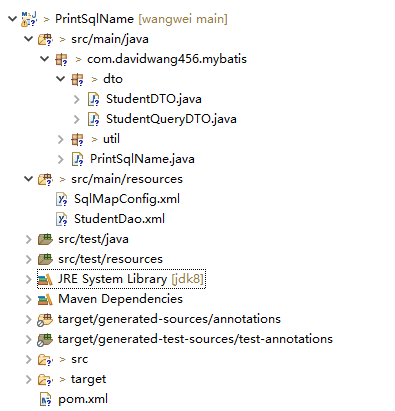

# 1-1 面试之殇--Myatis如何寻找要执行的sql？

## 背景

> 扫地僧：我们在使用Mybatis时，有时候会出现报错如下：Cause: java.lang.IllegalArgumentException: Mapped Statements collection does not contain value for xxx.xxx.xxx.xxx，你通常如何排查这个问题？
>
> 小白：一般情况下，这种情况应该查找配置文件：
>
>      - 先看mapper的命名空间是否为‘xxx.xxx.xxx’。 
>      - 然后看最后的‘xxx’是否有大小写或者别的拼写错误。
>      - 最后看配置文件是否包含了这个mapper 。 
>
> 扫地僧：如果上面的方法都没有发现问题，能否打印出所有的执行的语句Statement的名称进行对比验证呢？
>
> 小白：
>

​	这么多年过去了，小白依然记得来这家公司面试时，扫地僧面试中问到的这个问题。因为这个问题太多次出现在他和他的同事身上。要解决这个问题，就要对mybatis的内部实现比较熟悉。那么就让小白用一个最简单的实例来演示一下当时扫地僧教给他的方式方法吧！

## Mybatis执行XML映射文件实例

### 准备工作

mysql数据库,本实例的版本为:8.0.16

mysql客户端SQLyog(免费，不需要注册码)或者navicat for mysql(收费)

创建数据库www和表

```mysql
CREATE database davidwang456;
use davidwang456;

DROP TABLE IF EXISTS  student;
CREATE TABLE `student` (
  `id` int(11) NOT NULL AUTO_INCREMENT,
  `first_name` varchar(100) DEFAULT NULL,
  `last_name` varchar(100) DEFAULT NULL,
  `age` int(11) DEFAULT NULL,
  PRIMARY KEY (`id`)
) ENGINE=InnoDB DEFAULT CHARSET=utf8mb4;
```

插入测试数据

```sql
INSERT INTO `student` VALUES (1, 'wang1', 'david1', 25);
INSERT INTO `student` VALUES (2, 'wang2', 'david2', 25);
INSERT INTO `student` VALUES (3, 'wang3', 'david3', 25);
INSERT INTO `student` VALUES (4, 'wang4', 'david4', 25);
INSERT INTO `student` VALUES (5, 'wang5', 'david5', 25);
INSERT INTO `student` VALUES (6, 'wang6', 'david6', 25);
INSERT INTO `student` VALUES (7, 'wang7', 'david7', 25);
INSERT INTO `student` VALUES (8, 'wang8', 'david8', 25);
```

### 创建maven项目

完整的项目结构如下：



步骤如下：

**1. 添加mybatis，lombok，connector依赖**

完整pom.xm文件如下

```xml
<project xmlns="http://maven.apache.org/POM/4.0.0" xmlns:xsi="http://www.w3.org/2001/XMLSchema-instance" xsi:schemaLocation="http://maven.apache.org/POM/4.0.0 http://maven.apache.org/xsd/maven-4.0.0.xsd">
  <modelVersion>4.0.0</modelVersion>
  <groupId>com.davidwang456.mybatis</groupId>
  <artifactId>PrintSqlName</artifactId>
  <version>1.0.0-SNAPSHOT</version>
  
  <dependencies>
	<dependency>
	    <groupId>org.mybatis</groupId>
	    <artifactId>mybatis</artifactId>
	    <version>3.5.6</version>
	</dependency>
	<dependency>
	    <groupId>org.projectlombok</groupId>
	    <artifactId>lombok</artifactId>
	    <version>1.18.16</version>
	    <scope>provided</scope>
	</dependency>
    <dependency>
    	<groupId>mysql</groupId>
    	<artifactId>mysql-connector-java</artifactId>
    	<version>8.0.16</version>
	</dependency>		
  </dependencies>
</project>
```

**2. 创建DTO**

实体DTO

```java
package com.davidwang456.mybatis.dto;

import java.io.Serializable;

import lombok.Data;

@Data
public class StudentDTO implements Serializable{
	private static final long serialVersionUID = 1L;
	//字段
	private Integer id;
	private String first_name;
	private String last_name;
	private Integer age;
	@Override
	   public String toString() {
	    return "student [id=" + id + ", first_name=" + first_name
	    		 + ", last_name=" + last_name + ", age=" +age+ ']';
	   }
}
```

查询DTO

```java
package com.davidwang456.mybatis.dto;

import lombok.Data;

@Data
public class StudentQueryDTO {
	//字段
	private Integer id;
	private String firstName;
	private String lastName;
	private Integer age;
	//关键词查询,依据firstName和lastName
	private String keyword;

	private String orderByItem;
	private String orderBy;
}
```

**3. 创建mysql及Student的配置文件**

SqlMapConfig.xml配置文件

```xml
<?xml version = "1.0" encoding = "UTF-8"?>
<!DOCTYPE configuration PUBLIC "-//mybatis.org//DTD Config 3.0//EN" "http://mybatis.org/dtd/mybatis-3-config.dtd">
<configuration>
	<settings>
		<setting name="logImpl" value="JDK_LOGGING"/>
   </settings>
   
   <environments default = "development">
      <environment id = "development">
         <transactionManager type = "JDBC"/> 			
         <dataSource type = "POOLED">
            <property name = "driver" value = "com.mysql.cj.jdbc.Driver"/>
            <property name = "url" value = "jdbc:mysql://localhost:3306/davidwang456?characterEncoding=UTF-8&amp;useSSL=false&amp;useLegacyDatetimeCode=false&amp;serverTimezone=UTC"/>
            <property name = "username" value = "root"/>
            <property name = "password" value = "wangwei456"/>
         </dataSource>           
      </environment>
   </environments>  
   	
    <mappers>
      <mapper resource = "StudentDao.xml"/>
   </mappers> 
  
</configuration>
```

StudentDao.xml配置文件

```xml
<?xml version="1.0" encoding="UTF-8"?>
<!DOCTYPE mapper
        PUBLIC "-//mybatis.org//DTD Mapper 3.0//EN"
        "http://mybatis.org/dtd/mybatis-3-mapper.dtd">
<mapper namespace="com.davidwang456.mybatis.StudentDao">
	<select id="getStudentInfoByCondition" parameterType="com.davidwang456.mybatis.dto.StudentQueryDTO" resultType="com.davidwang456.mybatis.dto.StudentDTO">
	<bind name="condition" value="'%'+keyword+'%'"/>
		select id,
			   first_name ,
			   last_name ,
			   age
			   from student
			   where 1=1 
			   <if test="id!=null">
			   and id=#{id}
			   </if>
			   <if test="keyword!=null and keyword!=''">
			   and 
			   (first_name LIKE #{condition}
			   OR last_name LIKE #{condition}
			   )
			   </if>
			  <if test="age!=null and age!=0">
			   and age=#{age}
			   </if>				   		   
			  <choose>
			  	<when test="orderByItem=='first_name' and orderby='ASC'">
			  	ORDER BY first_name ASC
			  	</when>
			  	<when test="orderByItem=='first_name' and orderby='DESC'">
			  	ORDER BY first_name DESC
			  	</when>
			  	<when test="orderByItem=='last_name' and orderby='ASC'">
			  	ORDER BY last_name ASC
			  	</when>
			  	<when test="orderByItem=='last_name' and orderby='DESC'">
			  	ORDER BY last_name DESC
			  	</when>
			  	<when test="orderByItem=='age' and orderby='ASC'">
			  	ORDER BY age ASC
			  	</when>
			  	<when test="orderByItem=='age' and orderby='DESC'">
			  	ORDER BY age DESC
			  	</when>		  				  
			  </choose>
	</select>
</mapper>
```

测试程序

```java
package com.davidwang456.mybatis;

import java.io.IOException;
import java.io.Reader;
import java.util.List;

import org.apache.ibatis.io.Resources;
import org.apache.ibatis.session.RowBounds;
import org.apache.ibatis.session.SqlSession;
import org.apache.ibatis.session.SqlSessionFactory;
import org.apache.ibatis.session.SqlSessionFactoryBuilder;

import com.davidwang456.mybatis.dto.StudentDTO;
import com.davidwang456.mybatis.dto.StudentQueryDTO;

public class PrintSqlName {
	   public static void main(String args[]) throws IOException{
		      Reader reader = Resources.getResourceAsReader("SqlMapConfig.xml");
		      SqlSessionFactory sqlSessionFactory = new SqlSessionFactoryBuilder().build(reader);		
		      SqlSession session = sqlSessionFactory.openSession();		      
		      StudentQueryDTO param=new StudentQueryDTO();
		      param.setKeyword("david");		
		      RowBounds rbs=new RowBounds(0,5);
		      //1. 全名称的statement
		      //List<StudentDTO> stu=session.selectList("com.davidwang456.mybatis.StudentDao.getStudentInfoByCondition",param,rbs);
		      //2. 简名称的statement
		      List<StudentDTO> stu=session.selectList("getStudentInfoByCondition",param,rbs);
		      System.out.println("--------------record selected:"+stu.size()+"-----------");
		      for(StudentDTO dto:stu) {
		    	  System.out.println(dto.toString());
		      }
		      
		      session.commit(true);
		      session.close();
					
		   }

}
```

第一步：读取xml配置文件。

第二步：创建SqlSessionFactory

第三步：创建SqlSession

第四步：查询数据库不管是使用1. 全名称的statement(带命名空间) 还是使用2.简称的statement(不带命名空间)的结果都是一致的。结果为：

```java
--------------record selected:5-----------
student [id=1, first_name=wang1, last_name=david1, age=25]
student [id=2, first_name=wang2, last_name=david2, age=25]
student [id=3, first_name=wang3, last_name=david3, age=25]
student [id=4, first_name=wang4, last_name=david4, age=25]
student [id=5, first_name=wang5, last_name=david5, age=25]
```

第五步：提交

第六步：关闭session


## 工具类打印statement

为了更容易的查找问题，我们利用外部工具打印出可以执行的statement的名称（见方法1），甚至可以打印出statement执行的sql（见方法2）

```java
package com.davidwang456.mybatis.util;

import org.apache.ibatis.mapping.MappedStatement;
import org.apache.ibatis.session.Configuration;
import org.apache.ibatis.session.SqlSession;

public class MappedStatementUtil {
	//1.打印名称和对象
	public static void printMappedStatementName(SqlSession session) {
	      Configuration config=session.getConfiguration();
	      for(String sta:config.getMappedStatementNames()) {
	    	  System.out.println("id="+sta+",object:"+config.getMappedStatement(sta).toString());	    	 
	      }			
	}
	//2.打印名称和执行的sql
	public static void printMappedSql(SqlSession session,Object parameterObject) {
	      Configuration config=session.getConfiguration();
	      for(String sta:config.getMappedStatementNames()) {
	    	  MappedStatement mappedStatement=config.getMappedStatement(sta);
	    	  System.out.println("id="+sta+",sql"+mappedStatement.getBoundSql(parameterObject).getSql());	    	 
	      }	
	}
}
```

为了验证上面程序的正确性，我们到修改测试程序如下：

```java
package com.davidwang456.mybatis;

import java.io.IOException;
import java.io.Reader;
import java.util.List;

import org.apache.ibatis.io.Resources;
import org.apache.ibatis.session.RowBounds;
import org.apache.ibatis.session.SqlSession;
import org.apache.ibatis.session.SqlSessionFactory;
import org.apache.ibatis.session.SqlSessionFactoryBuilder;

import com.davidwang456.mybatis.dto.StudentDTO;
import com.davidwang456.mybatis.dto.StudentQueryDTO;
import com.davidwang456.mybatis.util.MappedStatementUtil;

public class PrintSqlName {
	   public static void main(String args[]) throws IOException{
		      Reader reader = Resources.getResourceAsReader("SqlMapConfig.xml");
		      SqlSessionFactory sqlSessionFactory = new SqlSessionFactoryBuilder().build(reader);		
		      SqlSession session = sqlSessionFactory.openSession();
		      //打印所有STATEMENT的名称
		      System.out.println("--------------print name and Object------------------");
		      MappedStatementUtil.printMappedStatementName(session);
		      
		      StudentQueryDTO param=new StudentQueryDTO();
		      param.setKeyword("david");		
		      RowBounds rbs=new RowBounds(0,5);
		      //1. 全名称的statement
		      //List<StudentDTO> stu=session.selectList("com.davidwang456.mybatis.StudentDao.getStudentInfoByCondition",param,rbs);
		      //2. 简名称的statement
		      //打印所有STATEMENT的名称及执行的sql，注意：此方法需要传入入参
		      System.out.println("---------------print name and sql---------------------");
		      MappedStatementUtil.printMappedSql(session,param);
		      List<StudentDTO> stu=session.selectList("getStudentInfoByCondition",param,rbs);
		      System.out.println("--------------record selected:"+stu.size()+"-----------");
		      for(StudentDTO dto:stu) {
		    	  System.out.println(dto.toString());
		      }
		      
		      session.commit(true);
		      session.close();
					
		   }

}
```

此时控制台打印出结果如下：

```java
--------------print name and Object------------------
id=com.davidwang456.mybatis.StudentDao.getStudentInfoByCondition,object:org.apache.ibatis.mapping.MappedStatement@59a6e353
id=getStudentInfoByCondition,object:org.apache.ibatis.mapping.MappedStatement@59a6e353
---------------print name and sql---------------------
id=com.davidwang456.mybatis.StudentDao.getStudentInfoByCondition,sqlselect id,
			   first_name ,
			   last_name ,
			   age
			   from student
			   where 1=1 
			   and 
			   (first_name LIKE ?
			   OR last_name LIKE ?
			   )
			  	ORDER BY first_name ASC
			  	
id=getStudentInfoByCondition,sqlselect id,
			   first_name ,
			   last_name ,
			   age
			   from student
			   where 1=1 
			   and 
			   (first_name LIKE ?
			   OR last_name LIKE ?
			   )
			  	ORDER BY first_name ASC
--------------record selected:5-----------
student [id=1, first_name=wang1, last_name=david1, age=25]
student [id=2, first_name=wang2, last_name=david2, age=25]
student [id=3, first_name=wang3, last_name=david3, age=25]
student [id=4, first_name=wang4, last_name=david4, age=25]
student [id=5, first_name=wang5, last_name=david5, age=25]
```

从结果看：

1. id=com.davidwang456.mybatis.StudentDao.getStudentInfoByCondition和id=getStudentInfoByCondition的Statement两个Statement指向同一个对象，即两个为同一个东西，这回答了为什么使用两个Statement，执行结果一致。
2. id=com.davidwang456.mybatis.StudentDao.getStudentInfoByCondition和id=getStudentInfoByCondition的Statement两个Statement的执行sql也是一样，也验证了使用两个Statement，执行结果一致。

这是什么原因呢？


根据官方的文档的介绍，在之前版本的 MyBatis 中，**命名空间（Namespaces）**的作用并不大，是可选的。 但现在，随着命名空间越发重要，**必须指定命名空间**。命名空间的作用有两个，一个是利用更长的全限定名来将不同的语句隔离开来，同时也实现了你上面见到的接口绑定。就算你觉得暂时用不到接口绑定，你也应该遵循这里的规定，以防哪天你改变了主意。 长远来看，只要将命名空间置于合适的 Java 包命名空间之中，你的代码会变得更加整洁，也有利于你更方便地使用 MyBatis。

注意：有人说，在配置中使用配置也可以打印出执行sql：

```xml
	<settings>
		<setting name="logImpl" value="STDOUT_LOGGING"/>
   </settings>
```

此时打印sql如下：

```tex
Opening JDBC Connection
Created connection 1881129850.
Setting autocommit to false on JDBC Connection [com.mysql.cj.jdbc.ConnectionImpl@701fc37a]
==>  Preparing: select id, first_name , last_name , age from student where 1=1 and (first_name LIKE ? OR last_name LIKE ? ) ORDER BY first_name ASC
==> Parameters: %david%(String), %david%(String)
<==    Columns: id, first_name, last_name, age
<==        Row: 1, wang1, david1, 25
<==        Row: 2, wang2, david2, 25
<==        Row: 3, wang3, david3, 25
<==        Row: 4, wang4, david4, 25
<==        Row: 5, wang5, david5, 25
--------------record selected:5-----------
student [id=1, first_name=wang1, last_name=david1, age=25]
student [id=2, first_name=wang2, last_name=david2, age=25]
student [id=3, first_name=wang3, last_name=david3, age=25]
student [id=4, first_name=wang4, last_name=david4, age=25]
student [id=5, first_name=wang5, last_name=david5, age=25]
Committing JDBC Connection [com.mysql.cj.jdbc.ConnectionImpl@701fc37a]
Resetting autocommit to true on JDBC Connection [com.mysql.cj.jdbc.ConnectionImpl@701fc37a]
Closing JDBC Connection [com.mysql.cj.jdbc.ConnectionImpl@701fc37a]
Returned connection 1881129850 to pool.
```

此时，打印的是执行sql及其参数，但并没有打印statement的名称，对排查名称其实没有足够的帮助。

## MappedStatementUtil打印statement内部实现原理

从上面的示例可以总结Mybatis执行程序的步骤：

- Resources读取配置文件，到字节流Reader；
- SqlSessionFactoryBuilder根据字节流Reader，构建SqlSessionFactory；
- SqlSessionFactory打开SqlSession，供sql执行使用；
- SqlSession会话执行增删改查数据库操作。

其中SqlSession的默认实现DefaultSqlSession包含了配置文件的内容的对象Configuration，Configuration是Mybatis的一个核心类，它包罗万象，包含了我们使用SqlSession会话执行增删改查数据库操作的所需的属性，如：入参parameterMaps，出参resultMaps，执行的sql对象MappedStatement，所以我们才可以通过自定义的MappedStatementUtil方法打印出我们所想要的。下面是Configuration常用的方法：

```java
  public void addInterceptor(Interceptor interceptor) {
    interceptorChain.addInterceptor(interceptor);
  }

  public void addMappers(String packageName) {
    mapperRegistry.addMappers(packageName);
  }

  public Collection<ParameterMap> getParameterMaps() {
    return parameterMaps.values();
  }

  public Collection<MappedStatement> getMappedStatements() {
    buildAllStatements();
    return mappedStatements.values();
  }

  public MappedStatement getMappedStatement(String id) {
    return this.getMappedStatement(id, true);
  }

  public Collection<Cache> getCaches() {
    return caches.values();
  }
```


## 总结

通过上面的示例，我们复习了Mybatis的运行流程，运用了一些重要的类：

- Resources：工具类，它包含一些实用方法，使得从类路径或其它位置加载资源文件更加容易；

- Reader：字节流实例，也可以使用任意的输入流（InputStream）实例；

- SqlSessionFactoryBuilder：创建SqlSessionFactory实例；

- SqlSessionFactory：创建SqlSession实例；

- SqlSession：类似于JDBC中的Connection.负责应用程序与持久层之间执行交互操作；

- Configuration：包含数据源、事务、mapper文件资源以及影响数据库行为属性的各种设置settings；

- MappedStatement：维护了一条<select|update|delete|insert>节点的封装。

**涉及到的知识点**

- 逻辑分页查询RowBounds
- 模糊查询/关键字查询
- 动态排序
- if判断
- choose....when判断

这些知识点会在后续章节进行深入阐述，本文暂时不深究。