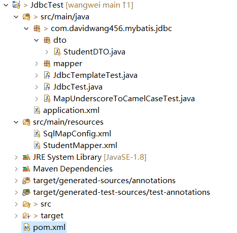

# Jdbc不香吗？聊聊spring jdbcTemplate吧？

## 背景

> 小白刚入公司时，领导指定小白的师傅为扫地僧。在介绍公司内部框架时，小白提出了自己的疑问：
>
> 小白：师傅，数据库操作，JDBC用着挺好的，为什么非要使用mybatis，hibernate，Spring jdbcTemplate这些框架，这样会不会导致新手入门门槛变高？
>
> 扫地僧：如果你想要变成一个整天忙的脚不沾地，四处救火的程序员，那你可以选择直接使用JDBC，如果你只想专注于业务开发,那么像Mybatis这些框架，可以帮我们把脏活累活帮我们处理好.事实胜于雄辩。下面，我来演示一个使用jdbc访问mysql数据库的示例，你来看看如果变成线上的项目，有什么地方值得改进？


## Jdbc不香吗？

### 准备工作

mysql数据库,本实例的版本为:8.0.16

mysql客户端SQLyog(免费，不需要注册码)或者navicat for mysql

创建数据库www和表

```java
CREATE database davidwang456;
use davidwang456;

DROP TABLE IF EXISTS  student;
CREATE TABLE `student` (
  `id` int(11) NOT NULL AUTO_INCREMENT,
  `first_name` varchar(100) DEFAULT NULL,
  `last_name` varchar(100) DEFAULT NULL,
  `age` int(11) DEFAULT NULL,
  PRIMARY KEY (`id`)
) ENGINE=InnoDB DEFAULT CHARSET=utf8mb4;
```

mock数据

```sql
INSERT INTO `student` VALUES (1, 'wang1', 'david1', 25);
INSERT INTO `student` VALUES (2, 'wang2', 'david2', 25);
INSERT INTO `student` VALUES (3, 'wang3', 'david3', 25);
INSERT INTO `student` VALUES (4, 'wang4', 'david4', 25);
INSERT INTO `student` VALUES (5, 'wang5', 'david5', 25);
INSERT INTO `student` VALUES (6, 'wang6', 'david6', 25);
INSERT INTO `student` VALUES (7, 'wang7', 'david7', 25);
INSERT INTO `student` VALUES (8, 'wang8', 'david8', 25);
```

### 创建maven项目

完整的项目结构



#### 添加依赖

完整依赖文件pom.xml(包含了后面用到的spring jdbcTemplate依赖相关)

    <project xmlns="http://maven.apache.org/POM/4.0.0" xmlns:xsi="http://www.w3.org/2001/XMLSchema-instance" xsi:schemaLocation="http://maven.apache.org/POM/4.0.0 http://maven.apache.org/xsd/maven-4.0.0.xsd">
      <modelVersion>4.0.0</modelVersion>
      <groupId>com.davidwang45.mybatis</groupId>
      <artifactId>JdbcTest</artifactId>
      <properties>
        <project.build.sourceEncoding>UTF-8</project.build.sourceEncoding>
        <maven.compiler.source>1.8</maven.compiler.source>
        <maven.compiler.target>1.8</maven.compiler.target>
      </properties>
      <version>1.2.0-SNAPSHOT</version>
        <dependencies>
    	<dependency>
    	    <groupId>org.mybatis</groupId>
    	    <artifactId>mybatis</artifactId>
    	    <version>3.5.6</version>
    	</dependency>
    	<dependency>
    	    <groupId>org.projectlombok</groupId>
    	    <artifactId>lombok</artifactId>
    	    <version>1.18.16</version>
    	    <scope>provided</scope>
    	</dependency>
        <dependency>
        	<groupId>mysql</groupId>
        	<artifactId>mysql-connector-java</artifactId>
        	<version>8.0.16</version>
    	</dependency>	
    	<dependency>
    	    <groupId>org.springframework</groupId>
    	    <artifactId>spring-core</artifactId>
    	    <version>5.2.9.RELEASE</version>
    	</dependency>
    	<dependency>
    	    <groupId>org.springframework</groupId>
    	    <artifactId>spring-beans</artifactId>
    	    <version>5.2.9.RELEASE</version>
    	</dependency>
    	<dependency>
    	    <groupId>org.springframework</groupId>
    	    <artifactId>spring-context</artifactId>
    	    <version>5.2.9.RELEASE</version>
    	</dependency>
    	<dependency>
    	    <groupId>org.springframework</groupId>
    	    <artifactId>spring-jdbc</artifactId>
    	    <version>5.2.9.RELEASE</version>
    	</dependency>
    	
      </dependencies>
    </project>
#### 测试程序

使用JDBC操作数据库的基本步骤大致相同：

- 加载（注册）数据库驱动（到JVM）。

- 建立（获取）数据库连接。

- 定义操作的SQL语句,实例化PreparedStatement对象,设置入参。

- 执行数据库操作。

- 获取并操作结果集。

- 关闭对象，回收数据库资源（关闭结果集-->关闭数据库操作对象-->关闭连接）

```java
import java.sql.Connection;
import java.sql.DriverManager;
import java.sql.PreparedStatement;
import java.sql.ResultSet;
import java.sql.SQLException;
import java.sql.Statement;

public class JdbcTest {
    // MySQL 8.0 以下版本 - JDBC 驱动名及数据库 URL
    //static final String JDBC_DRIVER = "com.mysql.jdbc.Driver";  
   // static final String DB_URL = "jdbc:mysql://localhost:3306/davidwang456";
 
    // MySQL 8.0 以上版本 - JDBC 驱动名及数据库 URL
    static final String JDBC_DRIVER = "com.mysql.cj.jdbc.Driver";  
    static final String DB_URL = "jdbc:mysql://localhost:3306/davidwang456?characterEncoding=UTF-8&useSSL=false&useLegacyDatetimeCode=false&serverTimezone=UTC";
 
 
    // 数据库的用户名与密码，需要根据自己的设置
    static final String USER = "root";
    static final String PASS = "wangwei456";

    public static void main(String[] args) {
        Connection conn = null;
        PreparedStatement preparedStatement = null;
        ResultSet rs=null;
        String sql="";
        try{
            //1 注册 JDBC 驱动
            Class.forName(JDBC_DRIVER);
        
            //2 打开链接
            System.out.println("连接数据库...");
            conn = DriverManager.getConnection(DB_URL,USER,PASS);
            
            //3 定义操作的SQL语句,实例化PreparedStatement对象,设置入参           
            sql = "SELECT id, first_name, last_name,age FROM student where id = ?";
            System.out.println(" 实例化PreparedStatement对象...");
            preparedStatement = conn.prepareStatement(sql);
            preparedStatement.setInt(1, 5);

            
            //4 执行数据库操作
            rs = preparedStatement.executeQuery();
        
            //5 获取并操作结果集
            while(rs.next()){
                // 通过字段检索
                int id  = rs.getInt("id");
                String first_name = rs.getString("first_name");
                String last_name = rs.getString("last_name");
                int age=rs.getInt("age");
    
                //输出数据
                System.out.println("[ID: " + id+",first_name:"+first_name+",last_name:"+last_name+",age:"+age+"]");
            }
            //6 完成后关闭
            // 关闭资源
            shutdownResource(conn,preparedStatement,rs);
        }catch(SQLException se){
            // 处理 JDBC 错误
            se.printStackTrace();
        }catch(Exception e){
            // 处理 Class.forName 错误
            e.printStackTrace();
        }finally{
        	shutdownResource(conn,preparedStatement,rs);
        }
    }
    
    public static void shutdownResource(Connection conn,Statement stmt,ResultSet rs) {
        // 关闭资源
    	try {
    		if(rs!=null) {
    			rs.close();
    		}
    	}catch(SQLException se1){
    		//TODO
    	}
    	
        try{
            if(stmt!=null) stmt.close();
        }catch(SQLException se2){
        	//TODO
        }
        
        try{
            if(conn!=null) conn.close();
        }catch(SQLException se){
            //TODO
        }
    }

}
```

运行结果

```java
连接数据库...
 实例化PreparedStatement对象...
[ID: 5,first_name:wang5,last_name:david5,age:25]
```

获取结果符合预期。

> 小白：线上系统使用jdbc时，因为使用jdbc的地方非常多，资源的释放很容易忘记，导致数据库资源不能释放，浪费数据库的性能。
>
> 扫地僧：确实如此，当我们注释掉上面的释放资源代码时，可以根据一些sql命令来查询mysql的连接,在navica客  	户端上执行：
>
> - 查看连接线程建立连接情况，数据如下：
>
> ```mysql
> show status like 'Threads%';
> ​	variable_name    value
> ​	Threads_cached	1
> ​	Threads_connected	4
> ​	Threads_created	5
> ​	Threads_running	2
> ```
>
> - 查看具体的连接线程
>
> ```mysql
> SHOW PROCESSLIST;
> ​	ID,USER,HOST,DB,COMMAND,TIME,STATE,INFO
> 
> ​	4	event_scheduler	localhost		Daemon	7230	Waiting on empty queue	
> ​	22	root	localhost:6717		Sleep	1864		
> ​	23	root	localhost:6719	davidwang456	Sleep	1863		
> ​	24	root	localhost:6720	davidwang456	Sleep	1857		
> ​	25	root	localhost:6721	davidwang456	Query	0	starting	SHOW PROCESSLIST
> ```
>
> - 杀掉连接数，使用kill命令
>
> ​    示例：
>
> ```mysql
>    kill 23
> ```
>
> 扫地僧：还会其它的问题吗？
>
> 小白：分页时，使用JDBC会碰到要根据数据库的类型，写不同的sql，如mysql使用limit，oracle使用rownum进行分页,即不同类型数据库要写不同的实现。
>
> 扫地僧：除了上面的问题，还有：1. sql会分散到项目中的不同地方，难以管理 ； 2. 动态sql语句生产容易产生sql注入问题；  3. 如果想要高性能，需要自己实现一级甚至二级缓存；4. 代码量会增大，从而导致出bug的概率增大；5. 事务管理也需要开发者操心等等问题，这就导致了一些ORM框架的产生，比较流行的就有Hibernate，Mybatis，JPA，Spring Jdbc。现在来看，jdbc还香吗？
>
> 小白：我听说，最早流行的开发框架是S(Spring)S(Struts)H(Hibernate),后面流行S(Spring)S(Spring mvc)M(Mybatis),现在流行Spring boot和Spring Cloud微服务，甚至Service Mesh等框架了。那我们为什么选择Mybatis而不是Spring 自带的Spring jdbc呢？这样变成S(Spring)S(Spring mvc)S(Spring jdbc)全家桶岂不是更好？
>
> 扫地僧：好，那我们今天先讨论一下Spring Jdbc的优缺点吧？Mybatis，Hibernate，jpa留待我们以后讨论。


## Spring JdbcTemplate

JdbcTemplate采用了模板方法的设计思想，和RowMapper配合，简化了jdbc访问。看下面的示例，

接着上面的项目：

### 添加依赖

注意上面pom.xml对spring依赖：

```xml
	<dependency>
	    <groupId>org.springframework</groupId>
	    <artifactId>spring-core</artifactId>
	    <version>5.2.9.RELEASE</version>
	</dependency>
	<dependency>
	    <groupId>org.springframework</groupId>
	    <artifactId>spring-beans</artifactId>
	    <version>5.2.9.RELEASE</version>
	</dependency>
	<dependency>
	    <groupId>org.springframework</groupId>
	    <artifactId>spring-context</artifactId>
	    <version>5.2.9.RELEASE</version>
	</dependency>
	<dependency>
	    <groupId>org.springframework</groupId>
	    <artifactId>spring-jdbc</artifactId>
	    <version>5.2.9.RELEASE</version>
	</dependency>
```

### 配置JdbcTemplate

```xml
<?xml version = "1.0" encoding = "UTF-8"?>
<beans xmlns = "http://www.springframework.org/schema/beans"
   xmlns:xsi = "http://www.w3.org/2001/XMLSchema-instance" 
   xsi:schemaLocation = "http://www.springframework.org/schema/beans
   http://www.springframework.org/schema/beans/spring-beans-3.0.xsd ">

   <!-- Initialization for data source -->
   <bean id="dataSource" 
      class = "org.springframework.jdbc.datasource.DriverManagerDataSource">
          <property name = "driverClassName" value = "com.mysql.cj.jdbc.Driver"/>
          <property name = "url" value = "jdbc:mysql://localhost:3306/davidwang456?characterEncoding=UTF-8&amp;useSSL=false&amp;useLegacyDatetimeCode=false&amp;serverTimezone=UTC"/>
          <property name = "username" value = "root"/>
          <property name = "password" value = "wangwei456"/>
   </bean>

   <!-- Definition for studentJDBCTemplate bean -->
   <bean id="jdbcTemplate" 
      class = "org.springframework.jdbc.core.JdbcTemplate">
      <property name = "dataSource" ref = "dataSource" />    
   </bean>
   
</beans>
```

### 测试程序

实体类，增加了create方法：

```java
import java.io.Serializable;

import lombok.Data;

@Data
public class StudentDTO implements Serializable{
	private static final long serialVersionUID = 1L;
	private Integer id;
	private String first_name;
	private String last_name;
	private Integer age;
	@Override
	public String toString() {
		return this.id+","+this.first_name+","+this.last_name+","+age;
	}
	
	public static StudentDTO create(String first_name,String last_name,Integer age) {
		StudentDTO dto=new StudentDTO();
		dto.setAge(age);
		dto.setFirst_name(first_name);
		dto.setLast_name(last_name);
		return dto;
	}
}
```

测试类：

```java
import java.sql.ResultSet;
import java.sql.SQLException;
import java.util.Arrays;
import java.util.List;

import javax.sql.DataSource;

import org.springframework.context.ApplicationContext;
import org.springframework.context.support.ClassPathXmlApplicationContext;
import org.springframework.jdbc.core.RowMapper;
import org.springframework.jdbc.core.namedparam.MapSqlParameterSource;
import org.springframework.jdbc.core.namedparam.NamedParameterJdbcTemplate;

public class JdbcTemplateTest {

	public static void main(String[] args) {
		queryBatch();
	}
	
	public static void queryBatch() {
        List<Integer> ids = Arrays.asList(5, 6, 8);

        MapSqlParameterSource parameters = new MapSqlParameterSource();
        parameters.addValue("ids", ids);
		ApplicationContext context = new ClassPathXmlApplicationContext("application.xml");
		DataSource dataSource=(DataSource) context.getBean("dataSource");
		NamedParameterJdbcTemplate jdbcTemplate = new NamedParameterJdbcTemplate(dataSource);
		
        List<StudentDTO> list = jdbcTemplate.query("SELECT id,first_name,last_name,age FROM student WHERE id IN (:ids)",
                parameters, new RowMapper<StudentDTO>() {
                    @Override
                    public StudentDTO mapRow(ResultSet resultSet, int i) throws SQLException {  
                    	StudentDTO stu=StudentDTO.create(resultSet.getString("first_name"), resultSet.getString("last_name"), resultSet.getInt("age"));
                    	stu.setId(resultSet.getInt("id"));
                    	return stu;
                    }
                });

        list.stream().forEach(System.out::println);
	}

}
```

运行结果如下：

```java
5,wang5,david5,25
6,wang6,david6,25
8,wang8,david8,25
```

从上面的示例可以看到JdbcTemplate解决了单纯使用JDBC而出现的大部分问题：

- 资源的获取与释放

- 支持不同类型的数据库，分页也可以通过spring-data的Pageable与Page实现。

-  事务管理也不需要开发者操心
- 代码量会减少，同时减少bug的概率；

但同时存在如下问题：

- sql会分散到项目中的不同地方，难以管理 ；
- 动态sql语句生产容易产生sql注入问题；
- 如果想要高性能，需要自己实现一级甚至二级缓存；
- 和Spring深度耦合，必须于Spring框架结合在一起使用。

而Mybatis，Hibernate，JPA都能解决上面的问题，故我们的选择不是Spring Jdbc。

## 总结

> 扫地僧：通过上面两个简单的示例，我们可以看出单纯使用jdbc和spring jdbcTemplate对复杂的生产环境来说，并不适用。特别重要的两点是：sql会分散到项目中的不同地方，难以管理；如果想要高性能，需要自己实现一级甚至二级缓存；它们对项目的管理和性能尤为重要。
>
> 小白：是不是意味着如果是演示类的项目，或者非常简单的项目，则可以使用jdbc或者Spring jdbcTemplate？例如使用jdbc时，可以将jdbc的公共代码抽取出来，组成一个JdbcUtil工具类，将执行的sql都封装成常量放到同一个文件(静态sql)，通过调用jdbcUtil来执行，可以避免很多问题。
>
> 扫地僧：是的，对于一些临时项目或者短期项目，为了快速实现，可以选择jdbc来做。
>
> 扫地僧：最后一点，也是我最想告诉 你的是，开发时总会觉得规范这种东西离我们很远，但这些规范恰恰从根本上解决了我们的绝大部分问题，熟悉这些规范可以让我们在开发的路上走的更远，效率更高。JDBC规范的最新版本为**JDBC 4.3 Specification** ,地址为：https://jcp.org/aboutJava/communityprocess/mrel/jsr221/index3.html，如果想要走的更远，请下载下来，一定要仔细研读一番它. 

