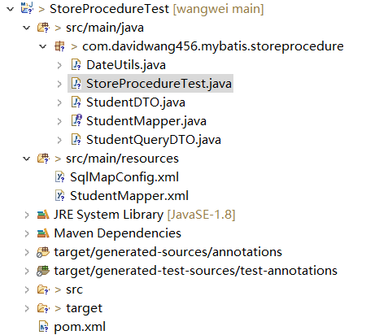

# 什么情况下要用到存储过程？mybatis支持不支持调用存储过程?

## 背景

> 小白：《阿里巴巴Java开发手册》是这样规定的：【强制】禁止使用存储过程，存储过程难以调试和扩展，更没有移植性。为什么阿里巴巴要禁止存储过程呢？
>
> 扫地僧：这个是针对互联网公司的业务特点来决定的，互联网公司的特点：单次请求涉及数据少，数据关系简单，但是更新频率高；工程的迭代速率高，数据关系随时可能扩展修改。有些行业数据库压力并不大，为了效率，则重度使用存储过程来完成业务。
>
> 小白：那存储过程到底适用于哪些场景，不适用哪些场景？能否举个例子让我明白呢
>
> 扫地僧：假设我们想要mock 1000w数据用来做性能测试，通常的做法是批量插入用来减少网络开销，按照每批次1000个数据来说，1000kw记录数需要调用1w次；如果我们将插入到数据库的1000w条记录的业务写成存储过程，则只要调用1次即只有一次网络开销即可插入所有数据。执行效率大大提升了。但存储过程也存在明显的缺点：不易调试，不同数据库的存储过程不能移植的。
>
> 小白：那我们使用的Mybatis支持存储过程调用吗？
>
> 扫地僧：Mybatis作为框架，肯定时支持存储过程调用的，那么怎么调用呢？我们来看一个实例吧！

## Mybatis调用存储过程实例

### 数据准备

```mysql
DROP TABLE IF EXISTS  student;
CREATE TABLE `student` (
  `id` INT(11) NOT NULL AUTO_INCREMENT,
  `first_name` VARCHAR(100) DEFAULT NULL,
  `last_name` VARCHAR(100) DEFAULT NULL,
  `age` INT(11) DEFAULT NULL,
  `create_time` TIMESTAMP NOT NULL DEFAULT CURRENT_TIMESTAMP,
  `update_time` TIMESTAMP NOT NULL DEFAULT CURRENT_TIMESTAMP ON UPDATE CURRENT_TIMESTAMP,
  PRIMARY KEY (`id`)
) ENGINE=INNODB DEFAULT CHARSET=utf8mb4;

INSERT INTO student(first_name,last_name,age) VALUES('david','wang123',20);
INSERT INTO student(first_name,last_name,age) VALUES('david','wang456',30);

SELECT * FROM student;
```

数据如下：

```tex
    id  first_name  last_name     age          create_time          update_time  
------  ----------  ---------  ------  -------------------  ---------------------
     1  david       wang123        20  2021-02-16 18:28:36    2021-02-16 18:28:36
     2  david       wang456        30  2021-02-16 18:28:36    2021-02-16 18:28:36
```

创建存储过程语句

```mysql
DELIMITER $
CREATE PROCEDURE getStudentInfoById(IN u_id INTEGER)
BEGIN
    		SELECT id,
			   first_name ,
			   last_name ,
			   age,
			   create_time,
			   update_time
			   FROM student
			   WHERE id=u_id; 
END $
```

调用存储过程，验证结果

```mysql
CALL getStudentInfoById(1);
```

结果如下：

```tex
    id  first_name  last_name     age          create_time          update_time  
------  ----------  ---------  ------  -------------------  ---------------------
     1  david       wang123        20  2021-02-16 18:28:36    2021-02-16 18:28:36
```

### Mybatis调用存储过程

完整项目如下：



具体步骤如下：

**1.创建maven工程**

依赖如下：

```xml
<project xmlns="http://maven.apache.org/POM/4.0.0" xmlns:xsi="http://www.w3.org/2001/XMLSchema-instance" xsi:schemaLocation="http://maven.apache.org/POM/4.0.0 http://maven.apache.org/xsd/maven-4.0.0.xsd">
  <modelVersion>4.0.0</modelVersion>
  <groupId>com.davidwang456.mybatis</groupId>
  <artifactId>StoreProcedureTest</artifactId>
  <version>1.6.0-SNAPSHOT</version>
  <properties>
    <project.build.sourceEncoding>UTF-8</project.build.sourceEncoding>
    <maven.compiler.source>1.8</maven.compiler.source>
    <maven.compiler.target>1.8</maven.compiler.target>
  </properties>
  <dependencies>
	<dependency>
	    <groupId>org.mybatis</groupId>
	    <artifactId>mybatis</artifactId>
	    <version>3.5.6</version>
	</dependency>
	<dependency>
	    <groupId>org.projectlombok</groupId>
	    <artifactId>lombok</artifactId>
	    <version>1.18.16</version>
	    <scope>provided</scope>
	</dependency>
    <dependency>
    	<groupId>mysql</groupId>
    	<artifactId>mysql-connector-java</artifactId>
    	<version>8.0.16</version>
	</dependency>	
   </dependencies>
</project>
```

**2. pojo实体类**

```java
package com.davidwang456.mybatis.storeprocedure;

import java.io.Serializable;
import java.util.Date;
import lombok.Data;

@Data
public class StudentDTO implements Serializable{
	private static final long serialVersionUID = 1L;
	//字段
	private Integer id;
	private String firstName;
	private String lastName;
	private Integer age;
	private Date createTime;
	private Date updateTime;
	@Override
	   public String toString() {
	    return "student [id=" + id + ", firstName=" + firstName
	    		 + ", lastName=" + lastName + ", age=" +age+ 
	    		 ",创建时间："+DateUtils.getDateString(createTime)+
	    		 ",更新时间："+DateUtils.getDateString(updateTime)+
	    		 ']';
	   }
}
```

因涉及到时间的格式话，其类如下：

```java
package com.davidwang456.mybatis.storeprocedure;

import java.text.ParseException;
import java.text.SimpleDateFormat;
import java.util.Date;

public class DateUtils {
    public final static String shortFormat = "yyyyMMdd";

    public final static String longFormat = "yyyyMMddHHmmss";

    public final static String webFormat = "yyyy-MM-dd";

    public final static String timeFormat = "HHmmss";

    public final static String monthFormat = "yyyyMM";

    public final static String chineseDtFormat = "yyyy年MM月dd日";

    public final static String newFormat = "yyyy-MM-dd HH:mm:ss";

    public final static String newFormat2 = "yyyy-MM-dd HH:mm";

    public final static String newFormat3 = "yyyy-MM-dd HH";

    public final static String FULL_DATE_FORMAT = "yyyy-MM-dd HH:mm:ss.SSS";
	
	private static final SimpleDateFormat sdf=new SimpleDateFormat(newFormat);
	
	public static String getDateString(Date date) {
		return sdf.format(date);
	}
	
	public static Date getDateByString(String date) throws ParseException {
		return sdf.parse(date);
	}
}
```

**3. mybatis映射器**

```java
package com.davidwang456.mybatis.storeprocedure;

import java.util.List;

public interface StudentMapper {
	public List<StudentDTO> getStudentInfoByCondition(StudentQueryDTO studentQueryDTO);
	
	public StudentDTO getStudentInfoById(Integer id);
}
```

其中有一个普通查询类

```java
package com.davidwang456.mybatis.storeprocedure;

import java.util.Date;

import lombok.Data;

@Data
public class StudentQueryDTO {
	//字段
	private Integer id;
	private String firstName;
	private String lastName;
	private Integer age;
	private Date startDate;
	private Date endDate;
	//关键词查:依据firstName和lastName
	private String keyword;
	//排序项目
	private String sort;
	//排序 DESC|ASC
	private String orderBy;
}
```


**4. mybatis配置文件**

**数据库mysql配置**

```xml
<?xml version = "1.0" encoding = "UTF-8"?>
<!DOCTYPE configuration PUBLIC "-//mybatis.org//DTD Config 3.0//EN" "http://mybatis.org/dtd/mybatis-3-config.dtd">
<configuration>
	<settings>
		<setting name="logImpl" value="STDOUT_LOGGING"/>
		<setting name="mapUnderscoreToCamelCase" value="true"/>
   </settings>
   
   <environments default = "development">
      <environment id = "development">
         <transactionManager type = "JDBC"/> 			
         <dataSource type = "POOLED">
            <property name = "driver" value = "com.mysql.cj.jdbc.Driver"/>
            <property name = "url" value = "jdbc:mysql://localhost:3306/davidwang456?characterEncoding=UTF-8&amp;useSSL=false&amp;useLegacyDatetimeCode=false&amp;serverTimezone=GMT%2B8"/>
            <property name = "username" value = "root"/>
            <property name = "password" value = "wangwei456"/>
         </dataSource>           
      </environment>
   </environments>  
   	
    <mappers>
      <mapper resource = "StudentMapper.xml"/>
   </mappers> 
</configuration>
```

**映射配置xml文件**

```xml
<?xml version="1.0" encoding="UTF-8"?>
<!DOCTYPE mapper
        PUBLIC "-//mybatis.org//DTD Mapper 3.0//EN"
        "http://mybatis.org/dtd/mybatis-3-mapper.dtd">
<mapper namespace="com.davidwang456.mybatis.storeprocedure.StudentMapper">
	<select id="getStudentInfoByCondition" parameterType="com.davidwang456.mybatis.storeprocedure.StudentQueryDTO" resultType="com.davidwang456.mybatis.storeprocedure.StudentDTO">
		<bind name="condition" value="'%'+keyword+'%'"/>
		select id,
			   first_name ,
			   last_name ,
			   age,
			   create_time,
			   update_time
			   from student
			   where 1=1 
			   <if test="id!=null">
			   and id=#{id}
			   </if>
			   <if test="keyword!=null and keyword!=''">
			   and 
			   (first_name LIKE #{condition}
			   OR last_name LIKE #{condition}
			   )
			   </if>
			  <if test="age!=null and age!=0">
			   and age=#{age}
			   </if>
			   <if test="startDate!=null">
			   AND create_time > #{startDate}
			   AND update_time > #{startDate}
			   </if>
			   <if test="endDate!=null">
			   AND  create_time <![CDATA[< #{endDate}]]>
			   AND  update_time <![CDATA[< #{endDate}]]>
			   </if>
			   ORDER BY ${sort} ${orderBy}			   		   		  				  
	</select>	
	
	
<!-- 根据id查询的存储过程 -->
	<select id="getStudentInfoById" parameterType="Integer" resultType="com.davidwang456.mybatis.storeprocedure.StudentDTO" statementType="CALLABLE">
		{call getStudentInfoById(#{id,mode=IN})}
	</select>
</mapper>
```

注意：和普通查询不同的是，存储过程使用了statementType="CALLABLE"

**5. 测试程序**

比较普通查询和存储过程查询的差异

```java
package com.davidwang456.mybatis.storeprocedure;

import java.io.IOException;
import java.io.Reader;
import java.text.ParseException;
import java.util.List;

import org.apache.ibatis.io.Resources;
import org.apache.ibatis.session.SqlSession;
import org.apache.ibatis.session.SqlSessionFactory;
import org.apache.ibatis.session.SqlSessionFactoryBuilder;

public class StoreProcedureTest {

	public static void main(String[] args) throws IOException, ParseException {
		testCommonQuery();
	   }
	
	public static void testStoreProcedure() throws IOException, ParseException {
		  Reader reader = Resources.getResourceAsReader("SqlMapConfig.xml");
	      SqlSessionFactory sqlSessionFactory = new SqlSessionFactoryBuilder().build(reader);		
	      SqlSession session = sqlSessionFactory.openSession();      
	      StudentMapper studentMapper=session.getMapper(StudentMapper.class);
	      StudentDTO dto=studentMapper.getStudentInfoById(1);
	      System.out.println(dto.toString());
	      session.commit(true);
	      session.close();	
	}
	
	public static void testCommonQuery() throws IOException, ParseException {
	      Reader reader = Resources.getResourceAsReader("SqlMapConfig.xml");
	      SqlSessionFactory sqlSessionFactory = new SqlSessionFactoryBuilder().build(reader);		
	      SqlSession session = sqlSessionFactory.openSession();      
	      StudentMapper studentMapper=session.getMapper(StudentMapper.class);
	      StudentQueryDTO query=new StudentQueryDTO();
	      query.setKeyword("david");
	      query.setOrderBy("DESC");
	      query.setSort("create_time");
	      List<StudentDTO> dtos=studentMapper.getStudentInfoByCondition(query);
	      for(StudentDTO dto:dtos) {
	    	  System.out.println(dto.toString());
	      }
	      session.commit(true);
	      session.close();	
	}
}
```

先测试一下普通查询方法：testCommonQuery

结果如下：

```tex
==>  Preparing: select id, first_name , last_name , age, create_time, update_time from student where 1=1 and (first_name LIKE ? OR last_name LIKE ? ) ORDER BY create_time DESC
==> Parameters: %david%(String), %david%(String)
<==    Columns: id, first_name, last_name, age, create_time, update_time
<==        Row: 1, david, wang123, 20, 2021-02-16 18:28:36, 2021-02-16 18:28:36
<==        Row: 2, david, wang456, 30, 2021-02-16 18:28:36, 2021-02-16 18:28:36
<==      Total: 2
student [id=1, firstName=david, lastName=wang123, age=20,创建时间：2021-02-16 18:28:36,更新时间：2021-02-16 18:28:36]
student [id=2, firstName=david, lastName=wang456, age=30,创建时间：2021-02-16 18:28:36,更新时间：2021-02-16 18:28:36]
```

再测试一下存储过程的查询方法：

```tex
==>  Preparing: {call getStudentInfoById(?)}
==> Parameters: 1(Integer)
<==    Columns: id, first_name, last_name, age, create_time, update_time
<==        Row: 1, david, wang123, 20, 2021-02-16 18:28:36, 2021-02-16 18:28:36
<==      Total: 1
<==    Updates: 0
student [id=1, firstName=david, lastName=wang123, age=20,创建时间：2021-02-16 18:28:36,更新时间：2021-02-16 18:28:36]
```


## 深入Mybatis调用存储过程内部原理

mybatis支持3中不同的查询方式，可以通过它的源码类StatementType看到：

```java
/**
 *    Copyright 2009-2015 the original author or authors.
 *
 *    Licensed under the Apache License, Version 2.0 (the "License");
 *    you may not use this file except in compliance with the License.
 *    You may obtain a copy of the License at
 *
 *       http://www.apache.org/licenses/LICENSE-2.0
 *
 *    Unless required by applicable law or agreed to in writing, software
 *    distributed under the License is distributed on an "AS IS" BASIS,
 *    WITHOUT WARRANTIES OR CONDITIONS OF ANY KIND, either express or implied.
 *    See the License for the specific language governing permissions and
 *    limitations under the License.
 */
package org.apache.ibatis.mapping;

/**
 * @author Clinton Begin
 */
public enum StatementType {
  STATEMENT, PREPARED, CALLABLE
}

```

三种不同的StatementHandler实现类

SimpleStatementHandler 对应STATEMENT

PreparedStatementHandler对应PREPARED

CallableStatementHandler 对应CALLABLE

内部实现原理

```java
  @Override
  public <E> List<E> query(Statement statement, ResultHandler resultHandler) throws SQLException {
    CallableStatement cs = (CallableStatement) statement;
    cs.execute();
    List<E> resultList = resultSetHandler.handleResultSets(cs);
    resultSetHandler.handleOutputParameters(cs);
    return resultList;
  }
```

CallableStatement符合JDBC规范，其实现由mysql驱动com.mysql.cj.jdbc.Driver实现

## 总结

存储过程是否使用，要看场景而定。

适用存储过程的场景：并发量低，单次请求数据量巨大，表都很大，表关系也复杂，常要大批量的处理数据。

不适用存储过程的场景：单次请求涉及数据少，数据关系简单，但是更新频率高；工程的迭代速率高，数据关系随时可能扩展修改。


