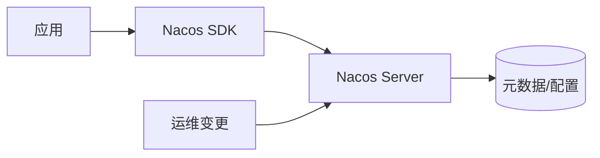

# 第 24 章 中级综合：配置变更 → 路由/流控 → 消费端行为演练

> **条目 ID**：`ch-24` · **Slug**：`capstone-intermediate-pipeline` · **级别**：intermediate

## 1. 项目背景（约 500 字）

### 1.1 业务场景（真实或拟真）

本章主题：中级综合：配置变更 → 路由/流控 → 消费端行为演练。团队要把平台能力落成可验收的步骤与证据链。

### 1.2 痛点放大

没有统一对象模型与验证步骤时，联调会变成随机过程：同名不同义、同义不同环境、一次变更多处失控。

### 1.3 流程图（示意）



## 2. 项目设计：剧本式交锋对话（约 1200 字）

### 角色设定

| 角色 | 性格标签 | 职责 | 话风示例 |
|------|----------|------|----------|
| **小胖** | 爱吃爱玩、不求甚解 | 用生活化比喻抛问题 | 「这不就跟食堂打饭排队一样吗？」 |
| **小白** | 喜静、喜深入 | 追问原理、边界、风险、备选 | 「队头阻塞怎么办？有没有更轻量方案？」 |
| **大师** | 资深技术 Leader | 约束条件下选型，由浅入深 | 「把连接池想成银行柜台……」 |

---

**【第一回合】**  
**小胖**：这章标题好长，中级综合：配置变更 → 路由/流控 → 消费端行为演练，能不能一句话讲明白？  
**小白**：落地这一步的验收标准是什么？失败时怎么降级？  
**大师**：先把本章主锚点对齐：**串联 ch-16~19 能力**。先把对象说清，再谈调参。  
**技术映射**：对象模型 / 主锚点 / 证据链。

**【第二回合】**  
**小胖**：听起来很牛，但运维会不会更累？  
**小白**：变更窗口、监控告警、SLA 怎么写进 Runbook？  
**大师**：平台组件必须配套 SLA、监控、可回滚；否则只是‘能跑’。  
**技术映射**：可运维性 = 可观测 + 可回滚 + 可演练。

**【第三回合】**  
**小胖**：那我啥时候该看源码？  
**小白**：源码阅读从哪里切入最省时间？  
**大师**：从 `nacos/api` 接口面进入，再进实现模块；本章锚点：**串联 ch-16~19 能力**。  
**技术映射**：接口优先 + 证据优先。

> 剧情提示：上述对话可替换为你们业务域的真实名词；本章主题：中级综合：配置变更 → 路由/流控 → 消费端行为演练。团队要把平台能...（场景背景可复用于内部培训）。

## 3. 项目实战（约 1500–2000 字）

### 3.1 环境准备

- **JDK / Maven**：与示例工程要求一致（见 `nacos-examples` 各子模块 `pom.xml`）。  
- **Nacos Server**：`127.0.0.1:8848`（standalone）或共享环境。  
- **仓库路径**：`nacos/`、`nacos-examples/`、`columns/chapter-anchors.md`（`ch-24`）。

### 3.2 分步实现

#### 步骤 1：锁定主锚点

**目标**：明确本章唯一入口。  
**操作**：打开 `columns/chapter-anchors.md`，检索 **ch-24**，阅读主锚点说明：**串联 ch-16~19 能力**。  
**期望（文字）**：能一句话说明本章核心对象。  
**坑**：路径不一致/克隆目录不同 → 以本机为准。

#### 步骤 2：执行本章实践

**目标**：120 分钟演练剧本。  
**操作**：进入对应示例目录按 README/`mvn` 运行；必要时 `-DskipTests`。  
**期望（文字）**：日志出现注册/配置/监听等关键信号。  
**坑**：`server-addr`、**Namespace**、**鉴权**未配置。

#### 步骤 3：最小验证

**目标**：形成可复现证据。  
**操作**：  

```bash
# 示例：最小连通性（按你的环境调整端口/路径）
curl -sS "http://127.0.0.1:8848/nacos/" || exit 1
```

**期望（文字）**：`curl` 可达或 Java 示例输出符合预期。  
**坑**：防火墙/代理/VPN 影响回环。

### 3.3 完整代码与仓库位置

- 源码：`nacos/`  
- 示例：`nacos-examples/`  
- 专栏：`columns/`（模板、清单、推广）

### 3.4 测试验证

- **冒烟**：启动无 ERROR；控制台可见目标服务/配置。  
- **集成**：对 Provider 暴露接口 `curl` 一次（若适用）。  
- **回归**：把本章变更点记入 `columns/test-checklist-template.md` 的实例化版本。

## 4. 项目总结（约 500–800 字）

### 4.1 优点与缺点（对比）

| 维度 | 本章方法/对象 | 同类/备选 | 说明 |
|------|----------------|-----------|------|
| 学习路径 | 先锚点后代码 | 直接啃源码 | 先锚点更省时间 |
| 控制面 | Nacos 统一 Naming/Config | Eureka+Apollo、仅 K8s DNS | 视是否跨运行时 |
| 风险 | 平台依赖 | 自研注册表 | 自研长期成本更高 |

### 4.2 适用场景 / 不适用场景

- **适用**：多团队协作、治理与观测。  
- **不适用**：极小团队且生命周期极简（仍建议保留外部化配置习惯）。

### 4.3 注意事项

- **版本矩阵**：Nacos Server / Client / Spring Cloud Alibaba 需匹配。  
- **安全**：默认凭据与未鉴权仅可用于内网实验。  
- **隔离**：Namespace 不是安全边界全部。

### 4.4 常见踩坑（生产向 3 例）

| 案例 | 现象 | 根因 | 预防 |
|------|------|------|------|
| 连错 Namespace | 列表为空 | Id 复制错误 | 控制台复制粘贴 |
| 只看注册不看健康 | 流量打到未就绪 | 健康语义误解 | readiness 后再接流量 |
| 配置热更过度 | 排障困难 | 缺少治理 | 变更单+灰度 |

### 4.5 思考题

1. 如果把 Nacos 从架构图移除，哪条链路会最先断裂？为什么？  
2. 本章主锚点对应的**最小可观测证据**是什么（日志/metrics/控制台）？

> 参考答案提示：见第 25 章开头承接。

### 4.6 推广与协作阅读提示

- **开发**：先完成 **ch-01~ch-12** 基础闭环，再进入中级。  
- **运维**：重点 **ch-03、ch-10、ch-22、ch-25、ch-30~ch-35**，输出 Runbook。  
- **测试**：重点 **ch-08、ch-09、ch-11、ch-23、ch-24、ch-36**，固化清单。  

（更完整的阶段规划见 `columns/ROLLOUT.md`。）

---

**篇幅提示**：按 `columns/chapters/template.md`，本篇目标 **3000–5000 字**（可通过补充业务域脱敏案例扩展）。
