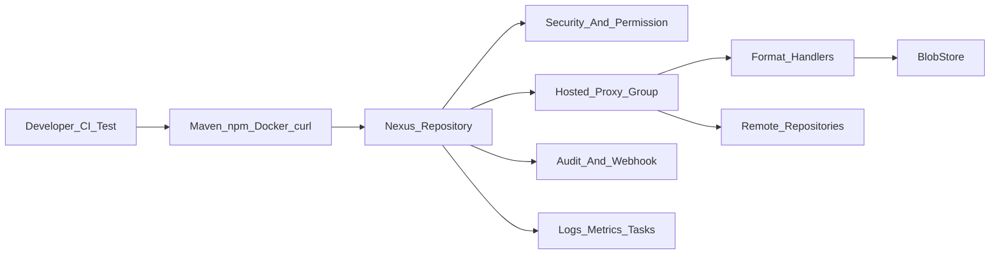

# Nexus Repository 实战与源码修炼专栏大纲

> 版本：Nexus Repository OSS 3.x
> 面向人群：新人开发、测试、运维、核心开发、架构师
> 总章节：40 章（基础篇 16 章 / 中级篇 15 章 / 高级篇 9 章）
> 每章独立成文件，字数 3000-5000 字

---

## 专栏定位

本专栏以 Nexus Repository 3.x 为主线，从“把私服跑起来”到“把制品治理起来”，再到“读源码、写扩展、做 SRE 落地”。每章都围绕一个真实或拟真的工程场景展开，采用「项目背景 -> 三人剧本对话 -> 项目实战 -> 总结思考」的四段式结构。理论只服务于实战：先理解为什么要这么做，再给出可复现的命令、配置、脚本、接口和排障方法。

专栏固定三位角色贯穿全篇：

| 角色 | 定位 | 话风 |
|------|------|------|
| 小胖 | 新人开发，关注“怎么快点跑起来” | “这不就是公司内部网盘吗？为啥还要 hosted、proxy、group？” |
| 小白 | 测试/核心开发，喜欢追问边界和风险 | “如果远程仓库挂了，缓存会不会失效？权限会不会穿透？” |
| 大师 | 资深技术 Leader，负责架构取舍和生产落地 | “你可以把 Nexus 想象成企业制品供应链的海关，既要放行，也要验货、留痕和追溯。” |

---

## 阅读路线建议

| 角色 | 建议阅读顺序 | 重点章节 |
|------|-------------|---------|
| 新人开发/测试 | 基础篇全读 -> 中级篇选读 | 第 1-16 章 |
| 运维/DevOps | 基础篇速读 -> 中级篇精读 -> 高级篇选读 | 第 8-31、39-40 章 |
| 核心开发 | 基础篇速读 -> 中级篇精读 -> 高级篇源码章节 | 第 17-38 章 |
| 架构师/资深开发 | 中级篇与高级篇为主，按需回溯基础篇 | 第 17-40 章 |

---

# 基础篇（第 1-16 章）

> **核心目标**：理解 Nexus 的核心术语、仓库模型、单机部署、基础权限、常用格式和初级 API，能独立搭建一个团队级制品仓库。
> **源码关联**：`components/nexus-repository-*`、`plugins/nexus-coreui-plugin`、`components/nexus-webhooks` 基础概念。

---

## 第1章：Nexus 术语全景与制品仓库工作原理

**定位**：专栏开篇，建立统一语系，先把 Nexus 看成“企业制品供应链平台”。

**核心内容**：
- Nexus Repository、Repository Manager、Artifact、Component、Asset、Blob、BlobStore、Format、Recipe、Facet、Hosted、Proxy、Group 等术语
- Maven、npm、Docker、Raw 等制品格式在 Nexus 中的统一抽象
- hosted/proxy/group 仓库如何组合出企业内部制品入口
- 请求流转：客户端 -> 仓库路由 -> 权限校验 -> 格式处理器 -> BlobStore -> 响应
- 缓存、元数据、索引、权限、审计、Webhook 在整体架构中的位置

**架构图建议**：

**实战目标**：画出一张团队可讲解的 Nexus 架构图，并用 10 个术语解释一次 Maven 依赖下载经过 Nexus 的完整链路。

---

## 第2章：Docker 单机启动与初始化配置

**定位**：从零启动一个可访问、可登录、可持久化的 Nexus。

**核心内容**：
- Docker / Docker Compose 部署 Nexus Repository OSS
- 数据目录挂载、端口规划、管理员密码读取
- 首次登录、匿名访问开关、基础安全设置
- JVM 参数、数据目录权限、容器健康检查
- 常见启动失败：权限不足、端口冲突、内存不足、磁盘不足

**实战目标**：用 Docker Compose 启动 Nexus，完成管理员初始化，并编写一份可重复执行的本地开发环境脚本。

---

## 第3章：仓库类型入门：Hosted、Proxy、Group

**定位**：理解 Nexus 最核心的仓库组织方式。

**核心内容**：
- hosted：企业内部发布制品的仓库
- proxy：代理远程中央仓库并缓存制品
- group：聚合多个 hosted/proxy 仓库，给客户端统一入口
- 仓库顺序、优先级、缓存命中和元数据合并
- 不同类型在开发、测试、生产环境中的使用边界

**实战目标**：创建 Maven hosted/proxy/group 三类仓库，让本地 Maven 只配置一个 group 地址即可完成依赖下载。

---

## 第4章：Maven 私服实战：依赖下载与制品发布

**定位**：从 Java 项目最常见的依赖管理场景切入。

**核心内容**：
- `settings.xml` 中 mirror、server、profile 的职责
- snapshot 与 release 仓库的区别
- `mvn deploy` 发布 jar、pom、sources、javadoc
- 认证失败、401/403、metadata 异常、SNAPSHOT 不更新的排查
- 企业 Maven 仓库命名规范

**实战目标**：搭建 `maven-snapshots`、`maven-releases`、`maven-public`，发布一个 Spring Boot 示例组件并在另一个项目中引用。

---

## 第5章：npm 私服实战：前端包缓存与发布

**定位**：让前端团队也能用上统一的制品供应链。

**核心内容**：
- npm hosted/proxy/group 仓库配置
- `.npmrc` 中 registry、scope、authToken 的配置方式
- 私有包发布、安装、版本废弃和权限控制
- npm 元数据缓存与 package-lock 兼容性
- pnpm/yarn 与 Nexus 的使用差异

**实战目标**：创建一个 scoped npm 私有包，发布到 Nexus，并在另一个前端项目中安装验证。

---

## 第6章：Docker Registry 私服实战

**定位**：掌握容器镜像的存储、拉取和推送。

**核心内容**：
- Docker hosted/proxy/group 仓库配置
- HTTP 与 HTTPS 场景下 Docker daemon 配置
- `docker login`、`docker tag`、`docker push`、`docker pull`
- 镜像层、manifest、tag 与 Nexus asset 的关系
- 常见错误：`unknown blob`、认证失败、HTTPS 证书不信任

**实战目标**：搭建内部 Docker hosted 仓库，推送一个业务镜像，并通过 group 仓库统一拉取内部镜像和 Docker Hub 镜像。

---

## 第7章：Raw 仓库与通用文件分发

**定位**：用 Nexus 管理不属于 Maven/npm/Docker 的普通文件。

**核心内容**：
- Raw hosted/proxy/group 的适用场景
- curl 上传、下载、覆盖和删除文件
- 安装包、脚本、模型文件、离线依赖包的版本组织
- 路径设计、命名规范和权限隔离
- 与对象存储、FTP、文件服务器的对比

**实战目标**：把团队常用安装脚本、离线 RPM 包和测试数据文件发布到 Raw 仓库，并写出标准下载命令。

---

## 第8章：用户、角色、权限与团队隔离

**定位**：从“能用”进入“安全可控”。

**核心内容**：
- 用户、角色、权限、Privilege、Content Selector 的关系
- 仓库读写权限拆分：浏览、下载、上传、删除、管理
- 匿名访问的利弊
- 团队级权限模型：开发、测试、运维、CI 机器人账号
- 最小权限原则与权限排查方法

**实战目标**：为 Java、前端、Docker 三个团队配置独立读写权限，并创建一个只允许 CI 发布制品的机器人账号。

---

## 第9章：仓库访问 API 与 curl 自动化

**定位**：把控制台点击操作变成脚本化能力。

**核心内容**：
- Nexus REST API 的认证方式和常用接口
- 仓库列表、组件查询、资产下载、组件删除
- curl、HTTPie、Postman 的使用方式
- API 返回分页、过滤、错误码处理
- 管理脚本中的超时、重试和幂等设计

**实战目标**：编写一组 shell 脚本，实现查询组件、下载资产、删除测试版本和批量检查仓库连通性。

---

## 第10章：组件搜索与制品定位

**定位**：解决“包到底在哪、谁上传的、能不能删”的日常问题。

**核心内容**：
- Component 与 Asset 的区别
- 搜索 API、Web UI 搜索、Browse 页面差异
- Maven 坐标、npm package、Docker tag 的查询方式
- 查询结果中的 checksum、path、repository、format
- 制品定位 SOP：从报错坐标到 Blob 文件

**实战目标**：给出 5 类常见制品定位案例，并编写一份“依赖找不到”的排障清单。

---

## 第11章：BlobStore 与磁盘空间初识

**定位**：理解制品最终存在哪里，为什么磁盘会越用越大。

**核心内容**：
- BlobStore、Blob、Blob Attributes 的基本概念
- File BlobStore 的目录结构与存储方式
- 软删除、清理任务和 Compact BlobStore
- 磁盘水位、目录权限、备份边界
- 不建议直接手工删除 Blob 文件的原因

**实战目标**：创建两个 File BlobStore，分别绑定到不同仓库，观察上传制品后的磁盘目录变化。

---

## 第12章：清理策略与过期制品治理

**定位**：让仓库不再变成“永远不打扫的仓库间”。

**核心内容**：
- Cleanup Policy 的匹配条件：格式、仓库、版本、最近下载时间
- snapshot、临时构建、测试镜像的清理规则
- Delete unused manifests and images、Compact BlobStore 等任务
- 清理任务的风险和回滚思路
- 清理前的容量评估与演练流程

**实战目标**：为 Maven snapshots、npm beta 包和 Docker dev 镜像设计三套清理策略，并在测试仓库中演练。

---

## 第13章：任务调度中心与常用维护任务

**定位**：掌握 Nexus 后台维护动作，避免“点错任务出事故”。

**核心内容**：
- Task 的类型、状态、日志和执行历史
- Rebuild Index、Repair Metadata、Compact BlobStore 等常见任务
- 任务执行窗口、并发风险和资源消耗
- 任务失败日志分析
- 生产环境任务排期原则

**实战目标**：配置一套每周维护计划，覆盖索引重建、元数据修复、清理策略执行和 BlobStore 压缩。

---

## 第14章：备份、恢复与升级前演练

**定位**：把 Nexus 当作关键基础设施进行保护。

**核心内容**：
- 需要备份的数据：数据库、BlobStore、配置、密钥、日志
- 文件系统备份与快照备份的取舍
- 冷备、热备、定时备份策略
- 恢复演练流程：新环境拉起、数据校验、仓库访问验证
- 升级前检查清单

**实战目标**：在本地搭建一套 Nexus 备份恢复演练环境，完成从备份数据到可用服务的恢复验证。

---

## 第15章：基础故障排查：401、403、404、502 与上传失败

**定位**：建立一线排障能力。

**核心内容**：
- HTTP 状态码在 Nexus 场景中的含义
- 权限错误、仓库路径错误、远程代理失败、Blob 缺失
- Maven/npm/Docker 客户端日志如何看
- Nexus 日志文件、request.log、task log 的定位方式
- 一线排障 SOP 与升级给二线的信息清单

**实战目标**：模拟 8 个常见故障，输出对应的排查命令、日志关键字和修复方案。

---

## 第16章：【基础篇综合实战】搭建团队级制品仓库

**定位**：将基础篇能力串成可交付的小型私服方案。

**核心内容**：
- 场景：一个 30 人研发团队需要统一管理 Java、前端、Docker 和通用文件
- 需求拆解：仓库规划、权限模型、CI 账号、清理策略、备份策略
- Docker Compose 部署、仓库初始化、权限初始化、客户端配置
- 验收标准：Maven/npm/Docker/Raw 四类制品均可上传、下载、清理和恢复
- 输出物：部署文档、账号权限表、排障手册、备份恢复演练记录

**实战目标**：交付一个团队级 Nexus 最小可用生产方案。

---

# 中级篇（第 17-31 章）

> **核心目标**：掌握生产治理、性能调优、格式细节、CI/CD 集成、可观测性和多团队协作，能支撑企业级制品仓库运行。
> **源码关联**：`components/nexus-repository-services`、`components/nexus-repository-content`、`plugins/nexus-coreui-plugin`、任务调度与日志模块。

---

## 第17章：企业仓库规划与命名规范

**定位**：从单团队扩展到多团队、多环境、多格式。

**核心内容**：
- dev/test/stage/prod 仓库边界
- snapshot、release、candidate、archive 的生命周期
- 命名规范：格式、团队、用途、环境
- group 仓库组合策略和依赖解析顺序
- 多租户隔离与共享基础组件的取舍

**实战目标**：为一个包含 Java、Node、Docker、Raw 的中台团队设计完整仓库矩阵和命名规范。

---

## 第18章：Maven 元数据、快照版本与依赖解析深水区

**定位**：解决 Maven 私服最容易“玄学”的问题。

**核心内容**：
- `maven-metadata.xml` 的生成、缓存和更新
- SNAPSHOT 时间戳版本与唯一版本
- release 版本不可覆盖原则
- mirrorOf、repository、pluginRepository 的优先级
- 依赖冲突、传递依赖、插件下载失败排查

**实战目标**：构造一个 SNAPSHOT 不更新的案例，逐步定位本地缓存、Nexus 元数据和远程代理缓存的问题。

---

## 第19章：npm、pnpm、yarn 与前端制品治理

**定位**：解决前端包生态版本碎片化和供应链风险。

**核心内容**：
- npm metadata 与 tarball 的缓存机制
- lockfile 对私服地址的影响
- scope 级权限与团队包命名规范
- pre-release、dist-tag、deprecated 的治理方式
- 前端依赖缓存加速与供应链审计思路

**实战目标**：建立一个支持 npm/pnpm/yarn 的前端私服方案，并验证 CI 中 lockfile 可复现安装。

---

## 第20章：Docker 镜像治理与空间回收

**定位**：解决 Docker 仓库最常见的磁盘爆炸问题。

**核心内容**：
- Docker manifest、layer、tag、blob 的关系
- tag 删除与实际空间释放的差异
- Cleanup Policy、Delete unused manifests、Compact BlobStore 的协作
- 多架构镜像、latest 标签和镜像晋级策略
- 镜像安全扫描和签名的扩展思路

**实战目标**：设计 dev/test/prod 镜像晋级流程，并通过任务组合释放过期镜像空间。

---

## 第21章：代理缓存策略与远程仓库稳定性

**定位**：让 Nexus 在公网波动时仍能稳定服务内部团队。

**核心内容**：
- proxy 仓库的 remote URL、negative cache、metadata max age、content max age
- 远程仓库不可用时的行为
- 缓存穿透、缓存污染和缓存预热
- 中央仓库、npm registry、Docker Hub 的代理差异
- 企业网络代理、证书和白名单配置

**实战目标**：模拟远程 Maven Central 不可用，验证本地缓存命中、负缓存和恢复后的刷新行为。

---

## 第22章：BlobStore 规划：File、S3 与容量模型

**定位**：从“有磁盘就行”升级到容量可规划、可扩展。

**核心内容**：
- File BlobStore 与对象存储 BlobStore 的适用场景
- BlobStore 与仓库绑定策略
- 容量模型：新增量、保留周期、清理效率、备份窗口
- 磁盘 IO、对象存储延迟、网络带宽对上传下载的影响
- BlobStore 迁移与风险控制

**实战目标**：为一个日新增 200GB 制品的团队设计 6 个月容量规划和清理策略。

---

## 第23章：权限模型进阶：Content Selector 与细粒度授权

**定位**：做到同一个仓库内也能分区授权。

**核心内容**：
- Content Selector 的表达式模型
- 基于路径、格式、仓库、坐标的细粒度权限
- 团队共享仓库中的隔离策略
- 机器人账号、临时账号和审计追踪
- 权限调试与误授权风险

**实战目标**：在一个 Raw 仓库中按路径隔离三个团队的上传权限，并验证越权上传会被拒绝。

---

## 第24章：CI/CD 集成：Jenkins、GitLab CI 与制品晋级

**定位**：把 Nexus 接入企业交付流水线。

**核心内容**：
- CI 机器人账号与凭据管理
- Maven/npm/Docker 发布流水线
- snapshot -> release -> prod 的晋级策略
- 构建产物、镜像、安装包统一归档
- 失败重试、幂等发布和制品不可变原则

**实战目标**：实现一条流水线：构建 jar -> 发布 Maven -> 构建 Docker 镜像 -> 推送 Nexus -> 部署测试环境。

---

## 第25章：REST API 自动化管理仓库与权限

**定位**：用代码管理 Nexus，减少控制台手工操作。

**核心内容**：
- 仓库创建、更新、删除 API
- 用户、角色、权限 API
- BlobStore、任务、脚本 API 的使用边界
- 幂等脚本设计与环境初始化
- API 变更兼容与错误处理

**实战目标**：编写一个初始化脚本，一键创建团队仓库、角色、用户、清理策略和维护任务。

---

## 第26章：日志、审计与合规追踪

**定位**：回答“谁在什么时候上传/删除了什么”。

**核心内容**：
- Nexus 日志分类：application log、request log、task log、audit log
- AuditData 的 domain、type、context、attributes
- 审计日志结构化采集到 ELK/OpenSearch
- 高风险操作追踪：删除组件、修改权限、修改仓库配置
- 合规场景下的保留周期和查询维度

**实战目标**：采集 Nexus 审计日志到 Elasticsearch，做一个“制品删除与权限变更”看板。

---

## 第27章：Webhook 实战：事件驱动制品治理

**定位**：让 Nexus 事件主动推动外部系统。

**核心内容**：
- Global Webhook、Repository Webhook、Audit Webhook 的差异
- Webhook 请求头：`X-Nexus-Webhook-ID`、`X-Nexus-Webhook-Delivery`、`X-Nexus-Webhook-Signature`
- Repository、Component、Asset、Audit 四类 payload 结构
- HMAC-SHA1 签名验证与重放防护
- Webhook 接收端的幂等、重试和死信设计

**实战目标**：编写一个 Spring Boot 接收端，接收 `source=fixed` 的 Nexus Audit 事件并写入业务审计表。

---

## 第28章：监控指标、健康检查与 Grafana 看板

**定位**：从“服务能访问”升级到“运行状态可观测”。

**核心内容**：
- JVM、线程池、磁盘、BlobStore、HTTP 请求量等关键指标
- Prometheus/JMX/日志采集方案
- Grafana 看板设计：容量、错误率、延迟、任务状态、远程代理失败
- 告警规则：磁盘水位、5xx 激增、任务失败、远程仓库不可用
- 告警降噪与值班处理流程

**实战目标**：搭建 Nexus 监控看板，并配置 5 条可落地的生产告警。

---

## 第29章：性能调优：下载慢、上传慢与高并发访问

**定位**：定位并优化制品仓库的吞吐瓶颈。

**核心内容**：
- 客户端、网络、Nexus、BlobStore、远程仓库的瓶颈拆分
- JVM 堆、GC、线程池、HTTP 连接数
- 大文件上传、Docker layer 拉取、npm 小文件风暴
- 缓存命中率与代理仓库性能
- 压测工具和指标解读

**实战目标**：分别压测 Maven 下载、Docker 拉取和 Raw 大文件下载，输出性能瓶颈报告和调优方案。

---

## 第30章：生产故障演练与应急预案

**定位**：用演练降低真实事故损失。

**核心内容**：
- 磁盘满、数据库异常、BlobStore 损坏、远程仓库不可用
- 权限误删、制品误删、任务卡死
- 应急流程：止血、隔离、回滚、恢复、复盘
- 只读模式、备份恢复、流量切换思路
- 故障复盘模板和改进项跟踪

**实战目标**：设计并执行 6 个 Nexus 故障演练剧本，形成团队应急手册。

---

## 第31章：【中级篇综合实战】建设企业级制品治理平台

**定位**：把 Nexus 从工具升级为制品治理平台。

**核心内容**：
- 场景：一个 300 人研发组织统一治理 Maven、npm、Docker、Raw 制品
- 架构设计：Nexus + CI/CD + 监控告警 + 审计日志 + Webhook 事件中心
- 制度落地：命名规范、权限规范、清理规范、发布晋级规范
- 自动化：仓库初始化、账号管理、清理任务、容量巡检
- 验收标准：可观测、可审计、可恢复、可扩展、可交接

**实战目标**：交付一套企业级 Nexus 治理方案，包括架构图、初始化脚本、监控大盘和应急手册。

---

# 高级篇（第 32-40 章）

> **核心目标**：深入源码与扩展机制，理解 Nexus 的请求链路、事件机制、权限校验和插件体系，具备定制开发与 SRE 深度落地能力。
> **源码关联**：`components/nexus-core`、`components/nexus-repository-content`、`components/nexus-webhooks`、`plugins/nexus-audit-plugin`、`plugins/nexus-coreui-plugin`。

---

## 第32章：源码工程结构与启动链路

**定位**：从使用者转向源码读者。

**核心内容**：
- Nexus 源码模块划分：components、plugins、assemblies、buildsupport
- OSGi/Karaf、Sisu、Guice 在 Nexus 中的角色
- 服务启动、组件扫描、插件加载的基本流程
- Web 层、Repository 层、BlobStore 层、Task 层的位置
- 源码阅读路线：先入口、再接口、最后实现

**实战目标**：拉起本地源码阅读环境，绘制 Nexus 主要模块依赖图，并定位 UI 上传接口的后端实现类。

---

## 第33章：Repository、Format、Recipe 与 Facet 设计模式

**定位**：理解 Nexus 如何支持多种制品格式。

**核心内容**：
- Repository 抽象与格式无关设计
- Format、Recipe、Facet 的职责分工
- Maven/npm/Docker/Raw 格式如何复用基础能力
- 配置、存储、路由、上传、浏览等 Facet 组合
- 面向扩展的模块边界设计

**实战目标**：选取一个现有格式，梳理它由哪些 Facet 组成，并输出一张格式能力拆解图。

---

## 第34章：上传链路源码：从 HTTP 请求到 Blob 入库

**定位**：深入最常见也最关键的写入链路。

**核心内容**：
- UI 上传入口与 REST 资源
- Multipart 表单解析与 ComponentUpload 构建
- UploadManager、UploadHandler、BlobStoreMultipartForm 的协作
- 资产路径、元数据、校验和的生成
- 上传失败、回滚和缓存刷新

**实战目标**：跟踪一次 Maven/Raw 上传请求的完整调用链，输出关键类、关键方法和日志埋点位置。

---

## 第35章：下载链路源码：路由、权限、缓存与响应

**定位**：理解一次依赖下载如何被 Nexus 处理。

**核心内容**：
- HTTP bridge 与 repository view
- request/response handler 链
- 权限校验、内容定位、Blob 读取
- proxy 仓库远程下载与本地缓存
- group 仓库聚合查找顺序

**实战目标**：跟踪一次 Maven 依赖下载请求，区分 hosted 命中、proxy 缓存命中、proxy 远程拉取三种链路。

---

## 第36章：EventBus、Audit 与 Webhook 源码剖析

**定位**：理解 Nexus 内部事件如何驱动审计与外部通知。

**核心内容**：
- Guava EventBus 在 Nexus 中的使用方式
- AuditDataRecordedEvent 与 GlobalAuditWebhook
- Repository/Component/Asset Webhook payload 构造逻辑
- WebhookServiceImpl 的 JSON 序列化、HMAC 签名和异步发送线程池
- 事件丢失、重复投递、消费幂等的工程边界

**实战目标**：从一次仓库创建操作出发，追踪 Audit 事件和 Webhook 请求的完整链路，并编写一个接收端验证 payload。

---

## 第37章：权限校验与安全模型源码

**定位**：理解 Nexus 如何决定“谁能访问什么”。

**核心内容**：
- Shiro 在 Nexus 中的认证和授权流程
- 用户、角色、Privilege、Content Selector 的源码映射
- REST API 与 Repository 请求的权限校验差异
- 匿名访问、Token、Basic Auth 的边界
- 权限缓存、误授权和越权风险

**实战目标**：跟踪一次 403 响应的源码链路，定位权限判断点，并输出权限排查 checklist。

---

## 第38章：自定义插件与扩展开发实战

**定位**：从源码阅读走向定制能力建设。

**核心内容**：
- Nexus 插件工程结构与依赖配置
- 自定义 REST Resource、Capability、Task、Webhook 的开发思路
- 插件注册、组件注入、生命周期管理
- 与 UI、权限、日志、配置系统的集成
- 插件升级兼容与测试策略

**实战目标**：开发一个最小插件，提供一个健康检查 REST API，并注册一个定时任务输出 BlobStore 容量摘要。

---

## 第39章：极端场景优化：海量组件、超大 Blob 与跨地域访问

**定位**：面向大型企业和高压场景的容量与性能优化。

**核心内容**：
- 百万级组件搜索、分页和索引压力
- 超大文件上传下载的超时、断点和代理限制
- 跨地域访问的缓存节点、镜像仓库和网络优化
- JVM、数据库、BlobStore、对象存储联合调优
- 压测、火焰图、慢日志与容量预测

**实战目标**：设计一个跨地域 Nexus 访问优化方案，并通过压测验证下载延迟和缓存命中率改进。

---

## 第40章：【高级篇综合实战】构建 Nexus 制品供应链 SRE 体系

**定位**：融会贯通高级篇知识，形成可长期运行的生产体系。

**核心内容**：
- 场景：为大型研发平台建设 Nexus SRE 运行体系
- 架构设计：Nexus 集群化部署思路、备份恢复、监控告警、审计追踪、容量治理、Webhook 事件中心
- 深度治理：权限基线、制品生命周期、清理自动化、故障演练、升级灰度
- 扩展能力：自定义插件、自动化巡检、SLO 报表、事件驱动治理
- 验收标准：RTO/RPO、SLO、容量水位、告警响应、审计可追溯

**实战目标**：交付一份 Nexus SRE 运行手册，包含架构图、SLO 指标、巡检脚本、告警规则、故障演练和源码扩展路线。

---

# 附录与资源

## 附录 A：推荐实验环境

- Docker / Docker Compose
- JDK 17 或团队指定版本
- Maven、npm、pnpm、Docker CLI
- curl、jq、HTTPie、Postman
- Prometheus、Grafana、Elasticsearch/OpenSearch

## 附录 B：章节写作统一模板

每章正文建议遵循：

1. 项目背景：用真实业务场景引出主题，放大没有 Nexus 治理时的痛点。
2. 项目设计：小胖、小白、大师三人剧本式交锋，带出技术取舍。
3. 项目实战：环境准备、分步实现、代码/配置片段、命令输出、坑点处理、测试验证。
4. 项目总结：优缺点、适用场景、注意事项、生产故障案例、思考题、推广计划。

## 附录 C：源码阅读路线图

1. Webhook 与事件：`components/nexus-core/src/main/java/org/sonatype/nexus/internal/webhooks/WebhookServiceImpl.java`
2. Audit：`plugins/nexus-audit-plugin/src/main/java/org/sonatype/nexus/audit/internal/GlobalAuditWebhook.java`
3. Upload：`plugins/nexus-coreui-plugin/src/main/java/org/sonatype/nexus/coreui/UploadResource.java`
4. Repository Webhook：`components/nexus-repository-services/src/main/java/org/sonatype/nexus/repository/webhooks/GlobalRepositoryWebhook.java`
5. Component/Asset Webhook：`components/nexus-repository-content/src/main/java/org/sonatype/nexus/repository/content/webhooks/`

## 附录 D：推荐产出物

- 团队仓库命名规范
- 权限矩阵表
- CI/CD 发布模板
- 清理策略与容量模型
- Webhook 接收端示例工程
- Nexus 运维巡检脚本
- 故障演练手册
- SRE 运行手册

---

> **版权声明**：本专栏围绕 Nexus Repository OSS 3.x 的公开使用方式和源码结构编写，源码引用与扩展开发需遵循对应项目许可证及企业内部合规要求。
