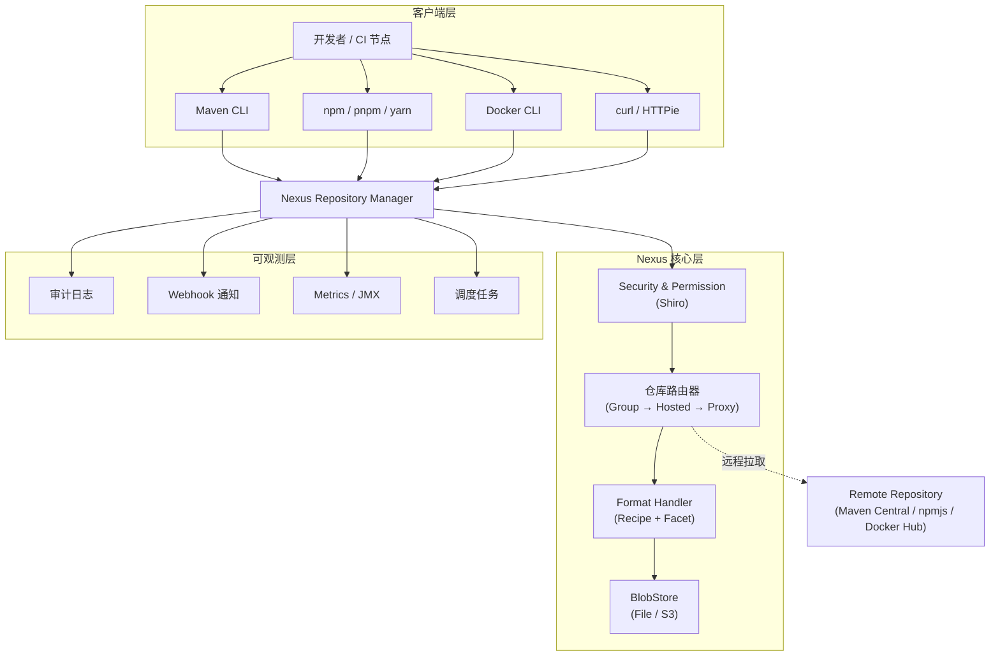

# 第1章：Nexus 术语全景与制品仓库工作原理

## 1. 项目背景

某互联网公司"云鲸科技"成立三年，团队从最初的 5 人猛增到 80 人，技术栈也从单一的 Java 拓展到 Java + Node.js + Python + Go + Docker。前端抱怨"npm install 卡半小时"，后端吐槽"Maven 中央仓库又挂了"，运维怒吼"Docker Hub 限流拉不到镜像"。更糟糕的是，每次版本发布前都要在多个制品来源之间"考古"——上周发的那版 Spring Boot jar 到底在谁本地？测试环境用的 Docker 镜像 tag 对得上吗？

没有统一制品仓库时，每一行代码变成可交付软件的过程都充满变量。开发本地构建的 jar、前端打包的 dist、运维封装的基础镜像散落在各台机器上，版本一致性靠口头约定，制品溯源靠翻聊天记录。最终交付环境发生"依赖地狱"——开发环境和生产环境下载了不同版本的传递依赖，导致线上功能异常，回溯根因花了整整一个周末。

Nexus Repository 正是一套面向企业的制品仓库管理器，它在软件供应链中扮演着"海关"角色：既要放行合法的制品流通，又要验货、留痕、追溯，确保每一份进入生产环境的制品都有据可查。本章作为专栏开篇，将帮你建立 Nexus 的统一术语体系，理解制品仓库的工作原理，为后续章节的实战打下概念基础。

## 2. 项目设计

大师召集小胖和小白到会议室，白板上写着"统一制品仓库"六个大字。

**小胖**（啃着面包）："大师，不就是搭个内网网盘嘛？把 jar 包扔到一个共享目录里，大家改一下 settings.xml 不就好了？干嘛要上 Nexus 这种大家伙？"

**大师**（在咖啡杯后面微笑）："小胖，你家冰箱里食材怎么放的？"

**小胖**："分类放啊，蔬菜一层、肉类一层、饮料一层——"

**大师**："那你为什么只给团队一个共享文件夹？这和把所有食材塞进一个塑料袋有什么区别？哪天想吃牛肉，翻半天发现底部压了一块发霉的猪肉。"

**小白**（推了推眼镜）："大师的意思我明白，但共享目录也能建子目录按项目分类。Nexus 比文件系统到底多了什么能力？"

**大师**："三个维度。第一，制品的元数据管理——Maven 坐标、npm 版本范围、Docker manifest，这些不是目录名能承载的。第二，代理和缓存——你愿意每次 npm install 都去公网 registry 下载同样的 tarball 吗？第三，权限审计——谁上传的、谁下载的、什么时候删除的，共享目录能告诉你吗？"

> **技术映射**：Nexus 不是存储层，而是制品管理平面——协调元数据、缓存策略、权限校验和审计追踪。

**小胖**（放下面包）："听起来好像是一个带收银系统的超市 vs 路边摊。那 Nexus 到底怎么分层的？"

**大师**（走到白板前画图）："好问题。Nexus 的核心抽象有四层。最底层是 **BlobStore**——二进制大对象存储，就是冰箱的实际空间。往上是 **Repository**——仓库，分 hosted（自产）、proxy（代购）和 group（组合入口）三种。再往上是 **Format**——格式处理器，Maven 的 pom、npm 的 package.json、Docker 的 manifest，每种格式有自己的 Recipe。最外层是 **Security** 和 **Webhook**——权限和通知。"

**小白**："那一个 Maven 依赖下载请求经过 Nexus 时，具体走了哪些步骤？"

**大师**："假设你用 maven-public 这个 group 仓库下载 commons-lang3。请求先到 Nexus HTTP 层，经过 Shiro 权限校验，然后在 group 仓库中按顺序查找成员仓库——先 hosted，再 proxy。proxy 仓库检查本地缓存，缓存命中直接返回 BlobStore 中的资产；缓存未命中就去远程中央仓库拉取，同时存一份到本地 BlobStore。整个过程都会产生审计事件，触发 Webhook 通知。"

> **技术映射**：请求链路 = HTTP → 权限校验 → 仓库路由（group→hosted→proxy）→ 格式处理器 → BlobStore。每一步都可插拔、可观测。

**小胖**："等等，你说 Component 和 Asset，这两个不是同一个东西吗？"

**大师**："Component 是逻辑实体，比如 `com.example:my-lib:1.0.0`。Asset 是物理文件，同一个 Component 下面可能有 `my-lib-1.0.0.jar`、`my-lib-1.0.0.pom`、`my-lib-1.0.0-sources.jar` 多个 Asset。打个比方，Component 是一本书的条目信息（书名、作者、ISBN），Asset 是这本书的每一页扫描件。"

**小白**："那 Facet 又是什么？"

**大师**："Facet 是格式无关能力的一种组合方式。一个 Maven hosted 仓库，同时需要存储（StorageFacet）、浏览（BrowseFacet）、清理（PurgeUnusedFacet）等多种能力。Facet 就是把这些能力像乐高积木一样拼到仓库实例上，不同格式按需组合。"

**小胖**（眼前一亮）："我懂了！就像游戏里的角色技能树——战士有嘲讽、冲锋，法师有火球、闪现。同一个技能可以被不同角色继承！"

> **技术映射**：Facet 是 Nexus 扩展性的核心设计模式，每种仓库由多个 Facet 组合而成，新格式只需实现差异部分。

## 3. 项目实战

### 3.1 环境准备

本文实战目标是理解 Nexus 架构并画出可讲解的请求链路图，无需实际安装。但建议提前拉取 Nexus 容器镜像备用：

```bash
# 拉取 Nexus 3 最新版（本章无需运行，仅为后续章节做准备）
docker pull sonatype/nexus3:latest
```

准备一份 Mermaid 绘图工具（在线版：https://mermaid.live ，或 VS Code Mermaid 插件），用于绘制架构图。

### 3.2 分步实战：手绘 Nexus 架构全景图

#### 步骤一：理解术语映射关系

下表列出 Nexus 核心术语及其在企业场景中的类比：

| 术语 | 含义 | 生活类比 |
|------|------|----------|
| **Repository Manager** | 制品仓库管理器整体（Nexus 本身） | 整栋物流中心大楼 |
| **Repository** | 一个具体的仓库实例（按格式+类型分隔） | 大楼里的一个独立仓库间 |
| **Hosted** | 企业自建仓库，存放内部发布制品 | 自有品牌生产车间 |
| **Proxy** | 代理仓库，缓存远程制品 | 代购中转站（带本地囤货） |
| **Group** | 组合仓库，聚合多个 hosted/proxy，给客户端统一入口 | 一站式服务窗口 |
| **Component** | 逻辑制品单元（Maven 坐标、npm 包名+版本） | 一件商品（含商品详情） |
| **Asset** | 物理文件（jar、pom、tar.gz、Docker layer） | 商品的一个具体包裹 |
| **Blob** | 二进制大对象，Asset 在存储层的表示 | 上架后库位上的物理货箱 |
| **BlobStore** | Blob 的存储池（文件系统或对象存储） | 仓库间的货架区 |
| **Format** | 制品格式（Maven、npm、Docker、Raw 等） | 商品品类（食品/电子/服装） |
| **Recipe** | 某格式在 Nexus 中的"配方"，定义如何处理该格式 | 品类管理标准作业程序 |
| **Facet** | 仓库能力的可组合模块（存储、浏览、清理等） | 仓库的操作设备（叉车、扫码器、温控） |
| **Content Selector** | 基于路径/格式/仓库的细粒度过滤 | 库位精确锁定（第3排B区） |
| **Webhook** | 事件驱动的外部通知 | 到货/出货自动短信通知 |

#### 步骤二：绘制 Nexus 请求流转架构图

在 Mermaid Live 中绘制以下架构图：



#### 步骤三：走通 Maven 依赖下载的完整链路

假设开发者执行 `mvn compile`，pom.xml 中依赖 `com.google.guava:guava:31.1-jre`，settings.xml 配置的 mirror 指向 Nexus 上的 `maven-public`（一个 group 仓库）。

**链路描述（文字输出）**：

```
[时间] 2025-01-15 14:32:10.123
[客户端] Maven 发出 GET /repository/maven-public/com/google/guava/guava/31.1-jre/guava-31.1-jre.jar
[Step1-权限] Shiro 校验匿名用户对 maven-public 仓库的 READ 权限 → 通过
[Step2-路由] maven-public (group) 按顺序查找：
  [Step2.1] maven-releases (hosted) → 未命中（此为内部发布仓库）
  [Step2.2] maven-central (proxy) → 检查本地缓存
    [Step2.2a] AssetBlob 查询 → BlobStore 中存在 → 缓存命中 ✓
    [Step2.2b] 读取 Blob → 返回二进制流
[Step3-格式] MavenFormat 处理器校验 checksum → SHA1/SHA256 匹配
[Step4-响应] HTTP 200 → 返回 guava-31.1-jre.jar (2746 KB)
[Step5-审计] AuditData 写入：
  - domain: repository
  - type: component
  - context: { repositoryName: "maven-central", componentId: "xxx", path: "..." }
[Step6-Webhook] 如有配置，触发 repository.webhook → POST 到外部端点
```

如果缓存未命中，则 Step2.2a 后走远程拉取路线：

```
[Step2.2a'] AssetBlob 查询 → 未命中 → 触发远程下载
[Step2.2b'] HTTP GET 到 Maven Central → 下载 guava-31.1-jre.jar
[Step2.2c'] 写入 BlobStore 作为本地缓存 → 返回流
[Step2.2d'] 写入 negative cache（如远程返回 404）→ 避免重复请求
```

#### 步骤四（可选）：使用 curl 验证术语

```bash
# 查看仓库列表（需要 Nexus 运行）
curl -u admin:admin123 http://localhost:8081/service/rest/v1/repositories

# 查看某个仓库的组件列表
curl -u admin:admin123 "http://localhost:8081/service/rest/v1/components?repository=maven-central"

# 查看特定组件的 asset 列表
curl -u admin:admin123 "http://localhost:8081/service/rest/v1/components?repository=maven-central&group=com.google.guava&name=guava"
```

### 3.3 常见坑点

| 坑点 | 现象 | 解决方法 |
|------|------|----------|
| 术语混淆：Component vs Asset | 以为删了一个 asset 就删了整个组件 | Component 是逻辑单元，Asset 是物理文件；删除组件需要通过 Component API |
| group 仓库顺序错误 | 内部发布包被远程缓存覆盖 | group 中 hosted 仓库必须在 proxy 之前 |
| BlobStore 直接操作 | 手动删除 blob 文件导致索引不一致 | 永远通过 Nexus API 或 UI 删除，不要直接操作文件系统 |
| 远程仓库 URL 填错 | proxy 始终返回 404 | 检查 remote URL 是否正确、是否需要网络代理 |
| 权限配置"一锅端" | 给所有人 nx-admin 角色 | 遵循最小权限原则，按团队/角色拆分权限 |

## 4. 项目总结

### 4.1 优点与缺点对比

| 维度 | Nexus | 共享目录（NFS/SMB） | Artifactory |
|------|-------|---------------------|-------------|
| 制品元数据管理 | ✅ 原生支持 Maven/npm/Docker 等多种格式的元数据 | ❌ 无元数据，靠文件命名约定 | ✅ 功能最全，但 OSS 版受限 |
| 远程代理缓存 | ✅ 内置 proxy 仓库，支持多格式 | ❌ 无缓存机制 | ✅ 类似功能，RAM 消耗更大 |
| REST API 自动化 | ✅ 完整的 REST API，文档清晰 | ❌ 无 API | ✅ API 丰富，但部分为商业版 |
| 权限与审计 | ✅ Shiro + Content Selector + Audit | ❌ 文件系统权限（简陋） | ✅ 权限粒度更细，商业版 |
| 部署复杂度 | ✅ Docker 一行启动，零依赖 | ✅ 零部署（已有 NAS 即可） | ⚠️ 需数据库 + 较大内存 |
| 学习曲线 | ⚠️ 术语较多，概念分层需理解 | ✅ 几乎无学习成本 | ⚠️ 概念与 Nexus 类似但更重 |
| 内存占用 | ⚠️ JVM 默认 2.7G，可调 | ✅ 无额外内存开销 | ⚠️ 推荐 4G+ |
| 商业版 vs OSS 版 | ⚠️ 高级功能（HA、FIPS、Staging）需付费 | ✅ 无此概念 | ⚠️ OSS 版功能阉割较多 |

### 4.2 适用场景

**典型场景**：
1. 多团队共用 Maven/npm/Docker 私服，需要统一入口和权限隔离
2. 公网依赖下载不稳定，需要本地缓存加速开发构建
3. 企业安全合规要求：所有依赖必须经过内部仓库，可审计、可追溯
4. CI/CD 流水线中的制品中转站，实现制品晋级（snapshot → release → archive）
5. 空⽓隔离环境（内网）的制品分发，通过 proxy 缓存外网依赖后导入内网

**不适用场景**：
1. 个人单机开发、无团队协作需求——本地 `.m2` 足够
2. 已有一套成熟的制品管理方案（如 Harbor + GitLab Package Registry）且满足需求——避免多系统维护成本

### 4.3 注意事项

- **版本兼容**：Nexus 3.x 与 2.x 架构完全不同，3.x 才引入 BlobStore 统一存储模型，无法从 2.x 直接升级
- **内存配置**：默认 JVM 最大堆 2703MB，生产环境建议按实际负载调整 `nexus.vmoptions`
- **安全边界**：初次安装后务必修改 admin 默认密码、关闭匿名访问（或严格限制权限），不暴露 `/service/rest` 到公网
- **OSS 版限制**：不支持仓库复制（Repository Replication）、高可用（HA）、FIPS 模式、Staging 套件，这些功能仅 PRO 版提供

### 4.4 常见踩坑经验

**故障一：BlobStore 磁盘满导致写入拒绝**

某团队凌晨 CI 批量发布失败，返回 HTTP 507（Insufficient Storage）。根因是 cleanup policy 只配了策略但未关联到仓库，snapshot 累积 3 个月未清理。排查路径：`Administration → System → BlobStore` 查看 5 个 BlobStore 的磁盘占用 → 发现 `maven-blob` 占用 98%。修复：先手动清理无用 snapshot 仓库，再正确关联 cleanup policy 并手工执行 `Admin - Cleanup repositories using their associated policies` 任务。

**故障二：proxy 仓库缓存过期但刷新滞后**

前端同学投诉某个 npm 公共包昨天就发布了新版本，但在 Nexus 中搜不到。根因是 proxy 仓库的 `Metadata Max Age` 默认 1440 分钟（24h），npmjs 发布的版本号尚未过期。解决：临时调低 `Metadata Max Age` 到 1 分钟，或用 API 触发缓存刷新 `POST /service/rest/v1/repositories/{repo}/rebuild-index`。

**故障三：group 仓库成员顺序不当引发版本覆盖**

Maven 依赖拉到了内部仓库已发布的 1.2.0，却下载了 Maven Central 的 1.1.0。根因是在 maven-public group 中，maven-central（proxy）排在了 maven-releases（hosted）前面。Nexus 按 group 成员的排列顺序依次查找，第一个命中就返回，导致内部版本被忽略。修复：调整 group 成员顺序，hosted 仓库必须排在 proxy 前面。

### 4.5 思考题

1. 如果一个 group 仓库包含 3 个 hosted 和 2 个 proxy，当 3 个 hosted 中都存在 `com.example:my-lib:1.0.0` 时，客户端下载到的是哪一个仓库的版本？为什么？（提示：group 成员顺序）
2. 你正在评估是否将公司的私有 Docker 镜像也放入 Nexus 管理，而运维团队坚持使用 Harbor。从架构角度，Nexus 管理 Docker 镜像和 Harbor 管理 Docker 镜像的核心差异是什么？什么情况下选 Nexus 更合适？

（答案将在下一章末尾揭晓）

### 4.6 推广计划提示

- **开发部门**：本章是必修课，建议所有新入职开发用 30 分钟读完并完成"术语映射表"的填空练习
- **测试部门**：重点理解 Component/Asset 关系，后续章节排查"测试环境依赖版本不对"问题时需要回溯本章概念
- **运维部门**：重点理解 BlobStore 和请求链路，为后续的磁盘规划和故障排查打好基础
- **阅读顺序**：本章为专栏第 1 章，建议所有角色先通读，建立统一语系后再按各自路线深入
