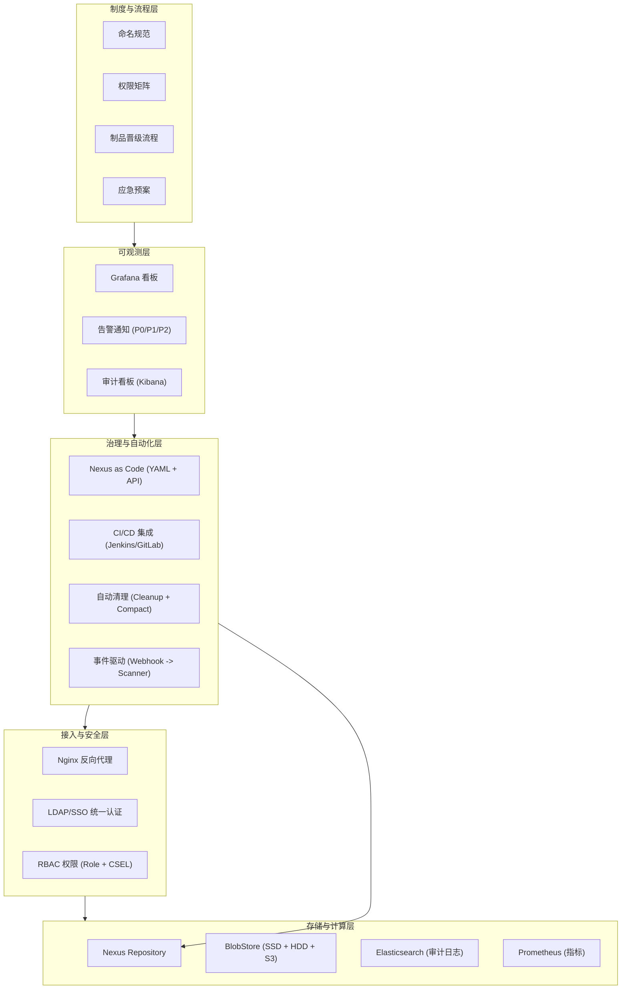

# 第31章：【中级篇综合实战】建设企业级制品治理平台

## 1. 项目背景

云鲸科技从 30 人团队扩张到 300 人规模只用了 18 个月。Nexus 从最初的一个 `default` BlobStore + 三个 Maven 仓库，演变成了 8 个团队 × 4 种格式 × 3 种仓库类型 = 96 个仓库、28 个用户、15 个角色、12 条清理策略、18 个定时任务的复杂体系。炮哥每周要花 4 个小时处理"权限申请"、"仓库创建"、"清理策略调整"、"磁盘水位巡检"等重复性操作。安全团队对审计日志的覆盖度不满意。测试团队抱怨测试环境的制品版本难以追溯。开发团队希望能自助创建仓库而不必等运维排队。

Nexus 已经从一个"制品存储工具"变成了一个"制品治理平台"。治理意味着——**不只是存和取，而是规范、自动化、可观测、可审计、可恢复**。中级篇的 14 章（第 17-30 章）分别解决了仓库规划、元数据治理、前端供应链、Docker 空间回收、缓存稳定性、存储分层、细粒度权限、CI/CD 集成、配置即代码、审计追踪、事件驱动、监控告警、性能调优、故障应急——现在需要把这些能力编织成一张完整的网。

本章将扮演"平台架构师"的角色，为云鲸科技 300 人组织设计一套端到端的制品治理方案——包括五层架构设计、治理制度落地、全自动化工具链、KPI 指标体系，最终交付一份可复制到其他企业的制品治理平台蓝图。

## 2. 项目设计

大师召集了所有组长——炮哥（运维）、阿玲（前端）、老王（Java）、浩子（Docker）、老刘（安全）参加最终方案评审。

**大师**："治理平台分五层。底层是**存储与计算层**（Nexus + BlobStore + ES + Prometheus），负责制品存储、日志采集和指标监控。第二层是**接入与安全层**（Nginx 反向代理 + LDAP/SSO + RBAC 权限），负责路由和认证授权。第三层是**治理与自动化层**（Nexus as Code + CI/CD 集成 + 清理策略 + Webhook），负责日常管理的自动化。第四层是**可观测层**（Grafana 看板 + 审计日志 + 告警），负责状态可见。第五层是**制度与流程层**（命名规范、权限矩阵、发布晋级、故障应急），负责人的行为约束。"

> **技术映射**：制品治理五层模型——存储与计算（Nexus/ES/Prometheus）→ 接入与安全（Nginx/SSO/RBAC）→ 治理自动化（IaC/CI/CD/Cleanup/Webhook）→ 可观测性（Grafana/Audit/Alerting）→ 制度流程（命名规范/权限矩阵/晋级流程/应急预案）。

**炮哥**："自动化工具链具体包括哪些？"

**大师**："六个核心工具。一，`init-platform.sh`——新团队接入一键创建所有仓库和权限（第 16 章）。二，`nexus-as-code.sh`——声明式配置管理引擎（第 25 章）。三，Jenkinsfile + GitLab CI 模板——标准化 CI 发布流程（第 24 章）。四，`audit-search.sh` + `compliance-report.sh`——审计与合规工具（第 26 章）。五，`drift-detect.sh`——配置漂移检测（第 25 章）。六，`nexus-diag.sh`——故障诊断一键采集（第 15 章）。这六件套覆盖了新团队接入、日常变更、CI/CD、合规审计、配置审计、故障排查六大场景。"

**老刘**："安全合规呢？我们怎么向上级和审计方证明制品治理是有效的？"

**大师**："用数据说话。定义四个关键 KPI——**制品覆盖率**（通过 Nexus 管理的制品占全部制品的百分比，目标 > 95%）、**漏洞修复时效**（从 CVE 公布到受影响制品被替换的平均时间，目标 < 72 小时）、**权限合规率**（符合最小权限原则的账号占比，目标 100%）、**审计覆盖率**（被审计日志覆盖的关键操作占比，目标 100%）。每个 KPI 在 Grafana 中有对应的面板，审计时直接导出。"

**阿玲**："前端团队最关心的供应链安全——Nexus 能防护哪些攻击？"

**大师**："四个维度。**防撤回**——proxy 缓存了本地副本，即使 npm 的包被撤回，你们仍然能 install。**防混淆**——通过 scope 权限确保只有你们能发布 `@cloudwhale/*` 的包。**防篡改**——lockfile 中的 integrity 校验确保下载的包与发布时的完全一致。**防投毒**——Webhook 触发 Snyk/Socket 扫描新包，CI 中 `npm audit` 检查已知漏洞。"

## 3. 项目实战

### 3.1 环境准备

- 已部署完整的 Nexus + CI/CD + ELK + Prometheus/Grafana 技术栈
- 第 16-30 章的核心脚本就绪
- Git 仓库用于存放所有配置和脚本

### 3.2 分步实战

#### 步骤一：五层架构总图设计

**目标**：绘制端到端的制品治理架构图。



#### 步骤二：制品治理 KPI 看板

**目标**：用 Grafana 创建治理 KPI 看板，可导出为审计证据。

```bash
#!/bin/bash
# governance-kpi.sh：计算并输出制品治理 KPI
NEXUS="http://nexus:8081"
AUTH="admin:admin123"

echo "=== 云鲸科技制品治理 KPI 报告 ==="
echo "周期: 2025-Q2"
echo ""

# KPI 1: 制品覆盖率（通过 Nexus 管理的制品 vs 总制品数）
echo "--- KPI 1: 制品覆盖率 ---"
TOTAL_COMPONENTS=$(curl -s -u $AUTH "$NEXUS/service/rest/v1/search" | jq '.items | length')
# 实际应统计包含本地构建的总数——这里简化
echo "Nexus 中制品数: $TOTAL_COMPONENTS (需对比各团队的 pom.xml/package.json 中依赖总数)"
echo "目标: > 95%  状态: 待人工评估"
echo ""

# KPI 2: 权限合规率
echo "--- KPI 2: 权限合规率（最小权限原则） ---"
# 检查是否有用户携带 nx-admin 角色（违规）
ADMIN_USERS=$(curl -s -u $AUTH "$NEXUS/service/rest/v1/security/users" | \
  jq '[.[] | select(.roles[] | contains("nx-admin"))] | length')
TOTAL_USERS=$(curl -s -u $AUTH "$NEXUS/service/rest/v1/security/users" | jq 'length')
COMPLIANT=$((TOTAL_USERS - ADMIN_USERS))
COMPLIANCE_PCT=$((COMPLIANT * 100 / TOTAL_USERS))
echo "总用户: $TOTAL_USERS | 合规: $COMPLIANT | 不合规(含nx-admin): $ADMIN_USERS"
echo "合规率: ${COMPLIANCE_PCT}% (目标: 100%)"
echo ""

# KPI 3: 告警响应时效
echo "--- KPI 3: 告警响应时效 ---"
echo "查询 Prometheus Alertmanager 获取本月告警平均响应时间"
echo "curl alertmanager:9093/api/v2/alerts | jq '.[].startsAt'"
echo "目标: P0 < 5min, P1 < 15min, P2 < 60min"
echo ""

# KPI 4: 审计覆盖率
echo "--- KPI 4: 审计覆盖率 ---"
echo "检查 ES 中最近 7 天是否有审计日志缺失的日期"
# for day in 1..7; do check if ES index exists; done
echo "目标: 100%，无审计日志丢失天数"
```

#### 步骤三：全自动化工具链整合

**目标**：将所有工具整合到统一的 `nexus-platform-toolkit` 仓库。

```bash
# 创建工具链目录结构
mkdir -p ~/nexus-platform-toolkit/{scripts,configs,dashboards,docs}

# 工具链清单
cat > ~/nexus-platform-toolkit/README.md << 'EOF'
# Nexus 制品治理平台工具链 v3.0

## 工具索引

| 工具 | 功能 | 使用场景 | 频率 |
|------|------|---------|------|
| init-platform.sh | 新团队一键初始化 | 新团队接入 | 按需 |
| nexus-as-code.sh | 声明式配置管理 | 仓库/权限/策略变更 | 按需 |
| drift-detect.sh | 配置漂移检测 | 配置一致性审计 | 每周 |
| nexus-diag.sh | 故障信息采集 | 故障排查 | 按需 |
| audit-search.sh | 审计日志查询 | 安全审计/事故追溯 | 按需 |
| compliance-report.sh | 合规审计报告 | 季度审计 | 每季度 |
| cache-warmup.sh | 缓存预热 | 新环境搭建/灾后恢复 | 按需 |
| nexus-backup.sh | 全量备份 | 数据保护 | 每日 |
| verify-platform.sh | 部署验收 | 新部署验证 | 按需 |

## 使用流程

1. 新团队接入: init-platform.sh → verify-platform.sh
2. 日常变更: 修改 configs/*.yaml → DRY_RUN=true ./nexus-as-code.sh → 确认 → ./nexus-as-code.sh
3. 每周巡检: drift-detect.sh + Grafana 健康检查
4. 故障响应: nexus-diag.sh → 应急手册 → 故障剧本
5. 季度审计: compliance-report.sh → 提交安全团队
EOF

echo "工具链仓库已建立: ~/nexus-platform-toolkit"
```

#### 步骤四：治理制度文档模板

**目标**：输出 5 份核心治理制度文档。

```markdown
# 云鲸科技制品治理制度 v3.0

## 制度 1：仓库命名规范 (ref: 第17章)
- 格式: <format>-<scope>-<lifecycle>
- 示例: maven-trade-releases, npm-shared-proxy
- 新仓库命名必须经过架构组审批

## 制度 2：权限矩阵 (ref: 第8章 + 第23章)
| 角色 | Maven 读 | Maven 写 | npm 读 | npm 写 | Docker 读 | Docker 写 |
|------|---------|---------|--------|--------|----------|----------|
| Java 开发者 | 全部 | snapshots | 只读 | — | 只读 | — |
| 前端开发者 | 只读 | — | 全部 | hosted | — | — |
| DevOps | 只读 | — | 只读 | — | 全部 | hosted |
| CI 机器人 | — | 指定仓库 | — | 指定仓库 | — | 指定仓库 |

## 制度 3：制品晋级流程 (ref: 第24章)
- SNAPSHOT → (Git Tag) → RELEASE Candidate → (审批) → RELEASE
- RELEASE 发布后禁止覆盖和删除
- 生产环境镜像需走 staged rollout (金丝雀)

## 制度 4：清理策略规范 (ref: 第12章 + 第20章)
| 制品类型 | 保留策略 | 清理频率 |
|---------|---------|---------|
| Maven SNAPSHOT | 保留 14 天 | 每周 |
| npm pre-release | 30 天未下载 | 每周 |
| Docker dev tag | 保留 7 天 | 每周 |
| Docker release tag | 保留最近 5 个版本 | 每月 |
| Maven RELEASE | 永不清理 | — |

## 制度 5：备份与容灾 (ref: 第14章)
- 数据库 + 配置: 每日备份，保留 30 天
- Release BlobStore: 每周备份，保留 4 周
- Proxy 缓存: 不备份（可重新拉取）
- 恢复演练: 每季度一次
```

#### 步骤五：编写"新团队接入自助服务"门户（简化版）

**目标**：提供一个参数化的接入页面，后台自动调用 `init-platform.sh`。

```bash
#!/bin/bash
# team-onboarding.sh：新团队自助接入（参数化）
TEAM_NAME="${1}"
TEAM_FORMATS="${2:-maven,npm}"  # 逗号分隔, 如 maven,npm,docker

if [ -z "$TEAM_NAME" ]; then
    echo "用法: $0 <team-name> [formats]"
    echo "示例: $0 trade maven,npm,docker,raw"
    exit 1
fi

echo "=== 新团队接入: $TEAM_NAME ==="
echo "格式: $TEAM_FORMATS"
echo ""

# 对每种格式创建 Repository 套件
IFS=',' read -ra FORMATS <<< "$TEAM_FORMATS"
for FMT in "${FORMATS[@]}"; do
    echo ">>> 创建 $FMT 仓库套件..."

    case "$FMT" in
        maven)
            # hosted - snapshots
            curl -s -u admin:admin123 -X POST \
              "$NEXUS/service/rest/v1/repositories/maven/hosted" \
              -H "Content-Type: application/json" \
              -d "{\"name\":\"maven-${TEAM_NAME}-snapshots\",\"online\":true,\"storage\":{\"blobStoreName\":\"blob-maven\",\"writePolicy\":\"ALLOW\"},\"maven\":{\"versionPolicy\":\"SNAPSHOT\",\"layoutPolicy\":\"STRICT\"}}"
            # hosted - releases
            curl -s -u admin:admin123 -X POST \
              "$NEXUS/service/rest/v1/repositories/maven/hosted" \
              -H "Content-Type: application/json" \
              -d "{\"name\":\"maven-${TEAM_NAME}-releases\",\"online\":true,\"storage\":{\"blobStoreName\":\"blob-maven\",\"writePolicy\":\"ALLOW_ONCE\"},\"maven\":{\"versionPolicy\":\"RELEASE\",\"layoutPolicy\":\"STRICT\"}}"
            # group
            curl -s -u admin:admin123 -X POST \
              "$NEXUS/service/rest/v1/repositories/maven/group" \
              -H "Content-Type: application/json" \
              -d "{\"name\":\"maven-${TEAM_NAME}-public\",\"online\":true,\"storage\":{\"blobStoreName\":\"blob-maven\"},\"group\":{\"memberNames\":[\"maven-shared-releases\",\"maven-${TEAM_NAME}-releases\",\"maven-${TEAM_NAME}-snapshots\",\"maven-central\"]}}"
            echo "  ✅ maven"
            ;;
        npm)
            curl -s -u admin:admin123 -X POST "$NEXUS/service/rest/v1/repositories/npm/hosted" \
              -H "Content-Type: application/json" \
              -d "{\"name\":\"npm-${TEAM_NAME}-hosted\",\"online\":true,\"storage\":{\"blobStoreName\":\"blob-npm\",\"writePolicy\":\"ALLOW_ONCE\"}}"
            curl -s -u admin:admin123 -X POST "$NEXUS/service/rest/v1/repositories/npm/group" \
              -H "Content-Type: application/json" \
              -d "{\"name\":\"npm-${TEAM_NAME}-public\",\"online\":true,\"storage\":{\"blobStoreName\":\"blob-npm\"},\"group\":{\"memberNames\":[\"npm-${TEAM_NAME}-hosted\",\"npm-proxy\"]}}"
            echo "  ✅ npm"
            ;;
        docker)
            curl -s -u admin:admin123 -X POST "$NEXUS/service/rest/v1/repositories/docker/hosted" \
              -H "Content-Type: application/json" \
              -d "{\"name\":\"docker-${TEAM_NAME}-hosted\",\"online\":true,\"storage\":{\"blobStoreName\":\"blob-docker\",\"writePolicy\":\"ALLOW\"},\"docker\":{\"v1Enabled\":false,\"forceBasicAuth\":true,\"httpPort\":5000}}"
            echo "  ✅ docker"
            ;;
        raw)
            curl -s -u admin:admin123 -X POST "$NEXUS/service/rest/v1/repositories/raw/hosted" \
              -H "Content-Type: application/json" \
              -d "{\"name\":\"raw-${TEAM_NAME}-hosted\",\"online\":true,\"storage\":{\"blobStoreName\":\"blob-raw\",\"writePolicy\":\"ALLOW\"}}"
            echo "  ✅ raw"
            ;;
    esac
done

# 创建基本角色和用户
curl -s -u admin:admin123 -X POST "$NEXUS/service/rest/v1/security/roles" \
  -H "Content-Type: application/json" \
  -d "{\"id\":\"role-${TEAM_NAME}-developer\",\"name\":\"${TEAM_NAME} 开发者\",\"privileges\":[\"nx-repository-view-*-*-read\"],\"roles\":[]}"

echo ""
echo "=== 接入完成 ==="
echo "Maven group url: http://nexus:8081/repository/maven-${TEAM_NAME}-public/"
echo "npm group url:   http://nexus:8081/repository/npm-${TEAM_NAME}-public/"
echo ""
echo "下一步：分配权限、生成客户端配置、通知团队 lead"
```

```bash
chmod +x team-onboarding.sh
./team-onboarding.sh data-platform maven,npm,raw
```

### 3.3 常见坑点

| 坑点 | 现象 | 解决方法 |
|------|------|----------|
| 平台过度自动化 | 新团队接入脚本完美但团队找不到人答疑 | 自助工具 + 人工 15 分钟 onboarding 会议 |
| 治理规范无人遵守 | 规范文档写完了但团队仍按自己的方式做事 | 规范落地靠 CI 阻断而非靠人喊——lockfile 检测、命名校验加到 CI 步骤 |
| 看板变成"墙纸" | Grafana 看板建好后没人看 | 将关键 KPI 投屏到团队公共大屏 + 每周例会用看板数据开头 |
| 制度文档从不过期 | 文档中的权限矩阵还是 3 个月前的 | 每季度强制 review 并打上版本号 |

## 4. 项目总结

### 4.1 中级篇能力全景图

| 维度 | 涵盖章节 | 核心交付物 | 验收标准 |
|------|---------|-----------|---------|
| 仓库治理 | 17, 21, 22 | 仓库矩阵 + 缓存策略 + 存储拓扑 | 每种格式正确响应 |
| 制品治理 | 18, 19, 20 | metadata 管理 + lockfile 规范 + 空间回收 | 无玄学故障 |
| 权限治理 | 8, 23 | RBAC + CSEL 细粒度授权 | 越权操作被拒绝 |
| 自动化治理 | 24, 25 | CI/CD 集成 + IaC | 新团队 10 分钟接入 |
| 可观测性 | 26, 27, 28 | 审计日志 + Webhook 告警 + Grafana | P0 告警 5 分钟内响应 |
| 稳定性治理 | 29, 30 | 性能调优 + 故障演练 | 磁盘满 RTO < 15min |

### 4.2 适用场景

1. **企业规模化**：从 30 人团队级私服升级到 300 人企业级制品治理平台
2. **合规过审**：ISO 27001 / 等保 / SOC2 审计时直接导出 KPI 看板作为证据
3. **多地域扩展**：基于本方案复制到各地域数据中心，通过统一 YAML 配置管理
4. **技术栈多元化**：新增 PyPI/Go/Helm 等格式时套用已有的仓库矩阵模板
5. **平台工程团队建设**：作为内部开发者平台（IDP）的制品管理模块

### 4.3 注意事项

- **不要追求一步到位**：从最痛的点开始（通常是清理策略和权限治理），逐步扩展到全体系
- **自动化是手段不是目的**：规范先于自动化——人们如果不认同规范，再好的自动化脚本也会被绕过
- **治理 ≠ 限制**：好的治理平台让开发感到更方便（一键创建、自助发布），而不是增加负担

### 4.4 思考题

1. 如果公司将 Nexus 从 OSS 版升级到 PRO 版，本章的治理方案中哪些环节可以用 PRO 版特性（如 HA、Staging、FIPS、Repository Replication）做本质性改进？画出升级后的架构图。
2. 设计一个"制品治理成熟度模型"——分为 L1（初始级）、L2（可重复级）、L3（已定义级）、L4（已管理级）、L5（优化级），为每个级别定义具体的行为特征和评估标准。将云鲸科技当前的状态对标到该模型中。

（第30章思考题答案：1. 混沌工程实验设计：使用 `tc`（traffic control）命令在 Nexus 宿主机上注入网络延迟——`tc qdisc add dev eth0 root netem delay 500ms 100ms distribution normal`。观察：Maven 的超时参数（`settings.xml` 中 `<timeout>` 标签）；npm 的 `fetch-retries` 参数；Docker daemon 的 `max-concurrent-downloads`。Nexus 侧可调整 `httpClient.connection.timeout` 和 `retries` 来适应网络波动。2. 告警路由规则：Prometheus Alert → Alertmanager 按 `severity` 和 `alertname` 路由。`NexusDown` → PagerDuty（P0）；`NexusBlobStoreHighUsage` → 自动执行 `nexus-diag.sh` 采集信息 → 检测是否 > 95% → 如果是则自动执行 Cleanup + Compact 并将结果推送钉钉；> 90% 但 < 95% 推送钉钉告警。所有自动操作结果记录到操作审计日志。此即"告警 → 诊断 → 止血 → 通知"的自愈雏形。）

### 4.5 推广计划提示

- **架构组**：审批本章的五层架构设计和治理制度，将其纳入公司技术规范
- **运维部门**：以本章为核心交付物，将"制品治理平台"作为一个正式的内部产品运营
- **所有开发团队**：中级篇至此结束。建议各团队 Lead 阅读本章的治理制度并反馈团队执行中的阻塞点
- **安全团队**：确认 KPI 指标和审计覆盖范围满足公司合规要求
