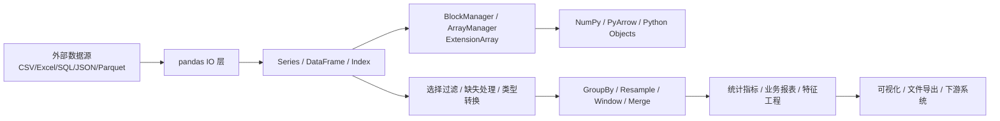

# Pandas 数据分析与源码实战修炼专栏大纲

> 版本：pandas main / 3.x 线
> 面向人群：数据分析师、Python 开发、测试、数据工程师、架构师
> 总章节：40 章（基础篇 16 章 / 中级篇 15 章 / 高级篇 9 章）
> 每章独立成文件，字数 3000-5000 字

---

## 专栏定位

以 pandas 的真实数据处理工作流为主线，从 CSV/Excel 清洗、指标分析、报表交付，到大文件处理、性能调优、测试验证，再到 DataFrame 内部结构、ExtensionArray、自定义访问器与源码贡献。每一章均采用「业务痛点 → 三人剧本对话 → 代码实战 → 总结思考」的四段式结构，理论只服务于实战决策，确保读者能把知识直接迁移到日常项目。

专栏整体节奏遵循由浅入深：基础篇先让读者用 pandas 完成可交付的数据任务；中级篇聚焦复杂数据工程、稳定性、性能和生产化；高级篇进入源码、扩展机制和贡献流程，帮助开发者理解 pandas 为什么这样设计，以及如何安全扩展。

---

## 每章统一写作结构

1. **项目背景**：用一个真实或拟真的业务需求引出主题，例如销售日报、用户留存、订单对账、埋点质量检查、金融行情回测。突出不用 pandas 或误用 pandas 时的痛点。
2. **项目设计**：通过小胖、小白、大师三人剧本式对话，讨论方案选择、边界条件、性能风险和测试策略。每轮对话后可由大师用一句“技术映射”把生活化比喻落到 pandas 概念。
3. **项目实战**：提供环境准备、可运行代码、输入数据样例、输出结果、常见坑、测试验证。优先使用小数据讲清楚，再扩展到中大型数据场景。
4. **项目总结**：给出优缺点、适用场景、不适用场景、版本兼容、性能注意事项、生产踩坑案例和 2 道思考题。

---

## Pandas 工作原理总览

---

## 阅读路线建议

| 角色 | 建议阅读顺序 | 重点章节 |
|------|-------------|---------|
| 新人开发/测试 | 基础篇全读 → 中级篇选读 | 第 1-16 章 |
| 数据分析师 | 基础篇全读 → 中级篇 17-27 章 | 第 5-16、17-27 章 |
| 数据工程师 | 基础篇速读 → 中级篇精读 → 高级篇选读 | 第 17-31、32-36 章 |
| 架构师/资深开发 | 中级篇性能与工程化 → 高级篇源码 | 第 24-40 章 |

---

# 基础篇（第 1-16 章）

> **核心目标**：掌握 pandas 核心对象、常用 API、数据清洗、统计分析和初级项目交付。
> **源码关联**：pandas/core/frame.py、pandas/core/series.py、pandas/core/indexes/base.py、pandas/io/。

---

## 第1章：Pandas 术语全景与 DataFrame 工作原理
**定位**：专栏总览与开篇，建立统一语系。
**核心内容**：
- 术语词典：Series、DataFrame、Index、dtype、missing value、axis、alignment、vectorization、copy-on-write
- DataFrame 的二维表象与内部列式存储思路
- pandas、NumPy、PyArrow、Python object 的协作关系
- 常见误区：把 pandas 当数据库、把 apply 当万能钥匙、忽视 dtype
- 源码关联：pandas/core/frame.py、pandas/core/series.py、pandas/core/internals/、pandas/core/arrays/
**实战目标**：用一份电商订单 CSV 创建 DataFrame，画出从读取、清洗、聚合到导出的处理流程图。

---

## 第2章：环境搭建与第一个销售日报
**定位**：让读者快速跑通完整小项目。
**核心内容**：
- Python、pandas、pyarrow、openpyxl、pytest 的最小环境
- Jupyter Notebook 与脚本化项目的选择
- read_csv、head、info、describe、to_excel 的基础用法
- 用 requirements.txt 或 pyproject.toml 固化依赖
- 源码关联：pandas/io/parsers/readers.py、pandas/io/excel/_base.py
**实战目标**：读取门店销售明细，生成按日期、门店、品类汇总的 Excel 日报。

---

## 第3章：Series、DataFrame 与 Index 的基本操作
**定位**：掌握 pandas 的基础数据模型。
**核心内容**：
- Series 与 DataFrame 的创建、查看、转置、列选择
- Index 的标签语义：RangeIndex、DatetimeIndex、MultiIndex 初识
- 轴的概念：axis=0 与 axis=1 的实际含义
- 对齐机制：为什么不同索引相加会自动对齐
- 源码关联：pandas/core/generic.py、pandas/core/indexes/base.py
**实战目标**：为用户行为日志补齐用户画像列，并验证按 user_id 对齐后的结果是否正确。

---

## 第4章：数据读取实战——CSV、Excel、JSON 一网打尽
**定位**：解决数据分析第一公里问题。
**核心内容**：
- read_csv 常用参数：sep、encoding、dtype、parse_dates、usecols、chunksize
- Excel 多 Sheet 读取与合并
- JSON 扁平化：json_normalize 处理嵌套结构
- 文件路径、编码、日期解析的常见坑
- 源码关联：pandas/io/parsers/readers.py、pandas/io/excel/_base.py、pandas/io/json/_normalize.py
**实战目标**：把客服系统导出的 CSV、财务 Excel、活动 JSON 合并成统一订单宽表。

---

## 第5章：选择、过滤与排序——从表格里精准取数
**定位**：建立安全、可读的数据筛选习惯。
**核心内容**：
- loc、iloc、at、iat 的边界与适用场景
- 布尔索引、isin、between、query 的取舍
- sort_values、sort_index、nlargest、nsmallest
- SettingWithCopyWarning 与 copy-on-write 背后的原因
- 源码关联：pandas/core/indexing.py、pandas/core/frame.py
**实战目标**：从百万订单中筛选高价值异常订单，输出可复核的问题清单。

---

## 第6章：缺失值与异常值清洗
**定位**：让脏数据变成可信数据。
**核心内容**：
- NA、NaN、NaT、None 的差异
- isna、fillna、dropna、interpolate
- 异常值识别：分位数、IQR、业务阈值
- 清洗策略记录与可追溯性
- 源码关联：pandas/core/missing.py、pandas/core/dtypes/missing.py
**实战目标**：清洗商品价格、库存、下单时间异常数据，并生成清洗前后质量报告。

---

## 第7章：数据类型转换与内存优化入门
**定位**：理解 dtype 对正确性和性能的影响。
**核心内容**：
- int、float、object、string、category、datetime、boolean
- astype、to_numeric、to_datetime、convert_dtypes
- category 在低基数字段中的收益
- 内存查看：memory_usage(deep=True)
- 源码关联：pandas/core/dtypes/、pandas/core/arrays/string_.py、pandas/core/arrays/categorical.py
**实战目标**：把一份 2GB 用户画像数据压缩到可在笔记本上分析的规模。

---

## 第8章：字符串、日期与文本字段处理
**定位**：处理业务数据中最常见的非结构化字段。
**核心内容**：
- str 访问器：contains、extract、split、replace、normalize
- 日期解析：to_datetime、dt.year、dt.floor、时区初识
- 正则提取订单号、渠道码、活动 ID
- 文本清洗中的空值与类型陷阱
- 源码关联：pandas/core/strings/、pandas/core/tools/datetimes.py
**实战目标**：从短信营销日志中提取活动、渠道、用户和转化时间，形成可分析明细表。

---

## 第9章：分组统计 GroupBy 入门
**定位**：掌握业务指标计算的核心武器。
**核心内容**：
- split-apply-combine 模型
- groupby、agg、transform、filter 的差异
- 多指标聚合与命名聚合
- as_index、observed、dropna 等参数影响
- 源码关联：pandas/core/groupby/groupby.py、pandas/core/groupby/generic.py
**实战目标**：计算门店销售额、客单价、复购率和 Top 商品榜单。

---

## 第10章：表连接与数据拼接
**定位**：把分散数据整合成业务宽表。
**核心内容**：
- concat、merge、join 的区别
- inner、left、right、outer 连接
- 主键唯一性检查与重复行膨胀
- indicator、validate 参数做连接质量校验
- 源码关联：pandas/core/reshape/merge.py、pandas/core/reshape/concat.py
**实战目标**：合并订单、支付、退款、用户画像，生成一张可用于运营分析的宽表。

---

## 第11章：透视表与交叉分析
**定位**：用 pandas 复刻并超越 Excel 透视表。
**核心内容**：
- pivot、pivot_table、crosstab 的适用场景
- margins、fill_value、aggfunc
- 多维指标看板：行列维度设计
- 与 Excel 透视表结果的校验
- 源码关联：pandas/core/reshape/pivot.py
**实战目标**：构建按城市、品类、月份拆分的销售经营看板。

---

## 第12章：时间序列基础与重采样
**定位**：处理日活、流水、行情等时间型数据。
**核心内容**：
- DatetimeIndex、PeriodIndex、TimedeltaIndex
- resample、asfreq、date_range、shift、diff
- 缺失日期补齐与业务日历
- 移动平均初识
- 源码关联：pandas/core/resample.py、pandas/core/indexes/datetimes.py、pandas/core/window/rolling.py
**实战目标**：分析 App 日活趋势，生成按日、周、月的活跃用户报表。

---

## 第13章：窗口函数与滚动指标
**定位**：构建趋势、波动和异常监控指标。
**核心内容**：
- rolling、expanding、ewm 的区别
- 移动平均、滚动标准差、同比环比
- min_periods、center、closed 参数
- 时间窗口与行数窗口的区别
- 源码关联：pandas/core/window/rolling.py、pandas/core/window/ewm.py、pandas/core/window/expanding.py
**实战目标**：为支付成功率构建 7 日滚动均值、波动预警和异常检测报表。

---

## 第14章：数据导出与报告交付
**定位**：把分析结果变成别人能用的交付物。
**核心内容**：
- to_csv、to_excel、to_json、to_parquet
- ExcelWriter、多 Sheet、格式化、冻结窗格
- Styler 高亮异常指标
- 导出前的数据校验清单
- 源码关联：pandas/io/formats/、pandas/io/excel/_base.py、pandas/io/parquet.py
**实战目标**：输出一份带样式、图表占位和异常标红的经营周报 Excel。

---

## 第15章：Pandas 测试与可复现分析
**定位**：让数据脚本从“能跑”变成“可信”。
**核心内容**：
- assert_frame_equal、assert_series_equal
- 固定随机种子与测试数据夹具
- 数据质量断言：行数、主键、取值范围、空值比例
- 用 pytest 验证清洗函数
- 源码关联：pandas/_testing/、pandas/tests/
**实战目标**：为订单清洗脚本编写 10 个单元测试，防止业务规则被误改。

---

## 第16章：【基础篇综合实战】从原始订单到经营分析报告
**定位**：融会贯通基础篇知识。
**核心内容**：
- 场景：为一家连锁零售公司搭建周度经营分析流程
- 需求拆解：数据读取、清洗、类型优化、关联用户、分组统计、透视分析、报告导出
- 分步实现：脚本化目录、参数配置、测试验证、Excel 交付
- 验收标准：指标可复核、结果可重跑、异常可追踪
**实战目标**：完成一个端到端 pandas 小项目，并沉淀为可复用项目模板。

---

# 中级篇（第 17-31 章）

> **核心目标**：掌握复杂数据处理、生产化数据管道、大文件性能、SQL/Parquet 集成、可观测性和工程协作。
> **源码关联**：pandas/io/、pandas/core/groupby/、pandas/core/reshape/、pandas/core/computation/、pandas/core/window/。

---

## 第17章：复杂清洗管道与链式调用
**定位**：把临时代码整理成可维护的数据流水线。
**核心内容**：
- assign、pipe、where、mask、rename、drop 的组合
- 函数式清洗步骤设计
- 中间结果命名与调试策略
- 链式调用的可读性边界
- 源码关联：pandas/core/frame.py、pandas/core/generic.py
**实战目标**：重构一段 500 行脏数据脚本，形成可测试、可复用的清洗 pipeline。

---

## 第18章：高级 GroupBy 与业务指标体系
**定位**：应对真实业务中的复杂分组指标。
**核心内容**：
- 多层分组、多函数聚合、自定义聚合
- transform 构造用户级、订单级派生指标
- 分组内排序、排名、累计指标
- groupby.apply 的性能风险与替代方案
- 源码关联：pandas/core/groupby/ops.py、pandas/core/groupby/generic.py
**实战目标**：构建会员 RFM 指标、分层运营标签和复购周期分析。

---

## 第19章：MultiIndex 与多维数据建模
**定位**：理解 pandas 的多维表表达能力。
**核心内容**：
- MultiIndex 创建、选择、排序、重排
- stack、unstack、swaplevel、reorder_levels
- 多层索引与宽表/长表转换
- MultiIndex 适用与不适用场景
- 源码关联：pandas/core/indexes/multi.py、pandas/core/reshape/reshape.py
**实战目标**：建立“区域-门店-品类-月份”的多维经营模型。

---

## 第20章：长宽表转换与特征工程
**定位**：为分析、建模和报表选择合适数据形态。
**核心内容**：
- melt、wide_to_long、pivot、get_dummies
- one-hot 编码与 category 的关系
- 特征交叉、分桶、离散化
- 面向机器学习的数据集构建
- 源码关联：pandas/core/reshape/melt.py、pandas/core/reshape/tile.py
**实战目标**：把用户行为明细加工成可用于流失预测的特征表。

---

## 第21章：SQL 数据库集成与增量同步
**定位**：把 pandas 放进企业数据链路。
**核心内容**：
- read_sql、to_sql 与 SQLAlchemy
- 分页读取、增量时间戳、主键去重
- pandas 与数据库职责边界
- 事务、类型映射和时区问题
- 源码关联：pandas/io/sql.py
**实战目标**：从 MySQL 增量拉取订单数据，生成日报后写回分析结果表。

---

## 第22章：Parquet、Arrow 与列式存储实战
**定位**：掌握中大型数据文件的高效存取。
**核心内容**：
- CSV vs Parquet：存储、压缩、类型、读取速度
- pyarrow 引擎与 nullable dtype
- 分区目录设计与列裁剪
- schema 演进与兼容风险
- 源码关联：pandas/io/parquet.py、pandas/core/arrays/arrow/array.py
**实战目标**：把一年订单 CSV 转换为按日期分区的 Parquet 数据集，并对比查询耗时。

---

## 第23章：大文件处理与分块计算
**定位**：在有限内存里处理更大数据。
**核心内容**：
- chunksize 分块读取
- 分块聚合、分块过滤、分块写出
- MapReduce 思路在 pandas 中的简化实现
- 内存峰值监控与失败恢复
- 源码关联：pandas/io/parsers/readers.py
**实战目标**：在 8GB 内存机器上处理 50GB 日志，统计 UV、PV 和错误率。

---

## 第24章：向量化、eval/query 与性能调优
**定位**：少写循环，写出更快的 pandas。
**核心内容**：
- 向量化与 Python for/apply 的性能差异
- where、mask、np.select 替代逐行逻辑
- eval、query、numexpr 的适用场景
- 性能度量：timeit、perf_counter、memory_profiler
- 源码关联：pandas/core/computation/eval.py、pandas/core/computation/expressions.py
**实战目标**：将一段逐行风控规则计算提速 20 倍，并给出性能报告。

---

## 第25章：时间序列进阶与业务日历
**定位**：处理金融、物流、运营中的复杂时间规则。
**核心内容**：
- 时区、本地化、夏令时问题
- DateOffset、BusinessDay、CustomBusinessDay
- resample 与 rolling 的时间边界
- 缺失交易日、节假日和补班日处理
- 源码关联：pandas/tseries/offsets.py、pandas/core/indexes/datetimes.py
**实战目标**：构建 A 股交易日收益率分析与节假日销量预测基线。

---

## 第26章：窗口、排名与漏斗分析
**定位**：用 pandas 完成常见增长分析模型。
**核心内容**：
- rank、cumcount、cumsum、cummax
- 用户路径排序与事件间隔计算
- 漏斗转化、留存、队列分析
- 同一用户多事件去重策略
- 源码关联：pandas/core/groupby/groupby.py、pandas/core/window/rolling.py
**实战目标**：基于 App 埋点日志计算注册、浏览、加购、支付四步漏斗。

---

## 第27章：数据质量监控与异常告警
**定位**：让 pandas 脚本具备生产意识。
**核心内容**：
- 数据质量维度：完整性、唯一性、合法性、及时性、一致性
- 指标漂移与分布变化检测
- 质量报告自动生成
- 告警策略：阈值、环比、同比、分位数
- 源码关联：pandas/core/methods/describe.py、pandas/core/nanops.py
**实战目标**：为每日用户画像表建立质量检查任务，异常时输出定位线索。

---

## 第28章：可视化协作与探索式分析
**定位**：把 pandas 分析结果讲清楚。
**核心内容**：
- plot API 与 matplotlib 的关系
- describe、value_counts、corr 快速探索
- 分布图、趋势图、箱线图、热力图
- Notebook 到脚本的迁移边界
- 源码关联：pandas/plotting/、pandas/core/frame.py
**实战目标**：完成一份用户增长诊断 Notebook，并抽取核心逻辑为可复用脚本。

---

## 第29章：任务调度、日志与参数化运行
**定位**：把 pandas 项目从本地运行推向自动化。
**核心内容**：
- 命令行参数、配置文件、环境变量
- logging 记录输入、输出、耗时、数据量
- cron/Airflow/Prefect 的轻量接入思路
- 幂等运行与失败重试
- 源码关联：pandas/io/common.py
**实战目标**：把经营日报脚本改造成可每天定时运行、失败可重试的任务。

---

## 第30章：Pandas 与其他计算框架协作
**定位**：理解 pandas 的边界，选择合适工具。
**核心内容**：
- pandas、NumPy、PyArrow、Polars、Dask、Spark 的定位
- dataframe interchange protocol
- Arrow-backed dtype 与跨系统传输
- 何时从 pandas 迁移到分布式计算
- 源码关联：pandas/core/interchange/、pandas/core/arrays/arrow/
**实战目标**：对同一份 5GB 数据分别用 pandas、PyArrow、Polars 做读取和聚合对比。

---

## 第31章：【中级篇综合实战】搭建可复用数据分析流水线
**定位**：融会贯通中级篇知识。
**核心内容**：
- 场景：为 SaaS 公司搭建每日用户行为指标流水线
- 功能需求：增量读取、质量校验、特征加工、指标聚合、Parquet 分区、Excel 报告、日志告警
- 架构设计：pandas + SQLAlchemy + PyArrow + pytest + 调度器
- 验收标准：可配置、可测试、可重跑、可观测，百万级数据 10 分钟内完成
**实战目标**：交付一个接近生产可用的数据分析项目骨架。

---

# 高级篇（第 32-40 章）

> **核心目标**：理解 pandas 源码核心链路、内部存储、扩展机制、性能瓶颈和贡献流程。
> **源码关联**：pandas/core/internals/、pandas/core/arrays/、pandas/core/groupby/、pandas/core/indexing.py、pandas/tests/。

---

## 第32章：NDFrame、Series、DataFrame 源码入口
**定位**：从使用者进入源码读者视角。
**核心内容**：
- NDFrame 抽象与通用方法复用
- Series/DataFrame 构造流程
- 方法分发、属性访问、访问器注册
- public API 与内部 API 的边界
- 源码关联：pandas/core/generic.py、pandas/core/series.py、pandas/core/frame.py
**实战目标**：跟踪 DataFrame 构造一份混合类型数据的调用链，并绘制源码阅读路线图。

---

## 第33章：Index 引擎与对齐机制源码剖析
**定位**：理解 pandas 自动对齐的底层逻辑。
**核心内容**：
- Index 不可变语义与查找引擎
- get_loc、reindex、align 的核心流程
- RangeIndex、DatetimeIndex、MultiIndex 的差异
- 对齐带来的便利与性能成本
- 源码关联：pandas/core/indexes/base.py、pandas/core/indexes/range.py、pandas/core/indexes/multi.py
**实战目标**：构造 3 个索引对齐案例，定位性能差异并解释原因。

---

## 第34章：BlockManager、ArrayManager 与列式存储
**定位**：理解 DataFrame 内部如何存放数据。
**核心内容**：
- Block、BlockManager、SingleBlockManager
- 同类型列合并存储与拆分
- ArrayManager 的设计动机
- copy-on-write 对内部结构的影响
- 源码关联：pandas/core/internals/blocks.py、pandas/core/internals/managers.py、pandas/core/internals/construction.py
**实战目标**：观察不同 dtype DataFrame 的内部 blocks，解释一次赋值为何触发拷贝。

---

## 第35章：ExtensionArray 与自定义数据类型
**定位**：掌握 pandas 类型系统的扩展能力。
**核心内容**：
- ExtensionDtype、ExtensionArray 接口
- nullable integer、string、boolean、arrow array 的实现思路
- take、isna、astype、factorize 的协议
- 自定义 dtype 的测试基类
- 源码关联：pandas/core/arrays/base.py、pandas/core/dtypes/base.py、pandas/tests/extension/
**实战目标**：实现一个 MoneyArray，支持币种、金额、缺失值和基础聚合。

---

## 第36章：GroupBy 源码与聚合性能路径
**定位**：理解 pandas 指标计算的性能核心。
**核心内容**：
- Grouper、codes、levels 的构建
- cython 聚合路径与 Python fallback
- agg、transform、apply 的执行差异
- category observed 参数对分组结果的影响
- 源码关联：pandas/core/groupby/grouper.py、pandas/core/groupby/ops.py、pandas/core/groupby/generic.py
**实战目标**：对比 sum、自定义函数、apply 三种聚合路径的调用链和性能差异。

---

## 第37章：IO 子系统源码与解析器扩展
**定位**：理解 pandas 如何把外部数据变成 DataFrame。
**核心内容**：
- read_* API 的统一入口与参数校验
- CSV C 引擎、Python 引擎、PyArrow 引擎差异
- Excel、JSON、Parquet 的适配层
- dtype 推断、日期解析、NA 值识别
- 源码关联：pandas/io/parsers/readers.py、pandas/io/parsers/c_parser_wrapper.py、pandas/io/parquet.py、pandas/io/excel/_base.py
**实战目标**：为一个自定义日志格式编写读取函数，输出标准 DataFrame 并添加测试。

---

## 第38章：自定义 Accessor 与领域 API 设计
**定位**：把团队业务规则封装成 pandas 原生体验。
**核心内容**：
- register_dataframe_accessor、register_series_accessor
- Accessor 的状态、缓存与校验
- API 命名、错误信息和文档示例
- 与 monkey patch 的风险对比
- 源码关联：pandas/core/accessor.py、pandas/tests/test_register_accessor.py
**实战目标**：开发 df.marketing 留存分析访问器，支持 funnel、retention、cohort 三类方法。

---

## 第39章：性能剖析、内存模型与极端场景优化
**定位**：解决慢、爆内存、结果不稳定的疑难问题。
**核心内容**：
- CPU profiling、memory profiling、line_profiler
- object dtype、碎片化、隐式拷贝、临时对象
- NumPy、Numba、Cython、PyArrow 的加速选择
- 算法复杂度优先于 API 微调
- 源码关联：pandas/core/algorithms.py、pandas/core/nanops.py、pandas/core/array_algos/
**实战目标**：把一个 30 分钟的用户标签任务优化到 3 分钟以内，并形成优化复盘报告。

---

## 第40章：【高级篇综合实战】从需求到源码贡献
**定位**：融会贯通高级篇知识，完成一次开源级交付。
**核心内容**：
- 场景：为 pandas 增强一个边界场景行为或修复一个真实 bug
- 贡献流程：issue 复现、最小失败测试、源码定位、实现修复、文档说明、发布说明
- 测试策略：单元测试、参数化测试、兼容性测试、性能风险评估
- 代码规范：类型标注、numpydoc、CI、向后兼容
- 源码关联：pandas/tests/、doc/source/development/、pandas/_testing/
**实战目标**：完成一个小型 pandas 修复 PR 的全流程演练，达到可提交社区评审的质量。

---

# 附录与资源

## 附录 A：源码阅读路线图
1. 入口对象：pandas/core/frame.py、pandas/core/series.py
2. 索引与选择：pandas/core/indexes/、pandas/core/indexing.py
3. 内部存储：pandas/core/internals/、pandas/core/arrays/
4. 计算链路：pandas/core/groupby/、pandas/core/window/、pandas/core/reshape/
5. IO 链路：pandas/io/
6. 测试样例：pandas/tests/

## 附录 B：推荐实战数据集
- 电商订单、支付、退款、商品、用户画像
- App 埋点日志、注册登录日志、转化漏斗数据
- 股票行情、交易日历、财务报表
- 客服工单、短信营销、广告投放明细

## 附录 C：推荐工具链
- 环境：uv、pip、conda、venv
- 开发：JupyterLab、VS Code/Cursor、pytest、ruff
- 存储：CSV、Excel、JSON、Parquet、SQLite、MySQL、PostgreSQL
- 性能：timeit、memory_profiler、line_profiler、py-spy
- 质量：pytest、pandera、Great Expectations

## 附录 D：推广计划建议
- 开发：重点阅读第 1-16 章、第 24 章、第 32-40 章，理解 API 设计、性能路径和源码扩展。
- 测试：重点阅读第 5-16 章、第 27 章、第 40 章，掌握数据质量断言、边界用例和回归测试。
- 数据分析：重点阅读第 1-28 章，优先完成每章实战项目。
- 运维/数据平台：重点阅读第 21-31 章，关注调度、日志、数据质量和资源消耗。
- 架构师：重点阅读第 30-40 章，评估 pandas 与其他数据框架的协作边界。

---

> **版权声明**：本专栏基于 pandas 官方源码（BSD-3-Clause License）与公开开发文档编写，所有源码引用均遵循原许可证条款。
