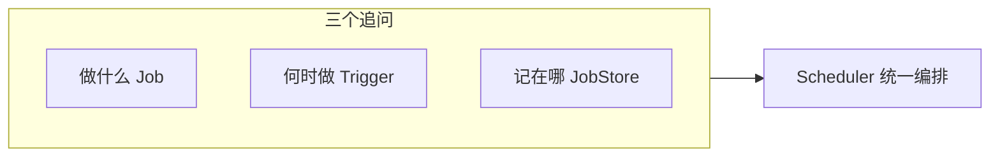
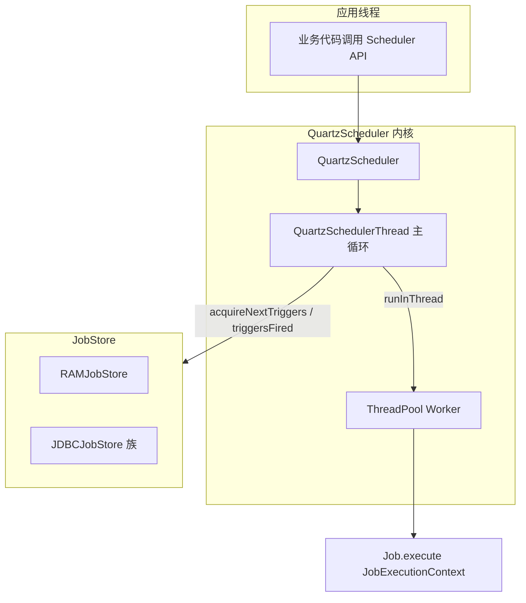

# 第00章：术语地图与工作原理：从「谁、何时、记在哪」读懂 Quartz

> **篇别**：基础篇（导读）  
> **建议篇幅**：3000–5000 字（含对话与代码）  
> **结构约束**：对齐 [专栏模板](../template.md) 四段式；并承担模板「开头章节：术语、工作原理与架构图」导读定位。

## 示例锚点

| 类型 | 路径 |
| --- | --- |
| 概念 | [readme.adoc](../../readme.adoc) |
| example1 | [SimpleExample.java](../../examples/src/main/java/org/quartz/examples/example1/SimpleExample.java) |
| 文档索引 | [docs/index.md](../../docs/index.md) |

## 1 项目背景（约 500 字）

### 业务场景

某金融科技公司的「清算与对账」平台刚合并了两支团队：一支习惯在业务代码里手写 `while+sleep` 轮询，另一支已经在若干微服务里嵌了 Quartz。新同学打开 Wiki，满眼是 **`Scheduler` / `JobDetail` / `Trigger` / `JobStore` / `misfire`** 等英文标识，却在排障时说不清「到底是调度线程没抢到触发器，还是工作线程在执行 Job 时卡死」。项目经理希望在正式阅读第01章选型对比之前，先有一份 **术语地图** 与 **一次完整的主线走读**：新人能在白板上画出「谁决定何时跑、状态记在哪、线程如何分工」，老员工review设计时也能对齐词汇，避免「把 Trigger 当队列消息」这类概念漂移。

### 痛点放大

| 现象 | 常见根因（概念层面） |
| --- | --- |
| 日志里同时出现 `QuartzSchedulerThread` 与业务线程栈，不知道先看谁 | 未区分 **调度线程**（拉取与触发）与 **工作线程**（执行 `Job#execute`） |
| 以为「删了 Job 类就安全了」，重启后仍报错 | 混淆 **`Job` 接口实现类** 与持久化在库里的 **`JobDetail` 元数据** |
| 集群下偶发双跑或长时间不跑 | 未理解 **`JobStore` + 锁 + `instanceId`** 的协作边界 |
| 大促后一批任务「补跑」不符合财务口径 | 未读 **`misfireInstruction`** 与 **Trigger 类型** 的组合语义 |



若缺少统一术语表，**可维护性**会下降（Code Review 各说各话），**可观测性**难以落地（指标与日志字段对不上模型），**事故复盘**则容易停留在「线程满了」而说不清调度层责任边界。

补充一张「**对象—职责**」速查表，便于与架构图对照记忆（后文各章会逐项展开，此处只建立索引）：

| 术语 | 一句话职责 | 后续章节索引 |
| --- | --- | --- |
| `Job` | 承载业务逻辑的 **执行入口** | 第02、16章 |
| `JobDetail` | 可被调度与持久化的 **Job 定义 + 身份** | 第04章 |
| `Trigger` | 描述 **何时、重复、结束、错过触发策略** | 第05–08、14章 |
| `JobDataMap` | 附在 `JobDetail`/`Trigger` 上的 **键值参数** | 第09章 |
| `Scheduler` | 对外 **门面**：注册、启停、暂停、查询 | 第02、03章 |
| `JobStore` | **触发与作业状态** 的存储与并发控制 | 第11、21、24、30章 |
| `ThreadPool` | **真正执行** `Job#execute` 的工人池 | 第11、26章 |
| `Listener` | 调度生命周期上的 **扩展钩子** | 第17章 |

## 2 项目设计（约 1200 字）

**角色**：小胖（生活化提问）· 小白（边界与风险）· 大师（选型与比方）

---

**小胖**：这不就定时跑个方法吗？我记三个词够不够：**任务、时间、线程池**？

**小白**：我追问边界——「任务」在 Quartz 里到底是 `Job` 类，还是带名字的那坨配置？时间若是 Cron，和「延迟队列」里的消息 TTL 是一回事吗？

**大师**：可以先用你这三个词起步，但 Quartz 刻意把概念掰开：**`Job` 是「怎么做」**（实现接口的类），**`JobDetail` 是「这是哪一份工」**（含 `JobKey` 的 name/group、描述、默认 `JobDataMap`）。时间也不是泛泛的 schedule，而是 **`Trigger` 家族**（`SimpleTrigger`、`CronTrigger` 等）各自描述 **起止、重复、日历排除、错过触发怎么办**。线程池只管「谁来干活」，不负责「下一枪何时响」——那是 **`QuartzSchedulerThread` + `JobStore`** 的事。

**技术映射**：背熟 **「JobDetail + Trigger → 交给 `Scheduler`；运行时由 `JobStore` 维护状态；`ThreadPool` 执行 `execute`」** 这一句，就拿到了阅读官方文档与后续各章的主线。

---

**小胖**：那 **`Scheduler`** 本人干啥？我就当它是 Spring 的 `TaskScheduler` 行不行？

**小白**：`standby`、`pauseAll`、`rescheduleJob` 这些 API 和「只提交 Runnable」相比，多了哪些持久化副作用？如果 `RAMJobStore`，重启后 `Trigger` 还在吗？

**大师**：可以把 **`Scheduler` 想成车站值班室**：对外卖票（`scheduleJob`）、改签了（`rescheduleJob`）、临时停运（`pauseJob`）、关站（`shutdown`）。它不等于「一个线程池提交器」——底层是 **`QuartzScheduler` 实现 + 调度线程循环**。`RAMJobStore` 下，**进程一挂，票根全没**；换成 **JDBC JobStore**，票根在库里，另一台进程上的值班室还能接着卖（集群语义，见第21、24章）。

**技术映射**：**`Scheduler` = 门面 API；`JobStore` = 真相来源（Source of Truth for firing state）**。

---

**小胖**：文档里还有什么 **`OperableTrigger`**、**`Calendar`**，是不是为了劝退新手？

**小白**：`HolidayCalendar` 和 Cron 里写死「跳过周末」有什么取舍？`misfireThreshold` 调大调小各自坑在哪？

**大师**：**`Calendar`（注意不是 `java.util.Calendar`）** 是挂在 **`Trigger` 上的时间过滤器**：例如「法定假日不触发」，多个 Trigger 可共享同一日历对象。**`OperableTrigger`** 多是源码与扩展作者视角——表示触发器在运行期可被调度内核 **计算下一次发射时间、标记已触发、处理 misfire**。新手读日志不必背接口名，但要知道：**misfire = 实际发射时间晚于「本应该」的窗口**，具体补救策略看 **`misfireInstruction`** 与各 Trigger 实现；**`misfireThreshold`** 则是「晚多久还算 misfire」的容忍毫秒，需要和业务 SLA、线程池容量一起调（第11、14章展开）。

**技术映射**：**日历 = 排除语义；misfire = 调度语义；Instruction = 可配置补救策略**。

---

**小胖**：那些 **`@DisallowConcurrentExecution`** 注解我背下来了，但到底拦的是「同一个 Job 类」还是「同一个 JobKey」？

**小白**：如果同一个 `JobDetail` 被两个不同 `Trigger` 同时点到名，阻塞语义怎么算？和「线程池只有两个 worker」是不是容易搞混？

**大师**：**并发注解约束的是「落到同一 `JobDetail`（同一 `JobKey`）上的执行重叠」**，不是笼统地禁止 JVM 里出现两个你的 `Job` 类实例——不同 `JobKey` 各跑各的。两个 Trigger 若指向 **同一份 `JobDetail`**，在 `@DisallowConcurrentExecution` 下 **第二次触发会等待或被拒**（与具体 Store、misfire 配置有关）；而「线程池只有两个 worker」是 **全局吞吐** 限制，可能造成 **任何 Job 排队**，二者解决的是不同层面的瓶颈。另一个常见对 **`@PersistJobDataAfterExecution`** 的误解是把它当成通用数据库——它指的是 **把 `JobDataMap` 的变更写回 `JobDetail` 存储视图**，方便带状态的分片处理，而不是替代业务 DAO。

**技术映射**：**「单 JobDetail 串行」≠「单线程池串行」；「JobDataMap 回写」≠「业务落库」**。

---

**小胖**：这跟食堂打饭有啥关系？我就想把任务跑起来。

**小白**：那 **谁来背锅**：触发没发生、发生了两次、还是延迟太久？指标口径先定死。

**大师**：把 **Scheduler 当「编排台」**：Job 是工序，Trigger 是节拍，Listener 是质检；节拍错了，工序再快也白搭。

**技术映射**：**可观测性口径 + Job／Trigger 职责边界**。

---

**小胖**：配置一多我就晕，`quartz.properties` 到底哪些能碰？

**小白**：**线程数、misfireThreshold、JobStore 类型** 改了会不会让 **同一套代码** 在预发与生产行为不一致？

**大师**：做一张 **「配置变更矩阵」**：改一项就写清 **影响面、回滚方式、验证命令**；RAM 与 JDBC 不要混着试。

**技术映射**：**显式配置治理 + 环境一致性**。

---

**小胖**：我本地跑得飞起，一上集群就「偶尔不跑」。

**小白**：**时钟漂移、数据库时间、JVM 默认时区** 三者不一致时，**nextFireTime** 你怎么解释给业务？

**大师**：把 **时区写进契约**：服务器、Cron、业务日历 **同一基准**；日志里同时打 **UTC 与业务时区**。

**技术映射**：**时区／DST 与触发语义**。

---

**小胖**：Trigger 优先级是不是数字越大越牛？

**小白**：**饥饿**怎么办？低优先级永远等不到的话，SLA 谁负责？

**大师**：优先级是 **「同窗口抢锁」** 的 tie-breaker，不是万能插队票；该 **拆分队列** 的别硬挤一个 Scheduler。

**技术映射**：**Trigger 优先级与吞吐隔离**。

---

**小胖**：misfire 不就是晚了吗，晚跑一下不行？

**小白**：**合并、丢弃、立即补偿** 三种策略对 **资金类任务** 分别是啥后果？

**大师**：把 **业务幂等键** 与 **misfireInstruction** 绑在一起评审；没有幂等就别选「立刻全部补上」。

**技术映射**：**misfire 策略与业务一致性**。
## 3 项目实战（约 1500–2000 字）

本章实战目标不是新写业务系统，而是 **在仓库内完成一次「术语—源码入口」对照实验**，并能口述 **一次触发从 `JobStore` 到 `Job` 的路径**。

### 环境准备

- **JDK**：与本仓库 `build.gradle` 一致（建议 JDK 17+）。
- **构建**：仓库根目录执行 `./gradlew :examples:classes`（Windows 可用 `gradlew.bat`）。
- **依赖坐标**（若在你自己的空白 Maven 工程中复刻）：`org.quartz-scheduler:quartz`（版本以 [Quartz 官网](https://www.quartz-scheduler.org/documentation/) 为准）。

### 分步实现

**步骤 1：目标** —— 打开 example1，把 **类名** 映射到 **术语**。

请阅读 [SimpleExample.java](../../examples/src/main/java/org/quartz/examples/example1/SimpleExample.java)，在纸上（或注释里）标注：

| 代码符号 | 术语角色 |
| --- | --- |
| `StdSchedulerFactory` | **`SchedulerFactory`**：读取默认 `quartz.properties` 装配组件 |
| `scheduler.getSchedulerName()` | **调度器逻辑名**（多调度器场景用于区分） |
| `JobBuilder.create(...).withIdentity(...)` | 构建 **`JobDetail`**，得到稳定 **`JobKey`** |
| `TriggerBuilder.newTrigger().withIdentity(...)` | 构建 **`Trigger`**，得到 **`TriggerKey`** |
| `scheduler.scheduleJob(job, trigger)` | **注册**：把「工」与「表」交给 `Scheduler` |
| `scheduler.start()` | **启动调度线程**；此前注册也会排队，语义细节见第03章 |

**运行结果（文字描述）**：控制台依次出现工厂初始化、`Scheduler` 元信息打印、`HelloJob` 在触发时刻输出 `Hello World!`，最后 `shutdown(true)` 带等待语义退出。

**可能遇到的坑**：IDE 未把 `examples` 模块加入 classpath 导致找不到 `HelloJob`；解决方式是按仓库 Gradle 结构运行 `example1` 的 `main`。

---

**步骤 2：目标** —— 用 **最小代码** 在本地工程打印 `SchedulerMetaData`，把抽象名词变成可观察字段。

**步骤目标**：验证当前调度器是否 **远程、持久化、集群** 等开关（读元数据比猜 `properties` 更直观）。

```java
import org.quartz.*;
import org.quartz.impl.StdSchedulerFactory;

public class MetadataProbe {
  public static void main(String[] args) throws Exception {
    Scheduler scheduler = new StdSchedulerFactory().getScheduler();
    SchedulerMetaData md = scheduler.getMetaData();
    // 下面这些 getter 把「术语」落到布尔/数值上
    System.out.println("summary: " + md.getSummary());
    System.out.println("started: " + md.isStarted());
    System.out.println("jobStoreSupportsPersistence: " + md.isJobStoreSupportsPersistence());
    System.out.println("jobStoreClustered: " + md.isJobStoreClustered());
    System.out.println("threadPoolSize: " + md.getThreadPoolSize());
    scheduler.shutdown(false);
  }
}
```

**验证**：默认配置下通常观察到 **非持久化 RAMJobStore**、**非集群**、`threadPoolSize` 与 `quartz.properties` 中 `org.quartz.threadPool.threadCount` 一致（具体以你本地默认文件为准）。

**可能遇到的坑**：把 `isJobStoreSupportsPersistence()` 误读成「当前是否已连上生产库」——它表达的是 **JobStore 实现能力**，不是数据源健康检查。

---

**步骤 3：目标** —— 对照下面 **架构示意图**，在源码树中各找 **一个类名** 对应上节点（训练「看见线程栈不慌」）。

### Quartz 运行时架构（简化）

下列示意图描述 **最常见本地进程内调度** 的主路径；RMI 远程、JTA 事务化 JobStore 等变体在后续章节叠加，但 **「调度线程 + JobStore + 线程池」** 三角不变。



**读图要点（工作原理一口气版）**：

1. **`QuartzSchedulerThread`**（调度线程）按配置节奏唤醒，向 **`JobStore`** 询问「接下来该点名的 **`Trigger`** 有哪些」，并在触发时刻尝试 **占用/更新** 这些触发器（RAM 与 JDBC 的锁粒度不同）。
2. 当触发器到期且被成功认领后，调度线程把 **可运行的 `JobRunShell`**（外壳）交给 **`ThreadPool`**；真正的 **`Job#execute`** 在工作线程里跑，从而 **调度与业务执行解耦**。
3. **`JobStore`** 在每次触发前后维护 **`Trigger` 状态**（如 `nextFireTime`、已完成次数、misfire 标记）；**`JobDetail`** 是否每次从存储装载取决于 Store 与配置，但 **「身份与默认参数」** 始终围绕 **`JobKey`** 展开。
4. **`SchedulerListener` / `TriggerListener` / `JobListener`**（第17章）插在上述边界的「事件缝」里，用于指标、审计、链式触发等，不改变三角主路径。

**`JobExecutionContext` 里该盯哪些字段？** 新人读栈时建议优先扫：**`JobDetail`/`Trigger` 的副本或引用**（确认 **Key** 与版本）、**`ScheduledFireTime` 与 `FireTime`**（判断是否补火）、**`Recovering`/`RefireCount`**（是否与 misfire 或恢复路径相关）、**合并后的 `JobDataMap`**（Trigger 覆盖 Detail 的键规则以文档为准）。这些字段把 **「这一次到底为什么执行」** 从黑盒里拉出来，是连接 **业务日志** 与 **调度日志** 的桥梁。

**SPI 鸟瞰（只记名字即可）**：`ThreadPool`、`JobStore`、`JobFactory`、`InstanceIdGenerator` 等均可被 **工厂 + properties** 替换（第28、33章）。默认实现足以跑通大部分业务；只有当你要 **接入定制线程池、复用容器托管 Bean、或改变实例 ID 生成策略** 时，才需要深入 SPI。过早抽象这些接口，反而会让团队 **跳过对三角主路径的掌握**。

**可能遇到的坑**：在 JDBC 集群下看到数据库连接池活跃，就误以为「业务 SQL 慢」——有时是 **`JobStoreSupport` 抢锁重试** 或 **大量 misfire 补偿**；需要结合 **QRTZ_ 表行数、索引与 `misfireThreshold`** 一起看。

---

**步骤 4：目标** —— 建立 **「集群相关名词」** 的最小认知，避免与 **应用集群** 混为一谈。

阅读默认 `quartz.properties`（可由 `StdSchedulerFactory` 使用的 classpath 资源）时，请刻意圈出三组词：

1. **`org.quartz.scheduler.instanceName`**：逻辑调度器名称，多应用共存时用于隔离 **同一库里的行**（配合表前缀）。
2. **`org.quartz.scheduler.instanceId`**：实例标识，`AUTO` 时常为 **主机+时间戳** 风格；集群心跳与「谁持有锁」都依赖 **可区分实例**。
3. **`org.quartz.jobStore.isClustered`**：是否为 **Quartz 集群模式**（与 K8s 副本数不是同义词——K8s 只管 Pod，**Quartz 集群管的是「多 JVM 共抢同一 JobStore」**）。

**验证（书面即可）**：用自己的话写三句话，说明 **「两个 Spring Boot 副本 + JDBC JobStore + `isClustered=true`」** 时，**同一 `TriggerKey` 仍只会被一个实例认领** 的直觉原因（答案线索在第24章：行锁或语义等价物 + 集群检查线程）。

**可能遇到的坑**：把 **`instanceName` 相同** 的多套环境指到 **同一数据库** 却不改表前缀——会导致 **触发器互相可见、极难排查的串扰**；根因是 **元数据命名空间** 设计缺失。

### 完整代码清单

- 本仓库示例：[examples/example1](../../examples/src/main/java/org/quartz/examples/example1)
- 核心实现入口：`org.quartz.impl.StdSchedulerFactory`、`org.quartz.core.QuartzScheduler`（包名以你检出版本为准）。

### 测试验证

- **静态**：在 IDE 中对 `QuartzSchedulerThread` 做「查找引用」，限制在 `quartz` 模块，确认其 **只依赖 `JobStore` 与 `ThreadPool` 抽象**，不直接绑定具体业务 Job。
- **动态**：对 `SimpleExample` 打线程 dump，应能同时看到 **名为 `QuartzSchedulerThread` 的线程** 与 **线程池 worker**；对照本节架构图口述一次触发路径即通过自测。

## 4 项目总结（约 500–800 字）

### 优点与缺点（对照「无模型手写调度」）

| 维度 | 采用 Quartz 显式模型 | 手写 sleep/线程池轮询 |
| --- | --- | --- |
| 概念边界 | Job / Trigger / Store 分离，文档与栈可追溯 | 边界混在业务类里，排障靠猜 |
| 时间表达 | Cron、日历、misfire 策略内建表达力强 | 复杂日历易写成「补丁套补丁」 |
| 持久化与集群 | 可渐进启用 JDBC 与集群（成本随规模上升） | 全自建，一致性风险高 |
| 学习成本 | 名词多，需一次「术语地图」投资 | 上手快，长期演化成本高 |
| 观测友好度 | Listener + 元数据字段成熟 | 需自行埋点，易漏关键状态 |

### 适用 / 不适用场景

- **适用**：希望团队共享 **同一套调度词汇** 做设计与 on-call；要在单进程内表达 **多 Trigger 驱动同一 Job**。
- **适用**：准备上 **持久化 / 集群**，需要先把 **JobStore 真相来源** 讲清楚再动表结构。
- **适用**：培训新人，用本章架构图 + example1 做 **半天 onboarding**。
- **不适用**：仅需要「每隔 N 秒调个方法」且无任何日历与审计需求——可评估更轻量方案，避免过度工程。
- **不适用**：把 Quartz 当 **无限堆积的任务队列**（应使用 MQ / 工作流，见第01章边界）。

### 注意事项

- **`Job` 与 `JobDetail`**：面试与评审时常混；记住 **Detail 是「被调度的实体配置」**，`Job` 类只是执行逻辑载体。
- **`Scheduler` 线程安全**：对外 API 设计为可从多线程调用，但 **业务 `Job` 内仍要避免阻塞式调用整个 `Scheduler`**（防止自锁）。
- **默认 RAM**：适合学习与集成测试；上生产前务必完成 **持久化、停机、Misfire、命名规范** 清单评审。

### 常见踩坑（生产案例）

1. **把 `TriggerKey` 当日志主键却省略 `JobKey`**：排障时无法定位 **实现类与参数版本**；根因是元数据模型理解不完整。
2. **线程池打满仍疯狂 `scheduleJob`**：吞吐由 **`threadCount` 与 Job 耗时** 决定，不是「注册越多越快」；根因是混淆 **调度队列** 与 **执行并发度**。
3. **升级 Quartz 大版本后反序列化失败**：`JobDataMap` 与持久化 `JobDetail` 绑定 **类全名与兼容序列化**；根因是缺少 **灰度与数据迁移** 预演（第40章 SRE 视角）。
4. **误把 `requestsRecovery` 当「自动重试业务失败」**：该标志侧重 **调度器崩溃后的恢复语义**（与 `JobStore` 中未完成实例记录相关），**不等于** 业务返回码失败后的重试策略；根因是混淆 **基础设施故障** 与 **业务失败**。
5. **`Scheduler#standby` 与 `pauseAll` 混用**：前者多表示 **整调度器进入待机**（具体语义以版本与调用顺序为准），后者是 **暂停全部触发**；线上脚本若写错，会出现「以为停了其实还在跑」或反之；根因是 **未读 API 契约与监控探针**。

### 思考题（答案见下一章或 [答案索引](answers-index.md)）

1. 用你自己的话描述：**从 `QuartzSchedulerThread` 醒来到 `Job#execute` 被调用**，中间至少经过哪三个关键抽象协作？
2. 在 **默认 RAMJobStore** 下，进程崩溃后重启，**已注册但未完成的重复触发器** 是否一定丢失？为什么？

### 推广计划提示

- **测试**：验收标准为「能不看文档画出三角架构图 + 解释 `JobDetail` 与 `Job` 差异」。
- **运维**：与 on-call 对齐 **调度线程 vs 工作线程** 的线程名，避免 JVM 告警误判方向。
- **开发**：下一章（第01章）开始选型对比 Timer / Executor / `@Scheduled`，请携带本章 **术语表** 参与讨论。
