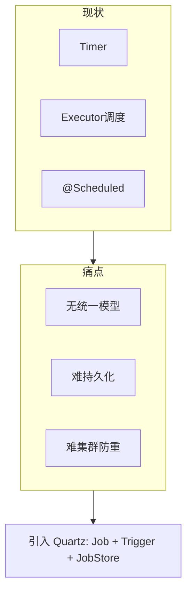

# 第01章：为什么需要 Quartz：与 Timer、ScheduledExecutor、Spring `@Scheduled` 的差异

> **篇别**：基础篇  
> **建议篇幅**：3000–5000 字（含对话与代码）  
> **结构约束**：对齐 [专栏模板](../template.md) 四段式。

## 示例锚点

| 类型 | 路径 |
| --- | --- |
| 概念 | [readme.adoc](../../readme.adoc) |
| 文档索引 | [docs/index.md](../../docs/index.md) |

## 1 项目背景（约 500 字）

### 业务场景

某电商后台需要「报表错峰生成」：每天凌晨汇总前一日订单，并在白天按固定间隔重算促销看板。初期团队用 `java.util.Timer` 在单节点上注册多个 `TimerTask`，后来又混入了 `ScheduledExecutorService` 与 Spring `@Scheduled`。随着实例扩容与发布频率提高，出现「任务重复执行、重启后丢失、某次大促线程池被打满后整批任务静默掉队」等现象。技术负责人要求统一调度层：既要支持复杂日历（工作日、节假日排除），又要为后续持久化与集群预留空间——这正是引入 **Quartz Scheduler** 的典型契机。

### 痛点放大

| 方案 | 典型问题 |
| --- | --- |
| `Timer` | 单线程串行，一个任务抛异常可能影响后续；无持久化；难以表达 Cron 语义。 |
| `ScheduledExecutorService` | 需自建「错过触发补偿、持久化、分布式互斥」；多 Trigger 与 Job 生命周期管理成本高。 |
| Spring `@Scheduled` | 与 Spring 生命周期强绑定；集群需额外防重（分布式锁/数据库标记）；复杂 misfire 策略与日历不如 Quartz 成熟。 |



没有统一调度抽象时，**可维护性**下降（日志与监控分散）、**一致性**难以证明（重复执行与漏执行边界不清），**性能**问题常被误判为「业务慢」而实为「调度与线程资源模型不匹配」。

## 2 项目设计（约 1200 字）

**角色**：小胖（生活化提问）· 小白（边界与风险）· 大师（选型与比方）

---

**小胖**：这不就跟手机设个闹钟吗？搞个线程池 `scheduleAtFixedRate` 不就行了，为啥还要整 Quartz 这么大一套？

**小白**：我关心的是边界——如果进程重启，谁记得「上一次到底执行到哪」？还有大促时线程全在跑重任务，短周期任务会不会悄悄过期？

**大师**：闹钟只管「到点响一次」；企业调度要管 **Job（做什么）**、**Trigger（何时做）**、**Store（记不记、记在哪）** 三件事。你可以把 `ScheduledExecutor` 想成「自家厨房定个计时器」；Quartz 则是「酒店后厨排班系统」——菜（Job）可以换厨师做，排班表（Trigger）可以改，黑板上的出菜记录（JobStore）还能给下一班人看。

**技术映射**：Quartz 的核心对象是 **`JobDetail` + `Trigger`，由 `Scheduler` 统一调度**；默认可先落在内存 **`RAMJobStore`**，再演进到 **JDBC JobStore + 集群**。

---

**小胖**：那 Spring 的 `@Scheduled` 不就是排班吗？一行注解多香。

**小白**：Spring 当然能排班，但集群下两个实例同时 `@Scheduled`，除非自己加分布式锁，否则「同一业务任务」可能双跑。Quartz 在 JDBC 集群模式下，是靠 **数据库行级锁 + instanceId** 协调「谁去捞下一批触发器」的，这和「注解驱动 + 自己防重」是两条不同路线。

**大师**：选型看 **耦合度与复杂度**。应用已是 Spring 全家桶、任务简单、可接受「单实例调度」或自建防重，`@Scheduled` 足够。若需要 **Cron + 日历排除 + misfire 策略 + 可恢复持久化 + 多 Trigger 绑定同一 Job**，Quartz 的模型更完整，也更容易在「非 Spring」环境（纯 Java EE、库集成）复用。

**技术映射**：`@Scheduled` 偏 **框架调度**；Quartz 偏 **通用调度库**，`StdSchedulerFactory` 可从 `quartz.properties` 装配整套组件。

---

**小胖**：听起来 Quartz 很重，小服务也用得上吗？

**小白**：Jar 依赖、线程数、DB 表——最小化部署的边界在哪？

**大师**：可以 **RAM + 默认线程池** 起步，和引入一个中等体积的库相当；重的是 **你选择的 JobStore 与集群**。好比先租小店面（RAM），生意大了再换带仓库的总店（JDBC）。readme 里写得很直白：从最小独立应用到大型电商都可嵌入。

**技术映射**：**渐进式采用** —— 先替换 Timer/Executor 的「表达力」与生命周期，再按需打开持久化与集群。

---

**小胖**：这跟食堂打饭有啥关系？我就想把任务跑起来。

**小白**：那 **谁来背锅**：触发没发生、发生了两次、还是延迟太久？指标口径先定死。

**大师**：把 **Scheduler 当「编排台」**：Job 是工序，Trigger 是节拍，Listener 是质检；节拍错了，工序再快也白搭。

**技术映射**：**可观测性口径 + Job／Trigger 职责边界**。

---

**小胖**：配置一多我就晕，`quartz.properties` 到底哪些能碰？

**小白**：**线程数、misfireThreshold、JobStore 类型** 改了会不会让 **同一套代码** 在预发与生产行为不一致？

**大师**：做一张 **「配置变更矩阵」**：改一项就写清 **影响面、回滚方式、验证命令**；RAM 与 JDBC 不要混着试。

**技术映射**：**显式配置治理 + 环境一致性**。

---

**小胖**：我本地跑得飞起，一上集群就「偶尔不跑」。

**小白**：**时钟漂移、数据库时间、JVM 默认时区** 三者不一致时，**nextFireTime** 你怎么解释给业务？

**大师**：把 **时区写进契约**：服务器、Cron、业务日历 **同一基准**；日志里同时打 **UTC 与业务时区**。

**技术映射**：**时区／DST 与触发语义**。

---

**小胖**：Trigger 优先级是不是数字越大越牛？

**小白**：**饥饿**怎么办？低优先级永远等不到的话，SLA 谁负责？

**大师**：优先级是 **「同窗口抢锁」** 的 tie-breaker，不是万能插队票；该 **拆分队列** 的别硬挤一个 Scheduler。

**技术映射**：**Trigger 优先级与吞吐隔离**。

---

**小胖**：misfire 不就是晚了吗，晚跑一下不行？

**小白**：**合并、丢弃、立即补偿** 三种策略对 **资金类任务** 分别是啥后果？

**大师**：把 **业务幂等键** 与 **misfireInstruction** 绑在一起评审；没有幂等就别选「立刻全部补上」。

**技术映射**：**misfire 策略与业务一致性**。

---

**小胖**：`JobDataMap` 里塞个大 JSON 爽不爽？

**小白**：**序列化成本、版本升级、跨语言** 谁来买单？失败重试会不会把 **半截状态** 写回去？

**大师**：**小键值 + 外置大对象**；必须进 Map 的，**版本字段** 与 **兼容读** 写进规范。

**技术映射**：**JobDataMap 体积与演进策略**。

---

**小胖**：`@DisallowConcurrentExecution` 一贴我就安心了。

**小白**：**同 JobKey 串行** 会不会把 **补偿触发** 堵成长队？线程池够吗？

**大师**：先画 **并发模型草图**：哪些 Job 必须串行、哪些只是 **资源互斥**（应改用锁或分片）。

**技术映射**：**并发注解与队列时延**。

---

**小胖**：关机我直接拔电源，反正有下次触发。

**小白**：**在途 Job** 写了一半的外部副作用怎么算？**at-least-once** 下会不会双写？

**大师**：发布路径默认 **`shutdown(true)` + 超时**；`kill -9` 只能进 **混沌演练**，不进 **常规 Runbook**。

**技术映射**：**优雅停机与副作用幂等**。
## 3 项目实战（约 1500–2000 字）

### 环境准备

- **JDK**：与本仓库 `build.gradle` 一致（建议 JDK 17+）。
- **构建**：仓库根目录执行 `./gradlew :examples:classes`（Windows 可用 `gradlew.bat`）。
- **依赖坐标**（若在你自己的工程中引入 Quartz）：使用 Maven Central 上的 `org.quartz-scheduler:quartz`（版本与发行说明以 [Quartz 官网](https://www.quartz-scheduler.org/documentation/) 为准）。

本章不强制改代码，以 **对比实验思路** 验证「为何需要统一模型」。

### 分步实现

**步骤 1：目标** —— 对比 `Timer` 与 Quartz 在「调度与执行分离」上的差异。

```java
// Timer：任务与调度耦合在同一线程语义下，需自行处理异常隔离
new Timer().schedule(new TimerTask() {
    @Override
    public void run() {
        // 若此处未捕获异常，可能影响 Timer 线程后续调度
    }
}, 0, 60_000);
```

**验证**：故意抛异常，观察后续 tick 是否停止（多数实现会终止线程）。

**步骤 2：目标** —— 浏览本仓库 **example1**，建立 Quartz 心智模型。

请打开 [SimpleExample.java](../../examples/src/main/java/org/quartz/examples/example1/SimpleExample.java)：可见 `SchedulerFactory` → `Scheduler` → `JobDetail` + `Trigger` → `scheduleJob` → `start` → `shutdown(true)` 的完整生命周期。`HelloJob` 只关心业务，调度由 Trigger 描述。

**验证**：运行 examples 模块中 `SimpleExample` 的 `main`（具体 Gradle 任务名因 IDE 配置而异，一般为运行 `org.quartz.examples.example1.SimpleExample`），控制台应出现 Initializing / Scheduling / Started / Hello World 等日志顺序。

**步骤 3：目标** —— 列出 Spring `@Scheduled` 与 Quartz 在配置层的差异清单（书面即可）。

| 维度 | `@Scheduled` | Quartz |
| --- | --- | --- |
| 配置入口 | 注解 + Spring 调度器 | `quartz.properties` 或程序化 API |
| 持久化 | 非内建 | `JobStoreTX` / `JobStoreCMT` 等 |
| 集群 | 需自建 | JDBC 集群模式内建协调思路 |

### 可能踩坑

1. **把 Quartz 当成「分布式任务队列」**：Quartz 首要解决的是 **时间驱动调度**；海量异步 backlog 更适合 MQ + 消费者，二者可组合而非替代。
2. **一上来就 JDBC 集群**：团队尚未统一 Job/Trigger 命名与 misfire 策略时，会增加排障难度；应 **先 RAM 跑通模型**（见第02章）。

### 完整代码清单

- 本仓库：[examples/example1](../../examples/src/main/java/org/quartz/examples/example1)、[quartz 核心模块](../../quartz/src/main/java/org/quartz)。

### 测试验证

- **静态**：在 IDE 中对 `SimpleExample` 做「查找引用」，确认 `StdSchedulerFactory` 来源为 `org.quartz.impl`。
- **动态**：运行 `SimpleExample`，确认 `shutdown(true)` 后进程退出且无残留线程（可用 JVM 线程 dump 辅助）。

## 4 项目总结（约 500–800 字）

### 优点与缺点（对比同类技术）

| 维度 | Quartz | Timer / Executor | Spring `@Scheduled` | K8s CronJob |
| --- | --- | --- | --- | --- |
| 模型完整性 | Job/Trigger/Store 清晰 | 需自建 | 中等，偏 Spring 生态 | 进程外，粗粒度 |
| 持久化与恢复 | 成熟 JDBC 方案 | 无 | 需额外设计 | 依赖集群与镜像 |
| 学习曲线 | 中等 | 低 | 低 | 中（运维向） |
| 集群内重复执行 | JDBC 集群可协调 | 各实例独立 | 易双跑需防重 | 单 Pod 语义需设计 |

### 适用 / 不适用场景

- **适用**：需要 Cron/日历、misfire 策略、持久化、Listener 审计；Java 进程内紧耦合调度。
- **适用**：多 Trigger 驱动同一 Job、动态增删任务。
- **适用**：非 Spring 或 Spring 仅作容器、希望调度配置可迁移。
- **不适用**：纯「一次性异步」海量堆积，应优先 MQ/工作流引擎。
- **不适用**：仅极少量固定间隔且无日历需求，可用更轻量方案降低依赖面。

### 注意事项

- **版本**：与 JVM、Spring Boot Starter（若使用）对齐发行说明。
- **安全**：后续章节涉及 RMI、JDBC 时需注意暴露面与凭据管理。

### 常见踩坑（生产案例）

1. **Timer 单线程导致「假死」**：报表任务阻塞后所有 TimerTask 延迟；根因是无独立线程池与无 misfire 概念。
2. **多实例 `@Scheduled` 双写**：两节点同时跑对账；根因是缺少集群级互斥或幂等键。
3. **混用多套调度 API**：排障时无法对齐「谁在何时触发」；根因是缺少统一 Job/Trigger 元数据。

#### 第00章思考题揭底

1. **从 `QuartzSchedulerThread` 醒来到 `Job#execute`，至少三个关键抽象**  
   **答**：典型路径为：**`QuartzSchedulerThread`** 向 **`JobStore`** 拉取/占用到期 **`Trigger`** 并更新发射状态 → 将 **`JobRunShell`**（包装 **`JobDetail`** 与上下文）提交给 **`ThreadPool`** → 工作线程调用目标 **`Job#execute(JobExecutionContext)`**。（Listener 可插在触发前后，但不改变这条主干。）

2. **默认 RAM 下重启后「已注册未完成」的重复触发器是否一定丢？**  
   **答**：**是，随进程内存消失**。`RAMJobStore` 不把 **`JobDetail`/`Trigger` 状态** 持久化到外部存储，崩溃或 `kill -9` 后 **`Scheduler` 元数据无法恢复**；若业务要求不丢，必须改用 **JDBC（或其他）JobStore** 并配套数据源与表结构（第21章起）。

### 思考题（答案见下一章或 [答案索引](answers-index.md)）

1. 请对比 Quartz 与单机 `ScheduledExecutorService` 在「持久化」与「misfire」上的差异边界。
2. 若业务要求「应用重启后任务不丢」，本章选型应如何调整？

### 推广计划提示

- **测试**：本章验收为「能口述 Quartz 三大对象 + 举出 Timer/@Scheduled 各一条缺陷」。
- **运维**：了解「进程内调度 vs K8s Cron」边界，避免用错观测指标。
- **开发**：下一章起在仓库内跑通 example1，并阅读 `StdSchedulerFactory` 默认配置。
