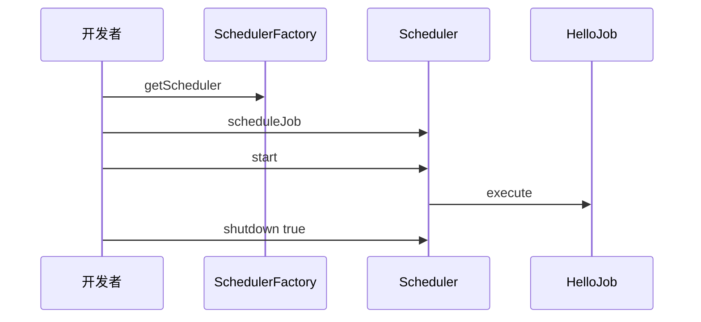

# 第02章：第一个调度器：构建、启动、关闭

> **篇别**：基础篇  
> **建议篇幅**：3000–5000 字（含对话与代码）  
> **结构约束**：对齐 [专栏模板](../template.md) 四段式。

## 示例锚点

| 类型 | 路径 |
| --- | --- |
| example1 | [SimpleExample.java](../../examples/src/main/java/org/quartz/examples/example1/SimpleExample.java) |
| example1 | [HelloJob.java](../../examples/src/main/java/org/quartz/examples/example1/HelloJob.java) |

## 1 项目背景（约 500 字）

### 业务场景

运营希望「准点发券」：每天 10:00 向缓存写入一批券批次信息。开发用 `while(true)+Thread.sleep` 写了一个粗糙循环，发布时经常杀进程导致任务半截执行；测试环境又希望「对齐整分」方便对日志。我们需要一个 **可预测启动顺序、可优雅关闭、Job 与调度解耦** 的最小方案——即本章：**用 Quartz 创建第一个 `Scheduler`，调度 `HelloJob`，并在合适时机 `shutdown`**。

### 痛点放大

- **无工厂与生命周期**：手写线程难以统一「初始化配置、线程名、异常策略」。
- **关闭语义不清**：`kill -9` 与「等任务跑完再停」业务要求冲突。
- **可观测性弱**：没有 `Scheduler` 元数据时，难以回答「下一次到底何时触发」。



## 2 项目设计（约 1200 字）

**角色**：小胖 · 小白 · 大师

---

**小胖**：我就 new 个线程 `sleep` 到 10 点不行吗？Quartz 还要 `Factory`、`Scheduler`，名字一长串。

**小白**：`shutdown(true)` 和 `false` 差在哪？如果 `schedule` 之后忘了 `start`，任务会悄悄丢吗？

**大师**：可以把 `SchedulerFactory` 想成「发电厂的总闸设计图纸」，把 `Scheduler` 想成「电网调度台」——你先接好线路（`scheduleJob`），再推闸送电（`start`），灯才会亮。只画图不接闸，电不会来；这是 **显式生命周期** 的好处，也是新手最容易卡壳的地方。

**技术映射**：**`StdSchedulerFactory` → `Scheduler` → `start()`** 是运行必经路径；`scheduleJob` 可在 `start` 前后调用（见下一章深挖）。

---

**小胖**：`HelloJob` 里就打印一行，为啥还要 `JobDetail` 包一层？

**小白**：`Job` 实现类如果是有状态的，和 `JobDetail` 里存的 `JobDataMap` 怎么分工？

**大师**：`JobDetail` 是 **Job 的定义与身份**（叫什么、在哪个组、用什么类）；`Trigger` 是 **何时触发**。好比「岗位编制表」和「排班表」——同一个人（`Job` 类）可以上不同班次（多个 Trigger），编制表不会每天重写。

**技术映射**：**`JobDetail` = Identity + JobClass + JobDataMap**；**`Trigger` = 时间规则**。

---

**小胖**：示例里 `sleep` 65 秒是为了啥？线上总不能这样吧。

**小白**：`shutdown(true)` 会等正在执行的 Job 吗？和 Spring 的 `DisposableBean` 顺序谁前谁后？

**大师**：example1 用 `sleep` 是为了 **教学上保证触发窗口**——真实系统会用 `CountDownLatch`、健康检查或容器钩子。`shutdown(true)` 对应 **waitForJobsToComplete**：尽量让已触发的 Job 跑完；`false` 则更偏「尽快停表」。与 Spring 集成时，要让 Spring 生命周期回调里去 `destroy` Scheduler，避免 Bean 已销毁而线程还在跑。

**技术映射**：**`Scheduler.shutdown(boolean waitForJobsToComplete)`** 控制停机语义。

---

**小胖**：这跟食堂打饭有啥关系？我就想把任务跑起来。

**小白**：那 **谁来背锅**：触发没发生、发生了两次、还是延迟太久？指标口径先定死。

**大师**：把 **Scheduler 当「编排台」**：Job 是工序，Trigger 是节拍，Listener 是质检；节拍错了，工序再快也白搭。

**技术映射**：**可观测性口径 + Job／Trigger 职责边界**。

---

**小胖**：配置一多我就晕，`quartz.properties` 到底哪些能碰？

**小白**：**线程数、misfireThreshold、JobStore 类型** 改了会不会让 **同一套代码** 在预发与生产行为不一致？

**大师**：做一张 **「配置变更矩阵」**：改一项就写清 **影响面、回滚方式、验证命令**；RAM 与 JDBC 不要混着试。

**技术映射**：**显式配置治理 + 环境一致性**。

---

**小胖**：我本地跑得飞起，一上集群就「偶尔不跑」。

**小白**：**时钟漂移、数据库时间、JVM 默认时区** 三者不一致时，**nextFireTime** 你怎么解释给业务？

**大师**：把 **时区写进契约**：服务器、Cron、业务日历 **同一基准**；日志里同时打 **UTC 与业务时区**。

**技术映射**：**时区／DST 与触发语义**。

---

**小胖**：Trigger 优先级是不是数字越大越牛？

**小白**：**饥饿**怎么办？低优先级永远等不到的话，SLA 谁负责？

**大师**：优先级是 **「同窗口抢锁」** 的 tie-breaker，不是万能插队票；该 **拆分队列** 的别硬挤一个 Scheduler。

**技术映射**：**Trigger 优先级与吞吐隔离**。

---

**小胖**：misfire 不就是晚了吗，晚跑一下不行？

**小白**：**合并、丢弃、立即补偿** 三种策略对 **资金类任务** 分别是啥后果？

**大师**：把 **业务幂等键** 与 **misfireInstruction** 绑在一起评审；没有幂等就别选「立刻全部补上」。

**技术映射**：**misfire 策略与业务一致性**。

---

**小胖**：`JobDataMap` 里塞个大 JSON 爽不爽？

**小白**：**序列化成本、版本升级、跨语言** 谁来买单？失败重试会不会把 **半截状态** 写回去？

**大师**：**小键值 + 外置大对象**；必须进 Map 的，**版本字段** 与 **兼容读** 写进规范。

**技术映射**：**JobDataMap 体积与演进策略**。

---

**小胖**：`@DisallowConcurrentExecution` 一贴我就安心了。

**小白**：**同 JobKey 串行** 会不会把 **补偿触发** 堵成长队？线程池够吗？

**大师**：先画 **并发模型草图**：哪些 Job 必须串行、哪些只是 **资源互斥**（应改用锁或分片）。

**技术映射**：**并发注解与队列时延**。

---

**小胖**：关机我直接拔电源，反正有下次触发。

**小白**：**在途 Job** 写了一半的外部副作用怎么算？**at-least-once** 下会不会双写？

**大师**：发布路径默认 **`shutdown(true)` + 超时**；`kill -9` 只能进 **混沌演练**，不进 **常规 Runbook**。

**技术映射**：**优雅停机与副作用幂等**。

---

**小胖**：Listener 里写业务逻辑最快了。

**小白**：Listener 异常会不会 **吞掉主流程** 或 **拖慢线程**？顺序保证吗？

**大师**：Listener 只做 **旁路观测与轻量编排**；重逻辑回 **Job** 或 **下游消息**。

**技术映射**：**Listener 边界与失败隔离**。

---

**小胖**：JDBC JobStore 不就是多几张表吗？

**小白**：**行锁、delegate、方言、索引** 哪个没对齐会出现 **幽灵触发** 或 **长时间抢锁**？

**大师**：把 **DB 监控**（慢查询、锁等待）与 **Quartz 线程栈** 对齐看；调参前先 **确认隔离级别与连接池**。

**技术映射**：**持久化 JobStore 与数据库协同**。

---

**小胖**：集群一开我就加节点，TPS 一定涨吧？

**小白**：**抢锁成本、心跳、instanceId** 乱配时，会不会 **越加越慢**？

**大师**：用 **压测曲线** 证明拐点；集群收益来自 **HA 与横向扩展边界**，不是魔法按钮。

**技术映射**：**集群伸缩与锁竞争**。
## 3 项目实战（约 1500–2000 字）

### 环境准备

1. 克隆本仓库，根目录：`./gradlew :examples:compileJava`。
2. IDE 将 `examples` 与 `quartz` 设为依赖模块（Gradle 已配置 `examples` → `project(':quartz')`）。
3. 日志：示例使用 SLF4J，控制台应能看到 info 级别输出。

### 分步实现

**步骤 1：目标** —— 读懂「整分对齐」触发时间。

在 [SimpleExample.java](../../examples/src/main/java/org/quartz/examples/example1/SimpleExample.java) 中：

```java
Date runTime = evenMinuteDate(new Date());
```

含义：把首次触发对齐到 **下一个整分钟**，便于演示与日志对齐。

**验证**：观察日志中 `will run at:` 的时间戳分秒为 `:00`。

**步骤 2：目标** —— 建立 Job 与 Trigger 并完成注册。

```java
SchedulerFactory sf = new StdSchedulerFactory();
Scheduler sched = sf.getScheduler();

JobDetail job = newJob(HelloJob.class)
    .withIdentity("job1", "group1")
    .build();

Trigger trigger = newTrigger()
    .withIdentity("trigger1", "group1")
    .startAt(runTime)
    .build();

sched.scheduleJob(job, trigger);
sched.start();
```

**验证**：控制台出现 `Hello World!`（来自 `HelloJob`）。

**步骤 3：目标** —— 优雅关闭。

```java
sched.shutdown(true);
```

**验证**：Job 若已开始执行，`true` 会尽量等待其结束再停表（极端长任务需业务侧可中断，见第19章）。

### 可能踩坑

| 坑 | 现象 | 解决 |
| --- | --- | --- |
| 未 `start()` | 到点无日志 | 确认 `sched.start()` 被调用 |
| 进程立即退出 | JVM 退出导致 Scheduler 来不及跑 | 教学代码用 `sleep`；集成到常驻服务则自然满足 |
| 多份 `quartz.properties` | 行为与预期不一致 | 指定明确配置路径或合并 classpath（第11章） |

### 完整代码清单

- [example1/SimpleExample.java](../../examples/src/main/java/org/quartz/examples/example1/SimpleExample.java)
- [example1/HelloJob.java](../../examples/src/main/java/org/quartz/examples/example1/HelloJob.java)

### 测试验证

在仓库根目录（示例）：

```bash
./gradlew :examples:run --args="org.quartz.examples.example1.SimpleExample"
```

若本地未配置 `run` 任务，可在 IDE 中直接运行上述类的 `main`。预期：初始化日志 → `Hello World!` → Shutdown Complete。

## 4 项目总结（约 500–800 字）

### 优点与缺点（对比同类技术）

| 维度 | Quartz（本例 RAM） | 手写线程 | `@Scheduled` |
| --- | --- | --- | --- |
| 生命周期 | 统一 start/shutdown | 分散 | 随容器 |
| 可测试性 | 可注入工厂替换 | 难 | 需 Spring 测试 |
| 依赖体积 | 有成本 | 无 | 已引入 Spring 时低 |

### 适用 / 不适用场景

- **适用**：需要标准调度 API、后续扩展 Trigger 类型。
- **适用**：希望 Job 类保持 POJO 风格、与框架解耦。
- **不适用**：仅一次延迟执行且无任何日历/持久化需求（`CompletableFuture.delayedExecutor` 可能更轻）。

### 注意事项

- **默认 RAMJobStore**：进程崩溃任务即失，勿直接用于「金融级必达」。
- **线程上下文类加载器**：部分容器环境需注意 `quartz.properties` 中 `threadsInheritContextClassLoaderOfInitializingThread`。

### 常见踩坑（生产案例）

1. **未捕获 Job 内异常**：导致触发器状态异常或监听器刷屏；应在 Job 内规范处理或包装模板。
2. **`shutdown` 未在钩子中调用**：容器快速下线时任务半截；根因是未注册 JVM shutdown hook 或 Spring destroy。
3. **把 `sleep` 当生产模式**：集成测试挂死；应改用同步原语或显式触发。

#### 第01章思考题揭底

1. **Quartz 与 `ScheduledExecutor` 在持久化与 misfire 上的差异**  
   **答**：默认 RAM 下二者都可不持久化；但一旦切换到 **JDBC JobStore**，Quartz 能把 **Trigger 与 Job 的状态** 落库并在重启后恢复，而 Executor 无标准持久化模型。**misfire**（错过触发窗口）在 Quartz 中有 **可配置的 misfireInstruction**（见第14章）；Executor 只体现为「延迟执行」或积压，无统一语义。

2. **「重启后任务不丢」如何调整选型**  
   **答**：必须引入 **持久化 JobStore（如 `JobStoreTX`）+ 对应数据库表**，并配置数据源与 delegate；若多实例还需 **集群 `isClustered=true`**（第21、24章）。单靠本章的 RAM 示例无法满足。

### 思考题（答案见下一章或 [答案索引](answers-index.md)）

1. 写出从 `StdSchedulerFactory` 获取 `Scheduler` 并 `start` 的最小步骤（伪代码即可）。
2. `scheduleJob` 在 `start` 之前与之后调用，语义上有何不同？

### 推广计划提示

- **测试**：用例验证「start 前后 schedule」各一次，断言触发次数。
- **运维**：关注 JVM 退出码与停机脚本是否发送 SIGTERM 留给 `shutdown` 时间。
- **开发**：预习 `SchedulerFactory`  properties 覆盖方式（第03、11章）。
