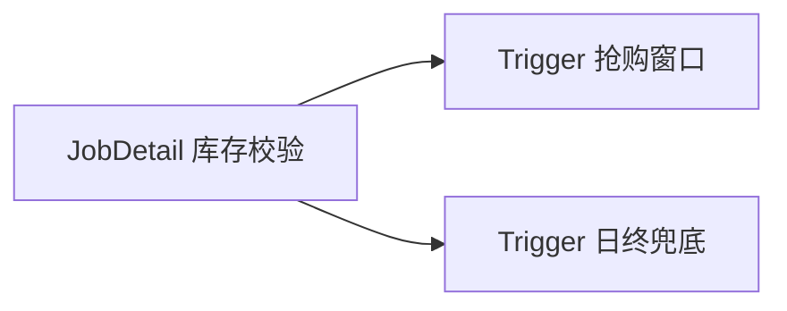

# 第05章：Trigger 总览：start/end、优先级占位、与 Job 绑定关系

> **篇别**：基础篇  
> **建议篇幅**：3000–5000 字（含对话与代码）  
> **结构约束**：对齐 [专栏模板](../template.md) 四段式。

## 示例锚点

| 类型 | 路径 |
| --- | --- |
| 铺垫 | [example2 目录](../../examples/src/main/java/org/quartz/examples/example2) |
| API | `org.quartz.TriggerBuilder` |

## 1 项目背景（约 500 字）

### 业务场景

限时抢购窗口：商品在 `10:00–10:30` 内允许下单，超时后自动切换展示文案。需要 **明确的 `startTime` / `endTime`**，且可能与 **多个促销 Job** 共用同一库存校验逻辑。产品还要求：大促当天可以 **临时插入一条更高优先级的「熔断检查」Trigger**，但不能改掉原有日终任务。本章梳理 **Trigger 与 Job 的多对一关系、时间窗、优先级字段的语义占位**（细节延展到第06、14、20章）。

### 痛点放大

- 仅用 `fixedRate` 难以表达 **有结束时间** 的窗口。
- 多 Trigger 绑同一 Job 时，误用 `scheduleJob(job, trigger)` 覆盖彼此。
- 忽略 **优先级** 导致关键任务在线程饥饿时被「饿死」。



## 2 项目设计（约 1200 字）

**角色**：小胖 · 小白 · 大师

---

**小胖**：一个闹钟只能响一次，为啥 Quartz 说一个 Job 能挂好几个 Trigger？

**小白**：那两个 Trigger 若时间重叠，会并发跑同一个 Job 实例吗？`@DisallowConcurrentExecution` 管不管用？

**大师**：把 Job 想成 **一台咖啡机**，Trigger 是 **不同同事点的取餐码**——同一台机器可以在上午 9 点给 A 做一杯，下午 3 点给 B 做一杯；若两个码 **同一时刻** 生效，默认咖啡机会 **尝试并发做两杯**（两个触发上下文），除非你在机器上贴条「同一时间只能出一杯」（`@DisallowConcurrentExecution`）。

**技术映射**：**多 Trigger → 同一 `JobDetail`**；并发行为由 **Job 注解 + 线程池** 共同决定（第10章）。

---

**小胖**：`startAt` 和 `startNow` 差一句代码，能有多大区别？

**小白**：`endTime` 到了之后，Trigger 状态变什么？JobDetail 还在不在？

**大师**：`startAt` 是 **指定发令时间**；`startNow` 是 **立刻允许进入可触发窗口**（仍受 misfire 等规则约束）。`endTime` 到达后，Trigger 通常进入 **完成/失效** 一类终态；**JobDetail 默认仍存在**（除非配置为无 Trigger 即删除，且非 durable——与 `JobBuilder.storeDurably` 有关）。这也是很多人以为「Trigger 结束 = Job 删除」的误区。

**技术映射**：**Trigger 生命周期 ≠ JobDetail 生命周期**。

---

**小胖**：优先级数字越大越先跑吗？我能不能全写 `Integer.MAX_VALUE`？

**小白**：优先级只在「同一时刻多个 Trigger 要抢线程」时生效吗？和 Kafka 分区顺序一样吗？

**大师**：优先级像 **急诊分诊**——只有 **资源紧张、同时到期** 时才显著；大家都标成最高，等于 **没有优先级**。它不是跨分布式队列的全局顺序保证；**同一 Scheduler 实例内** 的调度顺序参考 Quartz 规则（第20章深挖）。

**技术映射**：**`Trigger.getPriority()`** 作为 **同 Scheduler 内** 的相对次序提示。

---

**小胖**：这跟食堂打饭有啥关系？我就想把任务跑起来。

**小白**：那 **谁来背锅**：触发没发生、发生了两次、还是延迟太久？指标口径先定死。

**大师**：把 **Scheduler 当「编排台」**：Job 是工序，Trigger 是节拍，Listener 是质检；节拍错了，工序再快也白搭。

**技术映射**：**可观测性口径 + Job／Trigger 职责边界**。

---

**小胖**：配置一多我就晕，`quartz.properties` 到底哪些能碰？

**小白**：**线程数、misfireThreshold、JobStore 类型** 改了会不会让 **同一套代码** 在预发与生产行为不一致？

**大师**：做一张 **「配置变更矩阵」**：改一项就写清 **影响面、回滚方式、验证命令**；RAM 与 JDBC 不要混着试。

**技术映射**：**显式配置治理 + 环境一致性**。

---

**小胖**：我本地跑得飞起，一上集群就「偶尔不跑」。

**小白**：**时钟漂移、数据库时间、JVM 默认时区** 三者不一致时，**nextFireTime** 你怎么解释给业务？

**大师**：把 **时区写进契约**：服务器、Cron、业务日历 **同一基准**；日志里同时打 **UTC 与业务时区**。

**技术映射**：**时区／DST 与触发语义**。

---

**小胖**：Trigger 优先级是不是数字越大越牛？

**小白**：**饥饿**怎么办？低优先级永远等不到的话，SLA 谁负责？

**大师**：优先级是 **「同窗口抢锁」** 的 tie-breaker，不是万能插队票；该 **拆分队列** 的别硬挤一个 Scheduler。

**技术映射**：**Trigger 优先级与吞吐隔离**。

---

**小胖**：misfire 不就是晚了吗，晚跑一下不行？

**小白**：**合并、丢弃、立即补偿** 三种策略对 **资金类任务** 分别是啥后果？

**大师**：把 **业务幂等键** 与 **misfireInstruction** 绑在一起评审；没有幂等就别选「立刻全部补上」。

**技术映射**：**misfire 策略与业务一致性**。

---

**小胖**：`JobDataMap` 里塞个大 JSON 爽不爽？

**小白**：**序列化成本、版本升级、跨语言** 谁来买单？失败重试会不会把 **半截状态** 写回去？

**大师**：**小键值 + 外置大对象**；必须进 Map 的，**版本字段** 与 **兼容读** 写进规范。

**技术映射**：**JobDataMap 体积与演进策略**。

---

**小胖**：`@DisallowConcurrentExecution` 一贴我就安心了。

**小白**：**同 JobKey 串行** 会不会把 **补偿触发** 堵成长队？线程池够吗？

**大师**：先画 **并发模型草图**：哪些 Job 必须串行、哪些只是 **资源互斥**（应改用锁或分片）。

**技术映射**：**并发注解与队列时延**。

---

**小胖**：关机我直接拔电源，反正有下次触发。

**小白**：**在途 Job** 写了一半的外部副作用怎么算？**at-least-once** 下会不会双写？

**大师**：发布路径默认 **`shutdown(true)` + 超时**；`kill -9` 只能进 **混沌演练**，不进 **常规 Runbook**。

**技术映射**：**优雅停机与副作用幂等**。

---

**小胖**：Listener 里写业务逻辑最快了。

**小白**：Listener 异常会不会 **吞掉主流程** 或 **拖慢线程**？顺序保证吗？

**大师**：Listener 只做 **旁路观测与轻量编排**；重逻辑回 **Job** 或 **下游消息**。

**技术映射**：**Listener 边界与失败隔离**。

---

**小胖**：JDBC JobStore 不就是多几张表吗？

**小白**：**行锁、delegate、方言、索引** 哪个没对齐会出现 **幽灵触发** 或 **长时间抢锁**？

**大师**：把 **DB 监控**（慢查询、锁等待）与 **Quartz 线程栈** 对齐看；调参前先 **确认隔离级别与连接池**。

**技术映射**：**持久化 JobStore 与数据库协同**。
## 3 项目实战（约 1500–2000 字）

### 环境准备

阅读 [SimpleTriggerExample.java](../../examples/src/main/java/org/quartz/examples/example2/SimpleTriggerExample.java) 中 **同一 `JobDetail` 被第二个 Trigger 绑定** 的片段（`forJob(job)` + `scheduleJob(trigger)`）。

### 分步实现

**步骤 1：目标** —— 一个 Job，两个 Trigger。

```java
JobDetail job = newJob(HelloJob.class)
    .withIdentity("stockCheck", "promo")
    .build();

Date start = DateBuilder.nextGivenSecondDate(null, 10);
Trigger tWindow = newTrigger()
    .withIdentity("flashSaleWindow", "promo")
    .startAt(start)
    .endAt(DateBuilder.futureDate(5, DateBuilder.IntervalUnit.MINUTE)) // 示意结束时间
    .withPriority(5)
    .forJob(job)
    .build();

Trigger tHeartbeat = newTrigger()
    .withIdentity("heartbeat", "promo")
    .startAt(start)
    .withSchedule(SimpleScheduleBuilder.simpleSchedule()
        .withIntervalInSeconds(30)
        .repeatForever())
    .withPriority(1)
    .forJob(job)
    .build();

sched.scheduleJob(job, tWindow);   // 第一个 Trigger 随 Job 一起注册
sched.scheduleJob(tHeartbeat);     // 第二个 Trigger 单独注册并 forJob
```

**验证**：日志中两个 Trigger 均指向同一 `JobKey`；到达窗口内应有多次执行（与 HelloJob 实现相关）。

**步骤 2：目标** —— 查询某 Job 的全部 Trigger。

```java
List<? extends Trigger> triggers = sched.getTriggersOfJob(job.getKey());
log.info("count={}", triggers.size());
```

**验证**：`size == 2`。

**步骤 3：目标** —— 调整 `endTime` 后观察完成行为。

在测试中将 `endTime` 设为很快到期，确认窗口 Trigger 完成后 **Job 仍存在**（`checkExists(JobKey)`）。

### 可能踩坑

| 坑 | 解决 |
| --- | --- |
| 第二次 `scheduleJob(job, trigger)` 覆盖 | 第二个 Trigger 用 `scheduleJob(Trigger)` 且 `forJob` |
| `endTime` 早于 `startTime` | 校验时间线 |
| 误以为优先级跨 JVM | 集群下仍 **以单 Scheduler 实例视图** 理解 |

### 完整代码清单

- [SimpleTriggerExample.java](../../examples/src/main/java/org/quartz/examples/example2/SimpleTriggerExample.java)

### 测试验证

集成测试：注册双 Trigger 后，断言 `getTriggersOfJob` 大小与 `TriggerState` 变化符合时间推进（可用短间隔 + `Awaitility` 风格等待）。

## 4 项目总结（约 500–800 字）

### 优点与缺点（对比同类技术）

| 维度 | Quartz Trigger | Spring fixedDelay | K8s Cron |
| --- | --- | --- | --- |
| 多对一绑定 | 原生 | 需多 `@Scheduled` 方法 | 一 Pod 一调度 |
| 时间窗 end | 支持 | 弱 | 弱 |
| 优先级 | 有 | 无统一模型 | 无 |

### 适用 / 不适用场景

- **适用**：同一业务逻辑多种节奏驱动（窗口 + 心跳 + 日终）。
- **不适用**：仅需单节奏且已在 Spring 中深度集成、无多 Trigger 诉求。

### 注意事项

- **时区**：`startAt` 的 `Date` 与 JVM 默认时区关系（第07章）。
- **重复与 endTime**：`repeatForever` 与 `endTime` 组合需理解终止条件（第06章）。

### 常见踩坑（生产案例）

1. **双 Trigger 双跑库存**：根因是 Job 未幂等且未 `@DisallowConcurrentExecution`。
2. **endTime 误用 UTC/本地混用**：根因是服务器时区与业务时区未统一。
3. **优先级滥用**：根因是未配合线程池容量设计。

#### 第04章思考题揭底

1. **JobKey 与 TriggerKey 同名不同组是否允许？冲突时会发生什么？**  
   **答**：**允许**同名，只要 **分属不同命名空间**（Job 侧 `JobKey`、Trigger 侧 `TriggerKey`）。**冲突**仅发生在 **同一空间内重复注册**（例如两个 `TriggerKey("x","g")` 指向不同语义），通常会抛 **SchedulerException** 或需使用带 `replace` 的 API 显式覆盖（以当前 Quartz API 为准）。

2. **若把 group 全部设为 `DEFAULT`，生产上有什么风险？**  
   **答**：**可读性与隔离性差**，多租户/多环境场景下极易 **误删误暂停**；监控告警难以 **按域聚合**；排障时无法快速从 Key 反推业务归属。建议 **group 表示租户或业务域**，`name` 表示任务意图。

### 思考题（答案见下一章或 [答案索引](answers-index.md)）

1. 同一个 `JobDetail` 能否被多个 Trigger 驱动？典型用例是什么？
2. `Trigger` 的 `endTime` 到期后，关联的 `JobDetail` 是否会被自动删除？

### 推广计划提示

- **测试**：双 Trigger 并发与串行各一组用例。
- **运维**：将 `endTime` 纳入变更单评审。
- **开发**：下一章深入 `SimpleTrigger` 与 `SimpleScheduleBuilder`。
