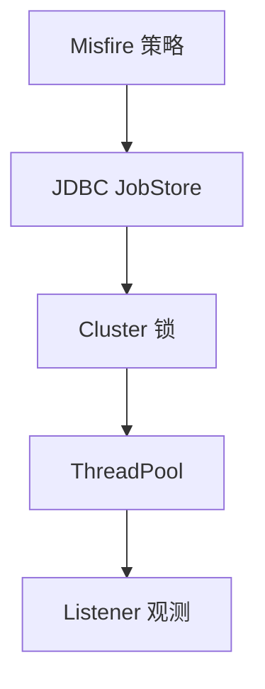

# 第29章：中级篇综合实战：对账集群与观测闭环演练

> **篇别**：中级篇（综合实战）
> **建议篇幅**：3000–5000 字（含对话与代码）
> **结构约束**：对齐 [专栏模板](../../column/template.md) 四段式；本章为模板「中级篇结束后独立综合实战」。

## 示例锚点

| 类型 | 路径 |
| --- | --- |
| 文档 | [docs/index.md](../../docs/index.md) |

## 1 项目背景（约 500 字）

### 业务场景

账务 **nightly 对账** 已切到 **JDBC JobStore + 双实例**：白天还有 **高优先级补偿 Trigger**。SRE 要求 **无双跑**、**misfire 可解释**、**RMI 默认关闭**；开发要把第14–28章变成 **一张 Runbook + 一次联调记录**。

### 痛点放大

- **指标碎片化**：Listener、DB 锁、线程池各说各话。
- **压测与生产不一致**：`batchTriggerAcquisitionMaxCount` 盲调。
- **远程运维入口失控**：RMI 误开等于 **扩大爆炸半径**。

## 2 项目设计（约 1200 字）

**角色**：小胖 · 小白 · 大师

---

**小胖**：我们就把两个实例都拉起来，看谁抢到 Trigger，算不算验收？

**小白**：要看 **失败面**：从库延迟、时钟 skew、行锁等待——抢到了也可能 **错账**。

**大师**：中级综合的验收是 **「可恢复 + 可解释」**：预置 **一次人为 misfire**、一次 **线程池打满**，Runbook 里写清 **先看哪三张表 / 哪三个指标**。

**技术映射**：**JobStore 真相来源 + 观测分层**。

---

**小胖**：RMI 我全关了就安全吧？

**小白**：那运维还要 **pause**，走 API 网关行不行？

**大师**：关 RMI 是 **减暴露面**；运维改走 **受控 API**，把 **审计日志** 与 **双人复核** 写进同一套流程，才与第27章边界一致。

**技术映射**：**远程控制面最小化**。

---

**小胖**：吞吐章节说调 `threadCount`，我直接拉满？

**小白**：DB 连接池与 **批量拉取** 会不会把 **锁时间** 拉长？

**大师**：用 **压测曲线** 回答：记录 **p50/p99 acquire 时间** 与 **misfire 计数** 的联动，形成 **一张二维表** 作为调参上限。

**技术映射**：**吞吐—锁—misfire 三角权衡**。

---

**小胖**：这跟食堂打饭有啥关系？我就想把任务跑起来。

**小白**：那 **谁来背锅**：触发没发生、发生了两次、还是延迟太久？指标口径先定死。

**大师**：把 **Scheduler 当「编排台」**：Job 是工序，Trigger 是节拍，Listener 是质检；节拍错了，工序再快也白搭。

**技术映射**：**可观测性口径 + Job／Trigger 职责边界**。

---

**小胖**：配置一多我就晕，`quartz.properties` 到底哪些能碰？

**小白**：**线程数、misfireThreshold、JobStore 类型** 改了会不会让 **同一套代码** 在预发与生产行为不一致？

**大师**：做一张 **「配置变更矩阵」**：改一项就写清 **影响面、回滚方式、验证命令**；RAM 与 JDBC 不要混着试。

**技术映射**：**显式配置治理 + 环境一致性**。

---

**小胖**：我本地跑得飞起，一上集群就「偶尔不跑」。

**小白**：**时钟漂移、数据库时间、JVM 默认时区** 三者不一致时，**nextFireTime** 你怎么解释给业务？

**大师**：把 **时区写进契约**：服务器、Cron、业务日历 **同一基准**；日志里同时打 **UTC 与业务时区**。

**技术映射**：**时区／DST 与触发语义**。

---

**小胖**：Trigger 优先级是不是数字越大越牛？

**小白**：**饥饿**怎么办？低优先级永远等不到的话，SLA 谁负责？

**大师**：优先级是 **「同窗口抢锁」** 的 tie-breaker，不是万能插队票；该 **拆分队列** 的别硬挤一个 Scheduler。

**技术映射**：**Trigger 优先级与吞吐隔离**。

---

**小胖**：misfire 不就是晚了吗，晚跑一下不行？

**小白**：**合并、丢弃、立即补偿** 三种策略对 **资金类任务** 分别是啥后果？

**大师**：把 **业务幂等键** 与 **misfireInstruction** 绑在一起评审；没有幂等就别选「立刻全部补上」。

**技术映射**：**misfire 策略与业务一致性**。

---

**小胖**：`JobDataMap` 里塞个大 JSON 爽不爽？

**小白**：**序列化成本、版本升级、跨语言** 谁来买单？失败重试会不会把 **半截状态** 写回去？

**大师**：**小键值 + 外置大对象**；必须进 Map 的，**版本字段** 与 **兼容读** 写进规范。

**技术映射**：**JobDataMap 体积与演进策略**。

---

**小胖**：`@DisallowConcurrentExecution` 一贴我就安心了。

**小白**：**同 JobKey 串行** 会不会把 **补偿触发** 堵成长队？线程池够吗？

**大师**：先画 **并发模型草图**：哪些 Job 必须串行、哪些只是 **资源互斥**（应改用锁或分片）。

**技术映射**：**并发注解与队列时延**。

---

**小胖**：关机我直接拔电源，反正有下次触发。

**小白**：**在途 Job** 写了一半的外部副作用怎么算？**at-least-once** 下会不会双写？

**大师**：发布路径默认 **`shutdown(true)` + 超时**；`kill -9` 只能进 **混沌演练**，不进 **常规 Runbook**。

**技术映射**：**优雅停机与副作用幂等**。

---

**小胖**：Listener 里写业务逻辑最快了。

**小白**：Listener 异常会不会 **吞掉主流程** 或 **拖慢线程**？顺序保证吗？

**大师**：Listener 只做 **旁路观测与轻量编排**；重逻辑回 **Job** 或 **下游消息**。

**技术映射**：**Listener 边界与失败隔离**。

---

**小胖**：JDBC JobStore 不就是多几张表吗？

**小白**：**行锁、delegate、方言、索引** 哪个没对齐会出现 **幽灵触发** 或 **长时间抢锁**？

**大师**：把 **DB 监控**（慢查询、锁等待）与 **Quartz 线程栈** 对齐看；调参前先 **确认隔离级别与连接池**。

**技术映射**：**持久化 JobStore 与数据库协同**。

---

**小胖**：集群一开我就加节点，TPS 一定涨吧？

**小白**：**抢锁成本、心跳、instanceId** 乱配时，会不会 **越加越慢**？

**大师**：用 **压测曲线** 证明拐点；集群收益来自 **HA 与横向扩展边界**，不是魔法按钮。

**技术映射**：**集群伸缩与锁竞争**。

---

**小胖**：我想自定义 ThreadPool 秀一把。

**小白**：线程工厂、拒绝策略、上下文传递（MDC）**漏一项** 会出现啥线上症状？

**大师**：自定义可以，但要 **对齐 SPI 契约**与 **关闭语义**；否则 **泄漏线程** 比默认池更难查。

**技术映射**：**ThreadPool SPI 与生命周期**。
## 3 项目实战（约 1500–2000 字）

### 环境准备

- 预备 **MySQL** 或团队已有 QRTZ 库；若无，可用 **Docker Compose** 起最小实例（自行编写 `compose.yml`）。
- Quartz **JDBCJobStore** 与 **集群** 参数与第21、24章对齐。

### 分步实现

**步骤 1：目标** —— 画出 **「触发—落库—执行」** 序列图，标注 **哪一步由哪张表** 证明。

**步骤 2：目标** —— 人为制造 **短窗口线程池饥饿**，观察 **misfireInstruction** 行为与日志关键字。

**步骤 3：目标** —— 关闭 RMI，验证 **仅本机 JMX/HTTP 控制面** 可达。

### 完整代码清单

- 本仓库 `examples/example5`、`examples` 负载示例与 `quartz` 源码索引。

### 测试验证

- 附 **一次压测截图** + **一次行锁等待 SQL**（`information_schema` 或等价）解释文本。

## 4 项目总结（约 500–800 字）

### 优点与缺点

| 维度 | 串联 Runbook | 分散排障 |
| --- | --- | --- |
| 协同 | 高 | 低 |
| 准备成本 | 中 | 低 |

### 适用 / 不适用场景

- **适用**：中级篇结业、预发演练周。
- **不适用**：尚无持久化条件的团队（先做缩小版）。

### 注意事项

- 生产凭据不进 Git；Runbook 放 **内部 Wiki**。

### 常见踩坑（生产案例）

1. **只看 CPU**：忽略 **DB 锁与批量拉取**。
2. **无双实例对照**：集群问题 **单测测不出**。
3. **把压测当一次性**：未 **回归基线**。

#### 第28章思考题揭底

1. **RMI 主要安全风险**  
   **答**：**远程调用面暴露**（未鉴权时可被滥用 **`Scheduler` 管理操作**）、**Java 序列化历史漏洞**、**网络绕行与横向移动**、**NAT 下错误绑定导致意外暴露**。

2. **现代替代架构**  
   **答**：**HTTPS/mTLS 控制面 API**（pause/resume/trigger 包装）、**集中认证授权与审计**、**服务网格策略**；调度执行仍在应用进程内，或通过 **消息队列** 解耦执行。

### 思考题（答案见下一章或 [答案索引](answers-index.md)）

1. 若 `acquire` SQL p99 上升，你如何在 Runbook 中区分 **锁竞争** vs **网络抖动**？
2. **`requestsRecovery=true`** 与业务 **at-least-once** 如何共同写进验收表？

### 推广计划提示

- **测试**：把本 Runbook 变成 **自动化检查脚本**（grep 关键字 + SQL）。
- **运维**：纳入 **月度演练**。
- **开发**：下一章进入 **StdSchedulerFactory**（第30章）源码阅读。