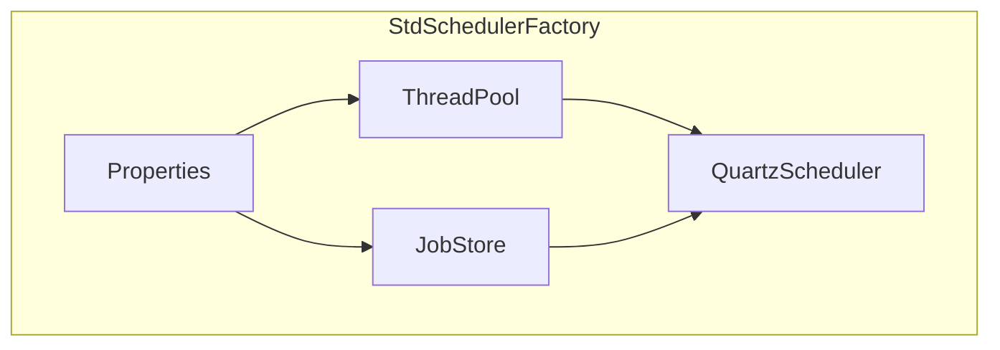

# 第30章：`StdSchedulerFactory` 配置解析与对象装配全景

> **篇别**：高级篇  
> **建议篇幅**：3000–5000 字（含对话与代码）  
> **结构约束**：对齐 [专栏模板](../template.md) 四段式。

## 示例锚点

| 类型 | 路径 |
| --- | --- |
| 源码 | [StdSchedulerFactory.java](../../quartz/src/main/java/org/quartz/impl/StdSchedulerFactory.java) |

## 1 项目背景（约 500 字）

### 业务场景

多环境配置漂移：`dev` 误用 `prod` 的 `instanceName`，导致 **JMX 冲突**；又有人把 **自定义 `JobFactory`** 配成类名拼写错误，启动在 **反射实例化** 时才失败。架构师要求团队 **能画出 `StdSchedulerFactory#getScheduler` 的对象图**：**ThreadPool、JobStore、JobRunShellFactory、RAM vs JDBC** 如何拼装。

### 痛点放大

- **properties key 拼写错误静默回默认**：排障困难。
- **多工厂实例**：同一 JVM 多调度器资源隔离。
- **与 Spring Boot 自动配置叠加**：重复 bean。

## 2 项目设计（约 1200 字）

**角色**：小胖 · 小白 · 大师

---

**小胖**：工厂类几千行，我看得头秃，有没有主线？

**小白**：`instantiate` 顺序错了会不会死锁？

**大师**：抓住 **三条主线**：**（1）线程池 `ThreadPool`**、**（2）JobStore**、**（3）QuartzScheduler 本体 + Thread**。其余插件、Listener、数据源是 **枝叶**。像 **组装电脑**：先主板 CPU 内存，再插显卡。

**技术映射**：**`initialize()` 内反射加载 `org.quartz.*` 配置类**。

---

**小胖**：同名 properties 在 jar 里两份，到底加载谁？

**小白**：`new StdSchedulerFactory("path")` 与无参构造差异？

**大师**：无参通常 **按默认搜索路径**；显式路径 **确定性最高**。像 **「用微信扫官方二维码」 vs 「群里流传的模糊码」**。

**技术映射**：**类路径顺序 / `ClassLoader.getResource`**。

---

**小胖**：我们能把部分配置程序化、部分文件化吗？

**小白**：`setProperty` 覆盖安全吗？

**大师**：可在 **内存 Properties 合并后** 再交给工厂；注意 **不可变发布**——启动后改 properties 对象不等于热更新 Scheduler。

**技术映射**：**Properties 合并策略**。

---

**小胖**：这跟食堂打饭有啥关系？我就想把任务跑起来。

**小白**：那 **谁来背锅**：触发没发生、发生了两次、还是延迟太久？指标口径先定死。

**大师**：把 **Scheduler 当「编排台」**：Job 是工序，Trigger 是节拍，Listener 是质检；节拍错了，工序再快也白搭。

**技术映射**：**可观测性口径 + Job／Trigger 职责边界**。

---

**小胖**：配置一多我就晕，`quartz.properties` 到底哪些能碰？

**小白**：**线程数、misfireThreshold、JobStore 类型** 改了会不会让 **同一套代码** 在预发与生产行为不一致？

**大师**：做一张 **「配置变更矩阵」**：改一项就写清 **影响面、回滚方式、验证命令**；RAM 与 JDBC 不要混着试。

**技术映射**：**显式配置治理 + 环境一致性**。

---

**小胖**：我本地跑得飞起，一上集群就「偶尔不跑」。

**小白**：**时钟漂移、数据库时间、JVM 默认时区** 三者不一致时，**nextFireTime** 你怎么解释给业务？

**大师**：把 **时区写进契约**：服务器、Cron、业务日历 **同一基准**；日志里同时打 **UTC 与业务时区**。

**技术映射**：**时区／DST 与触发语义**。

---

**小胖**：Trigger 优先级是不是数字越大越牛？

**小白**：**饥饿**怎么办？低优先级永远等不到的话，SLA 谁负责？

**大师**：优先级是 **「同窗口抢锁」** 的 tie-breaker，不是万能插队票；该 **拆分队列** 的别硬挤一个 Scheduler。

**技术映射**：**Trigger 优先级与吞吐隔离**。

---

**小胖**：misfire 不就是晚了吗，晚跑一下不行？

**小白**：**合并、丢弃、立即补偿** 三种策略对 **资金类任务** 分别是啥后果？

**大师**：把 **业务幂等键** 与 **misfireInstruction** 绑在一起评审；没有幂等就别选「立刻全部补上」。

**技术映射**：**misfire 策略与业务一致性**。

---

**小胖**：`JobDataMap` 里塞个大 JSON 爽不爽？

**小白**：**序列化成本、版本升级、跨语言** 谁来买单？失败重试会不会把 **半截状态** 写回去？

**大师**：**小键值 + 外置大对象**；必须进 Map 的，**版本字段** 与 **兼容读** 写进规范。

**技术映射**：**JobDataMap 体积与演进策略**。

---

**小胖**：`@DisallowConcurrentExecution` 一贴我就安心了。

**小白**：**同 JobKey 串行** 会不会把 **补偿触发** 堵成长队？线程池够吗？

**大师**：先画 **并发模型草图**：哪些 Job 必须串行、哪些只是 **资源互斥**（应改用锁或分片）。

**技术映射**：**并发注解与队列时延**。

---

**小胖**：关机我直接拔电源，反正有下次触发。

**小白**：**在途 Job** 写了一半的外部副作用怎么算？**at-least-once** 下会不会双写？

**大师**：发布路径默认 **`shutdown(true)` + 超时**；`kill -9` 只能进 **混沌演练**，不进 **常规 Runbook**。

**技术映射**：**优雅停机与副作用幂等**。

---

**小胖**：Listener 里写业务逻辑最快了。

**小白**：Listener 异常会不会 **吞掉主流程** 或 **拖慢线程**？顺序保证吗？

**大师**：Listener 只做 **旁路观测与轻量编排**；重逻辑回 **Job** 或 **下游消息**。

**技术映射**：**Listener 边界与失败隔离**。

---

**小胖**：JDBC JobStore 不就是多几张表吗？

**小白**：**行锁、delegate、方言、索引** 哪个没对齐会出现 **幽灵触发** 或 **长时间抢锁**？

**大师**：把 **DB 监控**（慢查询、锁等待）与 **Quartz 线程栈** 对齐看；调参前先 **确认隔离级别与连接池**。

**技术映射**：**持久化 JobStore 与数据库协同**。

---

**小胖**：集群一开我就加节点，TPS 一定涨吧？

**小白**：**抢锁成本、心跳、instanceId** 乱配时，会不会 **越加越慢**？

**大师**：用 **压测曲线** 证明拐点；集群收益来自 **HA 与横向扩展边界**，不是魔法按钮。

**技术映射**：**集群伸缩与锁竞争**。

---

**小胖**：我想自定义 ThreadPool 秀一把。

**小白**：线程工厂、拒绝策略、上下文传递（MDC）**漏一项** 会出现啥线上症状？

**大师**：自定义可以，但要 **对齐 SPI 契约**与 **关闭语义**；否则 **泄漏线程** 比默认池更难查。

**技术映射**：**ThreadPool SPI 与生命周期**。
## 3 项目实战（约 1500–2000 字）

### 环境准备

IDE 打开 `StdSchedulerFactory`，使用 **Find Usages** 跟踪 `getScheduler()`。

### 分步实现

**步骤 1：目标** —— 画 **组件图**（Mermaid）：

**步骤 2：目标** —— 故意写错 `org.quartz.jobStore.class`，观察 **异常栈** 定位 **哪一步反射失败**。

**步骤 3：目标** —— 使用 **`-Dorg.quartz.properties=`**（若支持）或代码指定文件，验证 **唯一配置源**。

### 可能踩坑

| 坑 | 解决 |
| --- | --- |
| 类名大小写 | 复制官方示例 |
| OSGi CL | 专用 ClassLoadHelper（第33章） |
| 版本 key 变更 | 读 migration guide |

### 完整代码清单

- [StdSchedulerFactory.java](../../quartz/src/main/java/org/quartz/impl/StdSchedulerFactory.java)

### 测试验证

启动集成测试：断言 **MetaData 中 JobStore 类名** 与配置一致。

## 4 项目总结（约 500–800 字）

### 优点与缺点（对比同类技术）

| 维度 | StdSchedulerFactory | DirectSchedulerFactory | Spring 封装 |
| --- | --- | --- | --- |
| 灵活性 | 高 | 更高（程序化） | 中 |

### 适用 / 不适用场景

- **适用**：绝大多数部署。
- **不适用**：极简嵌入式需手写对象图（高级定制）。

### 注意事项

- **安全**：properties 不含密钥明文。
- **可测试**：允许注入 Properties。

### 常见踩坑（生产案例）

1. **多 jar 默认 properties 污染**：根因是依赖冲突。
2. **类加载器错误导致插件找不到**：根因是 WAR 结构。
3. **重复初始化**：根因是单例模式被绕过。

#### 第29章思考题揭底

1. **`acquire` SQL p99 上升：锁竞争 vs 网络抖动**  
   **答**：锁竞争常伴 **行锁等待事件**、**同一 QRTZ 表热点**、**多实例同时段飙升**；网络抖动多伴 **连接池 borrow 超时**、**跨 AZ RTT 尖刺**、与 **DB CPU/锁指标脱钩**。Runbook 要求 **同时截取 JDBC 驱动日志片段** 与 **`SHOW ENGINE INNODB STATUS` 等价信息** 做二分。

2. **`requestsRecovery` 与 at-least-once**  
   **答**：`requestsRecovery` 面向 **调度器崩溃后的恢复语义**；业务 at-least-once 仍需 **幂等键 + 去重表**。验收表应分列 **基础设施故障** 与 **业务失败** 两类重试，避免互相覆盖 SLA。

### 思考题（答案见下一章或 [答案索引](answers-index.md)）

1. `StdSchedulerFactory` 初始化时最关键的 3 类组件是什么？
2. 同名 `quartz.properties` 在 classpath 多处时加载顺序？

### 推广计划提示

- **测试**：配置单测（快照）。
- **运维**：单一配置源策略。
- **开发**：下一章 `QuartzSchedulerThread` 主循环。
