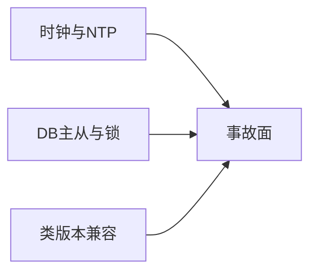

# 第40章：极端场景与 SRE：时钟回拨、主从延迟、长事务、升级兼容

> **篇别**：高级篇  
> **建议篇幅**：3000–5000 字（含对话与代码）  
> **结构约束**：对齐 [专栏模板](../template.md) 四段式。

## 示例锚点

| 类型 | 路径 |
| --- | --- |
| 综合 | `jdbcjobstore` + 运维案例（无单一 example） |

## 1 项目背景（约 500 字）

### 业务场景

生产事故复盘：**NTP 校时导致时钟回拨 200ms**，集群出现 **短暂双抢**；**RDS 只读从库被误配给 Quartz**，**acquire SQL 读到过期触发视图**；**大版本升级** 后 **`Job` 类反序列化失败** 导致 **任务静默丢失**。本章汇总 **SRE 视角的 Quartz 风险面**：**时间、数据库、类兼容、线程与连接池**。

### 痛点放大

- **时钟**：回拨/跳变影响 **nextFireTime 比较**。
- **复制延迟**：「以为没任务」或「重复任务」。
- **长事务**：占满 worker + 拉长 **DB 锁**。

## 2 项目设计（约 1200 字）

**角色**：小胖 · 小白 · 大师

---

**小胖**：回拨几百毫秒也要写进 P0 报告？是不是太敏感？

**小白**：Quartz 比较触发时间用单调时钟吗？

**大师**：调度系统普遍依赖 **墙上时钟** 与 **数据库时间戳**；**回拨** 可能导致 **触发排序短暂错乱、锁重试异常**。像 **「列车时刻表突然往回拨」**——哪怕一分钟，站台上也会乱。

**技术映射**：**NTP slew vs step 策略 + 监控 skew**。

---

**小胖**：我们把 Quartz 指到只读实例省主库压力，行吗？

**小白**：读写分离中间件透明代理可以吗？

**大师**：**acquire 与 update 必须落在可写、强一致主路径**；读从只能用于 **报表类旁路**，不能当 **调度真相源**。

**技术映射**：**JobStore 连接 = 主库**。

---

**小胖**：升级 jar 后 Job 类找不到咋整？

**小白**：能不能双版本并行？

**大师**：需要 **蓝绿部署 + JobDataMap 迁移脚本 + feature flag**；对 **序列化 JobDetail** 的场景，**类全名与 serialVersionUID** 都是契约。

**技术映射**：**兼容矩阵 + 迁移 Runbook**。

---

**小胖**：这跟食堂打饭有啥关系？我就想把任务跑起来。

**小白**：那 **谁来背锅**：触发没发生、发生了两次、还是延迟太久？指标口径先定死。

**大师**：把 **Scheduler 当「编排台」**：Job 是工序，Trigger 是节拍，Listener 是质检；节拍错了，工序再快也白搭。

**技术映射**：**可观测性口径 + Job／Trigger 职责边界**。

---

**小胖**：配置一多我就晕，`quartz.properties` 到底哪些能碰？

**小白**：**线程数、misfireThreshold、JobStore 类型** 改了会不会让 **同一套代码** 在预发与生产行为不一致？

**大师**：做一张 **「配置变更矩阵」**：改一项就写清 **影响面、回滚方式、验证命令**；RAM 与 JDBC 不要混着试。

**技术映射**：**显式配置治理 + 环境一致性**。

---

**小胖**：我本地跑得飞起，一上集群就「偶尔不跑」。

**小白**：**时钟漂移、数据库时间、JVM 默认时区** 三者不一致时，**nextFireTime** 你怎么解释给业务？

**大师**：把 **时区写进契约**：服务器、Cron、业务日历 **同一基准**；日志里同时打 **UTC 与业务时区**。

**技术映射**：**时区／DST 与触发语义**。

---

**小胖**：Trigger 优先级是不是数字越大越牛？

**小白**：**饥饿**怎么办？低优先级永远等不到的话，SLA 谁负责？

**大师**：优先级是 **「同窗口抢锁」** 的 tie-breaker，不是万能插队票；该 **拆分队列** 的别硬挤一个 Scheduler。

**技术映射**：**Trigger 优先级与吞吐隔离**。

---

**小胖**：misfire 不就是晚了吗，晚跑一下不行？

**小白**：**合并、丢弃、立即补偿** 三种策略对 **资金类任务** 分别是啥后果？

**大师**：把 **业务幂等键** 与 **misfireInstruction** 绑在一起评审；没有幂等就别选「立刻全部补上」。

**技术映射**：**misfire 策略与业务一致性**。

---

**小胖**：`JobDataMap` 里塞个大 JSON 爽不爽？

**小白**：**序列化成本、版本升级、跨语言** 谁来买单？失败重试会不会把 **半截状态** 写回去？

**大师**：**小键值 + 外置大对象**；必须进 Map 的，**版本字段** 与 **兼容读** 写进规范。

**技术映射**：**JobDataMap 体积与演进策略**。

---

**小胖**：`@DisallowConcurrentExecution` 一贴我就安心了。

**小白**：**同 JobKey 串行** 会不会把 **补偿触发** 堵成长队？线程池够吗？

**大师**：先画 **并发模型草图**：哪些 Job 必须串行、哪些只是 **资源互斥**（应改用锁或分片）。

**技术映射**：**并发注解与队列时延**。

---

**小胖**：关机我直接拔电源，反正有下次触发。

**小白**：**在途 Job** 写了一半的外部副作用怎么算？**at-least-once** 下会不会双写？

**大师**：发布路径默认 **`shutdown(true)` + 超时**；`kill -9` 只能进 **混沌演练**，不进 **常规 Runbook**。

**技术映射**：**优雅停机与副作用幂等**。

---

**小胖**：Listener 里写业务逻辑最快了。

**小白**：Listener 异常会不会 **吞掉主流程** 或 **拖慢线程**？顺序保证吗？

**大师**：Listener 只做 **旁路观测与轻量编排**；重逻辑回 **Job** 或 **下游消息**。

**技术映射**：**Listener 边界与失败隔离**。

---

**小胖**：JDBC JobStore 不就是多几张表吗？

**小白**：**行锁、delegate、方言、索引** 哪个没对齐会出现 **幽灵触发** 或 **长时间抢锁**？

**大师**：把 **DB 监控**（慢查询、锁等待）与 **Quartz 线程栈** 对齐看；调参前先 **确认隔离级别与连接池**。

**技术映射**：**持久化 JobStore 与数据库协同**。

---

**小胖**：集群一开我就加节点，TPS 一定涨吧？

**小白**：**抢锁成本、心跳、instanceId** 乱配时，会不会 **越加越慢**？

**大师**：用 **压测曲线** 证明拐点；集群收益来自 **HA 与横向扩展边界**，不是魔法按钮。

**技术映射**：**集群伸缩与锁竞争**。

---

**小胖**：我想自定义 ThreadPool 秀一把。

**小白**：线程工厂、拒绝策略、上下文传递（MDC）**漏一项** 会出现啥线上症状？

**大师**：自定义可以，但要 **对齐 SPI 契约**与 **关闭语义**；否则 **泄漏线程** 比默认池更难查。

**技术映射**：**ThreadPool SPI 与生命周期**。
## 3 项目实战（约 1500–2000 字）

### 环境准备

建立 **事故演练沙箱**：可注入时钟偏移、可切换 DB 角色、可加载两版 Job 类。

### 分步实现

**步骤 1：目标** —— **人为 `date -s`（仅沙箱）** 观察 Quartz 日志与 **触发漂移**。

**步骤 2：目标** —— 在 proxy 后模拟 **50ms 复制延迟**，统计 **misfire / 双跑** 指标。

**步骤 3：目标** —— **灰度升级**：一半节点新版本，观察 **JDBC 行锁等待** 与 **失败 Job 比例**。

### 可能踩坑

| 坑 | 解决 |
| --- | --- |
| 演练在生产 | 绝对禁止 |
| 无基线指标 | 先建 dashboard |
| 无回滚脚本 | 补 Runbook |

### 完整代码清单

- [JobStoreSupport.java](../../quartz/src/main/java/org/quartz/impl/jdbcjobstore/JobStoreSupport.java)
- 企业内部 **Runbook / Postmortem 模板**

### 测试验证

GameDay：**混沌工程** 定期执行（含 Quartz 场景）。

## 4 项目总结（约 500–800 字）

### 优点与缺点（对比同类技术）

| 维度 | Quartz + SRE 实践 | 无治理裸跑 |
| --- | --- | --- |
| 可用性 | 高 | 低 |
| 成本 | 中 | 低 |

### 适用 / 不适用场景

- **适用**：所有生产级 Quartz。
- **不适用**：玩具项目（仍建议养成习惯）。

### 注意事项

- **监控**：misfire、线程池、DB 锁、时钟 skew。
- **文档**：Runbook 与 RTO/RPO。

### 常见踩坑（生产案例）

1. **从库调度**：根因是成本优化过度。
2. **类不兼容**：根因是无灰度。
3. **回拨未告警**：根因是无 NTP 监控。

#### 第39章思考题揭底

1. **`FileScanJob` 典型用途**  
   **答**：**监视配置文件或批处理触发文件** 的变化并 **驱动后续任务**（如 **热加载、对账文件到达、导出完成标记**）；常与 **XML 插件或运维自动化** 结合。

2. **邮件 Job 二次封装隔离**  
   **答**：隔离 **SMTP 端点、凭据引用、发件人策略、模板引擎、速率限制、重试退避、附件大小上限**；避免在 **`JobDataMap` 明文放密码**；将 **发送审计** 与 **业务触发** 解耦。

### 思考题（答案见下一章或 [答案索引](answers-index.md)）

1. 时钟回拨对 Quartz 集群的典型影响？
2. 大版本升级 Job 类不兼容时如何灰度？

### 推广计划提示

- **测试**：GameDay 场景库。
- **运维**：NTP、DB HA、备份恢复演练。
- **开发**：建立 **Quartz 版本升级检查表**（配置键、表结构、序列化、SPI）。

---