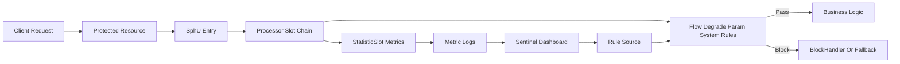

# Sentinel 源码剖析与实战修炼专栏大纲

> 版本：Sentinel 1.8.x / Spring Cloud Alibaba 2023.x
> 面向人群：开发、测试、运维、架构师、SRE
> 总章节：40 章（基础篇 16 章 / 中级篇 15 章 / 高级篇 9 章）
> 每章独立成文件，字数 3000-5000 字

---

## 专栏定位

以 Sentinel 的真实服务治理场景为主线，从单机限流到分布式流量治理，从控制台配置到动态规则推送，从 Spring Boot 快速接入到源码级 Slot Chain 剖析，逐步搭建一套可在生产落地的流量防护体系。每一章均采用「业务痛点 -> 三人剧本对话 -> 项目实战 -> 总结思考」的四段式结构，优先让读者动手跑通、压测验证、观察指标，再回到原理和源码解释为什么这样设计。

---

## 阅读路线建议

| 角色 | 建议阅读顺序 | 重点章节 |
|------|-------------|---------|
| 新人开发/测试 | 基础篇全读，先会接入、会配置、会验证 | 第 1-16 章 |
| 核心开发/运维 | 基础篇速读，中级篇精读，高级篇按需阅读 | 第 17-31 章 |
| 架构师/资深开发/SRE | 中级篇与高级篇为主线，回溯基础篇实验 | 第 21-40 章 |

---

# 基础篇（第 1-16 章）

> **核心目标**：理解 Sentinel 的术语、工作原理和基础规则，能在单体或 Spring Boot 服务中完成限流、熔断、降级、热点参数和系统保护的最小可用实践。
> **实践主线**：从一个“秒杀下单服务”开始，逐章加入 Sentinel 能力，最后形成一个可演示、可压测、可排障的本地保护系统。

---

## 第1章：Sentinel 术语全景与流量防护工作原理
**定位**：专栏开篇，统一 Sentinel 的核心语系和整体架构认知。
**核心内容**：
- 术语词典：资源、Entry、Context、Node、ClusterNode、Slot、Rule、BlockException、Fallback、Dashboard
- Sentinel 的工作流程：定义资源 -> 采集统计 -> 规则判断 -> 放行或阻断 -> 兜底处理
- Slot Chain 架构图：NodeSelectorSlot、ClusterBuilderSlot、StatisticSlot、FlowSlot、DegradeSlot、SystemSlot 等职责
- 单机规则与集群规则的边界：本地判断、远程 Token Server、动态数据源
- 与 Hystrix、Resilience4j、RateLimiter 的能力差异
**架构图草案**：

**实战目标**：为一个 Spring Boot `order-service` 手工接入 SphU API，绘制 Sentinel 流量防护架构图，并通过 JMeter 触发一次 `BlockException`。

---

## 第2章：搭建本地实验环境与 Sentinel Dashboard
**定位**：让读者先把控制台和示例服务跑起来，建立可视化反馈。
**核心内容**：
- JDK、Maven、Docker、JMeter、curl 的最小环境准备
- Sentinel Dashboard 启动参数、端口、鉴权和日志目录
- Spring Boot 示例工程结构：controller、service、load-test、docker-compose
- 客户端连接 Dashboard：`csp.sentinel.dashboard.server`、`project.name`
- 常见启动问题：端口占用、JDK 版本、Dashboard 看不到应用
**实战目标**：用 Docker Compose 启动 Dashboard 与 `order-service`，访问接口后在控制台看到实时簇点链路。

---

## 第3章：资源定义入门：SphU、Entry 与 try-with-resources
**定位**：从最底层 API 理解 Sentinel 到底保护的是什么。
**核心内容**：
- 资源名设计：接口维度、方法维度、业务动作维度
- `SphU.entry()` 与 `Entry.exit()` 的生命周期
- `ContextUtil.enter()` 的调用链上下文
- `BlockException` 与业务异常的边界
- try-with-resources 写法降低漏调 `exit` 的风险
**实战目标**：保护“创建订单”“查询订单”“取消订单”三个资源，编写单元测试验证正常放行、限流阻断和业务异常互不混淆。

---

## 第4章：Spring Boot 自动接入与注解保护
**定位**：把手写 API 升级为业务项目中更常用的注解式接入。
**核心内容**：
- `sentinel-spring-webmvc-adapter` 与 Spring Cloud Alibaba Sentinel 的区别
- `@SentinelResource` 的 `value`、`blockHandler`、`fallback`
- BlockHandler 方法签名与 fallback 方法签名
- Controller、Service、Feign Client 的资源命名策略
- 注解方式与硬编码 API 的适用边界
**实战目标**：改造 `order-service` 的下单链路，用 `@SentinelResource` 实现限流提示和异常兜底，并用 curl 验证响应差异。

---

## 第5章：流控规则入门：QPS、线程数与流控效果
**定位**：掌握 Sentinel 最常用的流量入口保护能力。
**核心内容**：
- FlowRule 核心字段：resource、grade、count、strategy、controlBehavior
- QPS 限流与线程数限流的区别
- 直接拒绝、Warm Up、匀速排队三种流控效果
- 资源维度与接口容量评估的关系
- Dashboard 配置规则与代码加载规则的优缺点
**实战目标**：为“秒杀下单接口”分别配置 QPS=10、线程数=5、Warm Up 预热规则，压测观察吞吐、RT 和拒绝数变化。

---

## 第6章：关联流控与链路流控
**定位**：理解 Sentinel 不只是保护单个接口，也能保护资源之间的竞争关系。
**核心内容**：
- 关联流控：当支付接口繁忙时限制下单接口
- 链路流控：同一资源在不同入口链路下采用不同阈值
- `Context`、入口资源与调用树的关系
- Web 场景下链路收敛导致规则不生效的原因
- `web-context-unify=false` 的配置影响
**实战目标**：设计“查询库存”和“提交订单”共享库存资源的案例，验证关联流控与链路流控在不同入口下的行为。

---

## 第7章：熔断降级规则：慢调用、异常比例与异常数
**定位**：从“挡住流量”进入“隔离故障”的服务稳定性实践。
**核心内容**：
- 熔断状态机：Closed、Open、Half-Open
- 慢调用比例、异常比例、异常数三种策略
- 熔断窗口、最小请求数、统计时长的取值方法
- 下游超时、异常、抖动对上游的影响
- 熔断提示、业务 fallback 与用户体验设计
**实战目标**：模拟库存服务 2 秒延迟和 50% 异常，配置慢调用比例熔断与异常比例熔断，观察熔断打开和半开恢复过程。

---

## 第8章：热点参数限流：保护爆款商品和高频用户
**定位**：解决“整体流量不高，但某个参数被打爆”的真实问题。
**核心内容**：
- ParamFlowRule 与普通 FlowRule 的差异
- 参数索引、参数类型、例外项配置
- 热点商品、热点用户、热点 IP 的识别方式
- `@SentinelResource` 热点参数限流的接入要求
- 热点参数限流的内存占用与统计窗口
**实战目标**：实现商品详情接口，对 `skuId` 做热点参数限流，为 VIP 商品配置更高阈值，并用 JMeter 参数化压测验证。

---

## 第9章：系统自适应保护：让服务学会自保
**定位**：从单个资源保护升级为整机维度的入口流量保护。
**核心内容**：
- SystemRule 核心指标：Load、CPU 使用率、平均 RT、入口 QPS、并发线程数
- Linux Load 与 CPU 的实际含义
- 系统规则为什么只对入口流量生效
- 系统保护与 Kubernetes HPA 的协作关系
- 误配系统规则导致全站不可用的典型事故
**实战目标**：在本地压测中触发 CPU 或入口 QPS 系统保护，记录 Sentinel 指标日志并给出阈值设置建议。

---

## 第10章：授权规则：黑白名单与来源识别
**定位**：掌握轻量级访问控制能力，理解来源标识的生产约束。
**核心内容**：
- AuthorityRule 的白名单与黑名单模式
- `RequestOriginParser` 的实现方式
- 从 Header、Token、AppId 提取调用方来源
- 授权规则与网关鉴权、业务鉴权的区别
- Header 伪造风险与上游可信边界
**实战目标**：为订单查询接口配置只允许 `web-app` 与 `admin-app` 调用的白名单规则，并编写 MockMvc 测试覆盖非法来源。

---

## 第11章：Dashboard 操作指南与规则生命周期
**定位**：让开发、测试、运维都能用同一套方式查看、配置和验证规则。
**核心内容**：
- 实时监控、簇点链路、流控规则、熔断规则、热点规则页面说明
- Dashboard 推送规则的内存态特性
- 规则新增、修改、删除后的客户端同步过程
- 控制台日志、客户端日志和指标文件定位
- 多环境 Dashboard 的隔离策略
**实战目标**：用 Dashboard 完成一次规则配置变更，重启服务验证规则丢失问题，并记录需要持久化的配置清单。

---

## 第12章：Sentinel 日志与指标文件解读
**定位**：学会不用控制台也能定位限流和熔断问题。
**核心内容**：
- `~/logs/csp/` 目录结构与日志类型
- metric 日志字段：timestamp、pass、block、success、exception、rt、occupiedPass
- block 日志与业务日志的关联方法
- 常见异常：`FlowException`、`DegradeException`、`ParamFlowException`
- 日志采集、清理和磁盘容量控制
**实战目标**：压测生成 metric 日志，用脚本统计每分钟通过数、拒绝数和平均 RT，输出一份简单排障报告。

---

## 第13章：Web 场景实战：保护电商下单链路
**定位**：把前面分散的规则串成一个完整业务链路。
**核心内容**：
- 下单链路拆解：校验库存、创建订单、扣减库存、发起支付
- Controller 入口资源与 Service 内部资源的分层保护
- 限流提示、熔断兜底、热点商品保护组合使用
- 用户体验：排队、重试、友好提示与幂等键
- 测试环境构造：Mock 下游、固定延迟、随机异常
**实战目标**：完成一个最小电商下单 Demo，配置三类 Sentinel 规则，并用 JMeter 输出压测前后对比图。

---

## 第14章：测试人员视角：如何验证 Sentinel 规则
**定位**：把 Sentinel 从“开发配置”变成“可测试、可验收”的质量能力。
**核心内容**：
- 限流、熔断、热点、授权、系统保护的测试用例设计
- 边界值测试：阈值前后、窗口切换、半开恢复
- 压测工具选择：JMeter、wrk、hey、Gatling
- 验收指标：通过率、拒绝率、P95/P99、恢复时间
- 自动化回归中的 Sentinel 规则校验
**实战目标**：为 `order-service` 编写一份 Sentinel 验收用例清单，并实现 3 个可重复执行的压测脚本。

---

## 第15章：基础故障排查：为什么规则没有生效
**定位**：集中解决初学者最常遇到的接入和配置问题。
**核心内容**：
- 资源名不一致、注解未生效、方法签名错误
- Dashboard 看不到应用、应用频繁掉线
- Web 链路收敛导致链路规则不符合预期
- BlockHandler 未执行与 fallback 抢占
- 日志、断点、单元测试三种定位手段
**实战目标**：构造 6 个“规则不生效”的故障案例，逐个定位根因并沉淀排查 SOP。

---

## 第16章：【基础篇综合实战】搭建秒杀服务的单机流量防护系统
**定位**：融会贯通基础篇，交付一个可运行的单机 Sentinel Demo。
**核心内容**：
- 场景：新品秒杀活动，订单服务需要抗住突发流量和库存服务抖动
- 功能需求：下单限流、热点商品限流、库存熔断、来源授权、系统保护
- 实现方案：Spring Boot + Sentinel Dashboard + JMeter + Docker Compose
- 验收标准：限流生效、熔断可恢复、日志可追踪、测试脚本可复现
**实战目标**：交付完整 Demo 工程、压测脚本、规则配置截图和一份基础篇复盘报告。

---

# 中级篇（第 17-31 章）

> **核心目标**：掌握 Sentinel 在微服务、网关、注册配置中心、监控告警和生产压测中的落地方法，能设计可持久化、可观测、可协作的流量治理方案。
> **实践主线**：把单机 Demo 升级为“订单、库存、支付、网关、配置中心、监控系统”组成的微服务实验环境。

---

## 第17章：动态规则持久化：从内存态到配置中心
**定位**：解决 Dashboard 配置重启丢失的问题，迈向生产可用。
**核心内容**：
- Sentinel 规则的数据模型与内存态限制
- ReadableDataSource、WritableDataSource 的职责
- push 模式与 pull 模式对比
- Nacos、Apollo、ZooKeeper、Redis 作为规则源的选择
- 规则版本、灰度发布和回滚策略
**实战目标**：将流控规则持久化到 Nacos，重启服务后自动加载规则，并验证 Dashboard 修改后的同步链路。

---

## 第18章：Nacos 动态规则生产实践
**定位**：围绕最常见的 Spring Cloud Alibaba 组合做深入落地。
**核心内容**：
- Sentinel 与 Nacos 的依赖配置和数据源类型
- groupId、dataId、namespace 的环境隔离设计
- JSON 规则格式与多规则维护方式
- 配置变更监听与客户端热更新
- Nacos 权限、审计和配置误删恢复
**实战目标**：为订单、库存、支付三个服务分别配置 Nacos 规则数据源，实现开发、测试、生产三套 namespace 隔离。

---

## 第19章：OpenFeign 与 RestTemplate 调用保护
**定位**：保护微服务之间的 HTTP 调用，避免故障沿链路扩散。
**核心内容**：
- Feign Sentinel 开关与 fallbackFactory
- RestTemplate 资源定义与异常映射
- 调用方限流与被调用方限流的分工
- 远程调用超时、重试与熔断的组合风险
- 业务错误、网络错误和 Sentinel 阻断的响应规范
**实战目标**：让订单服务通过 Feign 调用库存服务，在库存服务超时和异常时触发熔断，并返回可观测的降级结果。

---

## 第20章：Dubbo 服务治理与 RPC 资源保护
**定位**：覆盖 RPC 场景下的 Sentinel 接入与规则设计。
**核心内容**：
- Sentinel Dubbo Adapter 的 Provider 与 Consumer 保护
- 接口名、方法名、参数维度的资源命名
- Dubbo 异常、超时、线程池耗尽与 Sentinel 的关系
- Provider 侧限流与 Consumer 侧熔断的职责边界
- 泛化调用、异步调用和重试场景注意事项
**实战目标**：搭建订单调用库存的 Dubbo Demo，在 Provider 侧做 QPS 限流，在 Consumer 侧做异常比例熔断。

---

## 第21章：Spring Cloud Gateway 网关流控
**定位**：把 Sentinel 前移到统一入口，在流量进入服务前完成防护。
**核心内容**：
- Gateway Adapter 的接入方式与过滤器链
- route 维度与 API 分组维度的规则设计
- 网关参数解析：URL、Header、Query、Cookie
- 自定义网关限流异常响应
- 网关层限流与服务层限流的分层策略
**实战目标**：搭建 Spring Cloud Gateway，按路由限制订单接口 QPS，按用户 ID 限制热点访问，并输出统一 JSON 错误响应。

---

## 第22章：集群流控：Token Server 与客户端协同
**定位**：解决多实例各自限流导致整体阈值不准的问题。
**核心内容**：
- 单机限流在多副本部署下的误差来源
- 集群流控架构：Token Client、Token Server、ClusterStateManager
- 全局阈值模式与均摊阈值模式
- Token Server 选主、故障转移和容量规划
- 集群流控的网络开销与降级策略
**实战目标**：启动 3 个订单服务实例和 1 个 Token Server，将全局 QPS 限制为 100，压测验证整体通过量。

---

## 第23章：集群热点参数限流与大促保护
**定位**：在多实例下保护爆款商品、明星直播间等热点资源。
**核心内容**：
- 单机热点参数在多实例下的偏差
- 集群参数限流规则与普通集群流控的差异
- 热点参数的 Cardinality 风险
- TopN 热点识别、阈值下发和临时例外项
- 大促期间的预案、开关和回滚
**实战目标**：模拟 5 个服务实例共同承接爆款商品详情请求，实现全局热点参数限流并观察各实例通过量分布。

---

## 第24章：链路统计与调用树设计
**定位**：帮助读者理解 Sentinel 如何统计资源调用关系，并用好链路维度规则。
**核心内容**：
- EntranceNode、DefaultNode、ClusterNode 的关系
- 调用链路树如何生成和清理
- Web、RPC、异步任务中的上下文传播
- 链路维度统计与普通资源统计的差异
- 资源命名过细导致指标膨胀的问题
**实战目标**：为订单创建链路绘制调用树，分别观察入口资源、内部资源和集群节点指标变化。

---

## 第25章：可观测性：Prometheus、Grafana 与告警
**定位**：让 Sentinel 的通过、阻断、熔断、RT 指标进入统一监控体系。
**核心内容**：
- Sentinel metric 日志转 Prometheus 指标的常见方案
- Micrometer、自定义 Exporter 与日志采集对比
- Grafana 面板设计：QPS、Block QPS、RT、熔断次数、热点参数
- 告警规则：阻断率突增、熔断持续打开、规则异常变更
- 监控标签设计与高基数风险
**实战目标**：搭建 Prometheus + Grafana，展示订单服务 Sentinel 指标，并配置 3 条生产可用告警规则。

---

## 第26章：日志治理与全链路追踪协同
**定位**：把 Sentinel 事件接入日志平台和 Trace，方便生产排障。
**核心内容**：
- BlockException 日志字段规范
- TraceId、用户 ID、资源名、规则 ID 的关联
- ELK/Loki 中的 Sentinel 查询看板
- OpenTelemetry 与 Sentinel 事件打点
- 限流事件过多时的采样和聚合
**实战目标**：为下单接口添加 TraceId，将 Sentinel 阻断事件写入结构化日志，并在 Kibana 中查询一次完整故障链路。

---

## 第27章：容量评估与压测方法论
**定位**：从“拍脑袋阈值”升级为基于数据的规则设计。
**核心内容**：
- 基准压测、阶梯压测、稳定性压测、突刺压测
- 容量指标：QPS、并发、RT、CPU、GC、错误率
- 流控阈值、熔断阈值和系统保护阈值的推导
- JMeter、wrk、Gatling 的适用场景
- 压测环境与生产环境差异修正
**实战目标**：对订单服务做阶梯压测，找出拐点 QPS，并据此制定流控、熔断、系统保护三类规则。

---

## 第28章：规则治理平台设计
**定位**：从“谁都能改规则”升级为有审批、有审计、有回滚的平台化治理。
**核心内容**：
- 规则元数据：服务、资源、环境、负责人、阈值、原因、有效期
- 审批流、灰度发布、定时生效和紧急回滚
- Dashboard 二次开发与自研规则平台的取舍
- 规则冲突检测和基线模板
- 运维、测试、开发的协作边界
**实战目标**：设计一个规则治理平台原型，支持 Nacos 规则发布、审计记录和一键回滚。

---

## 第29章：生产事故复盘：限流、熔断与降级的误用
**定位**：通过真实化事故案例训练工程判断。
**核心内容**：
- 阈值过低导致核心链路被误杀
- 熔断窗口过长导致恢复慢
- fallback 吞掉业务异常造成数据不一致
- 网关层和服务层重复限流导致通过量异常
- 热点参数维度过多导致内存和 CPU 飙升
**实战目标**：复现 5 类 Sentinel 误用事故，输出事故时间线、根因分析、修复方案和预防清单。

---

## 第30章：Kubernetes 部署与弹性伸缩协同
**定位**：理解 Sentinel 在容器化和弹性环境中的部署约束。
**核心内容**：
- 多副本部署下的单机规则和集群规则选择
- Pod 重启、扩缩容与 Dashboard 应用列表变化
- HPA、KEDA 与 Sentinel 系统保护的配合
- ConfigMap、Secret、Nacos 规则源的部署方式
- 滚动发布期间的规则兼容与灰度验证
**实战目标**：在本地 Kind 或 Minikube 中部署订单服务 3 副本，验证扩缩容时单机限流与集群流控的差异。

---

## 第31章：【中级篇综合实战】构建微服务流量治理平台
**定位**：融会贯通中级篇，交付一套生产雏形级 Sentinel 治理方案。
**核心内容**：
- 场景：电商中台有订单、库存、支付、营销、网关 5 个服务
- 功能需求：动态规则、网关流控、服务熔断、集群限流、监控告警、审计回滚
- 架构设计：Spring Cloud Gateway + Sentinel + Nacos + Prometheus + Grafana + ELK
- 分步实现：规则持久化、压测建模、告警配置、事故演练
- 验收标准：规则可热更新、指标可观测、故障可熔断、变更可回滚
**实战目标**：输出完整 docker-compose 或 K8s 部署清单、规则样例、Grafana 面板和中级篇实战报告。

---

# 高级篇（第 32-40 章）

> **核心目标**：从源码和扩展机制理解 Sentinel 的实现细节，能定制 Slot、数据源、统计指标和生产治理策略，并能应对高并发、多机房、SRE 值班等复杂场景。
> **实践主线**：从源码调试一个请求进入 Sentinel 后的完整链路，逐步完成自定义扩展和生产治理闭环。

---

## 第32章：源码环境搭建与调试入口
**定位**：让读者具备阅读和调试 Sentinel 源码的能力。
**核心内容**：
- Sentinel 源码模块结构：core、adapter、dashboard、extension
- 本地导入、编译、运行单元测试和示例工程
- Debug 入口：`SphU.entry()`、`CtSph.entry()`、`ProcessorSlotChain`
- 常用测试类和样例模块的阅读路线
- 源码阅读时如何结合 Dashboard 与日志验证
**实战目标**：在 IDE 中断点调试一次 `SphU.entry()` 调用，记录从资源进入到规则判断的完整调用链。

---

## 第33章：Slot Chain 源码剖析：责任链如何保护资源
**定位**：理解 Sentinel 最核心的扩展点和执行骨架。
**核心内容**：
- ProcessorSlot、AbstractLinkedProcessorSlot、DefaultProcessorSlotChain
- Slot 加载机制与 SPI 顺序
- NodeSelectorSlot、ClusterBuilderSlot、LogSlot、StatisticSlot、FlowSlot、DegradeSlot 的职责
- Slot 异常传递与 Entry 生命周期
- 自定义 Slot 插入链路的风险
**实战目标**：编写一个自定义 Slot，在每次资源进入时记录业务标签，并验证它在 FlowSlot 前后执行的差异。

---

## 第34章：统计滑动窗口源码：LeapArray 与 MetricBucket
**定位**：深入理解 Sentinel 为什么能做秒级统计和快速判断。
**核心内容**：
- LeapArray、WindowWrap、MetricBucket 的数据结构
- 滑动窗口时间片的创建、复用和重置
- LongAdder 在高并发统计中的作用
- 秒级统计、分钟级统计与 metric 日志写入
- 时间回拨、窗口过期和高并发竞争问题
**实战目标**：单独运行统计窗口相关单元测试，修改窗口长度和样本数，对比统计精度与内存开销。

---

## 第35章：FlowSlot 源码：限流规则如何被执行
**定位**：从源码解释 QPS、线程数、Warm Up、匀速排队的实现细节。
**核心内容**：
- FlowRuleChecker 的判断流程
- DefaultController、WarmUpController、RateLimiterController
- 直接流控、关联流控、链路流控源码路径
- `canPass` 的返回语义与 `FlowException`
- `occupiedPass` 与匀速排队的指标含义
**实战目标**：为 FlowRuleChecker 添加调试日志，压测三种流控效果，输出源码路径和指标变化对照表。

---

## 第36章：DegradeSlot 源码：熔断器状态机与恢复机制
**定位**：深入理解熔断打开、半开探测和关闭恢复的实现。
**核心内容**：
- CircuitBreaker 接口与实现类
- SlowRatioCircuitBreaker、ExceptionCircuitBreaker 的判断逻辑
- 熔断状态切换、探测请求和恢复条件
- 统计窗口与熔断窗口的交互
- 熔断规则变更对已有状态的影响
**实战目标**：构造慢调用和异常比例两类测试，断点观察熔断器状态变化，并绘制状态机图。

---

## 第37章：SPI 与扩展机制：自定义规则源、指标和异常处理
**定位**：从“使用 Sentinel”升级为“扩展 Sentinel”。
**核心内容**：
- Sentinel SPI 机制与 `META-INF/services` 配置
- 自定义 DataSource 和 RuleManager
- 自定义 BlockExceptionHandler、UrlCleaner、RequestOriginParser
- Dashboard 扩展与客户端扩展的边界
- 扩展代码的兼容性、测试和发布策略
**实战目标**：实现一个基于数据库的规则数据源和一个统一 JSON 限流异常处理器，并补充集成测试。

---

## 第38章：极端高并发调优与低延迟实践
**定位**：面对大促、热点活动、突发流量时做系统级优化。
**核心内容**：
- 资源数量、规则数量、热点参数维度对性能的影响
- JVM 参数、GC、线程池、连接池与 Sentinel 的协同调优
- 高基数热点参数导致内存膨胀的治理
- Dashboard、日志、指标写入对性能的影响
- 压测火焰图、JFR、async-profiler 的定位方法
**实战目标**：对 10 万 QPS 的本地压测场景做性能剖析，定位 Sentinel 相关热点，并给出调优前后对比。

---

## 第39章：多机房与 SRE 落地：预案、演练和值班手册
**定位**：把 Sentinel 能力转化为组织级稳定性工程实践。
**核心内容**：
- 多机房规则一致性、就近限流与全局阈值分配
- 大促预案：预热、限流、降级、开关、回滚
- 故障演练：下游慢、缓存雪崩、突发热点、配置中心异常
- 值班手册：指标观察、规则调整、回滚步骤、沟通机制
- 开发、测试、运维、SRE 的责任分工
**实战目标**：编写一份 Sentinel 大促稳定性预案，包含规则基线、演练脚本、告警阈值和值班操作手册。

---

## 第40章：【高级篇综合实战】从源码扩展到生产级流量防护平台
**定位**：融会贯通高级篇，完成可交付的 Sentinel 深度实践项目。
**核心内容**：
- 场景：金融支付系统需要统一的限流、熔断、降级、审计和应急平台
- 架构设计：Sentinel Client + 自定义 Slot + Nacos/DB 数据源 + 治理后台 + Prometheus + Trace
- 功能实现：规则审批、动态推送、灰度发布、熔断演练、SRE 预案、一键回滚
- 源码扩展：自定义业务标签 Slot、自定义数据源、自定义异常输出和指标上报
- 验收标准：核心链路 P99 稳定、配置变更可审计、故障 5 分钟内定位、规则 1 分钟内回滚
**实战目标**：交付一个生产级流量防护平台原型，包含源码扩展、部署清单、压测报告、监控大盘和稳定性演练报告。

---

# 附录与资源

## 附录 A：源码阅读路线图
1. 入口：`SphU.entry()`、`CtSph.entry()`、`Env.sph`
2. 责任链：`ProcessorSlotChain`、`DefaultSlotChainBuilder`
3. 节点统计：`NodeSelectorSlot`、`ClusterBuilderSlot`、`StatisticSlot`
4. 规则执行：`FlowSlot`、`DegradeSlot`、`ParamFlowSlot`、`SystemSlot`
5. 指标统计：`LeapArray`、`MetricBucket`、`MetricTimerListener`

## 附录 B：推荐工具链
- 开发：JDK 17、Maven、IntelliJ IDEA、Spring Boot、Spring Cloud Alibaba
- 压测：JMeter、wrk、hey、Gatling
- 配置中心：Nacos、Apollo、ZooKeeper
- 可观测性：Prometheus、Grafana、ELK/Loki、OpenTelemetry、Jaeger
- 容器：Docker、Docker Compose、Kubernetes、Helm

## 附录 C：章节正文统一模板
1. 项目背景：用真实或拟真的业务需求引出本章主题，放大没有 Sentinel 时的痛点。
2. 项目设计：用小胖、小白、大师三人剧本式交锋自然带出技术决策。
3. 项目实战：给出环境准备、分步实现、代码片段、运行结果、测试验证和踩坑处理。
4. 项目总结：总结优缺点、适用场景、注意事项、生产案例、思考题和推广计划。

## 附录 D：推广计划建议
- 开发团队：优先阅读基础篇和中级篇，重点掌握接入、规则设计、熔断兜底和源码扩展。
- 测试团队：重点阅读第 14、15、27、29、31 章，形成可复用的稳定性测试用例库。
- 运维/SRE 团队：重点阅读第 17、25、26、30、39、40 章，建立监控、告警、预案和回滚机制。
- 架构师：重点阅读第 21-40 章，负责治理平台、规则规范和跨团队落地路径。

---

> **版权声明**：本专栏基于 Alibaba Sentinel 开源项目编写，源码引用与实验示例应遵循 Sentinel 项目的开源许可证要求。
