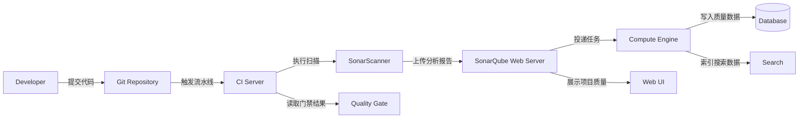

# SonarQube 代码质量治理与实战修炼专栏大纲

> 版本：SonarQube Server 主流/LTS 版本为基准，兼顾 Community、Developer、Enterprise、Data Center 能力差异
> 面向人群：开发、测试、运维、架构师、质量负责人
> 总章节：40 章（基础篇 16 章 / 中级篇 15 章 / 高级篇 9 章）
> 每章独立成文件，字数 3000-5000 字

---

## 专栏定位

以“让代码质量治理真正落地”为主线，从本地扫描、单项目质量门禁，到企业级 CI/CD 集成、权限治理、多语言规则体系，再到 SonarQube 架构原理、插件扩展、质量平台 SRE 运维。每一章均采用「业务痛点 -> 三人剧本对话 -> 项目实战 -> 总结思考」的四段式结构，保证实战为主、理论为辅，由浅入深。

专栏默认使用 Docker、Maven、Gradle、Node.js、GitLab CI、Jenkins、GitHub Actions 等常见工具链组织案例。Community Edition 能完成的实战会优先采用社区版；涉及分支分析、Pull Request 装饰、Portfolio、治理报表、Data Center 高可用等能力时，会明确说明商业版本边界与替代方案。

---

## 阅读路线建议

| 角色 | 建议阅读顺序 | 重点章节 |
|------|-------------|---------|
| 新人开发/测试 | 基础篇全读 -> 中级篇选读 | 第 1-16 章 |
| 核心开发 | 基础篇速读 -> 中级篇精读 -> 高级篇选读 | 第 6-31、32-37 章 |
| 运维/SRE | 第 2、10、15、17、25、26、28、29、31、38-40 章 | 部署、集成、观测、性能、高可用 |
| 架构师/质量负责人 | 中级篇和高级篇为主线，按需回溯基础篇 | 第 17-40 章 |

---

# 基础篇（第 1-16 章）

> **核心目标**：建立 SonarQube 统一语系，完成单机部署、项目扫描、质量门禁、规则治理和初级排障。
> **实战主线**：从一个 Java/前端混合项目开始，把“看不见的代码质量问题”变成团队每天都能执行的质量检查。

---

## 第1章：SonarQube 术语全景与工作原理
**定位**：专栏总览与开篇，建立代码质量治理的共同语言。
**核心内容**：
- 术语词典：Project、Analysis、Scanner、Quality Profile、Quality Gate、Rule、Issue、Measure、Metric、Leak Period、New Code、Coverage、Duplication、Security Hotspot
- 工作流：开发提交代码 -> CI 触发扫描 -> Scanner 上传分析报告 -> Compute Engine 入库 -> Web UI 展示 -> Quality Gate 返回流水线结果
- 核心组件：Web Server、Compute Engine、Search、Database、Scanner、插件系统
- 质量模型：Reliability、Security、Maintainability、Coverage、Duplications、Security Review
- New Code 机制：为什么企业质量治理要从“新增代码不变坏”开始
- 版本与能力边界：Community、Developer、Enterprise、Data Center 常见差异
**架构图**：

**实战目标**：用 Docker 启动 SonarQube，扫描一个最小 Java 项目，画出团队可复用的质量分析流程图。

---

## 第2章：Docker 单机安装与首次登录配置
**定位**：从零搭建可实验的 SonarQube 环境。
**核心内容**：
- Docker Compose 部署 SonarQube 与 PostgreSQL
- 系统参数准备：vm.max_map_count、文件句柄、容器内存
- 首次登录、管理员密码、安全基线配置
- Marketplace、插件安装与版本兼容注意事项
- 开发环境、测试环境、生产环境的部署差异
**实战目标**：编写一份可启动、可销毁、可复现的 `docker-compose.yml`，完成首次登录与健康检查。

---

## 第3章：第一个项目扫描：从 0 到 Quality Gate
**定位**：让团队第一次看到可量化的代码质量结果。
**核心内容**：
- SonarScanner CLI 的安装与配置
- `sonar-project.properties` 核心参数：projectKey、sources、tests、host.url、token
- 扫描任务生命周期：开始、分析、上传、计算、展示
- Quality Gate 默认规则与扫描失败的判定方式
- 常见错误：认证失败、路径错误、编码问题、语言插件缺失
**实战目标**：扫描一个包含 Bug、Code Smell、重复代码的示例项目，并让 Quality Gate 从 Failed 修复到 Passed。

---

## 第4章：Maven 项目扫描实战
**定位**：掌握 Java 后端团队最常见的接入方式。
**核心内容**：
- `sonar-maven-plugin` 的使用方式
- Maven 生命周期与 Sonar 分析阶段的关系
- 多模块 Maven 项目的扫描范围与聚合展示
- 单元测试、JaCoCo 覆盖率报告与 SonarQube 的关联
- 私有仓库、代理、证书问题排查
**实战目标**：扫描一个 Spring Boot 多模块项目，生成覆盖率并配置基础质量门禁。

---

## 第5章：Gradle 项目扫描与 Android 场景
**定位**：覆盖 Gradle 生态中的后端、移动端和多模块项目。
**核心内容**：
- `org.sonarqube` Gradle 插件配置
- Gradle Task 与 CI 命令组织
- Kotlin、Groovy、Java 混合项目扫描
- Android Lint、单元测试、覆盖率与 SonarQube 的配合
- 多模块项目中 sourceSet、testReportPath、coverageReportPath 的设计
**实战目标**：为一个 Gradle 多模块项目接入 SonarQube，并输出模块级质量对比。

---

## 第6章：前端项目扫描：TypeScript、ESLint 与覆盖率
**定位**：让前端团队也能把质量问题纳入统一门禁。
**核心内容**：
- Node.js、TypeScript、React/Vue 项目的扫描参数
- `sonar.javascript.lcov.reportPaths` 与 Jest/Vitest 覆盖率接入
- ESLint 与 SonarQube 的边界：哪些问题由谁负责
- 前端常见问题：重复组件、复杂函数、未覆盖分支、潜在 XSS
- monorepo 中前端包的扫描策略
**实战目标**：扫描一个 TypeScript + React 项目，接入 lcov 覆盖率并治理 3 类典型问题。

---

## 第7章：规则、问题与修复闭环
**定位**：理解 SonarQube 为什么能发现问题，以及问题如何被团队消化。
**核心内容**：
- Rule、Issue、Severity、Type、Clean Code Attribute 的含义
- Bug、Vulnerability、Code Smell、Security Hotspot 的区别
- Issue 生命周期：Open、Accepted、False Positive、Fixed
- Assign、Comment、Tags、Bulk Change 的团队协作方式
- 修复优先级：先 New Code，再高严重级别，再热点模块
**实战目标**：挑选 10 个真实 Issue，完成分析、修复、误报标记和复扫验证。

---

## 第8章：Quality Profile：打造团队规则集
**定位**：从默认规则走向团队自己的代码规范。
**核心内容**：
- Quality Profile 与语言的绑定关系
- 内置 Profile、继承、复制、激活/停用规则
- 规则参数调整：复杂度阈值、命名规范、异常处理约束
- 团队规则评审机制：开发、测试、架构师如何共同制定
- Profile 变更的影响评估与回滚策略
**实战目标**：基于 Java 默认规则复制一套团队 Profile，并为异常处理、复杂度、命名规范做定制。

---

## 第9章：Quality Gate：把质量要求变成流水线红线
**定位**：把“建议修复”升级为“不能带病合并”。
**核心内容**：
- Quality Gate 条件：Coverage、Duplicated Lines、Reliability Rating、Security Rating、Maintainability Rating
- Overall Code 与 New Code 的门禁差异
- 为什么推荐从 New Code 门禁开始
- 门禁过严/过松的团队风险
- 不同项目阶段的门禁模板：新项目、遗留项目、核心系统
**实战目标**：设计 3 套 Quality Gate，并在同一项目中比较门禁结果差异。

---

## 第10章：SonarLint 与 IDE 内左移实践
**定位**：让开发在提交前就发现质量问题。
**核心内容**：
- SonarLint 的本地模式与 Connected Mode
- IDE 与 SonarQube 服务器规则同步
- 本地问题、服务端问题、PR 问题的差异
- 开发体验优化：只看当前文件、只看新增问题、过滤误报
- 推广策略：如何避免工具变成打扰开发的噪音
**实战目标**：在 IntelliJ IDEA 或 VS Code 中接入 SonarLint，并验证服务端 Profile 同步效果。

---

## 第11章：测试覆盖率治理入门
**定位**：把“有没有测试”变成可追踪的工程指标。
**核心内容**：
- 行覆盖率、分支覆盖率、条件覆盖率的差异
- JaCoCo、lcov、coverage.py 报告接入
- 覆盖率路径匹配与源码路径不一致问题
- 新代码覆盖率门禁的合理阈值
- 覆盖率的反模式：无效断言、只测 getter/setter、为了数字写测试
**实战目标**：为 Java 和 TypeScript 两个模块分别接入覆盖率，并定位报告导入失败问题。

---

## 第12章：重复代码与复杂度治理
**定位**：从可维护性角度治理“越改越难”的代码。
**核心内容**：
- 重复率、重复块、重复行的计算方式
- Cyclomatic Complexity 与 Cognitive Complexity 的区别
- 长方法、大类、深层嵌套的治理思路
- 抽象过度与重复治理的边界
- 重构前后如何用 SonarQube 验证收益
**实战目标**：重构一个高复杂度订单校验模块，让复杂度和重复率同时下降。

---

## 第13章：安全漏洞与 Security Hotspot 入门
**定位**：让普通开发也能理解安全扫描结果。
**核心内容**：
- Vulnerability 与 Security Hotspot 的区别
- 常见安全规则：SQL 注入、路径遍历、弱加密、硬编码密钥、XSS
- Hotspot Review 流程：To Review、Reviewed、Safe、Fixed
- 安全问题与 SAST 工具的边界
- 安全部门与开发团队的协作方式
**实战目标**：扫描一个带有 SQL 注入和硬编码密钥的示例项目，完成修复与 Hotspot 审核。

---

## 第14章：Web API 初体验：用脚本读取质量数据
**定位**：把 SonarQube 从“看页面”扩展到“可集成系统”。
**核心内容**：
- Web API 文档入口与认证 Token
- 常用接口：projects、measures、issues、qualitygates、ce
- 用 curl 查询项目指标、门禁状态和 Issue 列表
- 分页、过滤、排序与错误码处理
- API Token 权限与泄露风险
**实战目标**：编写一个脚本，查询项目 Quality Gate 状态并输出 Top 10 严重 Issue。

---

## 第15章：日常运维与常见扫描失败排查
**定位**：从“能扫一次”到“稳定每天扫”。
**核心内容**：
- 扫描失败分类：网络、认证、参数、构建、覆盖率、服务端计算
- Compute Engine 任务队列与失败日志查看
- Scanner 日志中的关键字段
- 服务端日志：web.log、ce.log、es.log、sonar.log
- 常见故障 SOP：内存不足、数据库连接失败、ES 启动失败、插件不兼容
**实战目标**：模拟 5 类常见失败，整理一份团队扫描故障排查清单。

---

## 第16章：【基础篇综合实战】让一个团队完成代码质量入门落地
**定位**：融会贯通基础篇知识，完成从部署到门禁的闭环。
**核心内容**：
- 场景：一个 20 人团队维护 Spring Boot + React 业务系统，线上 Bug 频发、测试覆盖率不可见
- 需求拆解：部署 SonarQube、接入后端/前端扫描、配置 Profile、设置 Gate、接入 IDE、输出周报
- 分步实现：Docker 部署、项目 Token、Scanner 配置、覆盖率接入、门禁修复
- 验收标准：新增代码覆盖率 >= 80%，新 Bug 为 0，重复率 < 3%，团队完成一次 Issue 修复日
**实战目标**：交付一套可复用的团队质量入门模板，包括配置、命令、排障 SOP 和推广计划。

---

# 中级篇（第 17-31 章）

> **核心目标**：掌握 CI/CD 集成、分支与 PR 治理、权限模型、质量度量体系、性能维护和跨团队推广。
> **实战主线**：把单项目扫描升级为企业研发流程中的质量门禁与质量运营平台。

---

## 第17章：Jenkins 流水线集成与质量门禁阻断
**定位**：将 SonarQube 结果纳入持续集成发布流程。
**核心内容**：
- Jenkins SonarQube 插件与凭据配置
- Pipeline 中 `withSonarQubeEnv` 和 `waitForQualityGate`
- Webhook 回调与流水线等待机制
- 构建、测试、扫描、门禁、部署的阶段拆分
- 超时、重试、并发构建下的门禁稳定性
**实战目标**：编写 Jenkinsfile，让 Quality Gate 失败时自动阻断部署。

---

## 第18章：GitLab CI 与 Merge Request 质量治理
**定位**：让代码审查与质量扫描在合并前完成。
**核心内容**：
- GitLab CI 中缓存、变量、Token 的配置
- Merge Request 扫描与主干扫描的区别
- Quality Gate 结果回写 MR 的策略
- Community 版本替代方案与商业版 PR Decoration 能力边界
- 防止重复扫描、慢扫描、错误阻断的流水线优化
**实战目标**：为一个 GitLab 项目接入 MR 扫描，输出可复制的 `.gitlab-ci.yml` 模板。

---

## 第19章：GitHub Actions 与 Pull Request 装饰
**定位**：覆盖开源项目和 GitHub 团队的质量门禁场景。
**核心内容**：
- GitHub Actions 中配置 SonarScanner
- `SONAR_TOKEN`、`GITHUB_TOKEN` 与权限模型
- Pull Request Decoration 的展示内容
- 分支保护规则与 Quality Gate 状态检查
- Fork PR 的安全限制与 Token 保护
**实战目标**：让 PR 在合并前展示质量结果，并通过分支保护阻止不合格代码进入主干。

---

## 第20章：分支分析与 New Code 策略设计
**定位**：解决遗留项目“历史债太多导致无法落地”的问题。
**核心内容**：
- Main Branch、Long-lived Branch、Short-lived Branch 的治理差异
- New Code Period 的选择：Previous Version、Number of Days、Reference Branch
- 遗留项目的“先止血、再还债”策略
- Release 分支、Hotfix 分支、Feature 分支的扫描建议
- 不同版本能力边界与替代流程
**实战目标**：为一个三年遗留系统设计 New Code 门禁，做到不因历史债阻断日常迭代。

---

## 第21章：权限、组织与项目模板治理
**定位**：从单管理员模式走向多团队协作治理。
**核心内容**：
- 用户、组、全局权限、项目权限
- Permission Template 与新项目自动授权
- 项目可见性、Issue 管理权限、质量配置权限
- LDAP、SAML、OIDC 等企业认证集成思路
- 最小权限原则与审计要求
**实战目标**：设计研发、测试、运维、安全四类角色的权限矩阵，并用模板自动应用到新项目。

---

## 第22章：多语言、多仓库与 Monorepo 扫描策略
**定位**：应对企业真实项目结构的复杂性。
**核心内容**：
- Java、JavaScript、Python、Go、C# 等语言扫描差异
- 单仓多项目、单项目多模块、monorepo 的项目建模
- include/exclude 策略：源码、测试、生成代码、第三方目录
- 大仓库扫描耗时控制与缓存策略
- 项目 Key 命名规范与资产目录管理
**实战目标**：为一个包含后端、前端、脚本和基础库的 monorepo 设计扫描拆分方案。

---

## 第23章：覆盖率、测试报告与质量数据可信度
**定位**：解决“页面上有数字，但没人相信”的问题。
**核心内容**：
- 单元测试报告与覆盖率报告的导入链路
- 多模块覆盖率聚合与路径映射
- 容器化构建中路径变化导致的报告丢失
- 覆盖率与测试质量的关联和局限
- 质量数据可信度校验清单
**实战目标**：构建一条 Java + 前端混合项目的覆盖率聚合流水线，并输出数据可信度验收表。

---

## 第24章：Issue 管理、债务治理与质量运营
**定位**：把扫描结果转化为可执行的工程管理动作。
**核心内容**：
- Technical Debt、Remediation Cost、Debt Ratio 的含义
- Issue 分派、批量处理、标记误报与接受风险
- 质量债台账：按团队、模块、严重级别统计
- 修复节奏：每日新增清零、每周热点治理、每月债务复盘
- 如何避免“扫描很多，没人修”的工具疲劳
**实战目标**：用 API 导出 Issue 数据，生成一个团队质量债看板。

---

## 第25章：SonarQube 可观测性与监控告警
**定位**：保障质量平台自身稳定运行。
**核心内容**：
- 系统健康页、任务队列、后台任务失败率
- 日志监控：web、ce、es、access、deprecation
- 数据库连接池、JVM、磁盘、搜索索引指标
- Prometheus、Grafana、日志平台的接入思路
- 告警规则：CE 队列积压、ES 异常、磁盘不足、扫描失败率升高
**实战目标**：为 SonarQube 设计一套基础监控大盘和 5 条关键告警。

---

## 第26章：性能调优与大项目扫描加速
**定位**：解决企业推广后扫描慢、队列堵、页面卡的问题。
**核心内容**：
- Scanner 端性能：排除目录、缓存、增量思路、构建复用
- 服务端性能：Compute Engine Worker、JVM、数据库、搜索索引
- 大项目扫描拆分与任务排队治理
- 插件、规则数量、覆盖率报告体积对性能的影响
- 容量规划：项目数、代码行、日扫描次数、并发任务
**实战目标**：对一个百万行级项目进行扫描耗时分析，并把耗时降低 30%。

---

## 第27章：Kubernetes 部署与 Helm 实践
**定位**：让 SonarQube 适配云原生运维体系。
**核心内容**：
- Helm Chart 部署结构与关键 values
- PostgreSQL 外置、持久化存储、Ingress、TLS
- Pod 资源限制、探针、滚动升级策略
- Elasticsearch/搜索组件对 K8s 参数的要求
- 备份、恢复与升级演练
**实战目标**：在 K8s 中部署一套可用于测试环境的 SonarQube，并完成一次备份恢复验证。

---

## 第28章：备份、升级与插件兼容治理
**定位**：把质量平台从实验工具变成可长期维护的基础设施。
**核心内容**：
- 数据库备份与恢复策略
- 版本升级路径、停机窗口与回滚预案
- 插件兼容性评估、灰度验证和禁用策略
- 升级前检查：系统参数、数据库版本、Java 版本、插件清单
- 生产升级演练与升级报告模板
**实战目标**：制定一份从测试环境到生产环境的 SonarQube 升级 Runbook。

---

## 第29章：企业质量标准与度量体系设计
**定位**：从工具配置上升到组织级工程质量标准。
**核心内容**：
- 质量指标分层：项目级、团队级、部门级、公司级
- 质量门禁基线：安全、可靠性、可维护性、覆盖率、重复率
- 不同系统等级的质量要求：核心交易、内部系统、工具项目
- 质量报表：趋势、排行、红线、改进率
- 度量误用风险：唯指标论、刷覆盖率、惩罚性排名
**实战目标**：设计一套企业质量指标体系和质量周报模板。

---

## 第30章：开发、测试、运维协作推广计划
**定位**：解决工具落地中最难的“人和流程”问题。
**核心内容**：
- 推广节奏：试点团队、模板沉淀、规模化复制
- 开发关注：规则合理性、IDE 提醒、门禁公平性
- 测试关注：覆盖率可信度、缺陷回归、质量趋势
- 运维关注：平台稳定、权限、安全、容量
- 质量例会、修复日、豁免流程和培训材料
**实战目标**：输出一份 90 天 SonarQube 企业推广计划。

---

## 第31章：【中级篇综合实战】构建企业级质量门禁流水线
**定位**：融会贯通中级篇知识，把质量门禁落到研发流程。
**核心内容**：
- 场景：一家中型公司有 80 个项目、300 名研发，想在不拖慢交付的前提下提升代码质量
- 架构设计：SonarQube + GitLab/Jenkins + 统一规则集 + 权限模板 + 质量周报
- 分步实现：项目接入规范、CI 模板、门禁分级、Issue 运营、平台监控
- 验收标准：核心项目接入率 >= 90%，新增 Blocker/Critical 为 0，MR 门禁平均等待 < 3 分钟
**实战目标**：交付一套企业级 SonarQube 落地方案，包括流水线模板、治理制度、监控告警和推广计划。

---

# 高级篇（第 32-40 章）

> **核心目标**：理解 SonarQube 内部架构、分析模型、扩展机制与大规模治理方法，具备平台级建设能力。
> **实战主线**：从使用者升级为质量平台建设者，能扩展规则、优化性能、治理数据并保障生产稳定。

---

## 第32章：SonarQube 内部架构深挖
**定位**：从黑盒使用进入白盒理解。
**核心内容**：
- Web Server、Compute Engine、Search、Database 的职责边界
- Scanner 与 Server 的数据交互：分析报告、任务提交、结果计算
- 插件体系：语言分析器、规则、Web 扩展、传感器
- 数据流：源码指标 -> 分析报告 -> CE Task -> Measures/Issues -> UI/API
- 单机版与 Data Center 架构差异
**实战目标**：跟踪一次完整扫描任务，从 Scanner 日志追到 CE 任务和数据库结果。

---

## 第33章：Scanner 工作机制与分析报告结构
**定位**：理解扫描端如何收集、分析并上传质量数据。
**核心内容**：
- Scanner Bootstrap、项目配置合并、插件下载
- 文件索引、语言识别、规则执行、报告生成
- `sonar.sources`、`sonar.tests`、`sonar.exclusions` 的底层影响
- 覆盖率、测试报告、外部 Issue 的导入机制
- Debug 日志解读与性能瓶颈定位
**实战目标**：开启 Scanner Debug 模式，拆解一次分析中的配置解析、文件索引和报告上传过程。

---

## 第34章：Compute Engine 任务队列与指标计算
**定位**：理解 SonarQube 服务端处理扫描结果的核心引擎。
**核心内容**：
- CE Task 生命周期：Pending、In Progress、Success、Failed、Canceled
- 指标计算、Issue 变更、门禁评估的执行顺序
- Worker 并发、队列积压与失败重试
- 大报告、大覆盖率文件对 CE 的影响
- CE 日志中的关键排障线索
**实战目标**：模拟多个项目并发扫描，观察 CE 队列变化并调优 Worker 与资源配置。

---

## 第35章：规则引擎与自定义规则开发入门
**定位**：让团队可以把内部编码规范转化为自动化规则。
**核心内容**：
- 规则元数据：Key、Name、Severity、Type、Tags、Debt
- 语言插件与规则执行模型
- Java 自定义规则开发基础：AST、Visitor、Issue 上报
- 测试规则：RuleVerifier、测试样例、误报控制
- 自定义规则发布、版本兼容与治理流程
**实战目标**：开发一条 Java 自定义规则，禁止在 Controller 中直接调用 DAO，并发布到测试环境验证。

---

## 第36章：外部分析结果导入与安全工具联动
**定位**：把 SonarQube 扩展为统一质量与安全入口。
**核心内容**：
- Generic Issue Import 格式与使用场景
- ESLint、Stylelint、SpotBugs、PMD、Checkstyle、Semgrep 结果导入
- SAST、SCA、Secret Scan 与 SonarQube 的协作边界
- 外部 Issue 的去重、归属、严重级别映射
- 安全部门与研发流程的联动机制
**实战目标**：将 Semgrep 或 ESLint 的结果导入 SonarQube，并统一展示到项目质量报告中。

---

## 第37章：质量模型定制与平台化治理
**定位**：把 SonarQube 能力包装成企业质量平台。
**核心内容**：
- 项目分级：核心、重要、普通、实验项目
- 规则集分层：基础规则、安全规则、架构规则、团队规则
- 门禁分级：强阻断、软提醒、观察期、豁免
- 质量豁免流程：申请、审批、到期、复盘
- 质量平台 API 封装：项目创建、权限授权、模板应用、报表输出
**实战目标**：设计一个质量平台后台服务，自动创建 SonarQube 项目、应用模板并生成质量报告。

---

## 第38章：大规模 SonarQube 性能与容量治理
**定位**：支撑千项目、千万行代码规模的质量平台。
**核心内容**：
- 容量模型：项目数、代码行、扫描频率、CE 并发、数据库体量
- 数据库优化：连接池、慢查询、索引、备份窗口
- 搜索索引维护、重建与磁盘治理
- 历史数据清理、Housekeeping 与报表保留策略
- 横向扩展与 Data Center 版本适用边界
**实战目标**：为一个千项目规模组织制定容量规划，并完成一次 CE 队列积压治理演练。

---

## 第39章：SonarQube SRE 落地与故障演练
**定位**：把质量平台纳入生产级可靠性体系。
**核心内容**：
- SLO 设计：平台可用性、扫描成功率、门禁响应时间、CE 延迟
- 故障场景：数据库不可用、磁盘满、搜索索引损坏、插件崩溃、升级失败
- Runbook：告警确认、影响评估、降级策略、恢复步骤、复盘模板
- 备份恢复演练与灾难恢复指标
- 质量平台值班与变更管理
**实战目标**：组织一次 SonarQube 故障演练，验证告警、恢复和复盘流程。

---

## 第40章：【高级篇综合实战】建设企业级代码质量治理平台
**定位**：融会贯通高级篇知识，产出可运营、可扩展、可审计的质量平台。
**核心内容**：
- 场景：集团级研发组织拥有 1000+ 项目、多语言技术栈、多研发中心，需要统一质量治理
- 平台架构：SonarQube + CI/CD + 质量门户 + 权限中心 + 报表中心 + 监控告警
- 功能实现：项目自动开户、规则分层、门禁分级、质量豁免、API 报表、SRE 运维
- 治理机制：质量委员会、规则评审、推广培训、例外审批、季度复盘
- 验收标准：核心系统全量接入，新增代码门禁执行率 >= 95%，平台可用性 >= 99.9%，重大安全问题闭环率 100%
**实战目标**：交付一套企业级代码质量治理平台方案，包括架构图、实施路线、规则体系、容量规划和运维 Runbook。

---

# 附录与资源

## 附录 A：每章正文建议结构
1. 项目背景：用真实业务场景引出质量痛点，例如线上缺陷、覆盖率不可见、门禁失效、历史债堆积。
2. 项目设计：通过小胖、小白、大师三人对话展开技术决策，生活化比喻后用“技术映射”落回术语。
3. 项目实战：给出环境准备、配置文件、命令、运行结果、踩坑和验证方式。
4. 项目总结：总结优缺点、适用场景、注意事项、生产故障案例和思考题。

## 附录 B：推荐实战工具链
- 部署：Docker Compose、Kubernetes、Helm
- 构建：Maven、Gradle、npm、pnpm、pip、Go tooling
- CI/CD：Jenkins、GitLab CI、GitHub Actions
- 覆盖率：JaCoCo、lcov、coverage.py、go test coverage
- 质量辅助：SonarLint、ESLint、SpotBugs、PMD、Checkstyle、Semgrep
- 观测：Prometheus、Grafana、ELK/OpenSearch、企业日志平台

## 附录 C：推广计划建议
- 第 1 阶段：选择 2-3 个试点项目，完成部署、扫描、规则评审和基础门禁。
- 第 2 阶段：沉淀 CI 模板、权限模板、规则集和排障 SOP。
- 第 3 阶段：推广到核心项目，建立质量周报、修复日和豁免流程。
- 第 4 阶段：建设平台化能力，接入权限中心、报表中心、告警系统和 SRE 流程。

## 附录 D：章节命名与正文模板
- 文件命名建议：`chapter-01-sonarqube-terms-and-architecture.md`
- 正文标题建议：`第1章：SonarQube 术语全景与工作原理`
- 每章固定角色：小胖、小白、大师
- 每章固定闭环：业务痛点 -> 对话推演 -> 项目实战 -> 总结思考

---

> **版权声明**：本专栏以 SonarQube 官方公开文档、社区实践和企业落地经验为基础编写。涉及商业版本能力时，应以购买版本的官方许可与文档为准。
