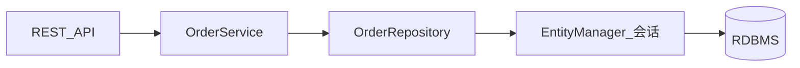

# 第 027 章：spring-boot-data-jpa —— Spring Data JPA 与仓库自动配置

> 对应模块：`spring-boot-data-jpa`。本章覆盖基础 API、中级架构关注点与高级扩展入口（自定义仓库、审计）。

---

## 1 项目背景

某跨境电商平台的后台「订单与履约」服务需要快速上线：运营要能按买家、状态、时间区间筛选订单，仓储要能根据 SKU 批量更新库存预留。团队最初用原生 JDBC 手写 SQL 与 `JdbcTemplate`，两周内就出现了三类痛点：**可维护性**（动态条件拼接散落各处，Code Review 成本高）、**一致性**（同一实体在列表接口与详情接口字段加载不一致，引发 N+1 查询）、**演进成本**（表结构变更后，手写映射与集成测试爆炸）。

若继续不用 JPA 与 Spring Data 的抽象，分布式事务边界、懒加载与 Web 层耦合等问题会在联调阶段集中爆发：例如订单列表为求省事在 Controller 里触达关联实体，Tomcat 线程长时间持有持久化上下文，高峰期连接池耗尽。业务上需要一种**约定优于配置**的持久化方案：实体映射清晰、Repository 接口即契约、与 Spring Boot 的 `spring-boot-data-jpa` 起步依赖对齐版本与 Hibernate 行为。



上图概括了典型调用链。**没有 Spring Data JPA 与 Boot 自动配置时**，团队要在 `EntityManagerFactory`、事务管理器、`ddl-auto`、连接池与二级缓存之间手动对齐；而引入 `spring-boot-data-jpa` 后，焦点可回到领域模型与查询策略。

---

## 2 项目设计（剧本式交锋对话）

**场景：** 架构评审会议室，白板写着「订单服务持久化选型」。

**小胖：** 这不就像食堂窗口吗？我管窗口点菜（Controller），后厨炒菜（数据库），为啥中间还要整一层「仓库」？多一张接口纸不是更慢吗？

**大师：** 窗口只关心「菜单上的菜名」，后厨才关心火候与备货。Repository 就是菜单到后厨的**稳定契约**：业务说「按状态分页查订单」，不关心底层是 JPQL 还是原生 SQL。  
**技术映射：** `OrderRepository extends JpaRepository` 对应**仓储模式**，隔离领域语言与持久化细节。

**小白：** 契约我认。那懒加载呢？如果运营在详情页要看订单行，列表页只显示摘要，边界怎么切？还有，如果队头阻塞——比如某个查询把整张表锁了，JPA 有没有更轻量的备选？

**大师：** 列表与详情可以拆 DTO，列表用投影或 `JOIN FETCH` 控制列与关联；懒加载只在**明确事务边界**内使用，避免 Open Session In View 把会话拖到视图层。轻量备选包括：`EntityGraph`、`@Query` 显式 fetch，或复杂读模型走 JDBC / jOOQ。  
**技术映射：** 懒加载依赖**持久化上下文**生命周期；替代方案是**显式抓取策略**与**读模型分离**。

**小胖：** 那版本升级呢？上次听说 Hibernate 改了个默认行为，我们测试全红了。

**大师：** Boot 通过 BOM 锁定 Hibernate 与 Spring Data 的兼容矩阵；升级时重点看 `spring.jpa.hibernate.*`、`spring.jpa.open-in-view` 与方言。渐进式做法是先在预发打开 SQL 日志与统计，对比执行计划。  
**技术映射：** `spring-boot-data-jpa` 提供**版本对齐**与**属性命名空间**，降低「隐式默认变更」风险。

**小白：** 多数据源场景下，`@Transactional` 会不会绑错 `EntityManager`？

**大师：** 为每个数据源配置独立的 `LocalContainerEntityManagerFactoryBean` 与 `PlatformTransactionManager`，在 Service 上通过 `transactionManager` 或限定符显式指定；测试里用 `@DataJpaTest` 默认单数据源，多库需自定义。  
**技术映射：** 多数据源 = **多持久化单元** + **多事务管理器**，与 Spring 的 `Qualifier` 协作。

---

## 3 项目实战

### 环境准备

- JDK 17+，Spring Boot 3.x（与当前仓库模块一致）。
- Maven：依赖 `spring-boot-starter-data-jpa`、`spring-boot-starter-web`（演示 REST），数据库使用本地 H2 或 Testcontainers PostgreSQL。

**`pom.xml` 片段：**

```xml
<dependency>
  <groupId>org.springframework.boot</groupId>
  <artifactId>spring-boot-starter-data-jpa</artifactId>
</dependency>
<dependency>
  <groupId>org.springframework.boot</groupId>
  <artifactId>spring-boot-starter-web</artifactId>
</dependency>
<dependency>
  <groupId>com.h2database</groupId>
  <artifactId>h2</artifactId>
  <scope>runtime</scope>
</dependency>
```

**`application.yml` 最小配置：**

```yaml
spring:
  jpa:
    hibernate:
      ddl-auto: update
    show-sql: true
    open-in-view: false   # 生产建议关闭，演示显式边界
  datasource:
    url: jdbc:h2:mem:orders;DB_CLOSE_DELAY=-1
    driver-class-name: org.h2.Driver
```

### 分步实现

**步骤 1 — 目标：** 定义订单实体与枚举状态。

```java
@Entity
@Table(name = "shop_order")
public class ShopOrder {
  @Id @GeneratedValue(strategy = GenerationType.IDENTITY)
  private Long id;
  private String buyerId;
  @Enumerated(EnumType.STRING)
  private OrderStatus status;
  private Instant createdAt;
  // getters/setters 省略
}
```

**预期：** 应用启动时 H2 建表或更新 schema（`ddl-auto: update`）。控制台可见 Hibernate DDL 日志。

**常见坑：** 枚举默认 `ORDINAL` 导致插值后顺序变化——生产应用 `STRING`。

---

**步骤 2 — 目标：** 声明 `JpaRepository` 与派生查询。

```java
public interface ShopOrderRepository extends JpaRepository<ShopOrder, Long> {
  Page<ShopOrder> findByStatus(OrderStatus status, Pageable pageable);
}
```

**预期：** 无实现类即可注入；分页参数由 Spring Data 解析。

**常见坑：** `Pageable` 未排序时结果不稳定——应 `PageRequest.of(0, 20, Sort.by("createdAt").descending())`。

---

**步骤 3 — 目标：** REST 层注入仓库并暴露查询。

```java
@RestController
@RequestMapping("/api/orders")
public class OrderController {
  private final ShopOrderRepository orders;
  public OrderController(ShopOrderRepository orders) { this.orders = orders; }

  @GetMapping
  public Page<ShopOrder> list(@RequestParam OrderStatus status,
      @RequestParam(defaultValue = "0") int page) {
    return orders.findByStatus(status,
        PageRequest.of(page, 20, Sort.by("createdAt").descending()));
  }
}
```

**运行结果（文字描述）：** `GET /api/orders?status=PAID` 返回 JSON 分页体（含 `content`、`totalElements` 等 Spring Data 默认结构）。

**常见坑：** JSON 序列化 `Instant` 需 Jackson JSR310 模块——Boot 默认已引入 `jackson-datatype-jsr310`。

---

### 完整代码清单与仓库说明

完整示例可置于独立 Git 仓库：`demo-order-jpa`（根 `pom.xml` + 上述类）。生产环境请将 `ddl-auto` 改为 `validate` 或交给 Flyway/Liquibase（见第 049、050 章）。

### 测试验证

**单元/切片测试（`@DataJpaTest`）：**

```java
@DataJpaTest
class ShopOrderRepositoryTest {
  @Autowired ShopOrderRepository repo;
  @Test void saveAndFind() {
    ShopOrder o = new ShopOrder();
    o.setBuyerId("u1"); o.setStatus(OrderStatus.NEW); o.setCreatedAt(Instant.now());
    repo.save(o);
    assertThat(repo.findAll()).hasSize(1);
  }
}
```

**HTTP 验证：**

```bash
curl -s "http://localhost:8080/api/orders?status=NEW"
```

---

## 4 项目总结

### 优点与缺点（对比同类技术）

| 维度 | Spring Data JPA + Boot | 手写 JDBC / JdbcTemplate | jOOQ / 原生 SQL |
|------|-------------------------|----------------------------|-----------------|
| 开发效率 | 高，派生查询与分页内置 | 中，样板多 | 中高，类型安全 SQL |
| 类型安全 | 中（运行时 JPQL） | 低 | 高（生成器） |
| 复杂 SQL | 需 `@Query` 或原生 | 灵活 | 极强 |
| 学习曲线 | 需理解持久化上下文 | 低 | 中 |

### 适用与不适用场景

- **适用：** CRUD 为主、领域模型稳定、需要快速迭代的中后台；与 Spring 事务生态深度集成。
- **不适用：** 极端复杂报表、强依赖数据库方言优化且需全程控制 SQL 的场景（可混合使用）。

### 注意事项

- 生产关闭 `open-in-view`，明确 Service 层事务与抓取策略。
- 版本升级时核对 Hibernate 与驱动兼容性。
- 对外 API 使用 DTO，避免实体直接暴露导致序列化与演进问题。

### 常见踩坑经验（根因摘要）

1. **N+1 查询：** 列表未做 fetch/join，懒加载在循环中触发——根因是抓取策略与事务边界设计不当。
2. **连接泄漏：** 异步线程访问懒加载——根因是持久化上下文非线程安全且未初始化代理。
3. **`ddl-auto` 误伤生产：** 使用 `create-drop`——根因是配置未按环境拆分。

### 思考题

1. 多数据源下如何为 `ShopOrderRepository` 绑定正确的 `EntityManagerFactory`？
2. 若将 `spring.jpa.open-in-view` 设为 `false`，前端详情仍需关联订单行，你如何在 Service 层一次性装配？

**参考答案：** 见 [附录：思考题参考答案](../appendix/thinking-answers.md) 中「027 spring-boot-data-jpa」小节。

### 推广计划提示

- **开发：** 先统一实体与 DTO 规范，再开放自定义 `@Query`；与架构组对齐多数据源边界。
- **测试：** 切片测试验证仓库；契约测试覆盖关键查询性能。
- **运维：** 关注连接池指标与慢查询日志；与 Actuator/Micrometer 联动（第 112、115 章）。

---

*本章字数约 3200–4500 字（视排版），结构对齐 [template.md](../template.md)。*
