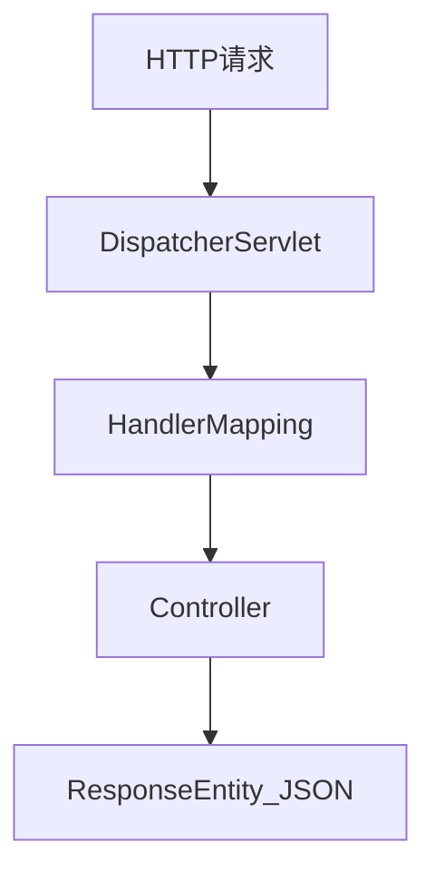

# 第 054 章：spring-boot-webmvc —— Spring MVC 与 Boot 集成

> 对应模块：`spring-boot-webmvc`。本章从典型 REST 服务出发，串联 `DispatcherServlet`、控制器映射、消息转换与异常处理，并区分基础、中级与高级扩展点。

---

## 1 项目背景

一家 SaaS 公司要交付「订阅计费」控制台：客户可查看账单、下载发票、管理员可调整套餐。接口形态以 **JSON REST** 为主，少量表单上传。团队若不用 Spring MVC 与 Boot 的自动配置，需要自己装配 `DispatcherServlet`、消息转换器链、静态资源与错误解析——在 Tomcat 嵌入式部署下，**可维护性与版本对齐成本**会迅速上升。

没有统一 MVC 抽象时的典型痛点包括：**路径冲突**（多个 `@RequestMapping` 叠加导致 404/405 难以排查）、**内容协商混乱**（客户端 `Accept` 与服务端 `produces` 不一致）、**异常冒泡**（业务异常未映射为统一 JSON 体，前端拿到 HTML 错误页）。从业务视角，运营希望在促销期对「套餐列表」接口做缓存与限流；开发希望**声明式校验**与**清晰的分层**。`spring-boot-webmvc` 与 `spring-boot-starter-web` 一起，将 Servlet 容器、Jackson、校验与 MVC 默认行为打包成可预测的起步体验。



---

## 2 项目设计（剧本式交锋对话）

**小胖：** MVC 不就是 Model-View-Controller 吗？我们只做 JSON，View 没了，那「炒菜窗口」谁当？

**大师：** View 可以看成「呈现形式」：JSON 也是一种呈现。Controller 仍负责**把领域结果翻译成 HTTP 语义**——状态码、头、体。  
**技术映射：** `@RestController` = Controller + 默认 `@ResponseBody`，视图名变为**序列化体**。

**小白：** 如果两个 Bean 都映射到 `GET /plans/{id}`，谁先匹配？还有，异常从 Service 抛出，怎么保证一定是 JSON，而不是 Whitelabel 页面？

**大师：** Spring MVC 按**映射 specificity** 与注册顺序解析；冲突会在启动期或首次分派时报错。统一异常用 `@ControllerAdvice` + `@ExceptionHandler`，配合 `produces = MediaType.APPLICATION_JSON_VALUE`，并关闭默认错误页对 API 路径的干扰（或通过 `server.error.include-message` 控制信息泄露）。  
**技术映射：** `HandlerMapping` 顺序 + **全局异常处理器** = 稳定 API 契约。

**小胖：** 上传发票 PDF 时，Multipart 很大，会不会把线程都占满？

**大师：** 同步 MVC 下大上传要注意 `spring.servlet.multipart.max-file-size` 与临时目录；更高并发可考虑异步 MVC 或 WebFlux（第 056 章）。  
**技术映射：** Multipart 解析在 Filter 层，**线程占用**与**背压**需在架构层评估。

**小白：** 我们想加版本前缀 `/v1/plans`，又不想每个方法写重复前缀。

**大师：** 用类级别 `@RequestMapping("/v1/plans")` 或自定义 `WebMvcConfigurer` 注册路径前缀（Spring 6.1+ 的 `PathPattern` 配合 `addPathPrefix`）。同时注意**安全规则**与 **OpenAPI** 文档同步。  
**技术映射：** **分层路由** = 类级映射 + 配置器，减少重复与遗漏。

---

## 3 项目实战

### 环境准备

- JDK 17+，Spring Boot 3.x。
- Maven：`spring-boot-starter-web`、`spring-boot-starter-validation`。

```xml
<dependency>
  <groupId>org.springframework.boot</groupId>
  <artifactId>spring-boot-starter-web</artifactId>
</dependency>
<dependency>
  <groupId>org.springframework.boot</groupId>
  <artifactId>spring-boot-starter-validation</artifactId>
</dependency>
```

### 分步实现

**步骤 1 — 目标：** 声明可校验的请求 DTO 与控制器。

```java
public record CreatePlanRequest(
  @NotBlank String name,
  @Positive int seats
) {}

@RestController
@RequestMapping("/api/v1/plans")
public class PlanController {
  @PostMapping
  public ResponseEntity<PlanView> create(@Valid @RequestBody CreatePlanRequest req) {
    PlanView body = new PlanView(1L, req.name(), req.seats());
    return ResponseEntity.status(HttpStatus.CREATED).body(body);
  }

  public record PlanView(Long id, String name, int seats) {}
}
```

**运行结果（文字描述）：** `POST /api/v1/plans` 携带合法 JSON 返回 201 与 body；非法时返回 400 与校验错误数组（Boot 默认 `ProblemDetail` 或传统错误体，视版本与配置）。

**坑：** 若前端发送 `application/x-www-form-urlencoded`，`@RequestBody` 会失败——需对齐 `Content-Type`。

---

**步骤 2 — 目标：** 全局异常映射为 JSON。

```java
@RestControllerAdvice
public class ApiExceptionHandler {
  @ExceptionHandler(IllegalArgumentException.class)
  public ProblemDetail conflict(IllegalArgumentException ex) {
    ProblemDetail pd = ProblemDetail.forStatus(HttpStatus.CONFLICT);
    pd.setTitle("Business rule violated");
    pd.setDetail(ex.getMessage());
    return pd;
  }
}
```

**坑：** 与 `server.error.whitelabel.enabled`、安全过滤器链顺序冲突时，404 可能仍经 DispatcherServlet——需为资源与 API 分层。

---

**步骤 3 — 目标：** 使用 `curl` 验证。

```bash
curl -i -X POST http://localhost:8080/api/v1/plans \
  -H "Content-Type: application/json" \
  -d "{\"name\":\"Pro\",\"seats\":10}"
```

**预期：** HTTP/1.1 201，JSON 体含 `id` 与字段。

### 完整代码清单

独立仓库建议结构：`src/main/java/.../Application.java`、`PlanController.java`、`ApiExceptionHandler.java`，`application.yml` 可为空。Git 远程占位：`https://example.com/demo/billing-mvc.git`（替换为真实地址）。

### 测试验证（`@WebMvcTest`）

```java
@WebMvcTest(PlanController.class)
class PlanControllerTest {
  @Autowired MockMvc mvc;

  @Test
  void createReturns201() throws Exception {
    mvc.perform(post("/api/v1/plans")
        .contentType(MediaType.APPLICATION_JSON)
        .content("{\"name\":\"Pro\",\"seats\":10}"))
      .andExpect(status().isCreated());
  }
}
```

---

## 4 项目总结

### 优点与缺点

| 优点 | 缺点 |
|------|------|
| 声明式映射与内容协商成熟 | 同步阻塞模型，极高并发需配合线程池与架构 |
| 与 Validation、Security、Actuator 生态一体 | 错误处理链复杂时需仔细排序 |
| 测试支持 `MockMvc` 完善 | 与 WebFlux 混用时心智负担上升 |

### 适用场景与不适用场景

- **适用：** 传统 REST/SSR 混合、企业内网 API、与 JPA/事务模型紧密配合。
- **不适用：** 超长连接、海量并发流式推送——优先考虑 WebFlux/WebSocket（第 056、058 章）。

### 注意事项

- 明确 `context-path` 与反向代理 `X-Forwarded-*`。
- 大文件上传与超时、Tomcat `max-swallow-size`。
- API 版本与安全规则同步。

### 常见踩坑经验

1. **405 Method Not Allowed：** 只注册了 GET，客户端发 POST——根因是映射方法不匹配。
2. **返回 XML：** 客户端 `Accept: */*` 触发了 XML 转换器——根因是消息转换器顺序与 `produces` 未收紧。
3. **校验不生效：** 缺少 `@Valid` 或方法参数未启用验证——根因是验证代理未触发。

### 思考题

1. `DispatcherServlet` 与多个 `HandlerMapping` 的解析顺序受哪些配置影响？自定义 `WebMvcConfigurer` 时如何避免无意替换默认 `HttpMessageConverter` 列表？
2. 大文件上传与 `StreamingResponseBody` 导出在 MVC 下分别要注意哪些容器限制？

**参考答案：** [附录：思考题参考答案](../appendix/thinking-answers.md)「054 spring-boot-webmvc」。

### 推广计划提示

- **开发：** 统一 ProblemDetail/错误码规范；与 OpenAPI 生成契约。
- **测试：** `@WebMvcTest` 覆盖控制器；集成测试走 Testcontainers。
- **运维：** 配置 access log 与 Actuator `metrics` 观测 Tomcat 线程与延迟。

---

*结构对齐 [template.md](../template.md)。*
