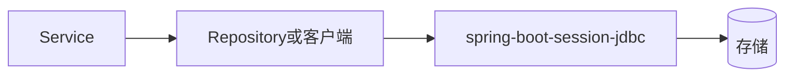

# 第 096 章：spring-boot-session-jdbc —— Session 存 JDBC

> 对应模块：`spring-boot-session-jdbc`。本章在**基础**层面讲清 `Session 存 JDBC` 的起步依赖与关键属性；**中级**讨论多环境、容量与可观测性衔接；**高级**指向条件装配、源码中的 `*Properties` 与自定义扩展。

---

## 1 项目背景

中台服务要同时支撑报表、交易与搜索：数据访问层若各自为政，会出现**连接池风暴**、**事务穿透**与**方言泄漏**。`Session 存 JDBC` 所覆盖的能力，是多数业务应用的「主航道」。

手写 `DataSource`、模板客户端与事务模板，短期可行但**演进痛苦**：升级 ORM 或驱动时全员踩坑。使用 `spring-boot-session-jdbc` 可把配置收敛到 `spring.*` 命名空间并与其它模块协同。



**小结：** 没有 `spring-boot` 对该能力的自动装配与属性命名空间时，团队要在**依赖对齐**、**Bean 生命周期**与**运维接口**上重复投入；引入 `spring-boot-session-jdbc` 后，可以把讨论焦点收束到业务约束与 SLA。

---

## 2 项目设计（剧本式交锋对话）

**场景：** 架构评审室，白板标题为「Session 存 JDBC」。

**小胖：** 这不就跟仓库货架与拣货单一样吗？为啥不能我自己接根线完事？

**大师：** 业务要的是**可复制的正确默认**：连接、超时、序列化、指标，一旦散落各处，线上就是拼图游戏。  
**技术映射：** `spring-boot-session-jdbc` 把横切关注点收敛到 `*AutoConfiguration` 与 `*Properties`。

**小白：** 拿错批次谁负责？如果队头阻塞或下游抖动，我们怎么降级？

**大师：** 先分清**同步还是异步**、**强一致还是最终一致**；再选熔断、隔离、重试与幂等键。Boot 不负责替你选模式，但让集成成本可控。  
**技术映射：** Resilience4j/Micrometer 等与 `Session 存 JDBC` 常一起出现。

**小胖：** 升级 Boot 大版本我最怕「默认变了」。

**大师：** 看发行说明 + `spring-boot-properties-migrator`（迁移期）+ 预发对比指标；必要时显式写出曾依赖的隐式默认。  
**技术映射：** **配置显式化**是长期可维护性的关键。

**小白：** 和同类技术相比，我们何时不该用 `Session 存 JDBC`？

**大师：** 当组织已有成熟平台 SDK 且与 Spring 生命周期冲突、或资源极度受限时，要评估**引入成本**与**退出策略**。  
**技术映射：** 技术选型 = **约束优化**，不是功能清单。

**技术映射（小结）：** `Session 存 JDBC` 对应的自动配置类由 `spring-boot-session-jdbc` 提供，入口注册见 `META-INF/spring/org.springframework.boot.autoconfigure.AutoConfiguration.imports`（以当前 Boot 版本为准）。

---

## 3 项目实战

### 环境准备

- JDK 17+，Spring Boot 3.x（与当前仓库 `spring-boot-main` 版本族一致）。
- 构建：Maven 或 Gradle；依赖以官方 **Starter** 或模块文档为准，源码对照 `spring-boot-main/module/spring-boot-session-jdbc/build.gradle`。

**Maven 依赖示例：**

```xml
<dependency>
  <groupId>org.springframework.boot</groupId>
  <artifactId>spring-boot-starter-session-jdbc</artifactId>
</dependency>
```

**`application.yml` 片段：**

```yaml
spring:
  application:
    name: demo-session-jdbc
  datasource:
    url: jdbc:h2:mem:demo;DB_CLOSE_DELAY=-1
    driver-class-name: org.h2.Driver
```

### 分步实现

**步骤 1 — 目标：** 创建可启动应用骨架。

```java
import org.springframework.boot.SpringApplication;
import org.springframework.boot.autoconfigure.SpringBootApplication;

@SpringBootApplication
public class DemoApplication {
  public static void main(String[] args) {
    SpringApplication.run(DemoApplication.class, args);
  }
}
```

**运行结果（文字描述）：** 控制台出现 Spring Boot Banner，`Started DemoApplication` 表示上下文就绪；若缺中间件或配置，异常信息应指向具体 `*Properties`。

**可能遇到的坑：** 类路径上同时存在互斥实现（例如两个 Web 引擎）导致条件装配失败——使用 `spring.autoconfigure.exclude` 精确排除。

---

**步骤 2 — 目标：** 编写与「Session 存 JDBC」相关的最小业务或基础设施代码。

```java
// 示例：声明 Spring Data 仓库或 JdbcTemplate Bean 注入点
// public interface OrderRepository extends JpaRepository<Order, Long> {}
```

**可能遇到的坑：** Profile 未激活、或测试与主应用包扫描路径不一致导致 Bean 未注册。

---

**步骤 3 — 目标：** 验证（HTTP / 消息 / 批任务视领域选择）。

```bash
# Web/运维类：健康检查
curl -s http://localhost:8080/actuator/health

# 或执行测试
./mvnw -q test
```

### 完整代码清单

建议新建示例工程 `demo-session-jdbc`，附 `README` 说明外部依赖（Docker Compose / 本地中间件）。**仓库占位：** `https://example.com/demo/spring-boot-session-jdbc.git`

### 测试验证

- **切片测试：** 按领域选用 `@WebMvcTest`、`@DataJpaTest`、`@JsonTest` 等；`*-test` 模块章节优先对齐本仓库测试基类。
- **集成测试：** `@SpringBootTest` + Testcontainers（模块已可选依赖时常用）。

---

## 4 项目总结

### 优点与缺点

| 优点 | 缺点 |
|------|------|
| 与 Spring Boot BOM 对齐，降低依赖地狱 | 默认值未必覆盖极端吞吐或合规要求 |
| 自动配置缩短从 0 到可运行的时间 | 需要团队规范 exclude/覆盖策略 |
| 与 Actuator/Micrometer/Security 等同栈协同 | 大版本升级需阅读发行说明与迁移工具 |

### 适用场景与不适用场景

- **适用：** 需要与 Spring 生态一致默认、并希望缩短联调周期的服务；已有 Spring Boot 基线的团队。
- **不适用：** 目标运行环境禁止引入相关依赖；或已有非 Spring 技术栈且迁移成本高于收益。

### 注意事项

- 对照 `spring-boot-main/module/spring-boot-session-jdbc/README.adoc`（若存在）与 `*Properties`。
- 生产环境避免开启调试级日志；密钥走密钥管理而非 YAML 明文。

### 常见踩坑经验（根因分析）

1. **配置写了不生效：** relaxed binding 与 `{prefix}` 层级写错——根因是属性元数据与 YAML 结构不一致。
2. **本地与 CI 行为不一致：** 环境变量/Profile 未对齐——根因是配置来源未收口到配置中心或 `.env` 约定。
3. **与其它自动配置冲突：** 两个 `DataSource` 或两套 Web 栈并存——根因是条件装配边界未用 `@ConditionalOn*` 或 Profile 切开。

### 思考题

1. 若要在不修改 `spring-boot-session-jdbc` 自带 `AutoConfiguration` 的情况下替换其中一个 Bean，你会用 `@Bean @Primary`、`@Qualifier` 还是 `BeanDefinitionRegistryPostProcessor`？各自适用什么顺序风险？
2. 与「Session 存 JDBC」最相关的生产指标与健康检查项是什么？如何在预发用 Actuator 与 Micrometer 验证？

**参考答案：** 见 [附录：思考题参考答案](../appendix/thinking-answers.md)（可按序号 `096` 维护）。

### 推广计划提示

- **开发：** 与架构组约定本模块的覆盖/排除策略；Code Review 检查是否误用默认线程池与超时。
- **测试：** 固化切片模板；对 `*-test` 模块与主模块章节交叉评审，避免重复长文。
- **运维：** 将 `management.*`、`spring.*` 关键项纳入配置审计与告警基线。

---

*本章结构与篇幅对齐专栏模板 [template.md](../template.md)；深度参照试点 [第 027 章：spring-boot-data-jpa —— Spring Data JPA 与仓库.md](第 027 章：spring-boot-data-jpa —— Spring Data JPA 与仓库.md)、[第 054 章：spring-boot-webmvc —— Spring MVC 与 Boot.md](第 054 章：spring-boot-webmvc —— Spring MVC 与 Boot.md)、[第 112 章：spring-boot-actuator —— Actuator 端点与运维 API.md](第 112 章：spring-boot-actuator —— Actuator 端点与运维 API.md)。*
