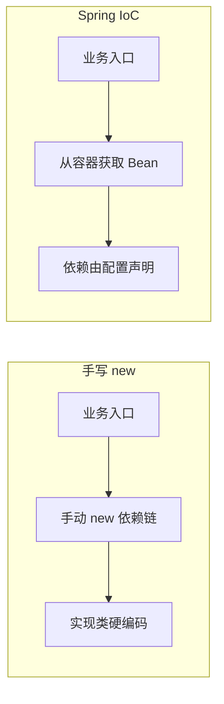

# 第 01 章：Spring 生态与 IoC 思想——从 `new` 到容器

> **业务线**：电商 / 订单履约微服务（拟真场景）。本章可独立阅读；与全书案例弱关联。

## 1 项目背景

「鲜速达」是一家区域性生鲜电商，技术团队要在两个月内上线第一版下单能力：用户选品、算价、占库存、生成订单、调用支付。产品节奏紧，后端先采用**单体 Spring 服务**快速交付，后续再拆微服务。

在没有任何 IoC 容器时，最常见的写法是：在 `main` 或某个「上帝类」里一路 `new`——`new InventoryClient()`、`new PricingService()`、`new OrderService(...)`。业务一膨胀，问题会立刻暴露：

- **可维护性差**：构造顺序错了就空指针；某个依赖需要替换实现（例如从 HTTP 客户端换成 gRPC），要改遍所有 `new` 的地方。
- **测试困难**：单元测试想给 `OrderService` 塞一个假的库存客户端，必须改生产代码或写脆弱的子类。
- **隐式全局状态**：有人顺手把依赖写成单例静态变量，多线程下出现诡异的库存错乱，排查成本高。

IoC（Inversion of Control，控制反转）要解决的，正是「**谁负责创建对象、谁负责组装依赖关系**」这一件事。Spring Framework 提供了一个**可配置的运行时容器**：你把「要哪些组件、怎么连起来」告诉它，由容器在启动时完成装配，业务代码只关心**接口与协作**，而不是 `new` 的细节。

下面用一张简化的「无容器 vs 有容器」对比，帮助建立直觉（流程可随章节替换细节，此处强调职责边界）。



**痛点放大**：当「促销规则」「风控」「支付渠道路由」陆续接入时，依赖图从几条线变成一张网。没有统一装配点，**每次需求变更都像在毛线团里找线头**；而 Spring 把这张网变成**可声明、可替换、可测试**的结构——这就是本章要带你迈过的第一道门槛。

---

## 2 项目设计（剧本式对话）

**角色**：小胖（生活化抛问题）、小白（追问原理与边界）、大师（选型与由浅入深打比方）。  
**结构**：小胖开球 → 小白质疑/追问 → 大师解答并引出下一子话题；循环多轮；大师在关键处给出「技术映射」。

**小胖**：我就纳闷了，写个下单服务，为啥不直接 `new`？这不就跟去食堂打饭一样，窗口在那儿，我排队领饭完事儿，搞个「容器」不是多此一举吗？

**小白**：如果只有一个窗口、一道菜，确实简单。但现在订单里要算价、要锁库存、要调支付，依赖一长串。你 `new` 的顺序错了，或者中间某个实现要换成 mock，你打算改多少处？

**小胖**：呃……那就封装个工厂类？大家从工厂拿？

**大师**：工厂能缓解「创建集中」，但依赖关系还是会写死在工厂方法里。IoC 容器相当于**把工厂再往上抽一层**：不只创建，还管**生命周期**（单例还是每次新建）、**装配**（构造器注入、字段注入）、**配置**（不同环境换实现）。你可以把 Spring 想成「**自动配菜的总厨**」——菜谱（配置）写好，后厨按单出菜，前厅（业务）不用自己洗菜切肉。

**技术映射**：**控制反转** = 业务代码不再掌控依赖的创建与绑定，而是**反过来**把控制权交给框架；**依赖注入（DI）**是实现 IoC 的主流手段之一。

**小白**：那容器里的对象叫啥？Bean？跟普通 Java 对象有啥边界？

**大师**：可以粗浅理解：**被 Spring 接管生命周期的对象**叫 Bean。不是随便 `new` 出来都算——要么通过 `@Bean` 注册，要么被组件扫描到（后续章节会展开）。边界在于：框架能否在合适的时机调用你的初始化/销毁逻辑，以及能否在图中**自动解析循环依赖**（高级篇会深挖）。

**技术映射**：**Bean** ≈ Spring 容器管理的组件实例；**BeanDefinition** 描述「怎么创建、依赖谁、作用域」等元数据。

**小胖**：听着挺美，会不会很重？我就写个 demo，也要引一大套？

**小白**：反过来问：如果团队规范、测试策略、未来拆分都要考虑，一开始就留一个**清晰的装配边界**，后期成本更低。demo 可以用最小依赖的 `spring-context`，不必一上来全家桶。

**大师**：选型上看三个约束：**团队规模**（越大越需要约定与基础设施）、**迭代速度**（单体快速交付 vs 长期演进）、**可测试性**（是否需要大量替身依赖）。Spring 的价值在于**工程化默认值**与**生态**；若只是几十行脚本级程序，确实可以不用容器——**不是银弹，是工具**。

**技术映射**：Spring Framework 的「核心容器」模块提供 **BeanFactory / ApplicationContext**，后者是我们最常用的**增强版容器**（支持事件、国际化、资源抽象等）。

**小白**：ApplicationContext 和「手搓工厂」比，最容易被低估的能力是什么？

**大师**：我会选**一致的装配模型 + 与生态的衔接**。同样是注入，Spring Security、Spring Data、Spring Boot 自动配置都站在同一套抽象上；你不需要为每个框架再造一套「获取实例」的入口。代价是学习曲线与启动时开销——后者在高级篇会用 profiling 再谈。

**技术映射**：**ApplicationContext** 是 Spring 应用的**运行时枢纽**；本章实战用它的 Java 配置变体 `AnnotationConfigApplicationContext` 完成最小闭环。

**小胖**：等等，那容器里的 `OrderService` 是大家共用一份，还是每来一单就 `new` 一个？要是共用，会不会把订单状态搞混？

**大师**：默认情况下，无特殊注解时 Bean 多是**单例（singleton）**：全容器通常只建一份，适合无状态服务；若类里持有请求级状态，就要改用 **prototype** 或 Web 场景下的 **request/session** 作用域，否则确实会串数据。你现在示例里的 `OrderService` 只调下游、不缓存订单字段，单例是安全的。

**技术映射**：**作用域（Scope）**决定「一次创建、全局复用」还是「每次获取新建」；选错作用域是线上串数据、内存飙高的常见根因之一（第 3 章系统展开）。

---

## 3 项目实战

本章目标：用 **Maven + Java 17** 搭建最小工程，引入 **`spring-context`**，通过 **Java 配置类**注册两个 Bean，并演示从容器获取与依赖注入；全程**不引入 Spring Boot**（Boot 会在第 10 章专门展开），以便把注意力放在 **IoC 本身**。

### 3.1 环境准备

| 项 | 说明 |
|----|------|
| JDK | 17+（与 Spring Framework 6.x 对齐） |
| 构建 | Maven 3.9+ |
| 依赖 | `org.springframework:spring-context`（传递引入 `spring-beans`、`spring-core` 等） |

**`pom.xml`（节选）**

```xml
<project xmlns="http://maven.apache.org/POM/4.0.0"
         xmlns:xsi="http://www.w3.org/2001/XMLSchema-instance"
         xsi:schemaLocation="http://maven.apache.org/POM/4.0.0 https://maven.apache.org/xsd/maven-4.0.0.xsd">
  <modelVersion>4.0.0</modelVersion>
  <groupId>com.example</groupId>
  <artifactId>chapter01-ioc-minimal</artifactId>
  <version>1.0.0-SNAPSHOT</version>
  <packaging>jar</packaging>

  <properties>
    <java.version>17</java.version>
    <spring.version>6.1.14</spring.version>
  </properties>

  <dependencies>
    <dependency>
      <groupId>org.springframework</groupId>
      <artifactId>spring-context</artifactId>
      <version>${spring.version}</version>
    </dependency>
  </dependencies>

  <build>
    <plugins>
      <plugin>
        <groupId>org.apache.maven.plugins</groupId>
        <artifactId>maven-compiler-plugin</artifactId>
        <version>3.13.0</version>
        <configuration>
          <release>${java.version}</release>
          <encoding>UTF-8</encoding>
        </configuration>
      </plugin>
    </plugins>
  </build>
</project>
```

**命令行输出（示例）**：在项目根目录执行 `mvn -q -DskipTests compile`，应看到 `BUILD SUCCESS`。

### 3.2 分步实现

**步骤 1 — 目标**：定义库存查询接口与实现，作为被注入的依赖。

```java
package com.example.order;

public interface InventoryService {
    boolean reserve(String skuId, int qty);
}
```

```java
package com.example.order;

import org.springframework.stereotype.Component;

@Component
public class InventoryServiceImpl implements InventoryService {
    @Override
    public boolean reserve(String skuId, int qty) {
        // 演示用：永远成功
        return qty > 0;
    }
}
```

**步骤 2 — 目标**：定义订单服务，通过**构造器注入**依赖（推荐写法，利于测试与不可变性）。

```java
package com.example.order;

import org.springframework.stereotype.Service;

@Service
public class OrderService {
    private final InventoryService inventoryService;

    public OrderService(InventoryService inventoryService) {
        this.inventoryService = inventoryService;
    }

    public String placeOrder(String skuId, int qty) {
        if (!inventoryService.reserve(skuId, qty)) {
            return "FAILED";
        }
        return "OK:" + skuId + " x" + qty;
    }
}
```

**步骤 3 — 目标**：编写配置类，开启**组件扫描**，把 `@Service` / `@Component` 注册为 Bean。

```java
package com.example.order;

import org.springframework.context.annotation.ComponentScan;
import org.springframework.context.annotation.Configuration;

@Configuration
@ComponentScan(basePackageClasses = OrderApplication.class)
public class OrderApplication {
}
```

**步骤 4 — 目标**：编写 `main`，手动启动 `AnnotationConfigApplicationContext`，从容器获取 `OrderService` 并调用。

```java
package com.example.order;

import org.springframework.context.annotation.AnnotationConfigApplicationContext;

public class Main {
    public static void main(String[] args) {
        try (AnnotationConfigApplicationContext ctx =
                     new AnnotationConfigApplicationContext(OrderApplication.class)) {
            OrderService orders = ctx.getBean(OrderService.class);
            System.out.println(orders.placeOrder("SKU-APPLE", 3));
        }
    }
}
```

**运行结果（文字描述）**：控制台打印 `OK:SKU-APPLE x3`，表示 `OrderService` 已成功注入 `InventoryServiceImpl`。

**可能遇到的坑**

| 现象 | 原因 | 处理 |
|------|------|------|
| `NoSuchBeanDefinitionException` | 扫描路径未覆盖 `@Service` 所在包 | 调整 `@ComponentScan` 的 `basePackages` 或 `basePackageClasses` |
| 同一接口多个实现冲突 | 未指定 `@Primary` 或 `@Qualifier` | 下一章会系统讲注入歧义 |
| 混用 Java 模块系统（module-info） | 反射扫描受限 | 演示项目先不用 JPMS，或正确 `opens` 包给 Spring |

### 3.3 完整代码清单与仓库

请将上述文件按 Maven 标准目录放置：`src/main/java/com/example/order/...`。

- **附录仓库占位**：`https://github.com/<your-org>/spring-column-samples`（将 `chapter01-ioc-minimal` 作为子目录推送后，把链接替换为真实地址即可。）

### 3.4 测试验证

**目标**：不启动 `main`，用 **JUnit 5 + Spring 测试** 拉起小型容器（需要额外测试依赖）。

在 `pom.xml` 的 `<dependencies>` 中追加（`test` 范围）：

```xml
<dependency>
  <groupId>org.springframework</groupId>
  <artifactId>spring-test</artifactId>
  <version>${spring.version}</version>
  <scope>test</scope>
</dependency>
<dependency>
  <groupId>org.junit.jupiter</groupId>
  <artifactId>junit-jupiter</artifactId>
  <version>5.10.2</version>
  <scope>test</scope>
</dependency>
```

**测试类示例**

```java
package com.example.order;

import org.junit.jupiter.api.Test;
import org.springframework.beans.factory.annotation.Autowired;
import org.springframework.test.context.junit.jupiter.SpringJUnitConfig;

import static org.junit.jupiter.api.Assertions.assertEquals;

@SpringJUnitConfig(OrderApplication.class)
class OrderServiceTest {

    @Autowired
    OrderService orderService;

    @Test
    void places_order() {
        assertEquals("OK:SKU-PEAR x1", orderService.placeOrder("SKU-PEAR", 1));
    }
}
```

**命令**：`mvn -q test`，期望测试通过。若测试未被识别，请在 `pom.xml` 中显式指定 **Maven Surefire 3.x**（与 JUnit 5 配套）。

**curl 说明**：本章为本地 JVM 演示，无 HTTP 层；从第 5 章起对 REST 接口补充 `curl` 样例。

---

## 4 项目总结

### 优点与缺点（对比「手搓 new / 手写工厂」）

| 维度 | Spring IoC / ApplicationContext | 手写 new / 工厂 |
|------|----------------------------------|------------------|
| 依赖解耦 | 面向接口与注入点，替换实现集中配置 | 替换实现需改多处创建逻辑 |
| 可测试性 | 容器内易用替身 Bean 或 `@MockBean`（Boot 场景） | 需额外绕开硬编码 |
| 学习成本 | 需理解注解、扫描、配置类 | 入门直观，规模变大后反噬 |
| 启动与运行时 | 容器初始化有开销；Bean 越多越需关注 | 几乎零框架开销 |
| 生态协同 | 与 AOP、事务、Security 等同构 | 需自研胶水代码 |

### 适用场景

1. **企业级后端**：多模块协作、长期迭代、需要统一装配与横切能力。  
2. **需要可替换实现**：支付、风控、库存等渠道经常切换。  
3. **测试驱动团队**：希望单元/集成测试稳定复用装配模型。  
4. **与 Spring 生态集成**：数据访问、Web、消息等。  

**不适用场景示例**

1. **极小程序或一次性脚本**：引入容器收益低于复杂度。  
2. **强约束的嵌入式极小包体**：需评估 footprint（可考虑更轻量 DI 或原生方案，见高级篇 Native 相关章节）。  

### 注意事项

- **版本对齐**：Spring Framework 6.x 需要 **Java 17+**；混用旧版第三方库时注意 `jakarta.*` 命名空间迁移。  
- **扫描边界**：`@ComponentScan` 过大拖慢启动；过小漏扫 Bean。  
- **安全边界**：不要把不可信输入直接用于类名/Bean 名动态加载，避免注入式攻击面（高级篇安全与扩展会再提）。  

### 常见踩坑经验（典型故障与根因）

1. **现象**：本地能跑，测试环境报 `NoSuchBeanDefinitionException`。  
   **根因**：Profile 或条件注解导致 Bean 未加载，或包扫描路径在打包后不一致。  

2. **现象**：偶发「同一类型两个实例」。  
   **根因**：既在配置类 `@Bean` 注册，又被组件扫描重复注册（或父子容器重复）。  

3. **现象**：启动慢、CPU 飙高。  
   **根因**：扫描范围过大 / 循环依赖解析触发多次代理（需结合 profiler，中级篇性能章展开）。  

---

## 思考题

1. **构造器注入**与**字段 `@Autowired`** 相比，在可测试性、不可变性与框架反射成本上各有什么取舍？（第 02 章开篇会结合 Bean 定义深入讨论。）  
2. 若 `InventoryService` 有两个实现类同时标注 `@Component`，当前示例会在启动时失败还是静默选其一？应如何用 `@Primary` / `@Qualifier` 表达业务语义？（答案见第 02 章正文。）  

---

## 推广协作提示

| 角色 | 建议 |
|------|------|
| **开发（新人）** | 先跑通本章示例，再对照「无容器」手写一版 `new`，对比修改依赖的成本。 |
| **测试** | 关注 `spring-test` 如何复用同一套装配；为后续 REST 与契约测试打基础。 |
| **运维** | 本章无部署产物；了解「容器初始化」有助于后续排查启动慢与 Bean 缺失类故障。 |

**下一章预告**：Bean 的多种注册方式、`@Autowired` 解析顺序、构造器 vs 字段注入的工程约定。
