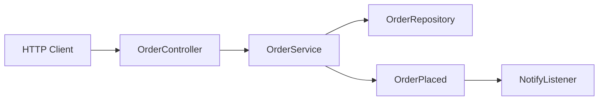

# 第 13 章：基础篇综合实战——最小可运行订单服务

> **业务线**：电商 / 订单履约微服务（拟真场景）。本章串联第 01–12 章能力。

## 上一章思考题回顾

1. **最小订单服务边界**：**API 层**（REST + 校验）、**应用服务**（事务 + 用例编排）、**持久化**（JDBC/JPA）、**横切**（日志/AOP）、**配置**（Profile）、**异步通知**（可选）。  
2. **事件演进 MQ**：将 `OrderPlaced` 从 `ApplicationEvent` 改为 **发 MQ 消息**，消费者独立扩容，**幂等键**用 `orderId`。

---

## 1 项目背景

「鲜速达」要在 **两周** 内交付 **MVP**：创建订单、查询订单、健康检查。团队已掌握 IoC、Web、校验、JDBC、事务、Boot、测试、事件。本章把模块**缝成可演示**的端到端服务，为中级篇「高并发、缓存、安全」打地基。

**痛点**：  
- 模块各会一点，**拼不起来**。  
- 缺少 **README** 与 **一键启动**，协作困难。



---

## 2 项目设计（剧本式对话）

**角色**：小胖 / 小白 / 大师。  
**结构**：反驳「粘贴集成」→ 分层边界 → MVP 范围控制（不加缓存的理由）。

**小胖**：这不就是把前面代码粘一起吗？我一天就能粘完。

**大师**：**集成**比**片段**难在**边界**：DTO 不进领域、事务在应用层、Repository 不暴露 Web；粘在一起的是**代码**，粘不住的是**依赖方向**。

**技术映射**：**分层 + 单向依赖**（应用服务编排，领域模型不依赖 Web）。

**小白**：MVP 要不要上缓存？产品说「页面要快」。

**大师**：**先正确再快**：缓存一致性、穿透、击穿、雪崩都是钱；MVP 先保证 **下单/查单/异常** 全链路可观测，再谈 QPS。

**技术映射**：**性能优化** 需要 **指标与瓶颈证据**（第 19/24/25 章）。

**小胖**：那我把所有东西写进一个 `OrderController` 里，算不算分层？

**小白**：算**分层幻觉**：文件多了，但职责还是一坨。

**大师**：可以设一个「**15 分钟新人跑通标准**」：克隆 → `mvn test` 绿 → `curl` 下单成功 → `/actuator/health` OK——达不到就别合并。

---

## 3 项目实战

### 3.1 环境准备

| 项 | 说明 |
|----|------|
| JDK | 17+ |
| Boot | 3.2+ |
| DB | H2 内存（`runtime`） |
| 依赖 | `web`、`jdbc`、`validation`、`aop`、`actuator` |

**推荐包结构**

```text
com.example.order
├── api/            # Controller + DTO
├── service/        # 应用服务（事务）
├── repo/           # JDBC Repository
├── config/         # 异常处理、Jackson（可选）
└── OrderApplication.java
```

### 3.2 分步实现

1. **`schema.sql`**：`orders` 表（`id`, `sku_id`, `qty`, `status`, `created_at`）。  
2. **`OrderRepository`**：`JdbcTemplate` 插入/查询。  
3. **`OrderService`**：`@Transactional` 创建订单，`publishEvent(new OrderPlaced(id))`。  
4. **`OrderController`**：`POST /api/orders`、`GET /api/orders/{id}`，`@Valid`。  
5. **`GlobalExceptionHandler`**：`ProblemDetail`。  
6. **`application.yml`**：`spring.profiles.active=dev`，日志级别 `com.example=DEBUG`。

**步骤 7 — 目标（端到端 curl）**

```bash
curl -i -X POST http://localhost:8080/api/orders ^
  -H "Content-Type: application/json" ^
  -d "{\"skuId\":\"SKU-APPLE\",\"qty\":2}"
```

```bash
curl -i http://localhost:8080/api/orders/<上一步返回的订单ID>
```

**运行结果（文字描述）**：POST 返回 **201/200**（按你实现约定）并带 `Location` 或 body 内 `id`；GET 能读到一致数据。

**可能遇到的坑**

| 现象 | 原因 | 处理 |
|------|------|------|
| 404 | `context-path` / 路由前缀 | 检查 `@RequestMapping` |
| 事务不回滚 | 吞异常或 checked exception | 调整 `rollbackFor` |
| H2 与生产不一致 | 方言/SQL 差异 | 关键 SQL 用 Testcontainers 复验 |

### 3.3 完整代码清单与仓库

`chapter13-order-mvp`（单模块 Maven 工程）。

### 3.4 测试验证

- `MockMvc`：`POST` 合法/非法 body（400）。  
- `@SpringBootTest` + `JdbcTemplate`：插入后 `GET` 能读到。  
- **可选**：`./mvnw -q verify` 作为 CI 门禁。

**命令**：`mvn -q test`。

---

## 4 项目总结

### 优点与缺点

| 维度 | 单体 MVP | 一步到位微服务 |
|------|-----------|----------------|
| 交付 | 快 | 慢 |
| 风险 | 低 | 高 |

### 常见踩坑经验

1. **DTO 与实体混用** 导致泄漏。  
2. **Controller 写事务** 破坏分层。  
3. **H2 与生产数据库** 方言差异。

---

## 思考题

1. `REQUIRES_NEW` 与 `NESTED` 区别？（第 14 章。）  
2. 同一方法多个 `@Transactional` 切面顺序？（第 15 章。）

---

## 推广协作提示

| 角色 | 建议 |
|------|------|
| **全员** | 以本仓库为「跑通标准环境」。 |

**下一章预告**：事务传播、隔离级别、回滚规则进阶。
